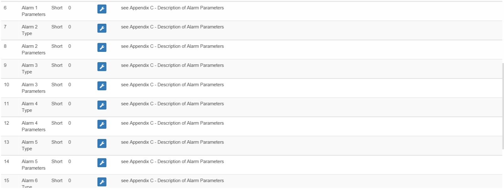

# Nodon Smart Plug - Smartplug

**Das Modul**

**Das Jeedom-Visual**

## Zusammenfassung

Die NodOn®-Funksteckdose kann über eine Z-Wave®- oder Z-Wave Plus®-kompatible Hausautomation oder direkt über andere Z-Wave®- oder Z-Wave Plus®-Controller wie z. B. die Soft Remote, den Wandschalter, gesteuert werden oder die Octan Remote NodOn®. Deutscher (Schuko) oder französischer (Typ E) Standard, der Stecker kann in beide Richtungen gesteckt werden, verkehrt herum oder verkehrt herum. In Kombination mit seinem schlanken Design ermöglichen diese 2 Eigenschaften eine einfache Integration, ohne die benachbarten Fässer auf einer Steckdosenleiste zu blockieren. Das Anlernen der Steckdose mit ihrem Controller dauert nur wenige Sekunden. Über einen lokalen Taster kann die Steckdose direkt ein- oder ausgeschaltet werden.

## Fonctions

-   Netzausfallerkennung
-   Ergonomique: Möglichkeit, den Steckerkopf nach oben / Kopf nach unten anzuschließen
-   Intelligentes Alarmmanagement
-   Verbesserte Funkreichweite
-   Maximale Stromstärke: 16A

## Technische Eigenschaften

-   Einspeisung : 230 VAC +/-10 % - 50 Hz
-   Maximale Kraft : 3000 W kontinuierlich / 3500 W zyklisch (Ohmsche Last) Eigenverbrauch : &lt;1W
-   Betriebstemperatur : 0°C bis 40°C - Höhe : 2000m
-   Drahtloses Z-Wave®-Protokoll : 868.4 MHz – Serie 500 – Kompatibles Z-Wave Plus® SDK 06.51.01
-   Zielfernrohr: 40m drinnen / 80m draußen
-   Dimensions: 104\*51\*36mm
-   2 Jahre Garantie
-   EU-Typ

## Moduldaten

-   Markieren : Nodon
-   Nachname : Smartplug
-   Hersteller-ID : 357
-   Geben Sie Produkt ein : 1
-   Produkt ID : 1

## Configuration

Um das OpenZwave-Plugin zu konfigurieren und zu wissen, wie man Jeedom einbindet, beziehen Sie sich auf diese [Dokumentation](https://doc.jeedom.com/de_DE/plugins/automation%20protocol/openzwave/).

> **Wichtig**
>
> Um dieses Modul in den Inklusionsmodus zu versetzen, drücken Sie die Taste, bis das Licht gemäß seiner Papierdokumentation rot wird.

Einmal enthalten, sollten Sie dies erhalten :

### Commandes

Sobald das Modul erkannt wird, sind die dem Modul zugeordneten Befehle verfügbar.

Hier ist die Liste der Befehle :

-   Bundesland : Dies ist der Befehl, mit dem Sie den Status der Steckdose erfahren können (Ein/Aus)
-   Wir : Dies ist der Befehl, mit dem Sie die Steckdose einschalten können
-   Aus : Dies ist der Befehl, mit dem Sie die Steckdose ausschalten können
-   Status : Ermöglicht es Ihnen zu wissen, ob die Steckdose mit Strom versorgt wird oder nicht (Stromausfallerkennung / -unterbrechung))

Beachten Sie, dass auf dem Dashboard die Status-, EIN/AUS-Informationen auf demselben Symbol zu finden sind.

### Modul-Setup

Sie können das Modul entsprechend Ihrer Installation konfigurieren. Dazu müssen Sie über die Schaltfläche "Konfiguration" des Jeedom Zwave-Plugins gehen.

Sie gelangen auf diese Seite (nachdem Sie auf die Registerkarte Einstellungen geklickt haben)

Parameterdetails :

-   1 : Dieser Parameter definiert den Status (EIN/AUS) des Smart Plug nach einem Stromausfall oder nach dem Einstecken
-   2 : Über diesen Parameter werden die Netzausfall-/Wiederkehrmeldungsmeldungen sowie die zugehörigen Gruppen (Gruppen 4, 5, 6, 7, 8). Mehrere Kombinationen sind möglich (siehe die Papierdokumentation oder die Hilfeblase in jeedom). Es wird empfohlen, diesen Parameter auf 1 zu setzen.
-   3 : Dieser Parameter aktiviert oder deaktiviert die Gruppen 2 und 3.
-   4 : Le paramètre force l'état de la Smart Plug à « ON » (Smart Plug activée). Wenn der Parameter aktiviert ist, ist es nicht möglich, den Smart Plug (lokal oder per Funk) auszuschalten)
-   Parameter 5 bis 20 : Durch die Konfigurationsparameter \#5 à \#20 können bis zu 8 verschiedene Alarme konfiguriert werden. Um Ihre Alarme richtig zu konfigurieren, verwenden Sie das Online-Formular: www.nodon.en/support/asp3/alarm wird Sie führen

### Groupes

Dieses Modul hat 8 Assoziationsgruppen.

-   Gruppe 1 – Rettungsleine : Diese Gruppe wird im Allgemeinen verwendet, um Informationen vom Smart Plug an den Hauptnetzwerkcontroller zu melden.
-   Gruppe 2 – Smart Plug Statusüberwachung Wenn der Smart Plug über die lokale Taste aktiviert (bzw. deaktiviert) wird, sendet er einen Aktivierungs- (bzw. Deaktivierungs-) Befehl an die zugehörigen Geräte. Es wird kein Befehl gesendet, wenn die Zustandsänderung des Smart Plug durch einen Funkbefehl verursacht wurde
-   Gruppe 3 – Ergänzende Zustandsüberwachung Wenn der Smart Plug über den lokalen Taster aktiviert (bzw. deaktiviert) wird, sendet er einen Deaktivierungs- (bzw. Aktivierungs-) Befehl an die zugehörigen Geräte. Es wird kein Befehl gesendet, wenn die Zustandsänderung des Smart Plug durch einen Funkbefehl verursacht wurde.
-   Gruppe 4 – Benachrichtigung bei Stromausfall Wenn der Smart Plug einen Stromausfall oder eine Stromwiederkehr erkennt, wird ein Benachrichtigungsbericht an verbundene Geräte gesendet. Le rapport envoyé est un « Notification Report : Energieverwaltung – Wechselstrom getrennt/wieder verbunden).
-   Gruppe 5 – Aktivierung bei Stromausfall Wenn der Smart Plug einen Stromausfall erkennt, aktiviert er die zugehörigen Geräte.
-   Gruppe 6 – Deaktivierung bei Stromausfall Wenn der Smart Plug einen Stromausfall erkennt, schaltet er die zugehörigen Geräte ab
-   Gruppe 7 – Aktivierung bei Spannungswiederkehr Wenn der Smart Plug eine Spannungswiederkehr erkennt, aktiviert er die zugehörigen Geräte.
-   Gruppe 8 – Deaktivierung bei Spannungswiederkehr Wenn der Smart Plug eine Spannungswiederkehr erkennt, deaktiviert er die zugehörigen Geräte

> **Wichtig**
>
> Zumindest Jeedom sollte in den Gruppen 1 und 4 sein

## Gut zu wissen

### Besonderheiten

-   Sie müssen sich nicht mit dem Einstecken/Ausstecken des Steckers herumschlagen, um den Alarm zu beobachten. Dieser funktioniert nur etwa 3 Mal. Darüber hinaus muss die Steckdose noch kurz mit Strom versorgt werden, um den internen Akku wieder aufzuladen.

## Wakeup

Keine Vorstellung von Aufwachen bei diesem Modul.
