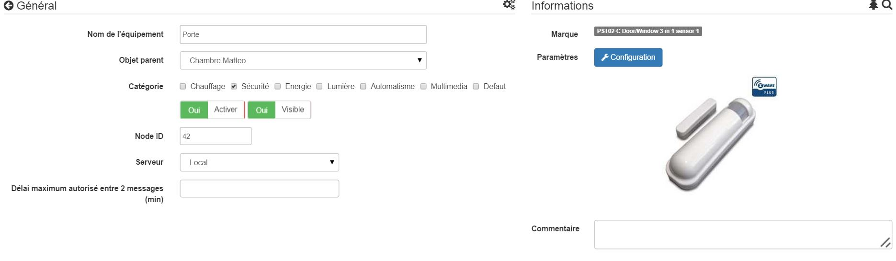

Philio PST02 C - 3 in 1 Öffnung 
=================================

\

-   **Das Modul**

\

\

-   **Das Jeedom Visual**

\

\

Zusammenfassung 
------

\

Der ZIP-PSM01-Detektor bietet 3 verschiedene Funktionen : Erkennung
Öffnung, Temperatursensor und Lichtdetektor. Es ist
besteht aus zwei Teilen : ein Detektor und ein Magnet. Sie sind entworfen
an einer Tür oder einem Fenster mit dem Magneten an der Tür anbringen
Öffnungsteil und Detektor am festen Teil.

Durch Öffnen der Tür oder des Fensters wird der Magnet ferngehalten
Detektor, der den Detektor auslöst, der ein Z-Wave-Signal sendet
Alarm, wenn das System scharfgeschaltet ist (dieses Signal kann von a verwendet werden
Sirene oder von einer Hausautomationsbox zum Beispiel). Der Sensor kann auch
für die automatische Lichtsteuerung verwendet werden, abhängig von der
Helligkeitsstufe. Beispielsweise sendet der Sensor ein Signal an
Z-Wave-Schalter zum Einschalten des Lichts beim Öffnen der Tür
und der Raum ist dunkel.

Der Detektor erhöht auch die Helligkeit und die Temperatur, d.h
im Falle einer wesentlichen Änderung und jedes Mal das Öffnen / Schließen
erkannt wird.

Ein Z-Wave-Controller (Fernbedienung, Dongle usw.) ist erforderlich, um
Integrieren Sie diesen Detektor in Ihr Netzwerk, wenn Sie bereits ein Netzwerk haben
existant.

\

Funktionen
---------

\

-   3 in 1 Detektor: Blende, Temperatur, Licht

-   Nimmt den aktuellen Z-Wave 400series-Chip zur Unterstützung an
    Mehrkanalbetrieb und mehr Datendurchsatz
    hoch (9,6 / 40 / 100kbps)

-   Verwendet das Z-Wave 6.02 SDK

-   Optimierte Antennenreichweite

-   Verwendung für Hausautomations- oder Sicherheitsanwendungen

-   Taste zum Ein- / Ausschließen des Detektors

-   Autoprotection

-   Anzeige für niedrigen Batteriestand

-   Klein, diskret und ästhetisch

-   Benutzerfreundlichkeit und Installation

\

Technische Daten 
---------------------------

\

-   Modultyp : Z-Wave Sender

-   Versorgung: 1 CR123A 3V Batterie

-   Akkulaufzeit : 3 Jahre (für 14 Fahrten pro Tag)

-   Frequenz : 868.42 MHz

-   Übertragungsentfernung : 30m drinnen

-   Temperatursensor : -10 bis 70 ° C

-   Helligkeitssensor : 0 bis 500 Lux

-   Abmessungen:

-   Detektor : 28 x 96 x 23 mm

-   Magnet: 10 x 50 x 12 mm

-   Gewicht: 52g

-   Betriebstemperatur : -10 bis 40 ° C

-   Betriebsfeuchtigkeit : 85% rF max

-   CE-Norm : EN300 220-1

-   Z-Wave-Zertifizierung : ZC08-13050003

\

Moduldaten 
-----------------

\

-   Machen Sie: Philio Technology Corporation

-   Name: PST02-C Tür / Fenster 3 in 1 Sensor

-   Hersteller ID : 316

-   Produkttyp : 2

-   Produkt-ID : 14

\

Konfiguration
-------------

\

So konfigurieren Sie das OpenZwave-Plugin und wissen, wie Sie Jeedom einsetzen
Aufnahme beziehen sich darauf
[Dokumentation](https://jeedom.fr/doc/documentation/plugins/openzwave/de_DE/openzwave.html).

\

> **Important**
>
> Um dieses Modul in den Einschlussmodus zu versetzen, drücken Sie die Taste dreimal
> Einschlussknopf gemäß seiner Papierdokumentation.

\

\

Einmal enthalten, sollten Sie dies erhalten :

\

\

### Befehle

\

Sobald das Modul erkannt wurde, werden die dem Modul zugeordneten Befehle ausgeführt
disponibles.

\

\

Hier ist die Liste der Befehle :

\

-   Öffnung: Es ist der Befehl, der eine Erkennung auslöst
    d'ouverture

-   Temperatur : es ist der Befehl, der es erlaubt, die
    Temperatur

-   Helligkeit: Es ist der Befehl, der es ermöglicht, die Helligkeit zu erhöhen

-   Batterie: Es ist der Batteriebefehl

\

### Konfiguration des Moduls 

\

> **Important**
>
> Wecken Sie das Modul bei einer ersten Aufnahme immer gleich danach auf
>Einbeziehung

\

Dann, wenn Sie das Modul entsprechend konfigurieren möchten
Ihrer Installation müssen Sie durch die Schaltfläche gehen
"Konfiguration "des OpenZwave-Plugins von Jeedom.

\

\

Sie gelangen auf diese Seite (nachdem Sie auf die Registerkarte geklickt haben
Einstellungen)

\

\

Parameterdetails :

\

-   2: Ermöglicht das Anpassen des an die Module in der Gruppe gesendeten Signals
    Verein 2

-   4: Stellt die Helligkeitsstufe ein, ab der die
    Das in Parameter 2 definierte Signal wird an die Module gesendet, die dem zugeordnet sind
    Gruppe 2

-   5: Betriebsart (siehe die
    Herstellerdokumentation) Empfohlener Wert : 8

-   6: Multisensor-Betriebsart (siehe
    Herstellerdokumentation) Empfohlener Wert : 4

-   7: personalisierte Multisensor-Betriebsart (siehe
    auf der Dokumentation des Herstellers) Empfohlener Wert : 20 (für
    die funktionale Öffnung haben)

-   9: Ermöglicht die Festlegung, wie lange das AUS-Signal dauern soll
    wird an Module gesendet, die der Gruppe 2 zugeordnet sind

-   10: Mit dieser Option können Sie die Dauer zwischen zwei Batterieberichten definieren (einer
    Einheit = Parameter 20)

-   11: Mit dieser Option können Sie die Dauer zwischen zwei sich selbst öffnenden Berichten definieren
    (eine Einheit = Parameter 20)

-   12: Hier können Sie die Dauer zwischen zwei Auto definieren
    Helligkeit (eine Einheit = Parameter 20) Empfohlener Wert : 3

-   13: Hier können Sie die Dauer zwischen zwei Auto definieren
    Temperatur (eine Einheit = Parameter 20) Empfohlener Wert : 2

-   20: Dauer eines Intervalls für Parameter 10 bis 13 Wert
    empfohlen : 10

-   21: Temperaturänderungswert in ° F zum Auslösen von a
    rapport

-   22: Wert in% der Helligkeitsschwankung zum Auslösen von a
    Empfohlenen Wert melden : 10

\

### Gruppen

\

Dieses Modul hat zwei Zuordnungsgruppen, nur die erste
indispensable.

\

\

Gut zu wissen 
------------

\

### Alternative visuelle 

\

\

Aufwachen
------

\

Um dieses Modul aufzuwecken, gibt es nur einen Weg :

-   Lassen Sie die Sabotage-Taste los und drücken Sie sie erneut

\

Faq. 
------

\

Dieses Modul wird durch Drücken der Sabotage-Taste aktiviert.

\

Dieses Modul ist ein Batteriemodul, die neue Konfiguration wird sein
beim nächsten Aufwachen berücksichtigt.

\

Wichtiger Hinweis 
---------------

\

> **Important**
>
> Sie müssen das Modul aufwecken : nach seiner Aufnahme, nach einer Änderung
> der Konfiguration, nach einer Änderung des Aufweckens, nach a
> Änderung der Assoziationsgruppen

\

**@sarakha63**
