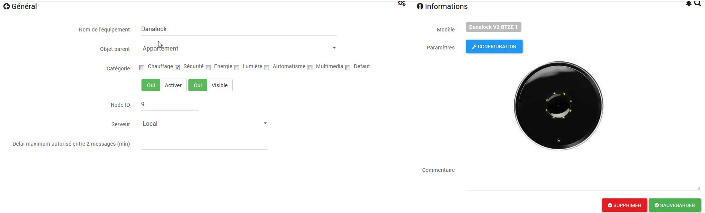

# Danalock V2 BTZE

**Das Modul**

**Das Jeedom-Visual**

## Zusammenfassung

**Sichern Sie Ihr Zuhause mit dem elektronischen Schloss Z-Wave von Poly-Control !**

Keine Schlüssel mehr, verwenden Sie Ihr Smartphone, um Ihre Tür zu verriegeln und zu entriegeln ! Danalock ist eine neue Lösung, mit der Sie Ihren Innenraum zuverlässig und intelligent sichern können. Ohne Schlüssel können Sie Ihr Schloss mit Ihrem Tablet oder Smartphone öffnen. So kontrollieren Sie den Zutritt Ihrer Gäste oder Mitarbeiter und können Ihren Innenraum effektiv überwachen. Mit verschiedenen Einstellungen können Sie den Zugang zu Ihrem Zuhause steuern. Danalock verfügt über eine Autolock-Funktion, die eine automatische Verriegelung der Haustür ermöglicht. Ideal, wenn Sie zum Beispiel die Hände nicht frei haben. Zusätzlich werden 5 Schlüssel mitgeliefert. Sie können sie draußen verwenden. Die Installation ist unabhängig von der Art der Tür einfach und schnell durchzuführen. Die entsprechende App ist kompatibel für iPhone 4S, Android 4.4 und Smartphone. Das Danalock benötigt keine externe Stromquelle. Die Stromversorgung erfolgt über Batterien mit einer Lebensdauer von zwei Jahren. Bei zu niedrigem Ladezustand des Akkus erhalten Sie ein akustisches Signal.

**Einfach anzubringen**

Das Danalock ist ein intelligentes Schloss, das in wenigen Minuten an fast jeder Tür montiert werden kann.

**Einfach zu installieren**

Installieren Sie die Danalock-App in Sekundenschnelle auf Ihrem Telefon. Ein Assistent führt Sie dann durch die Installation und Kalibrierung Ihres Danalock.

**Einfach zu verwenden**

Sperren und Entsperren per Taster, TwistAssist-Funktion oder per Smartphone. Und mit der Auto-Unlock-Funktion entriegelt das Danalock-Schloss automatisch die Tür, wenn Sie sich Ihrem Haus nähern, und verriegelt sie sofort, wenn Sie zurückkommen.

**Lange Akkulaufzeit**

Das Danalock hat eine durchschnittliche Batterielebensdauer von bis zu einem Jahr und benötigt keine externe Stromversorgung. Beachten Sie, dass die Verwendung eines Z-Wave-Heimautomatisierungscontrollers oder einer Z-Wave-Box die Batterielebensdauer verkürzen kann. Der Batteriestatus ist in der App leicht ersichtlich. Wenn der Akku 30, 20, 15 und 10 Prozent erreicht, erfolgt eine Benachrichtigung per SMS und E-Mail.

**Eingeschränkter oder dauerhafter Zugriff**

Schluss mit dem Verstecken von Schlüsseln unter der Fußmatte. Geben Sie Ihrer Familie schnellen und einfachen Zugriff mit ihren Smartphones. Um Ihrer Haushälterin oder Ihren Gästen einen zeitlich begrenzten oder wiederkehrenden Zutritt zu gewähren und Benachrichtigungen zu erhalten, wann und von wem Ihr Schloss benutzt wird.

**Vollständige Haussteuerung**

Erweitern Sie Ihre Smart Home Steuerung mit einem Danalock, dem perfekten Initiator für all Ihre Haussteuerungen. Das Danalock funktioniert nahtlos mit anderen Smart-Home-Geräten, und die gesamte Kommunikation ist stark verschlüsselt – niemand kann sich in Ihr Zuhause hacken.

**Diskret, langlebig und dänisch**

Danalock kombiniert die Eleganz und den Minimalismus des skandinavischen Designs – mit einer eloxierten massiven Aluminiumlünette und modernsten Bluetooth- und Z-Wave-Technologien. Ein dezentes dänisches Design für die Ewigkeit.

## Fonctions

-   Steuern Sie Ihre Haustür aus der Ferne
-   Verbundenes Schloss
-   1 auf verschiedene Längen anpassbarer Zylinder im Lieferumfang enthalten
-   5 physische Schlüssel werden bereitgestellt, um die Tür von außen zu öffnen
-   Verbindung über Bluetooth Smart und Z-Wave
-   Integration in kompatible Z-Wave Controller (eedomus, Vera, …​)
-   Aktivitätsverlauf
-   Unterschiedliche Einstellmöglichkeiten zum Schließen und Öffnen
-   Zugriffsfreigabe : Geben Sie Ihrer Haushälterin oder einem Freund für einen begrenzten Zeitraum Zugang
-   Automatische Kalibrierung
-   Einfach zu installieren
-   Betrieb mit Batterien
-   Kompatibel mit iOS (ab iPhone 4s), aber auch Android (ab 4.4).

## Technische Eigenschaften

-   Einspeisung : 4 x 3V CR123 Batterien
-   Versionen : V2
-   Material : Massives eloxiertes Aluminium
-   Kommunikation : Bluetooth und Z-Wave
-   Maße : 79 mm x 49 mm (Durchmesser x Höhe)
-   Gewicht : 363g

## Moduldaten

-   Markieren : Poly-Control
-   Nachname : Danalock V2 BTZE
-   Hersteller-ID : 010e
-   Geben Sie Produkt ein : 1
-   Produkt ID : 1

## Configuration

Um das OpenZwave-Plugin zu konfigurieren und zu wissen, wie man Jeedom einbindet, beziehen Sie sich auf diese [Dokumentation](https://doc.jeedom.com/de_DE/plugins/automation%20protocol/openzwave/).

> **Wichtig**
>
> Es ist unbedingt erforderlich, dieses Modul in den sicheren Modus einzubinden..

Um das Z-Wave-Plugin (openzwave) in Jeedom in den sicheren Aufnahmemodus zu versetzen : Gehen Sie einfach zur Verwaltungsseite der Z-Wave-Module und klicken Sie auf das Symbol „Zwave-Netzwerk“"

Klicken Sie dann im Reiter „Aktionen“ auf : "MODUL IM SICHEREN MODUS HINZUFÜGEN (INKL)"

> **Wichtig**
>
> Wir gehen davon aus, dass Sie die Anwendung auf Ihrem Smartphone oder iPhone installiert und ein Konto erstellt haben. Wenn Sie es noch nicht getan haben, können Sie auf diese Seite verweisen.

Klicken Sie in der Anwendung auf „Smart Home“, dann auf „Z-Wave“ und schließlich auf „CONNECT".

Einmal enthalten, sollten Sie dies erhalten :

### Commandes

Sobald das Modul erkannt wird, sind die dem Modul zugeordneten Befehle verfügbar.

Hier ist die Liste der Befehle :

-   Status : Dies ist der Befehl, der die zuletzt durchgeführte Aktion meldet (Öffnen/Schließen)
-   Offen : Dies ist der Befehl zum Öffnen des Schlosses
-   Nah dran : Dies ist der Befehl, der das Schloss schließt
-   Batterie : Dies ist der Batteriebefehl

### Modulkonfiguration

> **Warnung**
>
> Obwohl dieses Modul batteriebetrieben ist, verwendet es Flirs-Technologie. Das bedeutet, dass er keine Vorstellung von Aufwachen und Aufwachen hat. Es ruft alle Konfigurationsänderungen nahezu in Echtzeit wie ein Sektormodul ab.

Wenn Sie das Modul entsprechend Ihrer Installation konfigurieren möchten, müssen Sie über die Schaltfläche "Konfiguration" des Jeedom OpenZwave-Plugins gehen.

Sie gelangen auf diese Seite (nachdem Sie auf die Registerkarte Einstellungen geklickt haben)

Parameterdetails :

-   1 : Richtung 0-1 : 0 = Motor dreht im Uhrzeigersinn gesperrt, 1 = Motor dreht gegen den Uhrzeigersinn, wenn gesperrt
-   2 : Geschwindigkeit 1=am langsamsten, 2=langsam, 3=normal, 4=schnell, 5=am schnellsten
-   3 : Modus 1 = Motorantrieb (Energiesparen), 2 = Voller Antriebsmodus (Normal)
-   4 : Anzahl der Umdrehungen (1 = 10 Grad, 9 = 90 Grad usw.)
-   5 : Auto Lock 0-60 Wie viele Sekunden nach dem Entriegeln des Schlosses bis zum automatischen Schließen. Bei 0 ist es deaktiviert.
-   6 : Deaktivieren oder aktivieren Sie das Tonsignal zum Ver- oder Entriegeln (0 = Deaktivieren, 1 = Aktivieren.)
-   7 : Batterietyp : Stellen Sie den Batterietyp ein, der das Gerät mit Strom versorgt.
-   8 : Batteriealarm : Wenn der Batteriestand unter diesem Wert liegt, informiert das Gerät den Benutzer nach dem Sperren oder Entsperren mit einem Tonsignal.
-   9 : Turn & Go 0 = Turn & Go aus, 1 = Turn & Go an. Latch & Go dreht den Griff automatisch, wenn er manuell betätigt wird.
-   10 : Bremse & GoBack 0 = Deaktiviert. 1⇒15 Sekunden zum Bremsen. Bei Verwendung bremst die Sperre für x Sekunden und rollt dann um 75 Grad zurück. Konzipiert für Spezialtüren ohne Hebel. (Nur beim Entsperren).
-   11 : Async 0 = Async aus, 1 = Async ein. Wenn Async aktiviert ist, kalibriert sich das Schloss automatisch, wenn es bereits entsperrt ist, und entsperrt es erneut (wird für spezielle Türschlösser verwendet).
-   12 : Betriebsbericht

### Groupes

Dieses Modul hat nur eine Assoziationsgruppe.

## Gut zu wissen

### Besonderheiten

> **Tipp**
>
> Obwohl dieses Modul batteriebetrieben ist, verwendet es Flirs-Technologie. Das bedeutet, dass er keine Vorstellung von Aufwachen und Aufwachen hat. Es ruft alle Konfigurationsänderungen nahezu in Echtzeit wie ein Sektormodul ab.

> **Tipp**
>
> Dieses Modul gibt seinen Status zurück, wenn Sie die Sperre manuell aktivieren, wird der Status aktualisiert.

## Wakeup

Für dieses Modul gibt es keine Weckfunktion.
