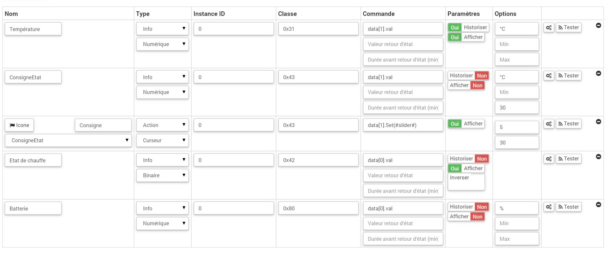

Sicherer SRT 323 "Thermostat" 
===========================

\.

-   **Das Modul**

\.

\.

-   **Das Jeedom Visual**

\.

\.

Zusammenfassung 
------

\.

Der SRT323 ist ein wandmontierter batteriebetriebener Thermostat. Er hat
Ein Drehknopf, mit dem der Benutzer die Temperatur einstellen kann
im Raum. Dieser Thermostat enthält ein Steuerrelais
aufladen. Es ist daher nicht erforderlich, einen Stellantrieb in der Nähe zu installieren
des Kessels.

Durch Überprüfen der eingestellten Temperatur mit der tatsächlichen Temperatur
gemessen, beschließt der Thermostat, den Kessel zu aktivieren. Was ist mehr
Der Thermostat enthält einen TPI-Algorithmus (Time-Proportional Integral),
Dies ermöglicht eine genauere Optimierung und Einstellung der Temperatur
Ihrer Umgebung.

Der Thermostat kann die Solltemperatur von einem anderen empfangen
Z-Wave-Controller und kann auch als verwendet werden
Temperatur. Der Thermostat selbst hat aber keinen eingebauten Timer
Führen Sie Z-Wave-Befehle und lokale Befehle aus.

Es kann als direkter Ersatz für Thermostate verwendet werden
vorhanden, ohne dass Verkabelungsänderungen vorgenommen werden müssen. Der Algorithmus
TPI optimiert das Ein- und Ausschalten des Kessels
um die eingestellte Temperatur bestmöglich aufrechtzuerhalten, ohne
"Überschwingen "davon. Es wurde gezeigt, dass TPI-Controller
kann erhebliche Energieeinsparungen im Vergleich zu bieten
traditionelle Heizungsregler.

Der SRT323 ist ein idealer Partner für die Verwendung mit einem Gateway
Hausautomation, mit der Sie Ihr System fernsteuern können
Heizung. Sie müssen sich keine Sorgen mehr machen, nach Hause zu gehen
ein kaltes Haus, solange Sie ein Smartphone, Tablet oder
PC zur Hand und mit dem Internet verbunden.

\.

Funktionen 
---------

\.

-   Thermostat für den Hausgebrauch

-   Ersetzt einen vorhandenen Thermostat

-   Z-Wave Wireless-Technologie

-   Hintergrundbeleuchtetes LCD-Display

-   Einfach zu bedienen

-   Kompatibel mit anderen Z-Wave-Produkten

-   Ein Knopf

\.

Technische Daten 
---------------------------

\.

-   Modultyp : Z-Wave-Controller

-   Integrierter TPI-Algorithmus

-   Relais: 3 (1) A 230V AC

-   Einstellbarer Temperaturbereich: 5 ° C bis 30 ° C.

-   Versorgung : 2x AAA-Batterien (LR3)

-   Akkulaufzeit : 2 Jahre

-   Frequenz : 868,42 MHz

-   Geltungsbereich : bis zu 50 m auf freiem Feld

-   Schutzindex : IP30

-   Betriebstemperatur : 0 ° C bis 40 ° C.

-   Abmessungen : 86 x 86 x 36,25 mm

\.

Moduldaten 
-----------------

\.

-   Machen Sie : Horstmann

-   Name : SRT 323 Elektronischer Raumthermostat und Temperatur

-   Hersteller ID : 89

-   Produkttyp : 1

-   Produkt-ID : 4

\.

Konfiguration 
-------------

\.

So konfigurieren Sie das OpenZwave-Plugin und wissen, wie Sie Jeedom einsetzen
Aufnahme beziehen sich darauf
[Dokumentation](https://jeedom.fr/doc/documentation/plugins/openzwave/de_DE/openzwave.html).

\.

> **Important**
>
> Um dieses Modul in den Einschlussmodus zu versetzen, müssen Sie Schalter 1 einschalten
> Stellen Sie dann mit der Wählscheibe L auf ON und drücken Sie die Wählscheibe,
> gemäß seiner Papierdokumentation.

\.

\.

> **Important**
>
> Dieses Modul ist bei der Aufnahme schwierig. Während einer ersten Aufnahme
> Wecken Sie das Modul immer sofort nach der Aufnahme auf. Um dies zu tun
> Lassen Sie den Schalter 1 auf ON und dann mit eingestelltem Daumenrad
> Positioniere "n" und drücke die Taste. Drücken Sie danach ein zweites Mal
> 10 Sekunden um sicher zu sein. Wenn Sie fertig sind, klicken Sie auf die Schaltfläche
> Synchronisieren (in der Expertenansicht sichtbar) neben den Schaltflächen
> Einschluss / Ausschluss. Klicken Sie dann auf der Seite Ihres Moduls auf
> Lupe oben rechts.

\.

Einmal enthalten, sollten Sie dies erhalten :

\.

\.

### Befehle 

\.

Sobald das Modul erkannt wurde, werden die dem Modul zugeordneten Befehle ausgeführt
disponibles.

\.

\.

Hier ist die Liste der Befehle :

\.

-   Temperatur : Es ist der Temperaturmessbefehl

-   Staat : Es ist der Befehl, der die aktuelle Anweisung gibt

-   Anleitung : Es ist der Befehl, mit dem der Sollwert eingestellt werden kann

-   Heizzustand : es ist der Befehl, der es ermöglicht zu wissen, ob die
    Thermostat ist im Heizmodus oder nicht

-   Batterie : Es ist der Batteriebefehl

\.

### Konfiguration des Moduls 

\.

Dann muss das Modul in konfiguriert werden
abhängig von Ihrer Installation. Dies erfordert das Durchgehen der Schaltfläche
"Konfiguration "des OpenZwave-Plugins von Jeedom.

\.

\.

Sie gelangen auf diese Seite (nachdem Sie auf die Registerkarte geklickt haben
Einstellungen)

\.

\.

Parameterdetails :

\.

-   1: ermöglicht die Aktivierung oder Nichtaktivierung des internen Temperatursensors

-   2: ermöglicht die Auswahl der Temperatureinheit

-   3: ermöglicht die Definition des Temperaturschwankungsniveaus für
    das Modul sichern (in Einheiten von 0,1 ° C)

\.

### Gruppen 

\.

Für eine optimale Funktion Ihres Moduls muss Jeedom sein
mit den 5 Gruppen verbunden

\.

\.

Gut zu wissen 
------------

\.

### Besonderheiten 

\.

> **Important**
>
> Dieses Modul ist batteriebetrieben. Es ist also wichtig, das zu beachten
> Eine Änderung des Sollwerts wird erst beim Aufwachen berücksichtigt. Von
> Standardmäßig liegt das Aufwecken bei 86400 Sekunden. Es wird dringend empfohlen
> verringern Sie es auf ungefähr 10 Minuten. Somit wird eine Änderung des Sollwerts sein
> vom Modul spätestens nach 10 Minuten berücksichtigt

\.

Aufwachen 
------

\.

Um dieses Modul aufzuwecken, müssen Sie den Schalter 1 auf ON stellen und
Wählen Sie mit dem Rad n und drücken Sie das Rad.

\.

Faq. 
------

\.

\.

Dieses Modul ist ein Batteriemodul, die neue Konfiguration wird sein
beim nächsten Aufwachen berücksichtigt.

\.

Wichtiger Hinweis 
---------------

\.

> **Important**
>
> Sie müssen das Modul aufwecken : nach seiner Aufnahme, nach einer Änderung
> der Konfiguration, nach einer Änderung des Aufweckens, nach a
> Änderung der Assoziationsgruppen

\.

**@sarakha63**
