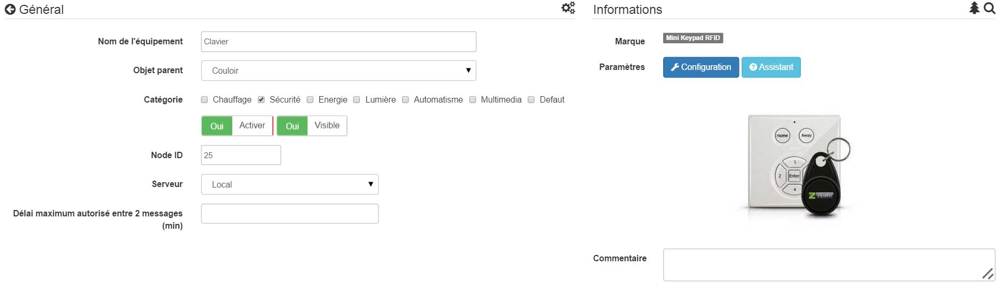

 
======================

\.

-   **Das Modul**

\.

\.

-   **Das Jeedom Visual**

\.

\.

Zusammenfassung 
------

\.

Steuern Sie Ihr Sicherheitssystem mit dieser Mini--Wandtastatur
!

Mit dieser Z-Wave-kompatiblen RFID-Tastatur können Sie oder aktivieren
Deaktivieren Sie einfach Ihr Alarmsystem. Das "Zuhause" und
"Weg "können Sie das Sicherheitssystem aktivieren und deaktivieren und / oder
Führen Sie Hausautomationsszenarien schnell aus. Neben der Verwendung der
Ziffernblock, Sie können auch ein RFID-Abzeichen vor dem
Tastatur zum Aktivieren / Deaktivieren des Systems. Die Tastatur überträgt auf Ihre
Hausautomationssteuerung die Kennung des erkannten Ausweises. Sie
kann leicht Szenarien basierend auf der Person erstellen
wer hat sein Abzeichen benutzt.

\.

Funktionen 
---------

\.

-   Code- und RFID-Tastatur

-   Unterstützt die Z-Wave-Technologie

-   Aktivieren / deaktivieren Sie Ihr Sicherheitssystem

-   Zugangskontrolle durch Lesen von RFID-Ausweisen

-   Zugangskontrolle über die Codetastatur

-   Manipulationsschutz

-   LED-Anzeige zur Bestätigung jeder Aktion

-   Integrierter Summer zur akustischen Anzeige von Aktivierung / Deaktivierung
    der Alarm zum Beispiel

\.

Technische Daten 
---------------------------

\.

-   Typ : Z-Wave-Slave

-   Versorgung : 2x AA 1,5V Batterien

-   Frequenz : 868.42 MHz

-   Funkreichweite : 30m auf freiem Feld

-   RFID-Protokoll : ISO15693, ISO18000-3, Tag-it ™, RFID

-   Summer : 60 dBa in 10 cm Entfernung

-   Lagertemperatur : -5 ° C bis + 65 ° C.

-   Luftfeuchtigkeit zur Lagerung : 10% bis 70%

-   Betriebstemperatur : 10 ° C bis 40 ° C.

-   Betriebsfeuchtigkeit : 30% bis 80%

-   Abmessungen : 

-   Zertifizierungen : Sicherheit :  : 

\.

Moduldaten 
-----------------

\.

-   Machen Sie : 

-   Name : 

-   Hersteller ID : 151

-   Produkttyp : 24881

-   Produkt-ID : 17665

\.

Konfiguration 
-------------

\.

So konfigurieren Sie das OpenZwave-Plugin und wissen, wie Sie Jeedom einsetzen
Aufnahme beziehen sich darauf
[documentation](https://jeedom.fr/doc/documentation/plugins/openzwave/de_DE/openzwave.html).

\.

> **Wichtig**
>
> Um dieses Modul in den Einschlussmodus zu versetzen, drücken Sie einfach zwei
> Sekunden auf der Metalllasche (die rote LED auf der Vorderseite
> zweimal blinken) und lassen Sie die Lasche so los
> Inklusion erfolgt.

\.

\.

Einmal enthalten, sollten Sie dies erhalten :

\.

\.

### Befehle 

\.

Sobald das Modul erkannt wurde, werden die dem Modul zugeordneten Befehle ausgeführt
verfügbar.

\.

\.

Hier ist die Liste der Befehle :

\.

-   Aktion : Es ist der Befehl, der nach Hause / weg geht (5 für weg 6
    für zu Hause)

-   Sabotage : Dies ist der Sabotagebefehl (er wird ausgelöst in
    herausreißen)

-   Code : Zeigt den Ausweis- oder Tastaturcode an, wenn der Code eingegeben wurde
    ist nicht in einer der Erinnerungen

-   Batterie : Es ist der Batteriebefehl

\.

### Konfiguration des Moduls 

\.

> **Wichtig**
>
> Wecken Sie das Modul bei einer ersten Aufnahme immer gleich danach auf
> Einbeziehung.

\.

Dann, wenn Sie das Modul entsprechend konfigurieren möchten
Ihrer Installation müssen Sie durch die Schaltfläche gehen
"Konfiguration "des OpenZwave-Plugins von Jeedom.

\.

\.

Sie gelangen auf diese Seite (nachdem Sie auf die Registerkarte geklickt haben
Einstellungen)

\.

\.

Parameterdetails :

\.

-   1: ermöglicht das Zurücksetzen der Standardkonfiguration (nicht empfohlen)

-   2: Widerrufsfrist (nicht zu ändern)

-   3: Rückkehr per Piepton : Ermöglicht das Aktivieren oder Nicht-Aktivieren einer Reihe von 8 Signaltönen
    nach Erkennung eines Ausweises / Codes

-   4: Anzahl der Pieptöne pro Sekunde (nicht ändern hat keine Auswirkung)

-   5: Betriebsart : normaler oder immer wacher Modus
    (nicht empfohlen, da sehr sehr batterieverbrauchend)

\.

### Gruppen 

\.

Dieses Modul hat zwei Zuordnungsgruppen.

\.

\.

> **Wichtig**
>
> Für einen optimalen Betrieb Ihres Moduls. Jeedom muss
> mindestens mit Gruppe 1 verbunden sein.

### Abzeichen / Codes 

\.

Auf der Ausrüstungsseite befindet sich eine Registerkarte Assistent.

\.

\.

Auf diese Weise können Sie Codes hinzufügen. Dort sehen Sie eine Tabelle.

\.

\.

-   In dieser Tabelle können Sie die auf Ihrem Computer belegten Speicher anzeigen
    Tastatur

-   Um einen neuen Code zu registrieren, klicken Sie auf die grüne Schaltfläche auf der
    gewünschter Speicher und folgen Sie den Schritten

-   Um einen Code zu löschen, klicken Sie einfach auf die rote Schaltfläche.

-   Es ist unmöglich, denselben Code / dasselbe Abzeichen in zwei Speichern zu speichern
    anders

-   Es ist (aus Sicherheitsgründen) unmöglich, den Wert von a zu lesen
    registrierter Code

\.

> **Wichtig**
>
> Denken Sie daran, das Modul nach dem Hinzufügen eines Codes oder Ausweises zu aktivieren.

\.

Anwendungsbeispiele 
----------------------

\.

\.

Der Auslöser ist der Ereignisbefehl, tatsächlich ist dies der Fall
wird nur aktualisiert, wenn ein gültiger Code / Ausweis vorgelegt wurde. Wenn die
Wert ist 6 (home) Wir deaktivieren den Alarm (zum Beispiel) oder schalten den ein
Mehrfachsteckdose, wir schalten das Licht je nach Helligkeit ein, die wir senden
eine Benachrichtigung, um zu melden, dass jemand zurückgekehrt ist, starten wir eine
Sprachsynthese, um beispielsweise einen Wetterbericht zu erstellen. Ansonsten (unbedingt
5) Wir aktivieren den Alarm, wir schneiden die Steckdosenleiste ab, wir senden eine
Benachrichtigung, um zu melden, dass das Haus leer ist.

\.

Gut zu wissen 
------------

\.

### Besonderheiten 

\.

Die Tastatur liest Codes / Ausweise auf zwei Arten :

\.

-   wenn Sie für die ersten 1 bis 2 nach Hause / weg drücken
    Sekunden, wenn Sie anfangen, einen Code einzugeben, wird dieser Code gelesen

-   Wenn innerhalb der ersten 1 bis 2 Sekunden nichts unternommen wird, beginnt es
    Lesemodus für RFID-Ausweise (rotes Licht an). Zu dieser Zeit
    er kann ein Abzeichen lesen, nicht vorher.

\.

Aufwachen 
------

\.

Um dieses Modul zu aktivieren, gibt es zwei Möglichkeiten :

\.

-   Drücken Sie die Sabotagetaste und lassen Sie sie nach 1 bis 2 Sekunden los

-   Drücken Sie Home, eine Zufallszahl und die Eingabetaste

\.

Faq. 
------

\.

Dieses Modul wird durch Drücken der Sabotage-Taste und aktiviert
entspannend. Er kann auch aufwachen, indem er Home und dann 1 drückt
Geben Sie ein.

\.

Dieses Modul ist ein Batteriemodul, die neue Konfiguration wird sein
beim nächsten Aufwachen berücksichtigt.

\.

Wichtiger Hinweis 
---------------

\.

> **Wichtig**
>
> Sie müssen das Modul aufwecken : nach seiner Aufnahme, nach einer Änderung
> der Konfiguration, nach einer Änderung des Aufwachens, nach a
> Änderung der Assoziationsgruppen

\.

**@sarakha63**
