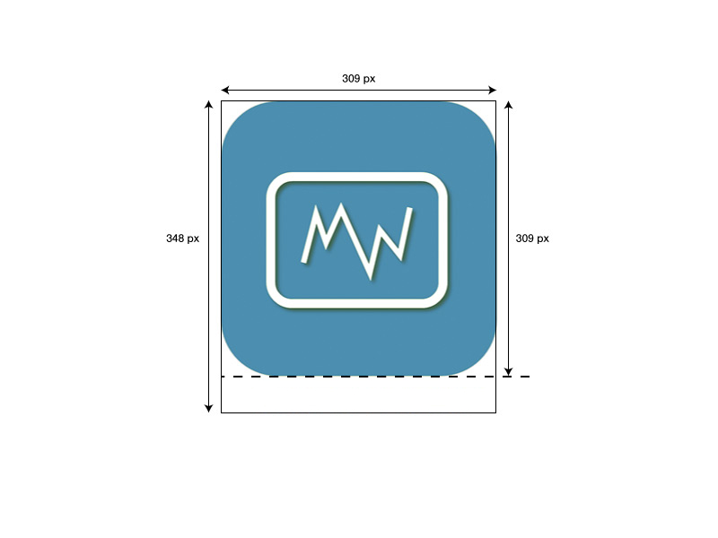

**Dokumentation zu Plugin-Symbolen**

Damit ein Plugin im Jeedom Market veröffentlicht werden kann, muss es über ein Symbol verfügen.

Dieses Symbol wird den Benutzern im Market und über die Jeedom-Benutzeroberfläche angezeigt.

Es muss eine Datei im PNG-Format mit einer Größe von 309 x 348 Pixel erstellt werden.

Der Dateiname ist wie folgt aufgebaut: `<plugin-id>_icon.png`

Es muss im Ordner gespeichert werden `/plugin-info/`

Diese Datei ist obligatorisch.

Wir bitten Sie im Voraus, nicht dieselbe Farbcodierung wie bei den Symbolen der offiziellen Jeedom-Plugins zu verwenden.

Seit 2020 wird empfohlen, den Namen nicht mehr unter das Bild zu setzen (bitte beachten Sie jedoch, dass die Größen der Vorlage beibehalten werden müssen!).

Bitte verwenden Sie diese Vorlage (abgerundete Ecken, Größe, farbiger Hintergrund, Transparenz am Rand usw.):

