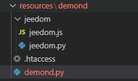
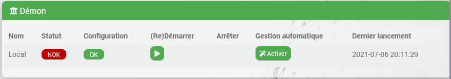
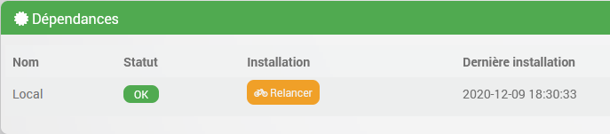

# Dämonen & Abhängigkeiten

## Einleitung

Im [Anleitung](tutorial_plugin) und die [Dokumentation](plugin_template) Sie haben gelernt, wie Sie Ihr erstes Plugin programmieren, das relativ einfache Aktionen ausführt, die entweder vom Benutzer über einen Aktionsbefehl oder durch eine vom Core geplante Aufgabe (Cron-Jobs) ausgelöst werden.
Das Plugin ist dann in der Lage, bei Bedarf Informationen abzurufen (beispielsweise über eine HTTP-Anfrage) oder alle möglichen Vorgänge auszuführen, sofern diese in PHP programmiert werden können.

Es kann vorkommen, dass Sie mehr als das benötigen; hier einige Beispiele (ohne Anspruch auf Vollständigkeit):

- Systemressourcen nutzen, z. B. USB-Stick oder andere Geräte (Bluetooth...)
- Eine Verbindung zu einem Remote-System aufrechterhalten (im lokalen Netzwerk oder über das Internet, jedoch nicht über Jeedom)
- Prozesse im Hintergrund aktiv halten, was bei PHP-Code nicht der Fall ist, da dieser nur während der Ausführung der HTTP-Anfrage „lebt“
- eine Echtzeitverarbeitung durchführen

Dazu wird meistens ein „Daemon“ verwendet.
Keine Panik, im Jeedom-Kern ist bereits alles vorgesehen, um uns bei der Einrichtung dieses Daemons zu helfen, und wir werden das hier im Detail erläutern.

## Dateistruktur eines Daemons

Der Code und/oder die ausführbare Datei Ihres Daemons muss sich natürlich im Verzeichnisbaum Ihres Plugins befinden und muss daher bei der Installation eines Plugins in das Archiv aufgenommen und mitgeliefert werden.
Es gibt keine strenge Regel für den genauen Speicherort Ihres Daemons, allerdings ist es üblich, diesen im Unterverzeichnis `./resources/` des Plugins.

In der Plugin-Vorlage finden Sie die Grundlagen für die Implementierung eines Daemons in Python. Dieses Beispiel werden wir in dieser Dokumentation verwenden. Es steht Ihnen jedoch frei, Ihren Daemon in einer Sprache Ihrer Wahl zu entwickeln, sofern er auf den [Von Jeedom unterstützte Plattformen](/compatibility/).
Die meisten Daemons der Jeedom-Plugins sind in Python oder Node.js geschrieben, es gibt jedoch auch welche in .NET Core und sicherlich auch in anderen Technologien.

Außerdem finden Sie hier einige nützliche Methoden für einen Daemon in Node.js, die möglicherweise in einer zukünftigen Version dieser Dokumentation näher erläutert werden. Vorerst empfehle ich Ihnen, die Entwickler-Community zu konsultieren, um sich mit anderen Entwicklern über alle Aspekte von Node.js abzustimmen, insbesondere hinsichtlich der zu verwendenden Version.

Verzeichnisstruktur der Vorlage:



### Der Python-Daemon

In der Plugin-Vorlage wurde das Verzeichnis des Daemons wie folgt benannt `demond`, und der Daemon selbst heißt `demond.py`.
Diese Bezeichnungen sind willkürlich gewählt; Sie können sie nach Belieben ändern.
Es ist üblich, die ID des Plugins gefolgt vom Buchstaben „d“ zu verwenden. Das ergibt beispielsweise für das Plugin `blea` das Verzeichnis `./resources/blead/` das unter anderem die Datei enthält `blead.py`, wobei diese Datei den Startpunkt für den Daemon darstellt.

> **TIPP**
>
> Zögern Sie nicht, sich von den offiziellen Plugins mit Daemon inspirieren zu lassen, um die Details zu verstehen, wie beispielsweise blea, openzwave oder sms.

### Das Jeedom-Paket für einen Python-Daemon

Jeedom stellt mit dem Plugin-Template ein Python-Paket bereit, das die grundlegenden Klassen und Methoden enthält, die für die Verwaltung des Daemons und die Kommunikation zwischen dem Daemon und dem PHP-Code Ihres Plugins nützlich sind.
Diese Klassen befinden sich im Verzeichnis `./resources/demond/jeedom/jeedom.py` (siehe Screenshot oben).
Um loszulegen, müssen Sie die Details der Implementierung dieser Klassen und Methoden nicht kennen. Daher finden Sie hier lediglich eine Zusammenfassung ihrer Funktionen.

#### Klasse jeedom_utils()

Diese Klasse enthält eine Reihe nützlicher statischer Methoden wie beispielsweise `convert_log_level` um den von Jeedom empfangenen Log-Level in einen Log-Level der Python-Klasse zu konvertieren `logging` oder `find_tty_usb` um eine Liste der Geräte im System zurückzugeben.
Wir werden hier nicht auf alle im Detail eingehen, da die Namen der einzelnen Methoden ziemlich selbsterklärend sind. Sie werden sie entdecken, wenn Sie sich mit dem Code beschäftigen.

#### Klasse jeedom_serial()

Diese Klasse kapselt das Lesen und Schreiben auf einem Gerät.
Auch hier werden wir nicht näher auf die Klasse eingehen – die Methoden sprechen für sich. Sie sollten nur wissen, dass es sie gibt, falls Sie sie benötigen.

> **Achtung**
>
> Wenn Ihr Daemon diese Art von Aktion nicht ausführen muss, sollten Sie darauf achten, diese Klasse weder zu verwenden noch zu importieren, da das Python-Paket `serial` ist standardmäßig nicht installiert, und in diesem Fall wird Ihr Daemon nicht starten (ein Problem, das in der Community bereits mehrfach aufgetreten ist). Wir werden im Abschnitt zur Abhängigkeitsverwaltung darauf zurückkommen.

#### Klasse jeedom_socket() & jeedom_socket_handler()

Sie werden die Klasse nicht verwenden `jeedom_socket_handler()` direkt, sie dient lediglich dazu, `jeedom_socket()`.
Das Ziel von `jeedom_socket()` dient dazu, eine Downstream-Kommunikation (von Ihrem PHP-Code zum Daemon) sicherzustellen.
Wenn Ihr Plugin einen Befehl an Ihren Daemon senden muss, kann es dies über diesen Socket tun. Ein Beispiel dazu finden Sie weiter unten in dieser Dokumentation.

Die Klasse öffnet also einen TCP-Socket und wartet auf eingehende Nachrichten. Wenn eine Nachricht empfangen wird, wird sie in eine Warteschlange gestellt, die anschließend von Ihrem Daemon gelesen wird – darauf kommen wir später noch zurück.

Auch hier gilt: Sie müssen diesen Mechanismus nicht unbedingt verwenden, es steht Ihnen frei, etwas anderes zu erstellen (zum Beispiel einen HTTP-Server), aber dies ist die Standardlösung von Jeedom – sie ist ressourcenschonend und funktioniert sehr gut.

#### Klasse jeedom_com()

Diese sorgt für die Aufwärtskommunikation vom Daemon zu Ihrem PHP-Code.
Sie werden hauptsächlich Folgendes verwenden `send_change_immediate()` zu Beginn, wodurch es möglich ist, eine JSON-Nutzlast über eine HTTP-Anfrage an Jeedom zu senden. Das ist sehr einfach und effizient; ein Beispiel dazu sehen wir uns später an.

### Skelett des Python-Dämons

Nachdem wir nun die Umgebung kennen, können wir uns dem Teil zuwenden, der uns am meisten interessiert: dem Daemon und dem, was wir programmieren müssen.

Wir werden uns nun das Grundgerüst eines von Jeedom vorgeschlagenen Demons genauer ansehen. Öffnen Sie die Datei `demond.py` und wir beginnen mit den letzten Zeilen, die eigentlich den Anfang des Programms bilden:

```python
_log_level = "error"
_socket_port = 55009 # à modifier
_socket_host = 'localhost'
_device = 'auto'
_pidfile = '/tmp/demond.pid'
_apikey = ''
_callback = ''

for arg in sys.argv:
    if arg.startswith("--loglevel="):
        temp, _log_level = arg.split("=")
    elif arg.startswith("--socketport="):
        temp, _socket_port = arg.split("=")
    elif arg.startswith("--sockethost="):
        temp, _socket_host = arg.split("=")
    elif arg.startswith("--pidfile="):
        temp, _pidfile = arg.split("=")
    elif arg.startswith("--apikey="):
        temp, _apikey = arg.split("=")
    elif arg.startswith("--device="):
        temp, _device = arg.split("=")

_socket_port = int(_socket_port)

jeedom_utils.set_log_level(_log_level)

logging.info('Start demond')
logging.info('Log level : '+str(_log_level))
logging.info('Socket port : '+str(_socket_port))
logging.info('Socket host : '+str(_socket_host))
logging.info('PID file : '+str(_pidfile))
logging.info('Apikey : '+str(_apikey))
logging.info('Device : '+str(_device))

signal.signal(signal.SIGINT, handler)
signal.signal(signal.SIGTERM, handler)

try:
    jeedom_utils.write_pid(str(_pidfile))
    jeedom_com = jeedom_com(apikey = _apikey,url = _callback,cycle=_cycle)
    if not jeedom_com.test():
        logging.error('Network communication issues. Please fixe your Jeedom network configuration.')
        shutdown()
    jeedom_socket = jeedom_socket(port=_socket_port,address=_socket_host)
    listen()
except Exception as e:
    logging.error('Fatal error : '+str(e))
    shutdown()
```

Einige Variableninitialisierungen:

```python
_log_level = "error" # le log level par défaut, au format texte tel qu'il est envoyé par Jeedom
_socket_port = 55009 # le port que votre démon utilisera par défaut pour ouvrir le socket d'écoute de Jeedom, à modifier.
_socket_host = 'localhost' # l'interface sur laquelle ouvrir le socket, à priori ne pas changer.
_device = 'auto' # ne sert à rien si vous n'utilisez pas un device matériel
_pidfile = '/tmp/demond.pid' # emplacement par défaut du pidfile, ce fichier est utiliser par Jeedom pour savoir si votre démon est démarrer ou pas; nom du démon à modifier comme expliqué ci-dessus;
_apikey = '' # apikey pour authentifier la communication entre Jeedom et votre démon
_callback = '' ## l'url de callback pour envoyer les notifications à Jeedom (et à votre code php)
```

> **Achtung**
>
> Bei der Auswahl des Ports, den Sie für Ihren Socket verwenden möchten, ist große Vorsicht geboten. Dies ist ein Punkt, an dem Jeedom noch verbessert werden könnte, da es keinen Mechanismus gibt, um Kollisionen zu vermeiden: Wenn also ein anderes Plugin denselben Port wie Sie verwendet, führt dies natürlich zu Problemen. Derzeit besteht die einzige Möglichkeit, eine Auswahl zu treffen, darin, unter den vorhandenen Plugins nach bereits belegten Ports zu suchen und sich mit den Entwicklern in der Community abzustimmen (es gibt bereits offene Themen zu diesem Thema). Außerdem ist es wichtig, dies in der Konfiguration Ihres Plugins vom Benutzer konfigurierbar zu lassen, damit die Portnummer geändert werden kann, falls ein solcher Konflikt auftreten sollte.

Anschließend werden die über die Befehlszeile übergebenen Argumente abgerufen. Diese Befehlszeile wird von Ihrem PHP-Code generiert – darauf kommen wir später noch zurück.
Es liegt an Ihnen, nicht benötigte Elemente (wie das Argument „device“) zu entfernen oder weitere hinzuzufügen, beispielsweise „user/pswd“, falls sich Ihr Daemon bei einem Remote-System anmelden muss.

```python
for arg in sys.argv:
    if arg.startswith("--loglevel="):
        temp, _log_level = arg.split("=")
    elif arg.startswith("--socketport="):
        temp, _socket_port = arg.split("=")
    elif arg.startswith("--sockethost="):
        temp, _socket_host = arg.split("=")
    elif arg.startswith("--pidfile="):
        temp, _pidfile = arg.split("=")
    elif arg.startswith("--apikey="):
        temp, _apikey = arg.split("=")
    elif arg.startswith("--device="):
        temp, _device = arg.split("=")
```

Danach folgen einige Log-Zeilen und diese beiden Zeilen, die in Python üblich sind und lediglich die Methode protokollieren, die aufgerufen werden soll, falls diese beiden Interrupt-Signale empfangen werden, wodurch der Daemon gestoppt werden kann:

```python
signal.signal(signal.SIGINT, handler)
signal.signal(signal.SIGTERM, handler)
```

und die Methode `handler` die etwas weiter oben im Daemon definiert ist:

```python
def handler(signum=None, frame=None):
    logging.debug("Signal %i caught, exiting..." % int(signum))
    shutdown()
```

die lediglich einen Eintrag im Protokoll hinzufügt und die Methode aufruft `shutdown()` wie unten definiert:

```python
def shutdown():
    logging.debug("Shutdown")
    logging.debug("Removing PID file " + str(_pidfile))
    try:
        os.remove(_pidfile)
    except:
        pass
    try:
        jeedom_socket.close()
    except:
        pass
    try:
        jeedom_serial.close()
    except:
        pass
    logging.debug("Exit 0")
    sys.stdout.flush()
    os._exit(0)
```

In dieser Methode müssen Sie den Code schreiben, der beim Beenden des Daemons ausgeführt werden soll, beispielsweise das Abmelden vom Remote-System und das ordnungsgemäße Schließen offener Verbindungen.

> **Achtung**
>
> Sie müssen diese Methode anpassen und den Code entfernen, der in Ihrem Fall nicht benötigt wird, insbesondere das try/except-Block bei `jeedom_serial.close()` wenn Sie diese Klasse nicht verwenden.

Um noch einmal auf den Start des Daemons zurückzukommen, hier die weitere Vorgehensweise mit Erläuterungen:

```python
try:
    jeedom_utils.write_pid(str(_pidfile)) # écrit le pidfile que le core de jeedom va surveiller pour déterminer si le démon est démarré
    jeedom_com = jeedom_com(apikey = _apikey,url = _callback,cycle=_cycle) # création de l'objet jeedom_com
    if not jeedom_com.test(): #premier test pour vérifier que l'url de callback est correcte
        logging.error('Network communication issues. Please fixe your Jeedom network configuration.')
        shutdown()
    jeedom_socket = jeedom_socket(port=_socket_port,address=_socket_host) # on déclare le socket pour recevoir les ordres de jeedom
    listen() # et on écoute
except Exception as e:
    logging.error('Fatal error : '+str(e))
    shutdown()
```

Die Methode `listen()` zu Beginn der Datei definiert:

```python
def listen():
    jeedom_socket.open()
    try:
        while 1:
            time.sleep(0.5)
            read_socket()
    except KeyboardInterrupt:
        shutdown()
```

Hier muss nichts geändert werden. Man sieht, dass der Socket geöffnet ist, und anschließend folgt eine Endlosschleife, um den Socket alle halbe Sekunde auszulesen.

Die Methode `read_socket()`

```python
def read_socket():
    global JEEDOM_SOCKET_MESSAGE
    if not JEEDOM_SOCKET_MESSAGE.empty():
        logging.debug("Message received in socket JEEDOM_SOCKET_MESSAGE")
        message = json.loads(jeedom_utils.stripped(JEEDOM_SOCKET_MESSAGE.get()))
        if message['apikey'] != _apikey:
            logging.error("Invalid apikey from socket : " + str(message))
            return
        try:
            print 'read'
        except Exception, e:
            logging.error('Send command to demon error : '+str(e))
```

Die Variable `JEEDOM_SOCKET_MESSAGE` ist eine `queue()` Python, basierend auf der Klasse `jeedom_socket()` wie bereits erwähnt.

Wenn die Warteschlange nicht leer ist, wird die JSON-Datei geladen und überprüft, ob der mit der Nachricht empfangene API-Schlüssel mit dem beim Start des Daemons empfangenen übereinstimmt (`_apikey`) Anschließend können wir die Meldung auslesen und unsere Aktionen im try/except-Block ausführen:

```python
        try:
            print 'read'
        except Exception, e:
            logging.error('Send command to demon error : '+str(e))
```

Also anstelle des `print 'read'` Es liegt an Ihnen, die relevanten Elemente der Nachricht zu lesen, die Ihr Plugin gesendet hat, und die entsprechenden Aktionen auszulösen oder die für Ihr Plugin spezifischen Klassen oder Methoden aufzurufen.

Ab hier haben Sie einen Daemon, der ausgeführt werden kann, auch wenn er noch nichts tut (das ist Ihre Aufgabe).

## Anpassung des PHP-Codes des Plugins

Einen Daemon zu haben und dessen Struktur zu verstehen, ist zwar gut und schön, aber es fehlen noch einige wichtige Elemente, damit Ihr Plugin (PHP-Code) diesen Daemon tatsächlich steuern kann und damit der Core ebenfalls darüber informiert wird, dass er existiert.

### plugin_info/info.json

In der Datei „info.json“ Ihres Plugins müssen Sie die Eigenschaft hinzufügen `hasOwnDeamon` und den Wert zuweisen `true`, Beispiel:

```json
{
    "id" : "pluginID",
    "name" : "pluginName",
    ...
    "hasDependency" : true,
    "hasOwnDeamon" : true,
    "maxDependancyInstallTime" : 10,
    ...
}
```

Wir werden uns später mit der Verwendung von `hasDependency` und `maxDependancyInstallTime`.

### Verwaltung des Daemons in Ihrer Klasse „eqLogic“

In der Klasse „eqLogic“ Ihres Plugins müssen einige Methoden implementiert werden, um den Daemon ordnungsgemäß zu verwalten.

#### Funktion daemon_info()

Die Funktion `deamon_info()` wird vom Core beim Anzeigen des nächsten Frames auf der Konfigurationsseite Ihres Plugins aufgerufen und muss unbedingt vorhanden sein:



In der Regel sieht das so aus; das zurückgegebene Array und die darin verwendeten Schlüssel sind natürlich wichtig.
Sie können den folgenden Code unverändert kopieren und einfügen und ihn am Ende der Funktion anpassen, um die für Ihr Plugin erforderliche Konfiguration zu überprüfen.

```php
    public static function deamon_info() {
        $return = array();
        $return['log'] = __CLASS__;
        $return['state'] = 'nok';
        $pid_file = jeedom::getTmpFolder(__CLASS__) . '/deamon.pid';
        if (file_exists($pid_file)) {
            if (@posix_getsid(trim(file_get_contents($pid_file)))) {
                $return['state'] = 'ok';
            } else {
                shell_exec(system::getCmdSudo() . 'rm -rf ' . $pid_file . ' 2>&1 > /dev/null');
            }
        }
        $return['launchable'] = 'ok';
        $user = config::byKey('user', __CLASS__); // exemple si votre démon à besoin de la config user,
        $pswd = config::byKey('password', __CLASS__); // password,
        $clientId = config::byKey('clientId', __CLASS__); // et clientId
        if ($user == '') {
            $return['launchable'] = 'nok';
            $return['launchable_message'] = __('Le nom d\'utilisateur n\'est pas configuré', __FILE__);
        } elseif ($pswd == '') {
            $return['launchable'] = 'nok';
            $return['launchable_message'] = __('Le mot de passe n\'est pas configuré', __FILE__);
        } elseif ($clientId == '') {
            $return['launchable'] = 'nok';
            $return['launchable_message'] = __('La clé d\'application n\'est pas configurée', __FILE__);
        }
        return $return;
    }
```

> **Achtung**
>
> Das Beispiel enthält keinen Tippfehler, die Methode heißt tatsächlich `deamon_info()` und nicht `daemon_info`, der Fehler liegt im Kern.

Der Schlüssel `state` entspricht natürlich dem auf dem Bildschirm angezeigten Status. Oben ist zu lesen, dass das Vorhandensein unserer „pid_file“ geprüft wird, um festzustellen, ob der Daemon läuft oder nicht.

Der Schlüssel `launchable` entspricht der Spalte „Konfiguration“ im Fenster, sodass man überprüfen kann, ob die Konfiguration vollständig und korrekt ist, um den Daemon zu starten. `launchable_message` ermöglicht es, dem Benutzer im Falle eines „NOK“ eine Meldung anzuzeigen

#### Funktion daemon_start()

Die Funktion `deamon_start()` ist, wie der Name schon sagt, die Methode, die vom Core aufgerufen wird, um Ihren Daemon zu starten.
Sie können den folgenden Code unverändert kopieren und einfügen und die markierten Zeilen ändern.

```php
    public static function deamon_start() {
        self::deamon_stop();
        $deamon_info = self::deamon_info();
        if ($deamon_info['launchable'] != 'ok') {
            throw new Exception(__('Veuillez vérifier la configuration', __FILE__));
        }

        $path = realpath(dirname(__FILE__) . '/../../resources/demond'); // répertoire du démon à modifier
        $cmd = system::getCmdPython3(__CLASS__) . " {$path}/demond.py"; // nom du démon à modifier
        $cmd .= ' --loglevel ' . log::convertLogLevel(log::getLogLevel(__CLASS__));
        $cmd .= ' --socketport ' . config::byKey('socketport', __CLASS__, '55009'); // port par défaut à modifier
        $cmd .= ' --callback ' . network::getNetworkAccess('internal', 'http:127.0.0.1:port:comp') . '/plugins/template/core/php/jeeTemplate.php'; // chemin de la callback url à modifier (voir ci-dessous)
        $cmd .= ' --user "' . trim(str_replace('"', '\"', config::byKey('user', __CLASS__))) . '"'; // on rajoute les paramètres utiles à votre démon, ici user
        $cmd .= ' --pswd "' . trim(str_replace('"', '\"', config::byKey('password', __CLASS__))) . '"'; // et password
        $cmd .= ' --apikey ' . jeedom::getApiKey(__CLASS__); // l'apikey pour authentifier les échanges suivants
        $cmd .= ' --pid ' . jeedom::getTmpFolder(__CLASS__) . '/deamon.pid'; // et on précise le chemin vers le pid file (ne pas modifier)
        log::add(__CLASS__, 'info', 'Lancement démon');
        $result = exec($cmd . ' >> ' . log::getPathToLog('template_daemon') . ' 2>&1 &'); // 'template_daemon' est le nom du log pour votre démon, vous devez nommer votre log en commençant par le pluginid pour que le fichier apparaisse dans la page de config
        $i = 0;
        while ($i < 20) {
            $deamon_info = self::deamon_info();
            if ($deamon_info['state'] == 'ok') {
                break;
            }
            sleep(1);
            $i++;
        }
        if ($i >= 30) {
            log::add(__CLASS__, 'error', __('Impossible de lancer le démon, vérifiez le log', __FILE__), 'unableStartDeamon');
            return false;
        }
        message::removeAll(__CLASS__, 'unableStartDeamon');
        return true;
    }
```

Ändern Sie nur die Zeilen mit einem Kommentar, der Rest muss unverändert bleiben.

Beachten Sie, dass zunächst der Daemon gestoppt wird, um den Neustart zu steuern.
Anschließend wird überprüft, ob der Daemon tatsächlich mit der Methode gestartet werden kann `deamon_info()` und die Befehlszeile wird in der Variablen generiert `$cmd` um unseren Daemon zu starten, hier mit Python 3. Beachten Sie die Verwendung der Funktion `system::getCmdPython3(__CLASS__)` Dies gibt den Pfad zu Python 3 zurück, der verwendet werden muss, um mit Debian 12 kompatibel zu sein, falls Ihre Abhängigkeiten über den Core installiert wurden.

#### Funktion daemon_stop()

Diese Methode wird verwendet, um den Daemon zu beenden: Man ruft die PID des Daemons ab, die in die „pid_file“ geschrieben wurde, und sendet den Kill-Befehl an den Prozess.

```php
    public static function deamon_stop() {
        $pid_file = jeedom::getTmpFolder(__CLASS__) . '/deamon.pid'; // ne pas modifier
        if (file_exists($pid_file)) {
            $pid = intval(trim(file_get_contents($pid_file)));
            system::kill($pid);
        }
        system::kill('templated.py'); // nom du démon à modifier
        sleep(1);
    }
```

An dieser Stelle haben Sie den Daemon in der Datei „info.json“ deklariert und die drei erforderlichen Methoden implementiert, damit der Jeedom-Kern Ihren Daemon starten und stoppen sowie dessen Status anzeigen kann. Die Voraussetzungen sind erfüllt.

### Kommunikation zwischen dem Daemon und dem PHP-Code

Nun muss noch die Kommunikation zum und vom Daemon geregelt werden. Im Python-Code haben wir bereits gesehen, wie dies gehandhabt wird: Zur Erinnerung, die Methode `listen()` und `read_socket()` das auf einem Socket lauscht und die Methode `send_change_immediate()` um eine JSON-Nutzlast an den PHP-Code zu senden.

Das entsprechende PHP-Code muss also entsprechend angepasst werden.

#### Eine Nachricht an den Daemon senden

Diese Funktion ist im Core nicht vorhanden und gehört nicht zum Standard aller Jeedom-Plugins; sie ist auch nicht zwingend erforderlich.
Das ist die Funktion, die ich (@Mips) in jedem meiner Plugins mit einem Daemon verwende. Ich stelle sie euch hier zur Verfügung, und ihr könnt damit machen, was ihr wollt ;-)

Sie erhält also als Parameter ein Wertearray und sorgt dafür, dass dieses an den Socket des Daemons gesendet wird, der dieses Array dann in der Methode auslesen kann `read_socket()` wie wir zuvor gesehen haben.

```php
    public static function sendToDaemon($params) {
        $deamon_info = self::deamon_info();
        if ($deamon_info['state'] != 'ok') {
            throw new Exception("Le démon n'est pas démarré");
        }
        $params['apikey'] = jeedom::getApiKey(__CLASS__);
        $payLoad = json_encode($params);
        $socket = socket_create(AF_INET, SOCK_STREAM, 0);
        socket_connect($socket, '127.0.0.1', config::byKey('socketport', __CLASS__, '55009')); //port par défaut de votre plugin à modifier
        socket_write($socket, $payLoad, strlen($payLoad));
        socket_close($socket);
    }
```

Was in der Tabelle steht `$params` Und wie Sie diese Daten in Ihrem Daemon auswerten, liegt ganz bei Ihnen – das hängt davon ab, was Ihr Plugin macht.

Zur Erinnerung: Dieses Array wird also in der Methode abgerufen `read_socket()`; Auszug aus dem Python-Code:

```python
        if message['apikey'] != _apikey:
            logging.error("Invalid apikey from socket : " + str(message))
            return
        try:
            print 'read'
        except Exception, e:
            logging.error('Send command to demon error : '+str(e))
```

Man sieht deutlich den vom PHP-Code hinzugefügten Schlüssel „apikey“, der vom Python-Code im Array „message“ gelesen wird.

#### Eine Nachricht vom Daemon empfangen

Dazu müssen wir unserem Plugin im Ordner eine Datei hinzufügen `./core/php/`. Der Übereinkunft nach nennen wir diese Datei `jee[pluginId].php`. `/plugins/[pluginId]/core/php/jee[pluginId].php` wird also als Callback-URL in der Methode verwendet `deamon_start()`

Hier ist der Grundinhalt, den Sie in diese Datei kopieren und einfügen können:

```php
<?php

try {
    require_once dirname(__FILE__) . "/../../../../core/php/core.inc.php";

    if (!jeedom::apiAccess(init('apikey'), 'template')) { //remplacez template par l'id de votre plugin
        echo __('Vous n\'êtes pas autorisé à effectuer cette action', __FILE__);
        die();
    }
    if (init('test') != '') {
        echo 'OK';
        die();
    }
    $result = json_decode(file_get_contents("php://input"), true);
    if (!is_array($result)) {
        die();
    }

    if (isset($result['key1'])) {
        // do something
    } elseif (isset($result['key2'])) {
        // do something else
    } else {
        log::add('template', 'error', 'unknown message received from daemon'); //remplacez template par l'id de votre plugin
    }
} catch (Exception $e) {
    log::add('template', 'error', displayException($e)); //remplacez template par l'id de votre plugin
}
```

Der Code überprüft zunächst, ob der API-Schlüssel korrekt ist:

```php
    if (!jeedom::apiAccess(init('apikey'), 'template')) { //remplacez template par l'id de votre plugin
        echo __('Vous n\'êtes pas autorisé à effectuer cette action', __FILE__);
        die();
    }
```

Der erste Test dient als Testmethode beim Start des Daemons (siehe Aufruf `jeedom_com.test()` im Daemon-Code):

```php
    if (init('test') != '') {
        echo 'OK';
        die();
    }
```

und schließlich laden wir den Payload, den wir im Array dekodieren `$result`:

```php
    $result = json_decode(file_get_contents("php://input"), true);
    if (!is_array($result)) {
        die();
    }
```

Anschließend müssen Sie die Tabelle auswerten und die entsprechenden Aktionen in Ihrem Plugin ausführen, Beispiel:

```php
    if (isset($result['key1'])) {
        // do something
    } elseif (isset($result['key2'])) {
        // do something else
    } else {
        log::add('template', 'error', 'unknown message received from daemon'); //remplacez template par l'id de votre plugin
    }
```

Der Python-Code zum Senden der Nachricht sieht etwa so aus:

```python
jeedom_com.send_change_immediate({'key1' : 'value1', 'key2' : 'value2' })
```

So, nun haben Sie einen voll funktionsfähigen Daemon und können bidirektional zwischen Ihrem Daemon und Ihrem PHP-Code kommunizieren. Das Schwierigste steht noch bevor: die Logik des Daemons zu programmieren.

## Nebengebäude

Wenn man einen Daemon programmiert, benötigt man sehr oft zusätzlich zu den eigenen Klassen externe Bibliotheken.

Unter Debian verwendet man in der Regel das Tool „apt“, um die erforderlichen Pakete zu installieren, und für Python 3 verwendet man „pip3“.

Und um dies zu verwalten, ist auch hier wieder alles im Kern von Jeedom vorgesehen, um uns mit zwei unterschiedlichen Methoden zu unterstützen:

1. Die prozedurale Methode.
Diese Methode war die einzige Möglichkeit bei Jeedom-Versionen vor 4.2.
1. Die Methode mit der JSON-Konfigurationsdatei.
Diese Methode wurde mit Version 4.2 des Jeedom-Kerns eingeführt.

Beide Methoden können in ein und demselben Plugin implementiert werden.

- Wenn beide Methoden in einem Plugin implementiert sind:
  - Core-Versionen vor 4.2 verwenden die prozedurale Methode.
  - Ab Core 4.2 wird die Methode mit der JSON-Konfigurationsdatei verwendet.
- Wenn in einem Plugin nur die prozedurale Methode implementiert ist:
  - Alle Core-Module werden diese Methode verwenden.
- Wenn in einem Plugin nur die Methode über eine JSON-Konfigurationsdatei implementiert ist.
  - Das Plugin ist nicht kompatibel mit Core-Versionen vor 4.2.

Beide Methoden haben ihre Vor- und Nachteile. Entscheiden Sie sich je nach Ihrer Situation.

### Deklaration in plugin_info/info.json

In beiden Fällen müssen Sie Ihre Datei anpassen `info.json`.
Genau wie bei der Deklaration des Daemons muss die Eigenschaft hinzugefügt werden `hasDependency` und den Wert zuweisen `true`:

```json
{
    "id" : "pluginID",
    "name" : "pluginName",
    ...
    "hasDependency" : true,
    "hasOwnDeamon" : true,
    "maxDependancyInstallTime" : 30,
    ...
}
```

Die Immobilie `maxDependancyInstallTime` ist die Zeitspanne in Minuten, nach deren Ablauf der Core davon ausgeht, dass die Installation nicht erfolgreich war.
In diesem Fall wird der Auto-Modus des Daemons deaktiviert und eine Meldung im Benachrichtigungscenter angezeigt.
Wenn diese Eigenschaft nicht definiert ist, beträgt die Standardverzögerung 30 Minuten.

> **TIPP**
>
> Das Installationsskript wird nicht unterbrochen, daher kann es sein, dass es letztendlich erfolgreich abgeschlossen wird. Es handelt sich lediglich um die Zeitspanne, nach der der Core nicht mehr wartet und den Fortschritt nicht mehr anzeigt.

### Die Methode mit der JSON-Konfigurationsdatei

#### Erstellen der Datei „plugin_info/packages.json“

Die Syntax dieser Datei wird hier beschrieben. Siehe auch
[Der Eröffnungsbeitrag im Blog](https://blog.jeedom.com/6170-introduction-jeedom-4-2-installation-de-dependance/).

Diese Datei kann einen oder mehrere der folgenden Abschnitte enthalten:

##### pre-install: Der Pfad zu einem Skript, das vor der Installation ausgeführt werden soll

Beispiel:

```json
{
  "pre-install" : {
    "script" : "plugins/[pluginID]/resources/post-install.sh"
  }
```

##### Nach der Installation

Dies kann entweder der Pfad zu einem Skript sein, das nach der Installation ausgeführt werden soll, oder die Aktion „Apache neu starten“.
Beispiel:

```json
{
  "post-install" : {
    "restart_apache" : true,
    "script" : "plugins/[pluginID]/resources/post-install.sh"
  }
```

##### apt: Debian-Abhängigkeiten

Beispiel

```json
{
  "apt" : {
    "libav-tools" : {"alternative" : ["ffmpeg"]},
    "ffmpeg" : {"alternative" : ["libav-tools"]},
    "python-pil" : {},
    "php-gd" : {}
  }
}
```

Für jedes Paket kann man Folgendes festlegen `version` Um eine Version festzulegen, `alternative` falls vorhanden,
`optional` falls optional, `reinstall` um die Neuinstallation des Pakets zu erzwingen, `remark` um einen freien Kommentar hinzuzufügen.

##### pip3: Python3-Abhängigkeiten

Beispiel:

```json
{
  "apt" : {
    "python3-pyudev" : {},
    "python3-requests" : {},
    "python3-dev" : {}
  },
  "pip3" : {
    "wheel" : {},
    "pyserial" : {},
    "tornado" : {},
    "zigpy" : {"reinstall" : true},
    "zha-quirks" : {"reinstall" : true},
    "zigpy-znp" : {"reinstall" : true},
    "zigpy-xbee" : {"reinstall" : true},
    "zigpy-deconz" : {"reinstall" : true},
    "zigpy-zigate" : {"reinstall" : true},
    "zigpy-cc" : {"reinstall" : true},
    "bellows" : {"reinstall" : true}
  }
}
```

> *Hinweis*
>
> Ab Jeedom Version 4.4.9 kann der Core die Installation von Python3-Abhängigkeiten unter Debian 12 verwalten. Die Abhängigkeiten werden in einer *venv* (virtuellen Umgebung) installiert.
> Sie müssen Ihr Plugin entsprechend anpassen und den Pfad zu `python3` aber nutzen `system::getCmdPython3(__CLASS__)` stattdessen.
> Beispiel: `$cmd = system::getCmdPython3(__CLASS__) . " {$path}/demond.py";`

##### npm: Abhängigkeiten für NodeJS

Bei NodeJS befinden sich die Abhängigkeiten in einer separaten Datei `packages.json` in einem eigenen Format,
im Verzeichnis abgelegt `/resources` Beispielsweise wird diese Datei in der Jeedom-Datei angegeben:

```json
{
  "apt" : {
    "nodejs" : {}
  },
  "npm" : {
    "plugins/dyson/resources/dysond"  : {}
  }
}
```

##### composer: Um eine weitere PHP-Abhängigkeit zu installieren

Ich habe gerade kein Beispiel zur Hand; die Syntax ähnelt der anderer Pakete, mit dem Schlüsselwort `composer`.

##### Abhängigkeiten von einem anderen Plugin

Wenn ein Plugin die Installation eines anderen Plugins erfordert, ist dies ebenfalls mit der folgenden Syntax möglich;
Das Plugin muss kostenlos sein oder bereits gekauft worden sein:

```json
{
    "plugin":{
        "mqtt2": {}
    }
}
```

### Die prozedurale Methode

Es gibt zwei Voraussetzungen, auf die wir gleich näher eingehen werden.

#### Einrichtung der Nebengebäude

In Ihrer eqLogic-Klasse müssen Sie diese Funktion hinzufügen, falls sie noch nicht vorhanden ist. Sie können sie unverändert kopieren und einfügen, ohne etwas zu ändern.

```php
    public static function dependancy_install() {
        log::remove(__CLASS__ . '_update');
        return array('script' => dirname(__FILE__) . '/../../resources/install_#stype#.sh ' . jeedom::getTmpFolder(__CLASS__) . '/dependance', 'log' => log::getPathToLog(__CLASS__ . '_update'));
    }
```

Diese Funktion löscht zunächst das Protokoll der vorherigen Installation, falls vorhanden, und übermittelt anschließend dem Core den auszuführenden Skriptbefehl sowie den Speicherort des Protokolls.

Beachten Sie, dass die zurückgegebene Skriptdatei den Namen `install_#stype#.sh`. Tatsächlich, `#stype#` wird vom Core dynamisch durch das Paketverwaltungstool ersetzt, das je nach dem System, auf dem Jeedom installiert ist, verwendet wird. Also `#stype#` wird ersetzt durch `apt` auf einem Debian-System.
Dadurch können Installationsskripte für Abhängigkeiten für verschiedene Systeme bereitgestellt werden, sodass auch andere Systeme als Debian/apt unterstützt werden, das das absolute Minimum darstellt und das einzige ist, das wir hier verwalten werden.

Das erste Argument: `jeedom::getTmpFolder(__CLASS__) . '/dependance'` ist die Datei, die zur Verfolgung des Installationsfortschritts dient (der Prozentsatz, der während der Installation auf dem Bildschirm angezeigt wird).

Das war’s zum PHP-Teil, nun muss das Skript in `./resources/install_apt.sh` Und natürlich hängt der Inhalt des Skripts von Ihrem Plugin und den Paketen ab, die Sie installieren möchten.

Hier ist ein Beispiel für ein recht einfaches Skript aus einem meiner Plugins, aber Sie können weitaus umfassendere und ausgefeiltere Skripte erstellen:

> **Achtung**
>
> Ab Debian 12 müssen die Python-Pakete zwingend in einer virtuellen Umgebung installiert werden. Dieses Beispielskript funktioniert daher in seiner jetzigen Form nicht mehr; Sie müssen es entsprechend anpassen.
>
> Ich möchte Sie außerdem darauf hinweisen, dass diese Dokumentation eine Alternative bietet: <https://github.com/Mips2648/dependance.lib/blob/master/pyenv.md>

```bash
PROGRESS_FILE=/tmp/jeedom/template/dependance #remplacez template par l'ID de votre plugin

if [ ! -z $1 ]; then
    PROGRESS_FILE=$1
fi
touch ${PROGRESS_FILE}
echo 0 > ${PROGRESS_FILE}
echo "*************************************"
echo "*   Launch install of dependencies  *"
echo "*************************************"
echo $(date)
echo 5 > ${PROGRESS_FILE}
apt-get clean
echo 10 > ${PROGRESS_FILE}
apt-get update
echo 20 > ${PROGRESS_FILE}

echo "*****************************"
echo "Install modules using apt-get"
echo "*****************************"
apt-get install -y python3 python3-requests python3-pip python3-voluptuous python3-bs4
echo 60 > ${PROGRESS_FILE}

echo "*************************************"
echo "Install the required python libraries"
echo "*************************************"
python3 -m pip install "aiohttp"
echo 80 > ${PROGRESS_FILE}

echo 100 > ${PROGRESS_FILE}
echo $(date)
echo "***************************"
echo "*      Install ended      *"
echo "***************************"
rm ${PROGRESS_FILE}
```

Wir werden einige Punkte näher erläutern:

Zunächst legen wir den Standard-Speicherort für die Fortschrittsdatei fest, für den Fall, dass wir den vorherigen Schritt nicht korrekt ausgeführt haben...
Und wir verwenden das erste übergebene Argument als Speicherort, weil wir den vorherigen Schritt korrekt ausgeführt haben ;-).

```bash
PROGRESS_FILE=/tmp/jeedom/template/dependance #remplacez template par l'ID de votre plugin

if [ ! -z $1 ]; then
    PROGRESS_FILE=$1
fi
```

Zeilen vom Typ `echo 60 > ${PROGRESS_FILE}` dienen natürlich dazu, den Fortschritt umzukehren: Um den Nutzer zu beruhigen, fügen wir regelmäßig Werte hinzu, bis 100 erreicht ist (normalerweise geraten sie in Stress, wenn der Wert 100 überschreitet, daher vermeiden wir das).

Einige Tipps:

- Machen Sie keine `apt-get upgrade`! Sie wissen nicht, was auf dem Rechner installiert ist, und es ist nicht Ihre Aufgabe, alles zu aktualisieren.
- Bitte nicht verwenden `apt` aber `apt-get`. `apt` ist für den interaktiven Einsatz vorgesehen, und dies führt zu einer Warnmeldung.
- Fügen Sie das Flag hinzu `-y` Wenn nötig, bestätigen Sie die Eingabeaufforderungen, andernfalls bricht das Skript mit einer Meldung wie der folgenden ab: `Do you want to continue [y/n]` und der Benutzer wird gesperrt.
- Verwenden Sie vorzugsweise die folgende Syntax `python3 -m pip install ...` anstatt `pip3 install ...` um die Python-Pakete zu installieren, da das zweite Probleme verursachen wird, wenn `pip3` (oder `pip` (wenn Sie Python v2 verwenden) ist nicht mit derselben Version wie Python 3 verknüpft: Wenn beispielsweise Python 3 auf die Version 3.7 verweist und pip3 auf die Version 3.9 oder – schlimmer noch – auf die Version 2.7; Sie wissen nicht, welche Änderungen am System vorgenommen wurden, und sind vor einem solchen Problem auf dem Rechner des Benutzers nicht gefeit; in der Community sind Dutzende solcher Fälle dokumentiert.

> **Achtung**
>
> Es ist sehr wichtig, alle erforderlichen Pakete zu installieren und besonders auf diejenigen zu achten, die zwar sehr oft bereits installiert sind … aber nicht immer. Häufig treten Probleme mit den Paketen auf `python3-requests`, `python3-pip` und/oder `serial`. Diese sind auf einem Basis-Debian nicht vorinstalliert, werden aber sehr oft bereits von einem anderen Plugin installiert … es sei denn, Ihr Plugin ist das erste – in diesem Fall wird Ihr Daemon nicht starten. Das kommt häufiger vor, als man denken könnte.

#### Status abfragen



Das ist also unsere PHP-Funktion `dependancy_install()` die vom Core aufgerufen wird und die es ermöglicht, unser Skript zu starten `./resources/install_apt.sh` Wenn der Benutzer auf die Schaltfläche „Neu starten“ klickt oder automatisch durch den Core, sobald dieser feststellt, dass die Abhängigkeiten entweder nicht installiert oder nicht auf dem neuesten Stand sind.

Aber woher kennt der Core den Status und wie zeigt er ihn im obigen Rahmen an? Dank der Funktion `dependancy_info()` die wir in unsere Klasse eqLogic hinzufügen müssen.

Hier ist ein Beispiel, das Sie größtenteils übernehmen können:

```php
    public static function dependancy_info() {
        $return = array();
        $return['log'] = log::getPathToLog(__CLASS__ . '_update');
        $return['progress_file'] = jeedom::getTmpFolder(__CLASS__) . '/dependance';
        if (file_exists(jeedom::getTmpFolder(__CLASS__) . '/dependance')) {
            $return['state'] = 'in_progress';
        } else {
            if (exec(system::getCmdSudo() . system::get('cmd_check') . '-Ec "python3\-requests|python3\-voluptuous|python3\-bs4"') < 3) { // adaptez la liste des paquets et le total
                $return['state'] = 'nok';
            } elseif (exec(system::getCmdSudo() . 'pip3 list | grep -Ewc "aiohttp"') < 1) { // adaptez la liste des paquets et le total
                $return['state'] = 'nok';
            } else {
                $return['state'] = 'ok';
            }
        }
        return $return;
    }
```

In diesem Beispiel wird geprüft, ob apt-Pakete vorhanden sind: `system::getCmdSudo() . system::get('cmd_check') . '-Ec "python3\-requests|python3\-voluptuous|python3\-bs4"'`. Hier wollen wir `python3-requests`, `python3-voluptuous` und `python3-bs4` und daher muss der Befehl den Wert 3 zurückgeben, daher der Vergleich: `< 3`.

Das Gleiche gilt für Python-Pakete: `pip3 list | grep -Ewc "aiohttp"'`. Das Vorhandensein von `aiohttp` ist validiert, es handelt sich also um ein einziges Paket, daher vergleichen wir: `< 1`;

> **Achtung**
>
> Ab Debian 12 müssen die Python-Pakete zwingend in einer virtuellen Umgebung installiert werden. Dieser Befehl funktioniert daher in dieser Form nicht mehr; Sie müssen ihn entsprechend anpassen.

Es ist also ganz einfach: Die Paketliste und die Gesamtsumme sind die einzigen Elemente, die Sie ändern müssen, wenn Sie nur diese Art von Überprüfung durchführen. Andernfalls ist es ein Leichtes, die für Ihren Fall relevanten weiteren Tests hinzuzufügen.
