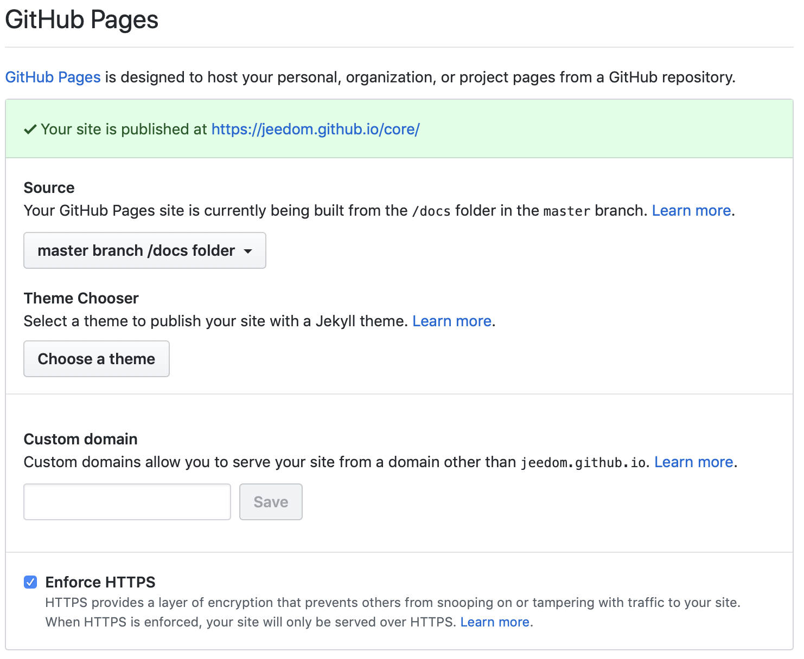

# So erstellen Sie die Dokumentation für ein Plugin

## Einleitung

In dieser Dokumentation erfahren Sie, wie Sie die Dokumentation für Ihr Plugin erstellen.

## Prinzip

Das Prinzip ist ganz einfach: Die Dokumentation des Plugins muss ein einfacher Weblink sein, der in Ihrer Datei „info.json“ angegeben werden muss (siehe Details [hier](structure_info_json) ) im Feld „Dokumentation“.

Beachten Sie, dass Sie auch ein Feld „Changelog“ haben, das genauso funktionieren sollte wie das Feld „Dokumentation“.

## Wie geht das?

Wie oben bereits erwähnt, müssen Sie in der Datei „info.json“ lediglich den HTTP(S)-Link zu Ihrer Dokumentation angeben. Sie können also die Darstellung, den Hosting-Anbieter und sogar den Modus frei wählen:

- ein Blog
- ein einfacher Webserver
- GitHub (die einzige Methode, die wir hier behandeln werden)

## GitHub

Am einfachsten ist es, für Ihre Dokumentation das GitHub-Seiten-System zu nutzen, das den Vorteil hat, sehr benutzerfreundlich zu sein.

### Sprache der Dokumentation

GitHub unterstützt Asciidoc und Markdown (md) für Seiten; wir werden uns hier jedoch nur mit Markdown befassen.

Wir werden hier nicht die gesamte Markdown-Syntax beschreiben, da andere Websites dies bereits sehr gut tun, darunter [dieser](https://guides.github.com/pdfs/markdown-cheatsheet-online.pdf)

### Standort

Wir empfehlen Ihnen, in Ihrem Plugin (das auf GitHub gehostet wird) einen Ordner anzulegen und die Dateien und Verzeichnisse aus dem Ordner /docs der Plugin-Vorlage dorthin zu kopieren (siehe [hier](plugin_template) )

Sobald dies erledigt ist, finden Sie im Ordner /docs einen Ordner namens fr_FR (der einzige, der geändert werden muss). In diesem Ordner empfehlen wir Ihnen, zwei Dateien anzulegen:

- ``changelog.md`` => Ihr Changelog
- ``index.md`` => Ihre Unterlagen

### Online-Schaltung

Das Online-Stellen ist recht einfach: Gehen Sie einfach zu Ihrem GitHub-Repository, wählen Sie „Einstellungen“ und aktivieren Sie im Bereich „GitHub Pages“ die Option „Master-Zweig /docs-Ordner“ (wie der Name schon sagt, werden nur die Dateien im Ordner /docs des Master-Zweigs Ihres Plugins online gestellt).

GitHub stellt Ihnen anschließend einen Link vom Typ ``https://jeedom.github.io/plugin-template/`` (Nach einigen Minuten sollte die Dokumentation beim Aufrufen korrekt formatiert angezeigt werden.)

Sie müssen nun die Links zu Ihrer Dokumentation in die Datei „info.json“ Ihres Plugins einfügen. Dazu müssen Sie:

- Hinzufügen ``#language#/`` Was den Link zur Dokumentation angeht, führt dieser in unserem Beispiel also zu ``https://jeedom.github.io/plugin-template/#language#/``
- Hinzufügen ``#language#/changelog`` Was den Link zu Ihrer Änderung betrifft, so sieht das in unserem Beispiel also so aus ``https://jeedom.github.io/plugin-template/#language#/changelog``

> **Hinweis**
>
> Wie Sie sicher verstanden haben: Wenn der Benutzer Ihre Dokumentation aufrufen möchte, ersetzen Jeedom oder der Market automatisch #language# durch die Sprache des Benutzers, um auf die richtige Sprache zu verweisen (falls Ihre Dokumentation nicht in der Sprache des Benutzers verfügbar ist, wird automatisch auf Französisch weitergeleitet).
