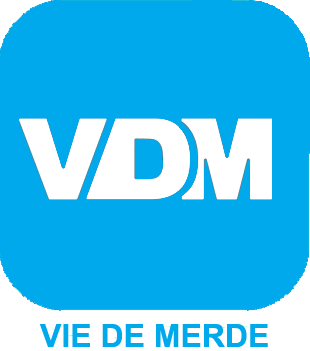
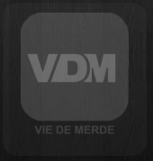
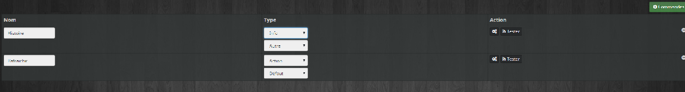
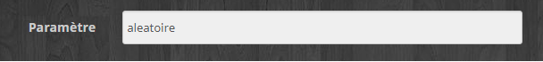

# Getting Started

> **IMPORTANT**
>
> This tutorial was written by ZygOm4t1k, whom we would like to thank very much. You can find the original [here](https://forum.jeedom.com/viewtopic.php?f=27&t=37630#p621495)

Here’s a quick hands-on exercise to explain how to create a plugin. For this example, we’ll create a plugin that returns a phrase from the website viedemerde.fr. (The plugin will be expandable.)

It is by no means a substitute for [official documentation](index)

# Create the plugin's base

To get started, you need to choose a name and an ID (which must not already exist)

Name: Shitty Life
ID: vdm

Download the template plugin to get the [basics](https://github.com/jeedom/plugin-template/archive/master.zip)

Unzip the file. You’ll get a folder named “plugin-template-master” containing folders such as 3rparty, core, desktop…

Let's go.

> **IMPORTANT**
>
>A setup wizard is available to help you quickly customize your plugin.
>This interactive tool lets you easily set the plugin's name, specify whether a daemon is required, and automatically modifies all necessary files.
>Using it simplifies the configuration process and saves you valuable time when developing your plugin.

👉 To launch the assistant, open a terminal in the template plugin directory and run the following command:

```
php plugin_info/helperConfiguration.php
```

If you don't want to use this script, you can follow these steps to rename the files.


Rename the "plugin-template-master" folder to "vdm" (the plugin's ID).

1/ Open the plugin_info/info.json file and edit it.

```json
{
  "id" : "vdm",
  "name" : "Vie de Merde",
  "description" : "Plugin pour récupérer les dernières vdm",
  "licence" : "AGPL",
  "author" : "Zyg0m4t1k",
  "require" : "3.3.39",
  "category" : "monitoring",
  "changelog" : "",
  "documentation" : "",
  "language" : "",
  "compatibility" : ""
}
```

Copy and paste the code above.

I changed the ID *(vdm)*, the name, added a description, the author, and the category.

Requires: minimum Jeedom version to access the plugin on the Market.

Changelog, documentation, language, and compatibility are currently unavailable. I’ll come back to this later.

2/ We're going to rename the necessary files so that the plugin is recognized by Jeedom

- Rename the file core/ajax/template.ajax.php to vdm.ajax.php

- Rename the file core/class/template.class.php to vdm.class.php and open it to edit it.

Replace

```php
class template extends eqLogic
```

by

```php
class vdm extends eqLogic
```

------------------------

```php
class templateCmd extends cmd
```

by

```php
class vdmCmd extends cmd
```

- Rename the file core/php/template.inc.php to core/php/vdm.inc.php
- Rename the file desktop/php/template.php to desktop/php/vdm.php and open it

Replace:

```php
$plugin = plugin::byId('template');
```

By

```php
$plugin = plugin::byId('vdm');
```

------------------------

```html
<legend><i class="fas fa-table"></i> {{Mes templates}}</legend>
```

By

```html
<legend><i class="fas fa-table"></i> {{Mes équipements}}</legend>
```

------------------------

```php
<?php include_file('desktop', 'template', 'js', 'template');?>
```

By

```php
<?php include_file('desktop', 'vdm', 'js', 'vdm');?>
```

And nothing else—**do not change this line** ``<?php include_file('core', 'plugin.template', 'js');?>``.

- Rename the file desktop/modal/modal.template.php to desktop/modal/modal.vdm.php

- Rename the file desktop/js/template.js to desktop/js/vdm.js

- Open the plugin_info/install.php file and rename the functions as follows

```php
function vdm_install() {
}

function vdm_update() {
}

function vdm_remove() {
}
```

The plugin is ready, but we still need to customize it and update the icon: [Developer Documentation - Plugin Icon](Icone_de_plugin)

Add the icon to the plugin_info folder with the name vdm_icon.png

in my case



Now you can copy the vdm folder into the Jeedom plugin folder and go to the plugin management section. The plugin should appear there.



Make it active, then go to Plugins/Monitoring/Life Sucks

There you go—the foundation is set. You should have the plugin active, but for now it doesn't do anything.

# Commands

The purpose of the plugin is to retrieve a random VDM and display it on the dashboard.

We therefore need to create an "info" type command to store this information. It will be of the "string" subtype because it is a string of characters.

For this example, we’ll add a command that refreshes the information. It will be an action-type command with the “other” subtype.

-Create a device named “vdm1” by clicking the + button. Enable it and make it visible. Select an object, and the device should appear on the dashboard (depending on the object).

At this time, no commands appear in the Orders tab or on the widget.

Open the file core/class/vdm.class.php and search for the postSave() function (Read the plugin template documentation if you haven't already)

We create the two commands

```php
public function postSave() {
  $info = $this->getCmd(null, 'story');
  if (!is_object($info)) {
    $info = new vdmCmd();
    $info->setName(__('Histoire', __FILE__));
  }
  $info->setLogicalId('story');
  $info->setEqLogic_id($this->getId());
  $info->setType('info');
  $info->setSubType('string');
  $info->save();

  $refresh = $this->getCmd(null, 'refresh');
  if (!is_object($refresh)) {
    $refresh = new vdmCmd();
    $refresh->setName(__('Rafraichir', __FILE__));
  }
  $refresh->setEqLogic_id($this->getId());
  $refresh->setLogicalId('refresh');
  $refresh->setType('action');
  $refresh->setSubType('other');
  $refresh->save();
}
```

- Create another "vdm2" device by clicking the + button. The commands will appear in the Commands tab. Enable it and make it visible. Select a parent object and check how it looks on the dashboard.

- Register the first device, "vdm1," to create the commands. You can also see the result on the widget.

In the "Commands" tab, you should see...



Open desktop/php/vdm.php to find the HTML code for this table.

```html

<!-- Onglet des commandes de l'équipement -->
<div role="tabpanel" class="tab-pane" id="commandtab">
<a class="btn btn-default btn-sm pull-right cmdAction" data-action="add" style="margin-top:5px;"><i class="fas fa-plus-circle"></i> {{Ajouter une commande}}</a>
<br/><br/>
<div class="table-responsive">
<table id="table_cmd" class="table table-bordered table-condensed">
<thead>
<tr>
<th>{{Id}}</th>
<th>{{Nom}}</th>
<th>{{Type}}</th>
<th>{{Paramètres}}</th>
<th>{{Options}}</th>
<th>{{Action}}</th>
</tr>
</thead>
<tbody>
</tbody>
</table>
</div>
</div><!-- /.tabpanel #commandtab-->

```

When the page is displayed, the script desktop/js/vdm.js is called and triggers the addCmdToTable function.

```html

/* Fonction permettant l'affichage des commandes dans l'équipement */
function addCmdToTable(_cmd) {
  if (!isset(_cmd)) {
    var _cmd = { configuration: {} };
  }
  if (!isset(_cmd.configuration)) {
    _cmd.configuration = {};
  }
  var tr = '<tr class="cmd" data-cmd_id="' + init(_cmd.id) + '">';
  tr += '<td style="width:60px;">';
  tr += '<span class="cmdAttr" data-l1key="id"></span>';
  tr += '</td>';
  tr += '<td style="min-width:300px;width:350px;">';
  tr += '<div class="row">';
  tr += '<div class="col-xs-7">';
  tr += '<input class="cmdAttr form-control input-sm" data-l1key="name" placeholder="{{Nom de la commande}}">';
  tr += '<select class="cmdAttr form-control input-sm" data-l1key="value" style="display : none;margin-top : 5px;" title="{{Commande information liée}}">';
  tr += '<option value="">{{Aucune}}</option>';
  tr += '</select>';
  tr += '</div>';
  tr += '<div class="col-xs-5">';
  tr += '<a class="cmdAction btn btn-default btn-sm" data-l1key="chooseIcon"><i class="fas fa-flag"></i> {{Icône}}</a>';
  tr += '<span class="cmdAttr" data-l1key="display" data-l2key="icon" style="margin-left : 10px;"></span>';
  tr += '</div>';
  tr += '</div>';
  tr += '</td>';
  tr += '<td>';
  tr += '<span class="type" type="' + init(_cmd.type) + '">' + jeedom.cmd.availableType() + '</span>';
  tr += '<span class="subType" subType="' + init(_cmd.subType) + '"></span>';
  tr += '</td>';
  tr += '<td style="min-width:150px;width:350px;">';
  tr += '<input class="cmdAttr form-control input-sm" data-l1key="configuration" data-l2key="minValue" placeholder="{{Min.}}" title="{{Min.}}" style="width:30%;display:inline-block;"/> ';
  tr += '<input class="cmdAttr form-control input-sm" data-l1key="configuration" data-l2key="maxValue" placeholder="{{Max.}}" title="{{Max.}}" style="width:30%;display:inline-block;"/> ';
  tr += '<input class="cmdAttr form-control input-sm" data-l1key="unite" placeholder="{{Unité}}" title="{{Unité}}" style="width:30%;display:inline-block;"/>';
  tr += '</td>';
  tr += '<td style="min-width:80px;width:350px;">';
  tr += '<label class="checkbox-inline"><input type="checkbox" class="cmdAttr" data-l1key="isVisible" checked/>{{Afficher}}</label>';
  tr += '<label class="checkbox-inline"><input type="checkbox" class="cmdAttr" data-l1key="isHistorized" checked/>{{Historiser}}</label>';
  tr += '<label class="checkbox-inline"><input type="checkbox" class="cmdAttr" data-l1key="display" data-l2key="invertBinary"/>{{Inverser}}</label>';
  tr += '</td>';
  tr += '<td style="min-width:80px;width:200px;">';
  if (is_numeric(_cmd.id)) {
    tr += '<a class="btn btn-default btn-xs cmdAction" data-action="configure"><i class="fas fa-cogs"></i></a> ';
    tr += '<a class="btn btn-default btn-xs cmdAction" data-action="test"><i class="fas fa-rss"></i> Tester</a>';
  }
  tr += '<i class="fas fa-minus-circle pull-right cmdAction cursor" data-action="remove"></i></td>';
  tr += '</tr>';
  $('#table_cmd tbody').append(tr);
  var tr = $('#table_cmd tbody tr').last();
  jeedom.eqLogic.builSelectCmd({
    id: $('.eqLogicAttr[data-l1key=id]').value(),
    filter: { type: 'info' },
    error: function (error) {
      $('#div_alert').showAlert({ message: error.message, level: 'danger' });
    },
    success: function (result) {
      tr.find('.cmdAttr[data-l1key=value]').append(result);
      tr.setValues(_cmd, '.cmdAttr');
      jeedom.cmd.changeType(tr, init(_cmd.subType));
    }
  });
}

```

This happens automatically.

Now all that's left is to get a random VDM and use the commands.

# Retrieving information

To retrieve a VDM at random.

```php
$url = "http://www.viedemerde.fr/aleatoire";
$data = file_get_contents($url);
@$dom = new DOMDocument();
libxml_use_internal_errors(false);
$dom->loadHTML('<?xml encoding="UTF-8">' .$data);
libxml_use_internal_errors(true);
$xpath = new DOMXPath($dom);
$divs = $xpath->query('//article[@class="art-panel col-xs-12"]//div[@class="panel-content"]//p//a');
return $divs[0]->nodeValue ;
```

Open the file core/class/vdm.class.php. For the vdm class, which inherits the egLogic methods, I create a function called randomVdm.

```php
public function randomVdm() {
  $url = "http://www.viedemerde.fr/aleatoire";
  $data = file_get_contents($url);
  @$dom = new DOMDocument();
  libxml_use_internal_errors(true);
  $dom->loadHTML($data);
  libxml_use_internal_errors(false);
  $xpath = new DOMXPath($dom);
  $divs = $xpath->query('//article[@class="art-panel col-xs-12"]//div[@class="panel-content"]//p//a');
  return $divs[0]->nodeValue ;
}
```

Now we're going to update the info(story) command with this information by running the action(refresh) command.
Still in core/class/vdm.class.php, for the vdmCmd class, we'll use the execute method

```php
public function execute($_options = array()) {
}
```

This is where we’ll define what happens when the “Refresh” command is triggered. The vdmCmd class has inherited all the methods from the cmd class (Jeedom Core).

We check the logicalId of the command that was issued, and if it is "refresh," we trigger the actions

```php
switch ($this->getLogicalId()) {
  case 'refresh': //LogicalId de la commande rafraîchir que l’on a créé dans la méthode Postsave de la classe vdm .
  //code pour rafraîchir ma commande
  break;
}
```

Now all that's left is to execute the randomVdm() function. To do this, we retrieve the eqLogic (the device) for the command and execute the function.

```php
$eqlogic = $this->getEqLogic(); //Récupération de l’eqlogic
$info = $eqlogic->randomVdm() ; //Lance la fonction et stocke le résultat dans la variable $info
```

We update the "story" command with the $info variable. We'll use the checkAndUpdateCmd method of the eqlogic class

```php
$eqlogic->checkAndUpdateCmd('story', $info);
```

Which ultimately results in

```php
public function execute($_options = array()) {
  $eqlogic = $this->getEqLogic(); //récupère l'éqlogic de la commande $this
  switch ($this->getLogicalId()) { //vérifie le logicalid de la commande
    case 'refresh': // LogicalId de la commande rafraîchir que l’on a créé dans la méthode Postsave de la classe vdm .
    $info = $eqlogic->randomVdm(); //On lance la fonction randomVdm() pour récupérer une vdm et on la stocke dans la variable $info
    $eqlogic->checkAndUpdateCmd('story', $info); //on met à jour la commande avec le LogicalId "story"  de l'eqlogic
    break;
  }
}
```

Now go to a created device and run the Refresh command. Then run the "History" command, which should be up to date.

Information appears on the Dashboard. Click the refresh icon to update the information.

Next, we'll set the widget's size, customize it a bit, and then automate the refresh.

# Information update (cron)

The plugin works, but for now it doesn't do much. If you click the "refresh" button, the "story" command updates, but other than that, nothing happens.

Note that when issuing a command, I refer to it by its logicalId. And this is important. Having a unique logicalId for each device (eqLogic) simplifies things.

Now let's see how to update the command using the core's native functions: crons

There are several:

- cron: refreshes every minute
- cron5: refreshes every 5 minutes
- cron15: refreshes every 15 minutes
- cron30: refreshes every 30 minutes
- cronHourly: every hour
- cronDaily: once a day

Given the plugin, we'll run an update every hour (let's go crazy). So we'll use the cronHourly() function.

So let's open the vdm.class.php file and look for

```php
/*
* Fonction exécutée automatiquement toutes les heures par Jeedom
public static function cronHourly() {
}
*/
```

Uncomment the code

```php
public static function cronHourly() {
}
```

Our feature is up and running

Now we need to retrieve all the active devices from our plugin,

```php
self::byType('vdm', true) //array contenant tous les équipements du plugin, le deuxième argument, un boolean, permet de ne récupérer que les équipements actifs si true ou tous les équipements si false (défaut)
```

and go through them one by one

```php
foreach (self::byType('vdm', true) as $vdm) {
}
```

Now we're looking for the "refresh" command for the device (eqLogic)

```php
$cmd = $vdm->getCmd(null, 'refresh');
```

If it doesn't exist, continue the loop (foreach); otherwise, execute it

```php
if (!is_object($cmd)) {
  continue;
}
$cmd->execCmd();
```

Which ultimately results in

```php
public static function cronHourly () {
  foreach (self::byType('vdm', true) as $vdm) { //parcours tous les équipements actifs du plugin vdm
    $cmd = $vdm->getCmd(null, 'refresh'); //retourne la commande "refresh" si elle existe
    if (!is_object($cmd)) { //Si la commande n'existe pas
    continue; //continue la boucle
  }
  $cmd->execCmd(); //la commande existe on la lance
}
}
```

To test this in Jeedom, go to Configuration > Task Engine and run the cron job in the "plugin" class with the "cronHourly" function.
The information is being updated.

That's fine, but it doesn't work for me. When the device is created, the "story" command doesn't update.

So we're improving the code.

We used the postSave() method to create the commands. We'll use the postUpdate() method to update the information.

This is the simplest approach, since there is only one command and it is created in postSave

```php
public function postUpdate() {
  $cmd = $this->getCmd(null, 'refresh'); //On recherche la commande refresh de l’équipement
  if (is_object($cmd)) { //elle existe et on lance la commande
    $cmd->execCmd();
  }
}
```

We need to test it—does it work?

But here’s an alternative that may prove more useful in more complex situations

In the postUpdate() function, we call the cronHourly() function with the device ID

```php
public function postUpdate() {
  self::cronHourly($this->getId()); //lance la fonction cronHourly avec l’id de l’eqLogic
}
```

But in this case, we change the cronHourly() function

```php
public static function cronHourly($_eqLogic_id = null) {
  if ($_eqLogic_id == null) { //La fonction n’a pas d’argument donc on recherche tous les équipements du plugin
    $eqLogics = self::byType('vdm', true);
    } else { //La fonction a l’argument id(unique) d’un équipement(eqLogic)
      $eqLogics = array(self::byId($_eqLogic_id));
    }

    foreach ($eqLogics as $vdm) {
      $cmd = $vdm->getCmd(null, 'refresh'); //retourne la commande "refresh si elle existe
      if (!is_object($cmd)) { //Si la commande n'existe pas
      continue; //continue la boucle
    }
    $cmd->execCmd(); //la commande existe on la lance
  }
}
```

You can then adjust the cron frequency based on the importance of the data you need to retrieve.

I highly recommend that you take the time to visit this page to learn more ==> [here](/phpdoc/)

And even better, check out the core's GitHub page ==> [HERE](https://github.com/jeedom/core)

Take a closer look to gain even more control.

The plugin works as is.

I'll take the time to add instructions on how to set up a custom cron job based on the device.

# The widget

The widget is no small task, but we'll stick with the default widget for now.

If you haven't touched anything—and the device is active and visible—the widget takes up the entire width of the screen. So let's change that.

The command that appears is the "story" command, which is of type info and subtype string.

My favorite part of waking up in the morning is reading a VDM as soon as I open my eyes. It helps me realize there are people worse off than me :D

But I don't have my glasses on, and right now the text on the widget is too small for me to read…

So we're going to change the style by assigning a template to the "story" command

It couldn't be easier.

I'll check it out ==> [HERE](https://github.com/jeedom/core/tree/alpha/core/template/dashboard)

I'm looking for a template for cmd.info.string (our command is of type "info" and subtype "string"). It's not difficult—there are only two options (default or tile).

I'm applying the "cmd.info.string.tile.html" template to my command.

To do this, I open the vdm.class.php file, go to the postSave() function, and add the “tile” template for the “story” command by calling the setTemplate() method

```php
$info = $this->getCmd(null, 'story');
if (!is_object($info)) {
  $info = new vdmCmd();
  $info->setName(__('Histoire', __FILE__));
}
$info->setLogicalId('story');
$info->setEqLogic_id($this->getId());
$info->setType('info');
$info->setTemplate('dashboard','tile');//template pour le dashboard
$info->setSubType('string');
$info->save();
```

Refresh the dashboard.

That's better, but the widget still takes up the entire width of the dashboard. So we'll fix that. By default, the width and height of the device widget (eqLogic) are set to "auto."

So we'll change the width of the widget (equipment => eqLogic) using the setDisplay() method inherited from the eqLogic class. We'll leave the height set to "auto."

To do this, simply add

```php
$this->setDisplay("width","800px");
```

Yes, but!! Because there’s a catch. Try adding that to the postsave() or postUpdate() function, and it won’t take the change into account. Why? Well, you’ll have to read the plugin’s documentation ==>HERE

Now that you've read this carefully, you know that you need to use the preSave() method

```php
public function preSave() {
  $this->setDisplay("width","800px");
}
```

Register a device and refresh the dashboard.

# Settings. Options

> **IMPORTANT**
>
> This is an important section, and you need to understand it before moving on.

For now, we’ve used three classes from the Jeedom core: EqLogic, cmd, and cron. Just so you know, we’ll add a fourth one using the plugin class in the vdm.php file, which you should open and keep open because we’re going to edit it.

```php
$plugin = plugin::byId('vdm'); // appelle la classe plugin du core
```

It’s important to understand that everything is designed to make our lives easier.

For a setting or option internal to the plugin, we’ll use one of the methods from the core’s eqLogic class: setConfiguration(), adding the desired parameters. For example:

```php
$this->setConfiguration("type","mon_type"); // si on veut définir un paramètre type de valeur mon_type. Comme on a défini la largeur du widget via la méthode setDisplay()
```

To give the user a choice, go back to the desktop.php file that you left open because you’re following this lab to the letter :D

Search

```html
<input type="text" class="eqLogicAttr form-control" data-l1key="configuration" data-l2key="city" placeholder="param1"/>
```

And replace with

```html
<input type="text" class="eqLogicAttr form-control" data-l1key="configuration" data-l2key="type" placeholder="option"/> //Important de laisser la classe eqLogicAttr
```

Log in and navigate to a device for the plugin you previously created by following this hands-on exercise (refresh if necessary).

In the "Settings" field for a device, type "random" and save.

Great, the setting has been saved.



It's simple, isn't it? That's why you absolutely must not change this line of code, as indicated in the first "test" menu. It's what does all the work.

```php
<?php include_file('core', 'plugin.template', 'js');?> //Chargement du fichier core/js/plugin.template.js (en partant de la racine du site)
```

If you take a closer look at the desktop.php file, you'll see that

```html
<input type="text" class="eqLogicAttr form-control" data-l1key="id" style="display:none;" /> // retourne l’id(unique) de l’eqLogic(équipement) que l’on va pouvoir récupérer via $this->getId() ;
```

```html
<input type="text" class="eqLogicAttr form-control" data-l1key="name" placeholder="{{Nom de l'équipement}}"/>// retourne le nom de l’eqLogic(équipement) que l’on va pouvoir récupérer via $this->getName();
```

Etc…

If you've understood all of this, we can move on to the next step. But first, let's make some changes to the desktop.php file

```html
<label class="col-sm-3 control-label">{{Paramètre}}</label>
```

By

```html
<label class="col-sm-3 control-label">{{Type de vdm}}</label>
```

Important: The text between curly braces is the text that will be translated if you publish the plugin on the marketplace.

Next, we'll expand the plugin by selecting the type of VDM (random, spicy, or top picks) we want, as well as a custom cron job for each device.

# Using Options/Settings

To take this a step further and ensure a thorough understanding of the previous chapter, we’ll let the user choose a type of VDM (random, spices, or top picks).

We could let him type in the “VDM Type” input field: “random,” “spicy,” or “top,” but we’ll do it differently by letting him choose using a drop-down menu.

If you've followed along, you should have the following in the desktop.php file

```html

<div class="form-group">
  <label class="col-sm-3 control-label">{{Type de vdm}}</label>
  <div class="col-sm-3">
    <input type="text" class="eqLogicAttr form-control" data-l1key="configuration" data-l2key="type" placeholder="option"/>
  </div>
</div>

```

Which we're going to replace with

```html

<div class="form-group">
  <label class="col-sm-3 control-label" >{{ Type de vdm }}</label>
  <div class="col-sm-3">
    <select class="form-control eqLogicAttr" data-l1key="configuration" data-l2key="type ">
      <option value="aleatoire">{{Aleatoire}}</option>
      <option value="epicees">{{Coquin}}</option>
      <option value="tops">{{Best}}</option>
    </select>
  </div>
</div>

```

Here, the "type" parameter will take the value selected from the dropdown menu—either "random," "spices," or "top picks."

Now we'll incorporate our parameter into the randomVdm() function in the vdm.class.php file

Search

```php
$url = "http://www.viedemerde.fr/aleatoire";
```

And replace with

```php
$type = $this->getConfiguration("type", "aleatoire"); //si le paramètre est vide ou n’existe pas, on prends le type aleatoire
$url = "http://www.viedemerde.fr/{$type}";
```

Now change the value of the drop-down menu for a device, save your changes, and go to the dashboard to see the results.
