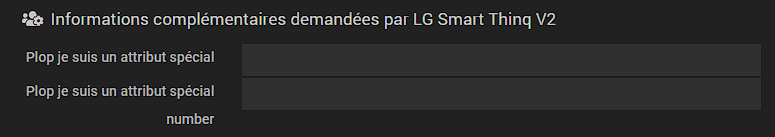
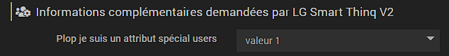

# Documentación del archivo info.json

Incluido desde la versión 3.0 de Jeedom, el archivo ``info.json`` es imprescindible para el correcto funcionamiento de los complementos y su correcta publicación en el Market de Jeedom.

El archivo info.json se guarda en la carpeta ``/plugin_info/`` de tu plugin.

## Lista de variables del archivo ``info.json``

Los campos marcados con un * son obligatorios.

Campos | Valores |
------------------------ | ------------------------------------------------------------------------------------------------------------------------- |
``id`` * | Identificador único del complemento en el Market de Jeedom. Debe comenzar por una letra. Sin acentos. No puede contener el símbolo _ |
``name`` * | Nombre del complemento. |
``description`` * | Descripción del complemento, tal y como aparecerá en el Market de Jeedom. Mínimo 80 caracteres. (``<br/>`` para el salto de línea). Atención: se trata de una tabla con los diferentes idiomas disponibles en Jeedom (fíjate bien en el ejemplo de la plantilla del plugin) | |
``utilization``                    | Información complementaria a la documentación sobre el uso del complemento. |
``licence`` * | Tipo de licencia. |
``author`` * | Nombre del autor del complemento, tal y como aparecerá una vez instalado el complemento, en la información del mismo. |
``require`` * | Versión mínima requerida de Jeedom (Core). |
``os``                 | Versión mínima y máxima requerida de Debian. En formato JSON, por ejemplo: {"min": 10, "max": 12.99} (Core 4.4.15 como mínimo). Si no se rellena alguno de los dos campos, no se comparará con la versión del sistema operativo del usuario. Puedes indicar una versión más precisa, como 10.5, por ejemplo. Para eliminar la restricción de versión, hay que volver a publicar en la tienda con un valor vacío «». Ten en cuenta que, para el valor máximo, se recomienda poner .99 para incluir todas las versiones menores. |
``category`` * | Categoría de clasificación del complemento en el Market de Jeedom. **Es imprescindible respetar la [lista de elementos de la tabla siguiente](#NOMENCLATURE%20CATEGORIES)** |
``display``                  | Si el complemento utiliza un panel específico en el escritorio, este es el nombre del archivo principal de dicho panel. |
``mobile``                   | Si el complemento utiliza un panel específico en la aplicación web de Jeedom, este es el nombre del archivo principal de dicho panel.   |
``changelog`` * | Enlace HTML al registro de cambios. |
``documentation`` * | Enlace HTML a la documentación del complemento.
``changelog_beta`` * | Enlace HTML al registro de cambios de la versión beta.|
``documentation_beta`` * | Enlace HTML a la documentación beta del complemento.
``link`` -> ``video``               | Enlace HTML a un vídeo de presentación. |
``link`` -> ``forum``               | Enlace HTML al foro sobre el tema oficial del complemento. |
``language``                | Lista de idiomas disponibles para el complemento: ``fr_FR``, ``en_US``, ``de_DE``, ``it_IT``, ``es_ES``, ``pt_PT``            |
``compatibility``            | Compatibilidad del complemento: miniplus, smart, docker, rpi, diy, mobileapp, v4. |
``hasDependency``            | «true» si [El complemento debe instalar algunas dependencias](daemon_plugin#Les%20d%C3%A9pendance), o bien «false» o ausente. |
``hasOwnDeamon``             | «true» si [El complemento debe ejecutar daemons](daemon_plugin#Les%20d%C3%A9mons%20%26%20d%C3%A9pendances), o bien «false» o ausente. |
``maxDependancyInstallTime`` | Tiempo máximo asignado para la instalación de los dispositivos, expresado en minutos. |
``specialAttributes`` | Permite a los complementos solicitar [parámetro adicional](#SpecialAttributes) en [de los objetos](#Attributs%20Objet) o [de los usuarios](#Attributs%20User) (fíjate bien en el ejemplo de la plantilla del complemento) (Ver explicaciones más abajo) |
``issue``                    | URL del gestor de incidencias, si es externo (si no se rellena, recibirás un correo electrónico)

## Ejemplo

[Archivo plugin-template/plugin_info/info.json](https://github.com/jeedom/plugin-template/blob/master/plugin_info/info.json)

## LISTA DE CATEGORÍAS

Market Jeedom | info.json |
--------------------- | ----------------------- |
Comunicación | ``communication``           |
Confort | ``wellness``                |
Energía | ``energy``                  |
El tiempo | ``weather``                 |
Supervisión | ``monitoring``              |
Multimedia | ``multimedia``              |
Naturaleza | ``nature``                  |
Objetos conectados | ``devicecommunication``     |
Organización | ``organization``            |
Pasarela de domótica  | ``home automation protocol``|
Programación | ``programming``             |
Protocolo de domótica   | ``automation protocol``     |
Salud | ``health``                  |
Seguridad | ``security``                |
Automatización | ``automatisation``          |

## Atributos especiales

Estos atributos permiten solicitar a los usuarios parámetros adicionales para cada objeto (`objet` en el sentido de Jeedom: menú Herramientas / Objetos; normalmente, esto representa las estancias de nuestro sistema de domótica) o bien para cada usuario.

### Uso

En tu código, podrás obtener el valor de estos parámetros utilizando el objeto `User` para un atributo User, o bien el objeto `jeeObject` para un atributo de objeto:

```
user : $user->getOptions(‹ plugin::ID_plugin::clef ›)
object : $jeeObject->getConfiguration(‹ plugin::ID_plugin::clef ›)
```
* ID_plugin es el identificador de tu plugin
* «clef» es la clave de tu configuración JSON (en el ejemplo: toto, toto 2...)

### Atributos del objeto

La sintaxis para proponer dos parámetros específicos por objeto es la siguiente:
```
	"specialAttributes" : {
		"object" : {
			"toto" : {"name" : {"fr_FR" : "Plop je suis un attribut spécial"},"type" : "input"},
			"toto2" : {"name" : {"fr_FR" : "Plop je suis un attribut spécial number"},"type" : "number"}
		}
	}
```

De este modo, el usuario podrá definir estos dos parámetros para cada objeto en el menú de configuración de objetos (menú Herramientas / Objetos).
Aquí hay un texto libre y uno digital.


### Atributos de usuario

```
	"specialAttributes" : {
		"user" : {
			"toto" : {"name" : {"fr_FR" : "Plop je suis un attribut spécial users"},"type" : "select","values" : [{"value" : "1", "name" : "valeur 1"},{"value" : "plop", "name" : "valeur plop"}]}
		}
	}
```

En este caso, este atributo permite a cada usuario definir un parámetro propio (en el menú Ajustes / Preferencias)


### Atributos de EqLogic

```
	"specialAttributes": {
        "eqLogic": {
            "mqttTranmit": {
                "type": "checkbox",
                "name": {
                    "fr_FR": "Transmettre l'équipement en MQTT"
                }
            }
        }
    }
```

Aquí, este atributo permite definir un parámetro para cada dispositivo de Jeedom (en la configuración avanzada del dispositivo). Lo encontrarás en la configuración del dispositivo en `plugin::mqtt2::mqttTranmit` (`plugin::id_plugin::key`)
