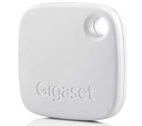
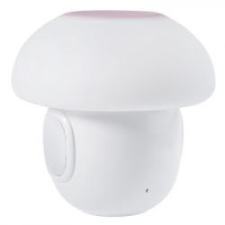
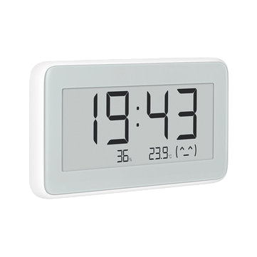

# amazfit
|Image|Marque|Nom|Type|Remarque|Lien|
|---|---|---|---|---|---|
||amazfit|||||

# awoxmesh
|Image|Marque|Nom|Type|Remarque|Lien|
|---|---|---|---|---|---|
||awoxmesh|||||
||awoxmesh|||||

# beagle
|Image|Marque|Nom|Type|Remarque|Lien|
|---|---|---|---|---|---|
||beagle|||||

# beewismartdoor
|Image|Marque|Nom|Type|Remarque|Lien|
|---|---|---|---|---|---|
||beewismartdoor|||||

# blpnr
|Image|Marque|Nom|Type|Remarque|Lien|
|---|---|---|---|---|---|
||blpnr|||||

# default
|Image|Marque|Nom|Type|Remarque|Lien|
|---|---|---|---|---|---|
||default|||||

# divoompixoo
|Image|Marque|Nom|Type|Remarque|Lien|
|---|---|---|---|---|---|
||divoompixoo|||||

# divoomtimeboxmini
|Image|Marque|Nom|Type|Remarque|Lien|
|---|---|---|---|---|---|
||divoomtimeboxmini|||||

# dotti
|Image|Marque|Nom|Type|Remarque|Lien|
|---|---|---|---|---|---|
||dotti|||||

# dreamscreen
|Image|Marque|Nom|Type|Remarque|Lien|
|---|---|---|---|---|---|
||dreamscreen|||||

# fitbit
|Image|Marque|Nom|Type|Remarque|Lien|
|---|---|---|---|---|---|
||fitbit|||||

# flowerpower
|Image|Marque|Nom|Type|Remarque|Lien|
|---|---|---|---|---|---|
||flowerpower|||||

# gigaset
|Image|Marque|Nom|Type|Remarque|Lien|
|---|---|---|---|---|---|
||gigaset|||||

# hector
|Image|Marque|Nom|Type|Remarque|Lien|
|---|---|---|---|---|---|
||hector|||||

# itag
|Image|Marque|Nom|Type|Remarque|Lien|
|---|---|---|---|---|---|
||itag|||||

# jinlin
|Image|Marque|Nom|Type|Remarque|Lien|
|---|---|---|---|---|---|
||jinlin|||||

# kst1
|Image|Marque|Nom|Type|Remarque|Lien|
|---|---|---|---|---|---|
||kst1|||||

# logiswitch
|Image|Marque|Nom|Type|Remarque|Lien|
|---|---|---|---|---|---|
||logiswitch|||||

# lywsd02
|Image|Marque|Nom|Type|Remarque|Lien|
|---|---|---|---|---|---|
||lywsd02|||||

# meyerdom
|Image|Marque|Nom|Type|Remarque|Lien|
|---|---|---|---|---|---|
||meyerdom|||||
||meyerdom|||||
||meyerdom|||||

# meyerdom4contacts
|Image|Marque|Nom|Type|Remarque|Lien|
|---|---|---|---|---|---|
||meyerdom4contacts|||||

# miband
|Image|Marque|Nom|Type|Remarque|Lien|
|---|---|---|---|---|---|
||miband|||||
||miband|||||
||miband|||||
||miband|||||
||miband|||||
||miband|||||

# miflora
|Image|Marque|Nom|Type|Remarque|Lien|
|---|---|---|---|---|---|
||miflora|||||

# miscale
|Image|Marque|Nom|Type|Remarque|Lien|
|---|---|---|---|---|---|
||miscale|||||

# miscale2
|Image|Marque|Nom|Type|Remarque|Lien|
|---|---|---|---|---|---|
||miscale2|||||

# myfox
|Image|Marque|Nom|Type|Remarque|Lien|
|---|---|---|---|---|---|
||myfox|||||

# niu
|Image|Marque|Nom|Type|Remarque|Lien|
|---|---|---|---|---|---|
||niu|||||

# noke
|Image|Marque|Nom|Type|Remarque|Lien|
|---|---|---|---|---|---|
||noke|||||

# nut
|Image|Marque|Nom|Type|Remarque|Lien|
|---|---|---|---|---|---|
||nut|||||

# parrotpot
|Image|Marque|Nom|Type|Remarque|Lien|
|---|---|---|---|---|---|
||parrotpot|||||

# playbulb
|Image|Marque|Nom|Type|Remarque|Lien|
|---|---|---|---|---|---|
||playbulb|||||

# ropot
|Image|Marque|Nom|Type|Remarque|Lien|
|---|---|---|---|---|---|
||ropot|||||

# ruuvi
|Image|Marque|Nom|Type|Remarque|Lien|
|---|---|---|---|---|---|
||ruuvi|||||

# smartplug
|Image|Marque|Nom|Type|Remarque|Lien|
|---|---|---|---|---|---|
||smartplug|||||

# tb05
|Image|Marque|Nom|Type|Remarque|Lien|
|---|---|---|---|---|---|
||tb05|||||

# ticatag
|Image|Marque|Nom|Type|Remarque|Lien|
|---|---|---|---|---|---|
||ticatag|||||

# tile
|Image|Marque|Nom|Type|Remarque|Lien|
|---|---|---|---|---|---|
||tile|||||

# wistiki
|Image|Marque|Nom|Type|Remarque|Lien|
|---|---|---|---|---|---|
||wistiki|||||

# xiaomiht
|Image|Marque|Nom|Type|Remarque|Lien|
|---|---|---|---|---|---|
||xiaomiht|||||

# yeelight
|Image|Marque|Nom|Type|Remarque|Lien|
|---|---|---|---|---|---|
||yeelight|||||

Cette liste est basee sur des retours utilisateurs, l\'équipe Jeedom ne peut donc garantir que tous les modules de cette liste sont 100% fonctionnels
