# Camera compatibility

|Image|Nom|Remarque|Lien|
|---|---|---|---|---|---|
||IP_Linkcom / Alcatel video door entry unit|||
|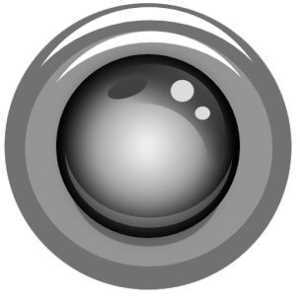|Android IP webcam|||
||Axis|||
||Bluestork|||
||D-Link DCS-5300G|||
||D-Link DCS|||
||D-Link DCS|||
||D-Link DCS PTZ|||
|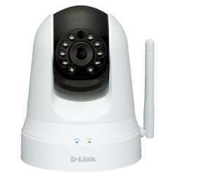|D-Link DSC-5020L && DCS-935L|||
||D-Link EyeOn baby Monitor|||
|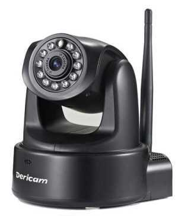|Dericam H502W|||
|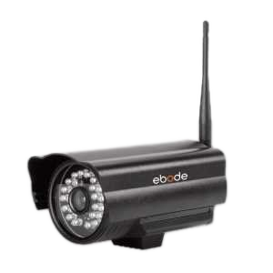|Outdoor ebode|||
||Motorized HD Ebode|||
|||||
||Foscam FI9803EP|||
||Foscam FI9803P|||
|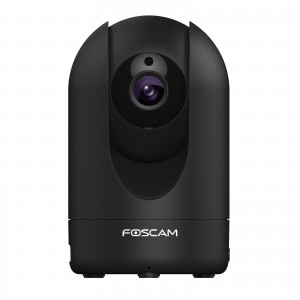|Foscam R2|||
||Foscam HD|||
||Motorized Foscam HD|||
||Motorized foscam|||
|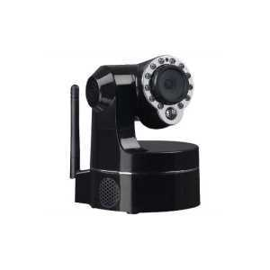|Heden CAMHED05IPWN (V5.5), VISIONCAM22|||
|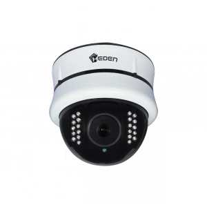|Heden VisionCam HD CAMHD08MD0|||
||Heden VisionCam CAMHED04IPWN|||
||Hikvision DS-7216HWI-SH / A (XXX = 101 for channel 1 / XXX = 202 for channel 2)|||
||Hikvision DS-2CD2132-I, DS-2CD3332-I, DS-2CD2232-I5, DS-2CD2732F-IS|||
||Karotz|||
||Konx video door entry unit|||
||Motorized Mustcam HD|||
||Onvif|||
||Openkarotz Camera|||
||Panasonic BL-C121|||
||Netatmo Presence|||
|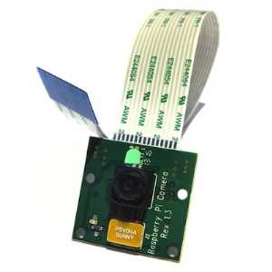|RPI Cam|||
||Tenvis|||
||TrendNet TV-IP310PI|||
|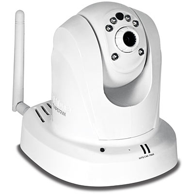|TrendNet TV-IP672WI|||
|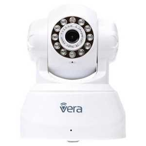|Vera Vista cam 700 / Secomm / Homelive|||
||Vera Vista cam SD|||
||Vivotek 8xxx and 7xxx|||
|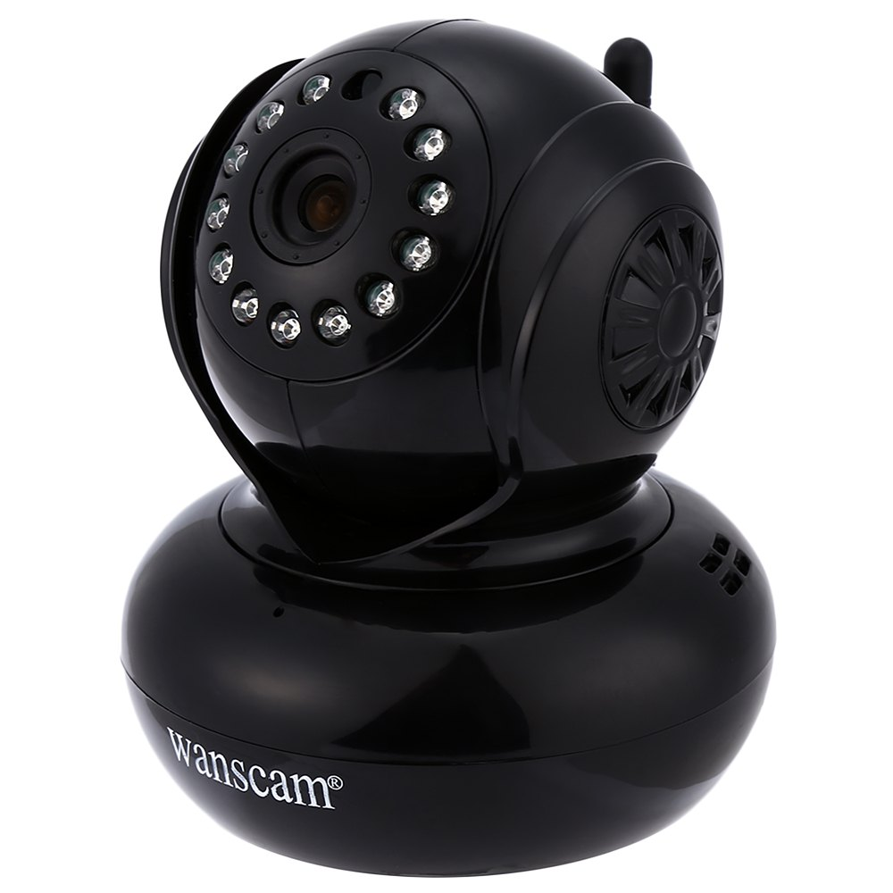|Wanscam HW0021|||
||Wanscam HW0026|||
||Wanscam HW0036|||
|||||
||Wanscam HW0043|||
||Wanscam HW0045|||
||Wanscam HW0049|||
|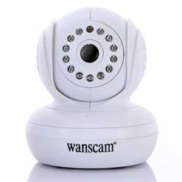|Wanscam HW00XX|||
||Motorized Wanscam|||
||Wanscam q3 (s)|||
|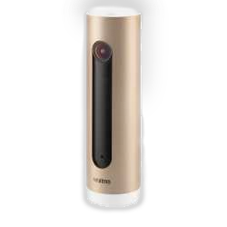|Netatmo Welcome|||
||Y-Cam|||
||Zavio F3115|||

This list is based on user feedback, the Jeedom team cannot therefore guarantee that all the modules in this list are 100% functional
