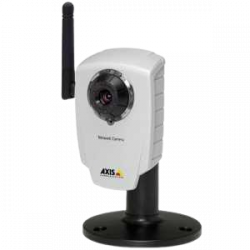
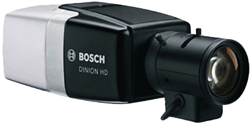
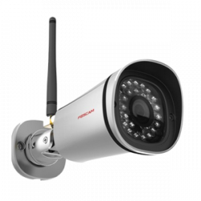
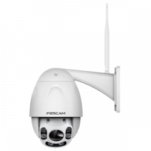
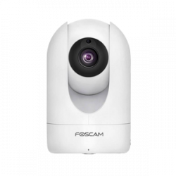
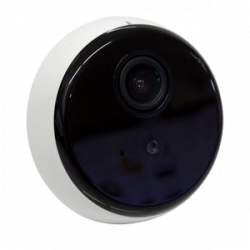
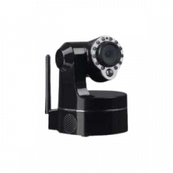
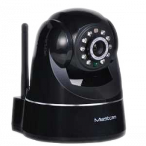
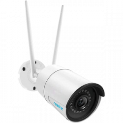
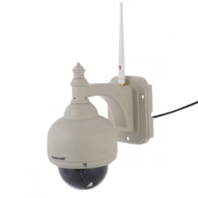

# Camera compatibility

# Alcatel

|Image|Marque|Nom|Type|Remarque|Lien|
|---|---|---|---|---|---|
||Alcatel|IP_Linkcom / video door entry unit||||

# Android

|Image|Marque|Nom|Type|Remarque|Lien|
|---|---|---|---|---|---|
||Android|IP Webcam||||

# Axis

|Image|Marque|Nom|Type|Remarque|Lien|
|---|---|---|---|---|---|
||Axis|207w||||

# Bluestork

|Image|Marque|Nom|Type|Remarque|Lien|
|---|---|---|---|---|---|
||Bluestork|Camera||||

# Bosh

|Image|Marque|Nom|Type|Remarque|Lien|
|---|---|---|---|---|---|
||Bosch|DINION IP||||

# D-link

|Image|Marque|Nom|Type|Remarque|Lien|
|---|---|---|---|---|---|
||D-Link|DCS-5300G||||
||D-Link|DCS 932l||||
||D-Link|DCS||||
||D-Link|DCS PTZ||||
||D-Link|DSC-5020L && DCS-935L||||
||D-Link|EyeOn baby Monitor||||

# Dahua

|Image|Marque|Nom|Type|Remarque|Lien|
|---|---|---|---|---|---|
||Dahua|IPC-B1B40||||
||Dahua|IPC-D2B40||||
||Dahua|IPC-HDBW1431E-S||||
||Dahua|IPC-K35A||||
||Dahua|SD22204T-GN-W||||

# Dericam

|Image|Marque|Nom|Type|Remarque|Lien|
|---|---|---|---|---|---|
||Dericam|H502W||||

# Doorbird

|Image|Marque|Nom|Type|Remarque|Lien|
|---|---|---|---|---|---|
||Doorbird|Camera||||

# Ebode

|Image|Marque|Nom|Type|Remarque|Lien|
|---|---|---|---|---|---|
||Ebode|Outdoor||||
||Ebode|Motorized HD||||
||Ebode|Motorized||||

# Foscam

|Image|Marque|Nom|Type|Remarque|Lien|
|---|---|---|---|---|---|
||Foscam|C1 / C2||||
||Foscam|C2M|||[Buy](https://www.domadoo.fr/fr/cameras/4975-foscam-camera-ip-wifi-interieure-2mp-6954836069547.html)|
||Foscam|D2P / D2EP||||
||Foscam|FI980xP / FI980xEP||||
||Foscam|FI9828W / FI9828P / FI9828P V2 / FI9805E||||
||Foscam|FI9853P / FI9853EP||||
||Foscam|FI9900EP / FI9900P / FI9901EP / FI9901P||||
||Foscam|FI9902P / FI9902EP|||[Buy](https://www.domadoo.fr/fr/cameras/4977-foscam-camera-ip-wifi-exterieur-2mp-6954836013533.html)|
||Foscam|FI9926P||||
||Foscam|FI9928P|||[Buy](https://www.domadoo.fr/fr/cameras/4978-foscam-camera-ip-wifi-exterieur-motorisee-2mp-6954836003299.html)|
||Foscam|G4P / G4EP||||
||Foscam|R2P / R2EP||||
||Foscam|R2MP / R2MEP|||[Buy](https://www.domadoo.fr/fr/cameras/4976-foscam-camera-ip-wifi-interieure-motorisee-2mp-6954836001486.html)|

# Freebox

|Image|Marque|Nom|Type|Remarque|Lien|
|---|---|---|---|---|---|
||Freebox|RocketCam||||

# Hedden

|Image|Marque|Nom|Type|Remarque|Lien|
|---|---|---|---|---|---|
||Heden|CAMHED05IPWN (V5.5), VISIONCAM22||||
||Heden|VisionCam HD CAMHD08MD0||||
||Heden|VisionCam CAMHED04IPWN||||

# Hikivision

|Image|Marque|Nom|Type|Remarque|Lien|
|---|---|---|---|---|---|
||Hikvision|DS-2DE2A404IW-DE3||||
||Hikvision|DS-7216HWI-SH / A||(XXX = 101 for channel 1 / XXX = 202 for channel 2)||
||Hikvision|DS-2CD2132-I, DS-2CD3332-I, DS-2CD2232-I5, DS-2CD2732F-IS||||

# Ios

|Image|Marque|Nom|Type|Remarque|Lien|
|---|---|---|---|---|---|
||ios|IP Camera||||
||ios|Karakuri Camera - Auto Shutter & WEB Monitoring||||
||ios|Live Reporter||||
||ios|HD periscope||||

# Karotz

|Image|Marque|Nom|Type|Remarque|Lien|
|---|---|---|---|---|---|
||Karotz|Karotz||||
||Karotz|Openkarotz||||

# Konx

|Image|Marque|Nom|Type|Remarque|Lien|
|---|---|---|---|---|---|
||Konx|Video doorman||||

# Mustcam

|Image|Marque|Nom|Type|Remarque|Lien|
|---|---|---|---|---|---|
||Mustcam|Motorized HD||||

# Netatmo

|Image|Marque|Nom|Type|Remarque|Lien|
|---|---|---|---|---|---|
||Netatmo|Doorbell||Absolutely requires the Netatmo Security plugin (paid)||
||Netatmo|Presence||Absolutely requires the Netatmo Security plugin (paid)|[Buy](https://www.domadoo.fr/fr/objets-communicants/3855-netatmo-camera-exterieure-de-securite-presence-3700730501866.html)|
||Netatmo|Welcome||Absolutely requires the Netatmo Security plugin (paid)|[Buy](https://www.domadoo.fr/fr/objets-communicants/3064-netatmo-camera-a-reconnaissance-faciale-welcome-3700730500623.html)|

# Onvif

|Image|Marque|Nom|Type|Remarque|Lien|
|---|---|---|---|---|---|
||Onvif|Onvif||Discovery of Onvif cameras (attention does not always work, no guarantee possible)||

# Panasonic

|Image|Marque|Nom|Type|Remarque|Lien|
|---|---|---|---|---|---|
||Panasonic|BL-C121||||
||Panasonic|Panasonic WV-NP502||||

# Reolink

|Image|Marque|Nom|Type|Remarque|Lien|
|---|---|---|---|---|---|
||Reolink|E1 Pro||||
||Reolink|E1 Zoom||||
||Reolink|Camera Proxy (for argus if proxy server installed)||||
||Reolink|RLC-410-5MP||||
||Reolink|RLC-410W||||

# Rpi

|Image|Marque|Nom|Type|Remarque|Lien|
|---|---|---|---|---|---|
||RPI|Camera||||

# Tenvis

|Image|Marque|Nom|Type|Remarque|Lien|
|---|---|---|---|---|---|
||Tenvis|Camera||||

# Trendnet

|Image|Marque|Nom|Type|Remarque|Lien|
|---|---|---|---|---|---|
||TrendNet|TV-IP310PI||||
||TrendNet|TV-IP325PI||||
||TrendNet|TV-IP672WI||||

# Ubiquiti

|Image|Marque|Nom|Type|Remarque|Lien|
|---|---|---|---|---|---|
||Ubiquiti|UVC G3 Dome||||
||Ubiquiti|Ubiquiti G3 Flex||||
||Ubiquiti|Ubiquiti G3 Instant||||
||Ubiquiti|Ubiquiti G3 Pro||||
||Ubiquiti|Ubiquiti G4 Bullet||||
||Ubiquiti|Ubiquiti G4 Bullet||||
||Ubiquiti|Ubiquiti G4 Pro||||

# Vistacam

|Image|Marque|Nom|Type|Remarque|Lien|
|---|---|---|---|---|---|
||Vistacam|Vera 700 / Secomm / Homelive||||
||Vistacam|Vera SD||||

# Vivotek

|Image|Marque|Nom|Type|Remarque|Lien|
|---|---|---|---|---|---|
||Vivotek|8xxx and 7xxx||||

# Wanscam

|Image|Marque|Nom|Type|Remarque|Lien|
|---|---|---|---|---|---|
||Wanscam|HW0021||||
||Wanscam|HW0026||||
||Wanscam|HW0036||||
||Wanscam|HW0038||||
||Wanscam|HW0043||||
||Wanscam|HW0045||||
||Wanscam|HW0049||||
||Wanscam|HW00XX||||
||Wanscam|Motorized||||
||Wanscam|q3 (s)||||

# Ycam

|Image|Marque|Nom|Type|Remarque|Lien|
|---|---|---|---|---|---|
||Y-Cam|Camera||||

# Zavio

|Image|Marque|Nom|Type|Remarque|Lien|
|---|---|---|---|---|---|
||Zavio|F3115||||

This list is based on user feedback, the Jeedom team cannot therefore guarantee that all the modules in this list are 100% functional

2024-01-31 01:20:04
