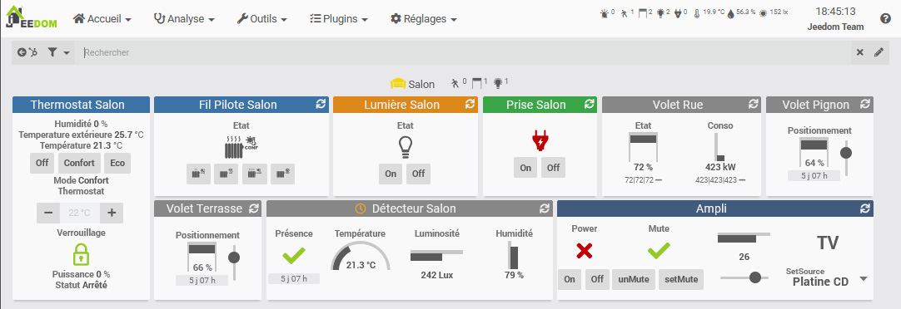
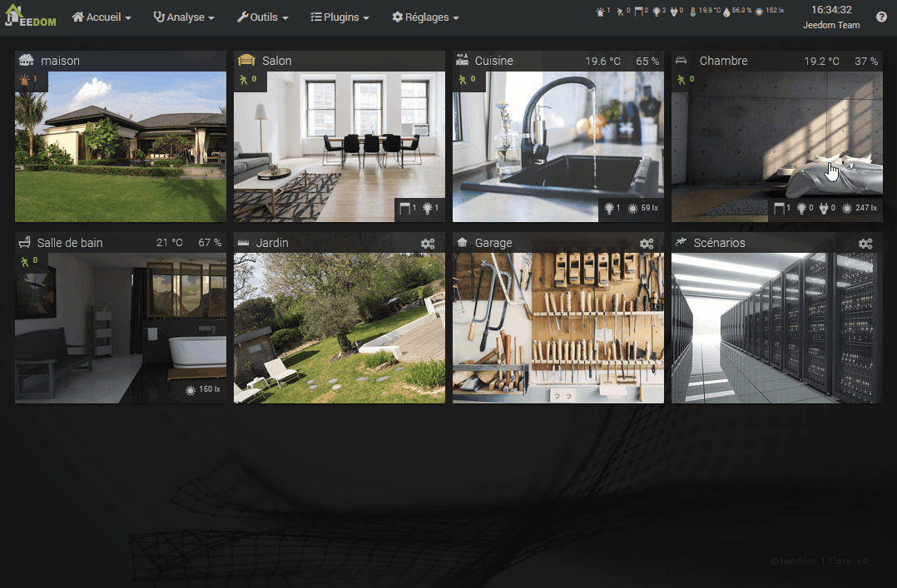

# Concept

Here are the main basic concepts of Jeedom. This documentation remains voluntarily simple in order to help you take control of your home automation.

The possibilities of Jeedom are almost infinite, since you can create a lot of things with a few php, python or other scripts, but that is not the subject here.

> Tip
>
> The links below point to Core v4.5. Once on the documentation page (User manual or configuration) you can change version in the menu at the top left to switch to the version corresponding to the Core you want.

## Affichage

Jeedom allows you to interface a large number of devices together, whether they are based on Z-Wave, Enocean, Zigbee etc. protocols, on APIs using plugins or directly in the form of scripts. You can watch on the [Market](https://market.jeedom.com/) to get an overview of supported devices.

You can view these devices in several ways :

- On the [Dashboard](/en_US/core/4.5/dashboard)
- On the [Synthesis](/en_US/core/4.5/overview) (v4.5)
- On a [View](/en_US/core/4.5/view)
- On a [Design](/en_US/core/4.5/design)
- On a [3D design](/en_US/core/4.5/design3d)


These can be viewed in a browser on a desktop computer, on a smartphone with the WebApp or the mobile application : [Mobile version](/en_US/mobile/index)

## The Objects

In order to organize your devices, you can create [Objects](/en_US/core/4.5/object).

These objects can represent parts of the house (Living room, Bedroom, Workshop). Each object can have a parent object. This hierarchy will be used for display on the Dashboard. For example, you can have an object **House**, then objects **Living room** and **Bedroom** object children **House**. Once on the Dashboard, the object **House** will also display, below, its child objects.


> **Advice**
>
> In **Settings → Preferences**, you can define which object you want to arrive on the Dashboard. [Preferences](/en_US/core/4.5/profils)



## Equipment and their commands

### Commandes

To interact with our home automation, you need commands ! These are of two types :

> Note
>
> Rest assured, commands are normally created automatically ! These explanations are for a better understanding.

- The Commands *Info* :
These commands store information from sensors. For example the temperature of a probe, a movement of a presence sensor, etc.
These commands can be logged in order to keep this information over time in the form of a curve : [History](/en_US/core/4.5/history)

These commands can also be used to trigger [Scenarios](/en_US/core/4.5/scenario) in order to automate actions based on the information sent by your sensors. For example, a motion sensor detects a presence, which will trigger a scenario that will turn on the light.

- The Commands *Action* :
These commands allow you to control your actuators. For example, commands ````on```` and ````off```` of a controlled outlet will allow you to turn it on and off.

Action commands are usually linked to info commands. Here our take has two actions ````on```` and ````off````, usually related to information **State**.


These two types of commands are attached in the form of equipment. The equipment therefore has info and / or action commands, and it is this equipment that will have an Object as parent, allowing you to display it where you want.

Each command can also have what is called a generic type, allowing Jeedom and some plugins to know the type of command (State of a socket, button of a light, etc). [**Tools → Equipment types**](/en_US/core/4.5/types).

### Équipement

- Physiquement: I have a socket with an on / off button and a status led, in the living room.
- In Jeedom: I have equipment with two on and off actions and a status info, in the Salon object.

These equipments are created by plugins. For example, the Z-Wave plugin will allow you to include your Z-Waze socket, which will create a device with its controls that you can name and link to an Object.

In terms of display, each command is displayed using a Widget. The Core offers the main Widgets, as well as a tool to create them (V4) : [Widget](/en_US/core/4.5/widgets).

These commands are grouped in a tile corresponding to your equipment. And this tile will therefore be displayed on the Dashboard in the Object that you have assigned to it.


Whatever your device, it will therefore be created in the form of a device, from a [Plugin](/en_US/core/4.5/plugin).

This device will have its own commands *Info* or *Action*. These commands will be displayed as Widgets forming the equipment tile, in its parent object.

You will then see that each Object, Equipment or Command has many options, in terms of functionality or display. But first things first, now you should have understood the basic concepts of Jeedom and thus be able to start organizing your home automation by knowing where to look.

## My first scenario

The advantage of home automation, beyond centralized and remote control of our peripherals, lies above all in automation. The goal is not to spend hours in front of your Dashboard or Design, but on the contrary that your accommodation adapts to your habits and makes you forget. No more shutters to open and close every day, no more lights to turn on and off, be warned when to put the trash on the street, when there is mail in the letterbox, the heating which adapts according to the seasons and climatic conditions. The possibilities are endless, and depend on one's lifestyle. The scenarios are there for that !

A scenario is a series of defined actions that will be executed at certain times of the day. The execution can be scheduled (every Monday at a particular time), or caused by an event. As seen above, this event can for example be our info command *Presence* a motion detector, following a detection.

The goal here is not to be exhaustive but to discover the scenarios through simple examples. The [user manual documentation](/en_US/core/4.5/scenario) is much more complete.


### Light on motion detection.

Suppose we have a controlled light and a motion detector in the room.



- Go to **Tools → Scenarios**
- Click on *Add* then give a name to the new scenario.
- Right, in the section *Trigger*, check that the mode is in *Provoked* then click on *+ Trigger*.
- Using the button *Choose a command* to the right of the field *Event*, select the object then the equipment and its command.

The *Trigger* is what will trigger the execution of this scenario. Here, we want to trigger it when our detector detects a presence, so we will use the command `#[Bedroom][Détecteur Bedroom][Presence]# == 1`.

The `#` indicates a command, then we find `[the name of its parent object]` then `[the name of the equipment]` and finally `[the name of the command]`. Here, we add ` == 1` because we want the scenario to be triggered only when a presence is detected. However on a presence detector, this detection goes back to 0 a few seconds after. This change to 0 will therefore not trigger our scenario again.

- Click on the tab *Scenario* then the button at the top *Add block*. Choose a block *Action* then on this one, *Add* A *Action*. This action will be our light switching command. According to the same principle : ``#[Bedroom][Lumière Bedroom][On]#``.

- Save, and your script is ready !

We have only scratched the surface of the possible scenarios here. You can add conditions (block *If / Do / Else*), delay actions (block *In*), program them (block *At*) and even directly use php code (block *CODE*).

Here we used the trigger mode *Provoked* with a command. But you can also use (and combine) the mode *Programmed* to run a scenario every morning or every hour, etc.


### Program of the day.

A recurring topic for beginners on Jeedom, the programming of daily events like :

- Turn on the coffee maker at 7 a.m. on weekdays.
- Open the shutters at sunrise.
- Close the shutters at sunset, if I'm not there.

For this type of scenario, here is a very good introduction : [Program of the day](https://kiboost.github.io/jeedom_docs/jeedomV4Tips/Tutos/ProgDuJour/en_US/)

