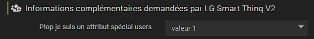

# Documentation file info.json

Integrated since version 3.0 from Jeedom, the file ``info.json`` is mandatory for the proper functioning of plugins, and their proper deployment on the Jeedom Market.

The info file.json is saved in the folder ``/plugin_info/`` of your plugin.

## List of variables in the file ``info.json``

Fields marked with * are required fields.

Fields                   | Values                                                                                                                   |
------------------------ | ------------------------------------------------------------------------------------------------------------------------- |
``id`` *                     | Unique identifier of the plugin on the Jeedom Market. Must start with a letter. Without accents. Cannot contain _                             |
``name`` *                   | Plugin Name.                                                                                                            |
``description`` *            | Description of the plugin, as it will be displayed on the Jeedom Market. Minimum 80 characters. (``<br/>`` for line break.). Please note that this is a table for the different possible Jeedom languages (take a good look at the example of the template plugin)                                  |                                                                                     |
``utilization``                    | Additional information to the documentation on the use of the plugin.                                                    |
``licence`` *                | License Type.                                                                                                          |
``author`` *                 | Name of the plugin author, as it will be displayed once the plugin is installed, in the plugin information.         |
``require`` *                | Minimum required version of Jeedom (Core).                                                                                                |
``os``                 | Minimum and maximum required Debian version. In the form of a json object, example : {"min" : 10,"max" : 12.99} (Core 4.4.15 minimum). If either is not filled, it will not be compared to the user's OS version. You can specify a more precise version like 10.5 for example. To remove the version restriction you have to republish on the market with an empty value "". Note that for the max, it is advisable to put .99 to include all minor versions.                                               |
``category`` *               | Plugin ranking category on the jeedom Market. **Absolutely respect the [nomenclature of the table below](https://doc.jeedom.com/en_US/dev/structure_info_json/#NOMENCLATURE%20CATEGORIES)** |
``display``                  | If the plugin uses a dedicated panel on the desktop,. This is the name of the main file for this panel.                    |
``mobile``                   | If the plugin uses a dedicated panel on the Jeedom webApp. This is the name of the main file for this panel.   |
``changelog`` *              | Html link to the Changelog.                                                                                              |
``documentation`` *          | Html link to plugin documentation.
``changelog_beta`` *              | Html link to the Beta Changelog.|
``documentation_beta`` *          | Html link to the plugin beta documentation.
``link`` -> ``video``               | Html link to a presentation video.                                                                                 |
``link`` -> ``forum``               | Html link to the forum on the official plugin topic.                                                                  |
``language``                | List of languages available for the plugin: ``fr_FR``, ``en_US``, ``de_DE``, ``it_IT``, ``es_ES``, ``pt_PT``            |
``compatibility``            | Plugin Compatibility: miniplus, smart, docker, rpi, diy, mobileapp, v4.                                                   |
``hasDependency``            | «true» si [the plugin needs to install dependencies](https://doc.jeedom.com/en_US/dev/daemon_plugin#Les%20d%C3%A9pendance), sinon «false» ou absent.                                              |
``hasOwnDeamon``             | «true» si [the plugin must run deamons](https://doc.jeedom.com/en_US/dev/daemon_plugin#Les%20d%C3%A9mons%20%26%20d%C3%A9pendances), sinon «false» ou absent.                                                   |
``maxDependancyInstallTime`` | Maximum time allowed for installation of dependencies, expressed in minutes.                                            |
``specialAttributes`` | Permet aux plugin de demander des [parametre suplémentaire](https://doc.jeedom.com/en_US/dev/structure_info_json#SpecialAttributes) sur [des objets](https://doc.jeedom.com/en_US/dev/structure_info_json#Attributes%20Object) or [users](https://doc.jeedom.com/en_US/dev/structure_info_json#Attributs%20User) ((look carefully at the example of the plugin template) (See explanations below)                                            |
``issue``                    | URL to the bugtracker if external (if not filled in then you will receive an email)

## Exemple

[Plugin-template/plugin_info/info.json file](https://github.com/jeedom/plugin-template/blob/master/plugin_info/info.json)

## NOMENCLATURE CATEGORIES

Market Jeedom         | info.json               |
--------------------- | ----------------------- |
Communication         | ``communication``           |
Comfort               | ``wellness``                |
Energy               | ``energy``                  |
Weather report                 | ``weather``                 |
Monitoring            | ``monitoring``              |
Multimedia            | ``multimedia``              |
Nature                | ``nature``                  |
Connected Objects      | ``devicecommunication``     |
Organization          | ``organization``            |
Home automation gateway  | ``home automation protocol``|
Programming         | ``programming``             |
Home automation protocol   | ``automation protocol``     |
Health                 | ``health``                  |
Security              | ``security``                |
Automation           | ``automatisation``          |

## SpecialAttributes

These attributes allow users to be asked for additional parameters, on each object (`object` in the Jeedom sense : Tools / Objects menu; typically this represents the rooms in our home automation) or for each user.

### Utilisation

In your code, you can retrieve the value of these parameters by using the `User` object for a User attribute, or the `jeeObject` object for an object attribute:

```
user : $user->getOptions(‹ plugin::ID_plugin::key ›)
object : $jeeObject->getConfiguration(‹ plugin::ID_plugin::key ›)
```
* ID_plugin is the ID of your plugin
* key is the key in your json configuration (in the example: toto, toto 2 ...)

### Object Attributes

The syntax is as follows to propose 2 specific parameters per object :
```
	"specialAttributes" : {
		"object" : {
			"toto" : {"name" : {"fr_FR" : "Plop I am a special attribute"},"type" : "input"},
			"toto2" : {"name" : {"fr_FR" : "Plop I am a special attribute number"},"type" : "number"}
		}
	}
```

The user will be able to define these 2 parameters for each object in the object configuration menu (Tools / Objects menu).
Here is a free text, and a digital one.


### User Attributes

```
	"specialAttributes" : {
		"user" : {
			"toto" : {"name" : {"fr_FR" : "Plop I am a special attribute users"},"type" : "select","values" : [{"value" : "1", "name" : "value 1"},{"value" : "plop", "name" : "plop value"}]}
		}
	}
```

Here, this attribute allows each user to define a parameter specific to them (in the Settings / Preferences menu)


### EqLogic Attributes

```
	"specialAttributes": {
        "eqLogic": {
            "mqttTranmit": {
                "type": "checkbox",
                "name": {
                    "fr_FR": "Transmit equipment in MQTT"
                }
            }
        }
    }
```

Here, this attribute allows you to define a parameter for each jeedom equipment (in the advanced configuration of the equipment). You can find it in the equipment configuration under `plugin::mqtt2::mqttTranmit` (`plugin::id_plugin::key`)
