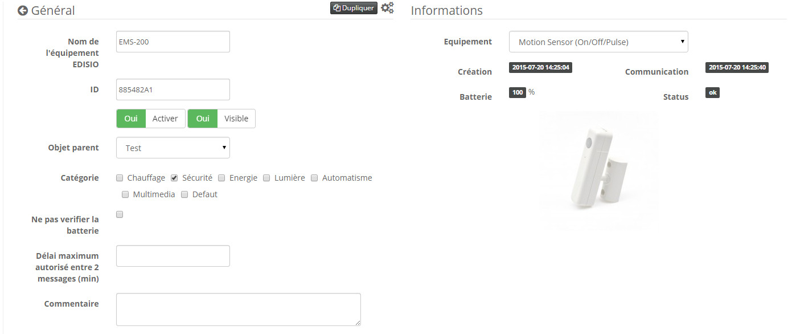

# 

****

## 

.

. .

## Fonctions

-   
-   
-   
-   
-   
-   
-   

## 

-    : 
-    : )
-    : 
-    : 
-    : 100M
-    : 6M
-    : 
-    : IP20
-    : 

## 

-    : 
-    : EMS-200

## 

 .

> ****
>
> .

> ****
>
> .

### "

.

### 

### 

.  :

## 

. . . . .

 :

> ****
>
> .

### Commandes

 :

 :

-    : 
-    : 

### Informations

 :

-    : 
-    : 
-    : 
-    : 
