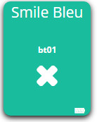

# Edisio ETC1

**The module**

**The Jeedom visual**

## Summary 

Les télécommandes “Smile” ont un canal, elles sont idéales pour la table de chevet, salle de bain et surtout pour les enfants, car celles-ci sont très robustes grâce au matériau utilisé. Ultra simples et à la fois “fun” elles ont pour but d'être pratiques dans l'habitat. They exist in three different colors.

They are easily connected to the different receivers and can therefore control on / off lights, variable lights, shutters, gates, garage doors. Available in 3 colors.

In addition, interaction with other protocols is possible, it can interact with Edisio brand receivers, with Jeedom, but also by any Z-Wave receiver on your network.

## Fonctions

-   Mode of use : Lighting, Dimmer
-   Small, discreet and aesthetic
-   Ease of use and installation

## Technical characteristics

-   Type of module : Edisio transmitter
-   Food : 3VDC (CR2032 Lithium Battery)
-   Canals : 1
-   Radio protocol : 868.3 MHz
-   Range in free field : 100M
-   Operating temperature : -10 ° C + 50 ° C
-   Dimensions : 65x18mm
-   Degree of protection : IP64

## Module data

-   Mark : Edisio Smart Home
-   Name : ETC1
-   Reference : P01 / Y01 / L01

## General configuration

To configure the Edisio plugin and associate a module with Jeedom, refer to this [Documentation](https://doc.jeedom.com/en_US/plugins/automation%20protocol/edisio/).

> **IMPORTANT**
>
> For Jeedom to automatically create your transmitter modules, don't forget to activate the option in the plugin configuration.

### Function diagram

Here is how the remote control works :

### Battery replacement

To replace the battery of your remote control, here is the procedure to follow :

## Association of the remote control with Jeedom

The association of an Edisio transmitter is simple and automatic. Just press the button on your remote control.

Once, your associated equipment, you should get this :

### Commandes

Once your equipment is created, you should get the commands associated with the module :

Here is the list of commands :

-   bt01 : It is the command that allows you to interact with button 1
-   Drums : Indicates the battery status

### Informations

Once your equipment is associated with Jeedom, various information will be available :

-   Creation : Indicates the date on which the equipment was created
-   Communication : Indicates the last communication recorded between Jeedom and the micro-module
-   Drums : Indicates the battery status of the battery modules
-   STATUS : Returns the status of the module

### Utilisation

Once your remote control is configured, you can with the Jeedom Scenario plugin, interact with your remote control on Jeedom and its equipment.

> **NOTE**
>
> The remote control with binary status feedback.
