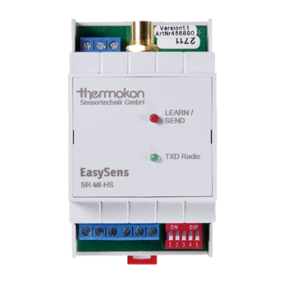
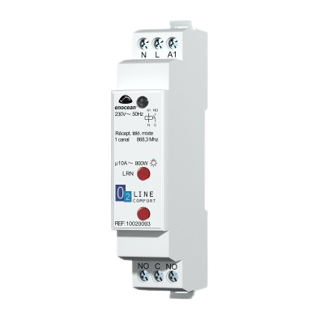
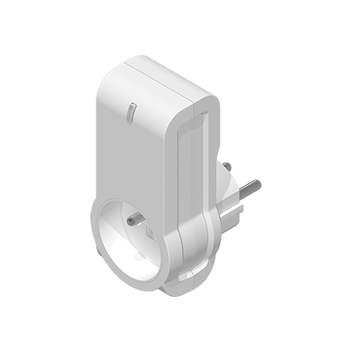
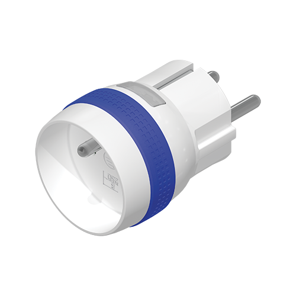
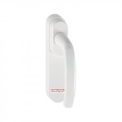
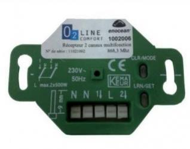
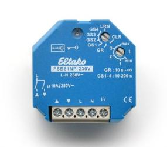

# Compatibility of EnOcean equipment

# A5-02

|Image|Marque|Nom|Type|Remarque|Lien|
|---|---|---|---|---|---|
||Nodon|White temperature sensor|Temperature|Available in several colors|[Buy](http://www.domadoo.fr/fr/peripheriques/2627-nodon-capteur-de-temperature-sans-fils-et-sans-piles-blanc-3700313920183.html)|
||Nodon|Black temperature sensor|Temperature|Available in several colors|[Buy](http://www.domadoo.fr/fr/peripheriques/2637-nodon-capteur-de-temperature-enocean-black-3700313920169.html)|
||Nodon|Aluminum temperature sensor|Temperature|Available in several colors|[Buy](http://www.domadoo.fr/fr/peripheriques/2634-nodon-capteur-de-temperature-enocean-alu-3700313920176.html)|
||Nodon|Wood temperature sensor|Temperature|Available in several colors|[Buy](http://www.domadoo.fr/fr/peripheriques/2635-nodon-capteur-de-temperature-enocean-wood-3700313920145.html)|
||Nodon|Varnish temperature sensor|Temperature|Available in several colors|[Buy](http://www.domadoo.fr/fr/peripheriques/2636-nodon-capteur-de-temperature-enocean-varnish-3700313920152.html)|
||Thermokon|Pipe temperature sensor|Temperature|||

# A5-04

|Image|Marque|Nom|Type|Remarque|Lien|
|---|---|---|---|---|---|
||A5-04|||||
||Nodon|Temperature and humidity sensor Enocean White|Temperature,Humidity|||
||Trio2sys|Humidity and temperature radio probe for indoor mounting|Temperature,Humidity|||
||Nexelec|Insafe + Pilot Humidity and temperature probe|Temperature,Humidity|||
||Eltako|Humidity and temperature radio probe for outdoor mounting - FAFT60|Temperature||[Buy](http://www.domadoo.fr/fr/peripheriques/1931-eltako-sonde-radio-humidite-et-temperature-montage-exterieur-faft60-4010312310120.html)|

# A5-05

|Image|Marque|Nom|Type|Remarque|Lien|
|---|---|---|---|---|---|
||A5-05|||||

# A5-06

|Image|Marque|Nom|Type|Remarque|Lien|
|---|---|---|---|---|---|
||Eltako|FAH60 outdoor light sensor|Luminosité||[Buy](http://www.domadoo.fr/fr/peripheriques/3084-eltako-sonde-de-luminosite-exterieure-4010312305218.html)|

# A5-07

|Image|Marque|Nom|Type|Remarque|Lien|
|---|---|---|---|---|---|
||Eosca|EnOcean motion detector (ceiling position)|Mouvement|||
||Pressac|Motion detector Under desk (underdesk)|Mouvement|||
||Easyfit|Ceiling motion detector|Mouvement|||
||Easyfit|Motion detector under desk|Mouvement|||
||Nodon|EnOcean motion and light detector|Mouvement|||
||Avidsen|Movement detector|Mouvement|||

# A5-09

|Image|Marque|Nom|Type|Remarque|Lien|
|---|---|---|---|---|---|
||A5-09|||||
||Nanosense|CO2 air quality sensor E4000|CO2, Air quality|||
||PressacSensing|Co2 Temperature Humidity sensor|CO2, Temperature, Humidity|||
||Thermokon|Co2 Temperature Humidity Sensor|CO2, Temperature, Humidity|||
||Nexelec|Insafe + Carbon Co2 Probe Humidity Temperature|CO2, Temperature, Humidity|||
||Nanosense|Air quality sensor E4000|Air quality|||
||Nanosense|P4000 fine particle probe|Fine particles|||
||Nanosense|Air quality sensor E4000NG|Air quality|||

# A5-10

|Image|Marque|Nom|Type|Remarque|Lien|
|---|---|---|---|---|---|
||Eltako|Temperature controller with day / night / OFF functions|Regulator||[Buy](http://www.domadoo.fr/fr/peripheriques/3128-eltako-regulateur-de-temperature-avec-fonctions-journuitoff-4010312315859.html)|
||Avidsen|Temperature and humidity probe with digital display|Regulator|||

# A5-11

|Image|Marque|Nom|Type|Remarque|Lien|
|---|---|---|---|---|---|
||Altecon|Air conditioning / heating controller|Regulator|||

# A5-12

|Image|Marque|Nom|Type|Remarque|Lien|
|---|---|---|---|---|---|
||Avidsen|Current clamp module|Compteur|||
||Thermokon|Energy Meter|Compteur|||
||Eltako|65A energy metering module|Compteur||[Buy](http://www.domadoo.fr/fr/peripheriques/2837-eltako-module-de-comptage-d-energie-65a-4010312311059.html)|
||Eltako|Energy metering module 16A|Compteur||[Buy](http://www.domadoo.fr/fr/peripheriques/2836-eltako-module-de-comptage-d-energie-16a-4010312303184.html)|
||Avidsen|Teleinfo module|Compteur|||
||Ewattch|SQUID EnOcean electrical sub-counter - 12 inputs|Compteur||[Buy](http://www.domadoo.fr/fr/peripheriques/2859-ewattch-squid-sous-compteur-electrique-enocean-12-entrees-3770002148045.html)|

# A5-13

|Image|Marque|Nom|Type|Remarque|Lien|
|---|---|---|---|---|---|
||A5-13|||||

# A5-14

|Image|Marque|Nom|Type|Remarque|Lien|
|---|---|---|---|---|---|
||Avidsen|Rain sensor|Detector|||
||Avidsen|Noise detector|Detector|||

# A5-20

|Image|Marque|Nom|Type|Remarque|Lien|
|---|---|---|---|---|---|
||Micropelt|EnOcean thermostatic valve without battery|Vanne|Make sure the valve flashes once in response to inclusion|[Buy](http://www.domadoo.fr/fr/peripheriques/3259-micropelt-vanne-thermostatique-enocean-4260413370022.html)|
||Thermokon|SAB + airconfig|Vanne|Make sure the valve flashes once in response to inclusion||

# A5-3f

|Image|Marque|Nom|Type|Remarque|Lien|
|---|---|---|---|---|---|
||Thermokon|SR65 3AI|Input Modules|||

# D1079-00

|Image|Marque|Nom|Type|Remarque|Lien|
|---|---|---|---|---|---|
||Ventilairsec|Assistant|Remote control|||

# D1079-01

|Image|Marque|Nom|Type|Remarque|Lien|
|---|---|---|---|---|---|
||Ventilairsec|VMI|Ventilation|||

# D2-01

|Image|Marque|Nom|Type|Remarque|Lien|
|---|---|---|---|---|---|
||Trio2sys|Modular consumption indicator|Consommation|Make sure that the take comes out of the learn after inclusion. Otherwise proceed to an exclusion before||
||Avidsen|Boiler module|Contacteur|Make sure that the take comes out of the learn after inclusion. Otherwise proceed to an exclusion before||
||Flextron|ALADIN Pro intermediate socket|Prise|Make sure that the take comes out of the learn after inclusion. Otherwise proceed to an exclusion before||
||UbiWizz|EnOcean Smart Plug|Prise|Make sure that the take comes out of the learn after inclusion. Otherwise proceed to an exclusion before|[Buy](http://www.domadoo.fr/fr/peripheriques/2667-ubiwizz-smart-plug-enocean-schuko.html)|
||Nodon|EnOcean Smart Plug|Prise|Make sure that the take comes out of the learn after inclusion. Otherwise proceed to an exclusion before|[Buy](http://www.domadoo.fr/fr/peripheriques/2631-nodon-prise-intelligente-enocean-type-eu-3700313920008.html)|
||Nodon|Smart plug + metering|Prise|Make sure that the take comes out of the learn after inclusion. Otherwise proceed to an exclusion before|[Buy](http://www.domadoo.fr/fr/peripheriques/2633-nodon-prise-intelligente-metering-enocean-type-eu-3700313920022.html)|
||Avidsen|Pilot Wire Module|Pilot wire|Make sure that the take comes out of the learn after inclusion. Otherwise proceed to an exclusion before||
||Nodon|Pilot Wire Module|Pilot wire|Make sure that the take comes out of the learn after inclusion. Otherwise proceed to an exclusion before|[Buy](http://www.domadoo.fr/fr/peripheriques/5134-nodon-module-chauffage-fil-pilote-enocean-3700313924693.html)|
||Nodon|Micro Smart Plug|Prise|Make sure that the take comes out of the learn after inclusion. Otherwise proceed to an exclusion before|[Buy](http://www.domadoo.fr/fr/peripheriques/4309-nodon-micro-smart-plug-enocean-prise-fr-3700313921401.html)|
||Nodon|EnOcean single switch micromodule|Micromodule|Make sure that the micromodule leaves the learn after inclusion. Otherwise proceed to an exclusion before||
||Avidsen|EnOcean single switch micromodule|Micromodule|Make sure that the micromodule leaves the learn after inclusion. Otherwise proceed to an exclusion before||
||Nodon|EnOcean double switch micromodule|Micromodule|Make sure that the micromodule leaves the learn after inclusion. Otherwise proceed to an exclusion before|[Buy](http://www.domadoo.fr/fr/peripheriques/3341-nodon-micromodule-commutateur-double-enocean-3700313920374.html)|
||Avidsen|EnOcean double switch micromodule|Micromodule|Make sure that the micromodule leaves the learn after inclusion. Otherwise proceed to an exclusion before||

# D2-03

|Image|Marque|Nom|Type|Remarque|Lien|
|---|---|---|---|---|---|
||Nodon|Soft Button|Bouton|5 quick presses in inclusion mode||

# D2-04

|Image|Marque|Nom|Type|Remarque|Lien|
|---|---|---|---|---|---|
||Nanosense|E4000-NG|Sensor,CO2|||

# D2-05

|Image|Marque|Nom|Type|Remarque|Lien|
|---|---|---|---|---|---|
||Nodon|EnOcean Roller Shutter Micromodule|Micromodule|Make sure that the micromodule leaves the learn after inclusion. Otherwise proceed to an exclusion before||
||Avidsen|EnOcean Roller Shutter Micromodule|Micromodule|Make sure that the micromodule leaves the learn after inclusion. Otherwise proceed to an exclusion before||

# D2-06

|Image|Marque|Nom|Type|Remarque|Lien|
|---|---|---|---|---|---|
||Soda|EnOcean smart handle|Handle|Make sure that the handle beeps after inclusion. Otherwise proceed to an exclusion before|[Buy](http://www.domadoo.fr/fr/peripheriques/2.html)|

# D2-14

|Image|Marque|Nom|Type|Remarque|Lien|
|---|---|---|---|---|---|
||Nexelec|Insafe|Smoke|||
||Enocean|STM550|Temperature, Humidity, Brightness, Acceleration|||

# D2-15

|Image|Marque|Nom|Type|Remarque|Lien|
|---|---|---|---|---|---|
||EasyFit|EPAC|Presence|||

# D2-32

|Image|Marque|Nom|Type|Remarque|Lien|
|---|---|---|---|---|---|
||PressacSensing|Enocean Current Clamp|Courant|||
||PressacSensing|Enocean 3-way current clamp|Courant|||

# D5-00

|Image|Marque|Nom|Type|Remarque|Lien|
|---|---|---|---|---|---|
||Nodon|White opening sensor|Ouverture|Available in several colors|[Buy](http://www.domadoo.fr/fr/peripheriques/2626-nodon-detecteur-d-ouverture-sans-fils-et-sans-piles-blanc-3700313920138.html)|
||Nodon|Black opening sensor|Ouverture|Available in several colors|[Buy](http://www.domadoo.fr/fr/peripheriques/2640-nodon-detecteur-d-ouverture-enocean-black-3700313920114.html)|
||Nodon|Aluminum opening sensor|Ouverture|Available in several colors|[Buy](http://www.domadoo.fr/fr/peripheriques/2641-nodon-detecteur-d-ouverture-enocean-alu-3700313920121.html)|
||Nodon|Wood opening sensor|Ouverture|Available in several colors|[Buy](http://www.domadoo.fr/fr/peripheriques/2638-nodon-detecteur-d-ouverture-enocean-wood-3700313920091.html)|
||Nodon|Varnish opening sensor|Ouverture|Available in several colors|[Buy](http://www.domadoo.fr/fr/peripheriques/2639-nodon-detecteur-d-ouverture-enocean-varnish-3700313920107.html)|
||Eltako|Door / window contact - white - FTK-RW|Ouverture|Available in several colors|[Buy](http://www.domadoo.fr/fr/peripheriques/3122-eltako-contact-de-portefenetre-blanc-4010312305010.html)|
||Eltako|Door / window contact - silver - FTK-SI|Ouverture|Available in several colors|[Buy](http://www.domadoo.fr/fr/peripheriques/3123-eltako-contat-de-portefenetre-argente-4010312305171.html)|
||Eltako|Door / window contact - anthracite - FTK-AN|Ouverture|Available in several colors|[Buy](http://www.domadoo.fr/fr/peripheriques/3121-eltako-contact-de-portefenetre-anthracite-4010312305164.html)|
||Avidsen|Door / window contact|Ouverture|||

# F6-02

|Image|Marque|Nom|Type|Remarque|Lien|
|---|---|---|---|---|---|
||F6-02|||||
||F6-02|||||
||Nodon|Soft Remote blue tech|Remote control|Available in several colors. Two operating modes possible in Jeedom (on / off on two buttons or toggle on 4 buttons). Multiple supports are managed.|[Buy](http://www.domadoo.fr/fr/peripheriques/2624-nodon-soft-remote-enocean-tech-blue-3700313920053.html)|
||Nodon|Soft Remote cozy gray|Remote control|Available in several colors. Two operating modes possible in Jeedom (on / off on two buttons or toggle on 4 buttons). Multiple supports are managed.|[Buy](http://www.domadoo.fr/fr/peripheriques/2625-nodon-soft-remote-enocean-cozy-grey-3700313920060.html)|
||Nodon|Soft Remote blue lagoon|Remote control|Available in several colors. Two operating modes possible in Jeedom (on / off on two buttons or toggle on 4 buttons). Multiple supports are managed.|[Buy](http://www.domadoo.fr/fr/peripheriques/2898-nodon-soft-remote-enocean-lagoon-3700313920312.html)|
||Nodon|Soft Remote softberry|Remote control|Available in several colors. Two operating modes possible in Jeedom (on / off on two buttons or toggle on 4 buttons). Multiple supports are managed.|[Buy](http://www.domadoo.fr/fr/peripheriques/2900-nodon-soft-remote-enocean-softberry-3700313920305.html)|
||Nodon|Soft Remote wasabi|Remote control|Available in several colors. Two operating modes possible in Jeedom (on / off on two buttons or toggle on 4 buttons). Multiple supports are managed.|[Buy](http://www.domadoo.fr/fr/peripheriques/2899-nodon-soft-remote-enocean-wasabi-3700313920299.html)|
||Nodon|Soft Remote white|Remote control|Available in several colors. Two operating modes possible in Jeedom (on / off on two buttons or toggle on 4 buttons). Multiple supports are managed.|[Buy](http://www.domadoo.fr/fr/peripheriques/2648-ubiwizz-telecommande-ubi-remote-blanc-3553740015966.html)|
||Nodon|Z-Wave plus wall switch - Cozi White|Interrupteur|Available in several colors. Two operating modes possible in Jeedom (on / off on two buttons or toggle on 4 buttons). Multiple supports are managed.|[Buy](http://www.domadoo.fr/fr/peripheriques/2995-nodon-interrupteur-mural-z-wave-plus-cozi-white-3700313920268.html)|
||Nodon|EnOcean wall switch - Cozi Gray|Interrupteur|Available in several colors. Two operating modes possible in Jeedom (on / off on two buttons or toggle on 4 buttons). Multiple supports are managed.|[Buy](http://www.domadoo.fr/fr/peripheriques/2628-nodon-interrupteur-mural-enocean-cozi-grey-3700313920084.html)|
||Eltako|Infrared / EnOcean converter with USB port for Harmony Logitech remote control - FIW-USB|Infrarouge|Create as many devices as family of buttons available in the module documentation (each family must be included)|[Buy](http://www.domadoo.fr/fr/peripheriques/3263-eltako-convertisseur-infrarougeenocean-avec-port-usb-4010312311158.html)|
||F6-02|||||
||Eltako|Door / window contact with lever - white - FTKE-RW|Ouverture|Choosing the right profile after inclusion|[Buy](http://www.domadoo.fr/fr/peripheriques/3125-eltako-contact-de-portefenetre-blanc-4010312315231.html)|
||Nodon|Soft Remote blue tech|Remote control|Available in several colors. Two operating modes possible in Jeedom (on / off on two buttons or toggle on 4 buttons). Multiple supports are managed.|[Buy](http://www.domadoo.fr/fr/peripheriques/2624-nodon-soft-remote-enocean-tech-blue-3700313920053.html)|
||Nodon|Soft Remote cozy gray|Remote control|Available in several colors. Two operating modes possible in Jeedom (on / off on two buttons or toggle on 4 buttons). Multiple supports are managed.|[Buy](http://www.domadoo.fr/fr/peripheriques/2625-nodon-soft-remote-enocean-cozy-grey-3700313920060.html)|
||Nodon|Soft Remote blue lagoon|Remote control|Available in several colors. Two operating modes possible in Jeedom (on / off on two buttons or toggle on 4 buttons). Multiple supports are managed.|[Buy](http://www.domadoo.fr/fr/peripheriques/2898-nodon-soft-remote-enocean-lagoon-3700313920312.html)|
||Nodon|Soft Remote softberry|Remote control|Available in several colors. Two operating modes possible in Jeedom (on / off on two buttons or toggle on 4 buttons). Multiple supports are managed.|[Buy](http://www.domadoo.fr/fr/peripheriques/2900-nodon-soft-remote-enocean-softberry-3700313920305.html)|
||Nodon|Soft Remote wasabi|Remote control|Available in several colors. Two operating modes possible in Jeedom (on / off on two buttons or toggle on 4 buttons). Multiple supports are managed.|[Buy](http://www.domadoo.fr/fr/peripheriques/2899-nodon-soft-remote-enocean-wasabi-3700313920299.html)|
||Nodon|Soft Remote white|Remote control|Available in several colors. Two operating modes possible in Jeedom (on / off on two buttons or toggle on 4 buttons). Multiple supports are managed.|[Buy](http://www.domadoo.fr/fr/peripheriques/2648-ubiwizz-telecommande-ubi-remote-blanc-3553740015966.html)|
||Nodon|Z-Wave plus wall switch - Cozi White|Interrupteur|Available in several colors. Two operating modes possible in Jeedom (on / off on two buttons or toggle on 4 buttons). Multiple supports are managed.|[Buy](http://www.domadoo.fr/fr/peripheriques/2995-nodon-interrupteur-mural-z-wave-plus-cozi-white-3700313920268.html)|
||Nodon|EnOcean wall switch - Cozi Gray|Interrupteur|Available in several colors. Two operating modes possible in Jeedom (on / off on two buttons or toggle on 4 buttons). Multiple supports are managed.|[Buy](http://www.domadoo.fr/fr/peripheriques/2628-nodon-interrupteur-mural-enocean-cozi-grey-3700313920084.html)|
||Eltako|Infrared / EnOcean converter with USB port for Harmony Logitech remote control - FIW-USB|Infrarouge|Create as many devices as family of buttons available in the module documentation (each family must be included)|[Buy](http://www.domadoo.fr/fr/peripheriques/3263-eltako-convertisseur-infrarougeenocean-avec-port-usb-4010312311158.html)|
||Eltako|EnOcean optical smoke detector - FRW-WS|Smoke|Choosing the right profile after inclusion|[Buy](http://www.domadoo.fr/fr/peripheriques/2835-eltako-detecteur-de-fumee-optique-enocean-4010312312308.html)|

# F6-03

|Image|Marque|Nom|Type|Remarque|Lien|
|---|---|---|---|---|---|
||Eltako|F8S12-12VDC module|Impulsion|Choosing the right profile after inclusion and creating equipment for each channel||
||F6-03|||||

# F6-04

|Image|Marque|Nom|Type|Remarque|Lien|
|---|---|---|---|---|---|
||Nodon|EnOcean card switch|Interrupteur|Choosing the right profile after inclusion|[Buy](http://www.domadoo.fr/fr/peripheriques/3066-nodon-interrupteur-a-carte-enocean-3700313920329.html)|

# F6-05

|Image|Marque|Nom|Type|Remarque|Lien|
|---|---|---|---|---|---|
||Eltako|Enocean FWS81 Flood Detector|Fuite|Choosing the right profile after inclusion|[Buy](http://www.domadoo.fr/fr/peripheriques/3132-eltako-detecteur-d-inondation-enocean-4010312316061.html)|

# F6-10

|Image|Marque|Nom|Type|Remarque|Lien|
|---|---|---|---|---|---|
||The DS Crossroads|D-Sign window handle|Handle|Choosing the right profile after inclusion||
||The DS Crossroads|Helium window handle|Handle|Choosing the right profile after inclusion||
||Hoppe|Window handle Sécusignal Atlanta Aluminum|Handle|Choosing the right profile after inclusion|[Buy](http://www.domadoo.fr/fr/peripheriques/1062-hoppe-poignee-fenetre-secusignal-atlanta-alu-4012789023428.html)|
||Hoppe|Window handle Sécusignal Atlanta White|Handle|Choosing the right profile after inclusion|[Buy](http://www.domadoo.fr/fr/peripheriques/1063-hoppe-poignee-fenetre-secusignal-atlanta-blanc-4012789104158.html)|

# Recepteur

|Image|Marque|Nom|Type|Remarque|Lien|
|---|---|---|---|---|---|
||Trio2sys|1 channel O2line receiver|Micromodule|Receiver module only is not included but is paired||
||Vitec|Vitec 1 channel receiver|Micromodule|Receiver module only is not included but is paired||
||Trio2sys|O2line 2-channel receiver|Micromodule|Receiver module only is not included but is paired||
||Eltako|Universal radio actuator without neutral - FUD61NP-230V|Micromodule|Activate the status feedback on the module according to the manufacturer's documentation. The module sends its state 1 second after the end of the change|[Buy](http://www.domadoo.fr/fr/peripheriques/2424-eltako-actionneur-radio-variateur-rlc-encastrable-sans-neutre-4010312300183.html)|
||Eltako|Dimmer for 1-10V electronic ballasts|Ballast|Activate the status feedback on the module according to the manufacturer's documentation. The module sends its state 1 second after the end of the change|[Buy](http://www.domadoo.fr/fr/peripheriques/3208-eltako-variateur-pour-ballasts-electroniques-1-10v-4010312316283.html)|
||Eltako|Radio actuator, universal dimmer, built-in - FUD61NPN-230V|Micromodule|Activate the status feedback on the module according to the manufacturer's documentation. The module sends its state 1 second after the end of the change|[Buy](http://www.domadoo.fr/fr/peripheriques/1936-eltako-actionneur-radio-variateur-rlcesl-et-led-encastrable-4010312300299.html)|
||Eltako|Dimmer socket - FSUD-230V|Prise|Activate the status feedback on the module according to the manufacturer's documentation. The module sends its state 1 second after the end of the change||
||Eltako|Ballast dimmer - FUD71-230V|Ballast|Activate the status feedback on the module according to the manufacturer's documentation. The module sends its state 1 second after the end of the change||
||Eltako|Enocean remote control actuator - FSR61NP-230V|Micromodule|Activate the status feedback on the module according to the manufacturer's documentation|[Buy](http://www.domadoo.fr/fr/peripheriques/3112-eltako-actionneur-enocean-telerupteur-4010312300190.html)|
||Eltako|EnOcean remote control actuator - FSR61-230V|Micromodule|Activate the status feedback on the module according to the manufacturer's documentation|[Buy](http://www.domadoo.fr/fr/peripheriques/3109-eltako-actionneur-telerupteur-enocean-4010312301531.html)|
||Eltako|EnOcean actuator remote control switch with 8 to 24V UC power supply - FSR61 / 8-24V|Micromodule|Activate the status feedback on the module according to the manufacturer's documentation|[Buy](http://www.domadoo.fr/fr/peripheriques/3110-eltako-actionneur-enocean-telerupteur-a-alimentation-en-8-a-24v-uc-4010312301357.html)|
||Eltako|Enocean remote control actuator - FSR61LN-230V|Micromodule|Activate the status feedback on the module according to the manufacturer's documentation||
||Eltako|EnOcean staircase timer actuator - FTN61NP-230V|Micromodule|Activate the status feedback on the module according to the manufacturer's documentation|[Buy](http://www.domadoo.fr/fr/peripheriques/3126-eltako-actionneur-enocean-minuterie-d-escalier-4010312300206.html)|
||Eltako|EnOcean light control actuator - FLC61NP-230V|Micromodule|Activate the status feedback on the module according to the manufacturer's documentation|[Buy](http://www.domadoo.fr/fr/peripheriques/3099-eltako-actionneur-enocean-commande-de-lumiere-4010312312032.html)|
||Eltako|Actuator socket - FSSA-230V|Prise|Activate the status feedback on the module according to the manufacturer's documentation||
||Eltako|Radio actuator, control of roller blinds and curtains, built-in FSB61NP-230V|Micromodule|Module which is not included but is called. If the module is in motion a press on the direction will stop it. Activate status feedback in accordance with the manufacturer's documentation|[Buy](http://www.domadoo.fr/fr/peripheriques/1935-eltako-actionneur-radio-commande-de-stores-et-rideaux-a-rouleaux-4010312300213.html)|

This list is based on user feedback, the Jeedom team cannot therefore guarantee that all the modules in this list are 100% functional

2025-02-11 01:17:03
