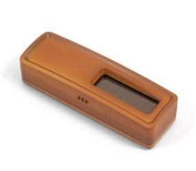
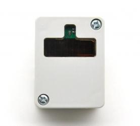
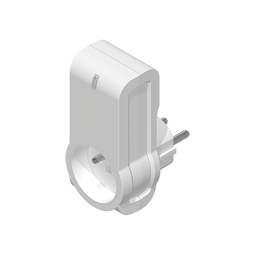
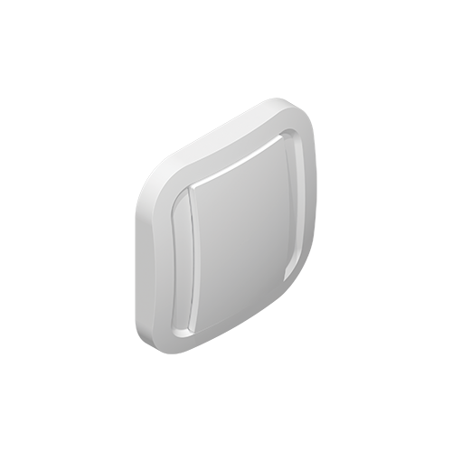
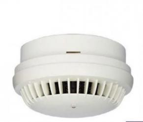
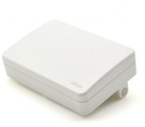

# a5-02
|Picture|Marque|Name|Type|Note|Link|
|---|---|---|---|---|---|
||Nodon|Capteur de température blanc|Temperature|Disponible en plusieurs coloris|[Acheter](http://www.domadoo.fr/fr/peripheriques/2627-nodon-capteur-de-temperature-sans-fils-et-sans-piles-blanc-3700313920183.html)|
||Nodon|Capteur de température black|Temperature|Disponible en plusieurs coloris|[Acheter](http://www.domadoo.fr/fr/peripheriques/2637-nodon-capteur-de-temperature-enocean-black-3700313920169.html)|
||Nodon|Capteur de température alu|Temperature|Disponible en plusieurs coloris|[Acheter](http://www.domadoo.fr/fr/peripheriques/2634-nodon-capteur-de-temperature-enocean-alu-3700313920176.html)|
||Nodon|Capteur de température wood|Temperature|Disponible en plusieurs coloris|[Acheter](http://www.domadoo.fr/fr/peripheriques/2635-nodon-capteur-de-temperature-enocean-wood-3700313920145.html)|
||Nodon|Capteur de température varnish|Temperature|Disponible en plusieurs coloris|[Acheter](http://www.domadoo.fr/fr/peripheriques/2636-nodon-capteur-de-temperature-enocean-varnish-3700313920152.html)|
||Thermokon|Capteur de température tuyau|Temperature|||

# a5-04
|Picture|Marque|Name|Type|Note|Link|
|---|---|---|---|---|---|
||a5-04|||||
||Trio2sys|Sonde radio humidité et température pour montage interieur|Temperature|||
||Nexelec|Insafe+ Pilot Sonde humidité et température|Temperature|||
||Eltako|Sonde radio humidité et température pour montage extérieur - FAFT60|Temperature||[Acheter](http://www.domadoo.fr/fr/peripheriques/1931-eltako-sonde-radio-humidite-et-temperature-montage-exterieur-faft60-4010312310120.html)|

# a5-06
|Picture|Marque|Name|Type|Note|Link|
|---|---|---|---|---|---|
||Eltako|Sonde de luminosité extérieure FAH60|Brightness||[Acheter](http://www.domadoo.fr/fr/peripheriques/3084-eltako-sonde-de-luminosite-exterieure-4010312305218.html)|

# a5-07
|Picture|Marque|Name|Type|Note|Link|
|---|---|---|---|---|---|
||Eosca|Détecteur de mouvement EnOcean (position plafond)|Movement|||
||Pressac|Détecteur de mouvement Sous bureau (underdesk)|Movement|||
||Easyfit|Détecteur de mouvement plafond|Movement|||
||Easyfit|Détecteur de mouvement sous bureau|Movement|||
||Nodon|Détecteur de mouvement et luminosité EnOcean|Movement|||
||Avidsen|Détecteur de mouvement|Movement|||

# a5-09
|Picture|Marque|Name|Type|Note|Link|
|---|---|---|---|---|---|
||a5-09|||||
||Nanosense|Sonde CO2 qualité d'air E4000|Capteur|||
||PressacSensing|Sonde Co2 Temperature Humidité|Capteur|||
||Nexelec|Insafe+ Carbon Sonde Co2 Temperature Humidité|Capteur|||
||Nanosense|Sonde qualité d'air E4000|Capteur|||
||Nanosense|Sonde particules fines P4000|Capteur|||
||Nanosense|Sonde qualité d'air E4000NG|Capteur|||

# a5-10
|Picture|Marque|Name|Type|Note|Link|
|---|---|---|---|---|---|
||Eltako|Régulateur de température avec fonctions jour/nuit/OFF|Régulateur||[Acheter](http://www.domadoo.fr/fr/peripheriques/3128-eltako-regulateur-de-temperature-avec-fonctions-journuitoff-4010312315859.html)|
||Avidsen|Sonde de température et d'humidité avec affichage numérique|Régulateur|||

# a5-11
|Picture|Marque|Name|Type|Note|Link|
|---|---|---|---|---|---|
||Altecon|Régulateur de climatisaton/chauffage|Régulateur|||

# a5-12
|Picture|Marque|Name|Type|Note|Link|
|---|---|---|---|---|---|
||Avidsen|Module Pince ampérimétrique|Counter|||
||Eltako|Module de comptage d'énergie 65A|Counter||[Acheter](http://www.domadoo.fr/fr/peripheriques/2837-eltako-module-de-comptage-d-energie-65a-4010312311059.html)|
||Eltako|Module de comptage d'énergie 16A|Counter||[Acheter](http://www.domadoo.fr/fr/peripheriques/2836-eltako-module-de-comptage-d-energie-16a-4010312303184.html)|
||Avidsen|Module Téléinfo|Counter|||
||Ewattch|SQUID Sous-compteur electrique EnOcean - 12 entrées|Counter||[Acheter](http://www.domadoo.fr/fr/peripheriques/2859-ewattch-squid-sous-compteur-electrique-enocean-12-entrees-3770002148045.html)|

# a5-14
|Picture|Marque|Name|Type|Note|Link|
|---|---|---|---|---|---|
||Avidsen|Rain Sensor|Détecteur|||
||Avidsen|Détecteur de bruit|Détecteur|||

# a5-20
|Picture|Marque|Name|Type|Note|Link|
|---|---|---|---|---|---|
||Micropelt|Vanne thermostatique EnOcean sans pile|Vanne|Bien s'assurer que la vanne clignote une fois en réponse à l'inclusion|[Acheter](http://www.domadoo.fr/fr/peripheriques/3259-micropelt-vanne-thermostatique-enocean-4260413370022.html)|

# d1079-00
|Picture|Marque|Name|Type|Note|Link|
|---|---|---|---|---|---|
||Ventilairsec|Assistant|Remote control|||

# d1079-01
|Picture|Marque|Name|Type|Note|Link|
|---|---|---|---|---|---|
||Ventilairsec|VMI|Ventilation|||

# d2-01
|Picture|Marque|Name|Type|Note|Link|
|---|---|---|---|---|---|
||Avidsen|Module Chaudière|Contactor|Bien s'assurer que la prise sort du learn après inclusion. Sinon procédez à une exclusion avant||
||Flextron|ALADIN prise intermédiaire Pro|Outlet|Bien s'assurer que la prise sort du learn après inclusion. Sinon procédez à une exclusion avant||
||UbiWizz|Smart Plug EnOcean|Outlet|Bien s'assurer que la prise sort du learn après inclusion. Sinon procédez à une exclusion avant|[Acheter](http://www.domadoo.fr/fr/peripheriques/2667-ubiwizz-smart-plug-enocean-schuko.html)|
||Nodon|Outlet intelligente EnOcean|Outlet|Bien s'assurer que la prise sort du learn après inclusion. Sinon procédez à une exclusion avant|[Acheter](http://www.domadoo.fr/fr/peripheriques/2631-nodon-prise-intelligente-enocean-type-eu-3700313920008.html)|
||Nodon|Outlet intelligente + metering|Outlet|Bien s'assurer que la prise sort du learn après inclusion. Sinon procédez à une exclusion avant|[Acheter](http://www.domadoo.fr/fr/peripheriques/2633-nodon-prise-intelligente-metering-enocean-type-eu-3700313920022.html)|
||Avidsen|Module Pilot wire|Pilot wire|Bien s'assurer que la prise sort du learn après inclusion. Sinon procédez à une exclusion avant||
||Nodon|Micro Smart Plug|Outlet|Bien s'assurer que la prise sort du learn après inclusion. Sinon procédez à une exclusion avant|[Acheter](http://www.domadoo.fr/fr/peripheriques/4309-nodon-micro-smart-plug-enocean-prise-fr-3700313921401.html)|
||Nodon|Micromodule commutateur simple EnOcean|Micromodule|Bien s'assurer que le micromodule sort du learn après inclusion. Sinon procédez à une exclusion avant||
||Avidsen|Micromodule commutateur simple EnOcean|Micromodule|Bien s'assurer que le micromodule sort du learn après inclusion. Sinon procédez à une exclusion avant||
||Nodon|Micromodule commutateur double EnOcean|Micromodule|Bien s'assurer que le micromodule sort du learn après inclusion. Sinon procédez à une exclusion avant|[Acheter](http://www.domadoo.fr/fr/peripheriques/3341-nodon-micromodule-commutateur-double-enocean-3700313920374.html)|
||Avidsen|Micromodule commutateur double EnOcean|Micromodule|Bien s'assurer que le micromodule sort du learn après inclusion. Sinon procédez à une exclusion avant||

# d2-03
|Picture|Marque|Name|Type|Note|Link|
|---|---|---|---|---|---|
||Nodon|Soft Button|Bouton|5 appuis rapides en mode inclusion||

# d2-04
|Picture|Marque|Name|Type|Note|Link|
|---|---|---|---|---|---|
||Nanosense|E4000-NG|Capteur|||

# d2-05
|Picture|Marque|Name|Type|Note|Link|
|---|---|---|---|---|---|
||Nodon|Micromodule Volet Roulant EnOcean|Micromodule|Bien s'assurer que le micromodule sort du learn après inclusion. Sinon procédez à une exclusion avant||
||Avidsen|Micromodule Volet Roulant EnOcean|Micromodule|Bien s'assurer que le micromodule sort du learn après inclusion. Sinon procédez à une exclusion avant||

# d2-06
|Picture|Marque|Name|Type|Note|Link|
|---|---|---|---|---|---|
||Soda|Poignée intelligente EnOcean|Poignée|Bien s'assurer que la poignée bippe après inclusion. Sinon procédez à une exclusion avant|[Acheter](http://www.domadoo.fr/fr/peripheriques/2.html)|

# d2-14
|Picture|Marque|Name|Type|Note|Link|
|---|---|---|---|---|---|
||Nexelec|Insafe|Smoke|||

# d2-15
|Picture|Marque|Name|Type|Note|Link|
|---|---|---|---|---|---|
||EasyFit|EPAC|Presence|||

# d2-32
|Picture|Marque|Name|Type|Note|Link|
|---|---|---|---|---|---|
||PressacSensing|Pince Ampérimétrique Enocean|Courant|||
||PressacSensing|Pince Ampérimétrique Enocean 3 voies|Courant|||

# d5-00
|Picture|Marque|Name|Type|Note|Link|
|---|---|---|---|---|---|
||Nodon|Capteur d'ouverture blanc|Opening|Disponible en plusieurs coloris|[Acheter](http://www.domadoo.fr/fr/peripheriques/2626-nodon-detecteur-d-ouverture-sans-fils-et-sans-piles-blanc-3700313920138.html)|
||Nodon|Capteur d'ouverture black|Opening|Disponible en plusieurs coloris|[Acheter](http://www.domadoo.fr/fr/peripheriques/2640-nodon-detecteur-d-ouverture-enocean-black-3700313920114.html)|
||Nodon|Capteur d'ouverture alu|Opening|Disponible en plusieurs coloris|[Acheter](http://www.domadoo.fr/fr/peripheriques/2641-nodon-detecteur-d-ouverture-enocean-alu-3700313920121.html)|
||Nodon|Capteur d'ouverture wood|Opening|Disponible en plusieurs coloris|[Acheter](http://www.domadoo.fr/fr/peripheriques/2638-nodon-detecteur-d-ouverture-enocean-wood-3700313920091.html)|
||Nodon|Capteur d'ouverture varnish|Opening|Disponible en plusieurs coloris|[Acheter](http://www.domadoo.fr/fr/peripheriques/2639-nodon-detecteur-d-ouverture-enocean-varnish-3700313920107.html)|
||Eltako|Contact de porte/fenêtre - blanc - FTK-RW|Opening|Disponible en plusieurs coloris|[Acheter](http://www.domadoo.fr/fr/peripheriques/3122-eltako-contact-de-portefenetre-blanc-4010312305010.html)|
||Eltako|Contact de porte/fenêtre - argent - FTK-SI|Opening|Disponible en plusieurs coloris|[Acheter](http://www.domadoo.fr/fr/peripheriques/3123-eltako-contat-de-portefenetre-argente-4010312305171.html)|
||Eltako|Contact de porte/fenêtre - anthracite - FTK-AN|Opening|Disponible en plusieurs coloris|[Acheter](http://www.domadoo.fr/fr/peripheriques/3121-eltako-contact-de-portefenetre-anthracite-4010312305164.html)|
||Avidsen|Contact de porte/fenêtre|Opening|||

# f6-02
|Picture|Marque|Name|Type|Note|Link|
|---|---|---|---|---|---|
||f6-02|||||
||f6-02|||||
||Nodon|Soft Remote blue tech|Remote control|Disponible en plusieurs coloris. Deux modes de fonctionnement possible dans Jeedom (on/off sur deux boutons ou toggle sur 4 boutons). Les appuis multiples sont gérés.|[Acheter](http://www.domadoo.fr/fr/peripheriques/2624-nodon-soft-remote-enocean-tech-blue-3700313920053.html)|
||Nodon|Soft Remote cozy grey|Remote control|Disponible en plusieurs coloris. Deux modes de fonctionnement possible dans Jeedom (on/off sur deux boutons ou toggle sur 4 boutons). Les appuis multiples sont gérés.|[Acheter](http://www.domadoo.fr/fr/peripheriques/2625-nodon-soft-remote-enocean-cozy-grey-3700313920060.html)|
||Nodon|Soft Remote blue lagoon|Remote control|Disponible en plusieurs coloris. Deux modes de fonctionnement possible dans Jeedom (on/off sur deux boutons ou toggle sur 4 boutons). Les appuis multiples sont gérés.|[Acheter](http://www.domadoo.fr/fr/peripheriques/2898-nodon-soft-remote-enocean-lagoon-3700313920312.html)|
||Nodon|Soft Remote softberry|Remote control|Disponible en plusieurs coloris. Deux modes de fonctionnement possible dans Jeedom (on/off sur deux boutons ou toggle sur 4 boutons). Les appuis multiples sont gérés.|[Acheter](http://www.domadoo.fr/fr/peripheriques/2900-nodon-soft-remote-enocean-softberry-3700313920305.html)|
||Nodon|Soft Remote wasabi|Remote control|Disponible en plusieurs coloris. Deux modes de fonctionnement possible dans Jeedom (on/off sur deux boutons ou toggle sur 4 boutons). Les appuis multiples sont gérés.|[Acheter](http://www.domadoo.fr/fr/peripheriques/2899-nodon-soft-remote-enocean-wasabi-3700313920299.html)|
||Nodon|Soft Remote blanc|Remote control|Disponible en plusieurs coloris. Deux modes de fonctionnement possible dans Jeedom (on/off sur deux boutons ou toggle sur 4 boutons). Les appuis multiples sont gérés.|[Acheter](http://www.domadoo.fr/fr/peripheriques/2648-ubiwizz-telecommande-ubi-remote-blanc-3553740015966.html)|
||Nodon|Interrupteur mural Z-Wave plus - Cozi White|Interrupteur|Disponible en plusieurs coloris. Deux modes de fonctionnement possible dans Jeedom (on/off sur deux boutons ou toggle sur 4 boutons). Les appuis multiples sont gérés.|[Acheter](http://www.domadoo.fr/fr/peripheriques/2995-nodon-interrupteur-mural-z-wave-plus-cozi-white-3700313920268.html)|
||Nodon|Interrupteur mural EnOcean - Cozi Grey|Interrupteur|Disponible en plusieurs coloris. Deux modes de fonctionnement possible dans Jeedom (on/off sur deux boutons ou toggle sur 4 boutons). Les appuis multiples sont gérés.|[Acheter](http://www.domadoo.fr/fr/peripheriques/2628-nodon-interrupteur-mural-enocean-cozi-grey-3700313920084.html)|
||Eltako|Convertisseur infrarouge/EnOcean avec port USB pour télécommande Harmony Logitech - FIW-USB|Infrarouge|Créera autant d'équipement que de famille boutons disponibles dans la documentation de modules (à chaque famille une inclusion est nécessaire)|[Acheter](http://www.domadoo.fr/fr/peripheriques/3263-eltako-convertisseur-infrarougeenocean-avec-port-usb-4010312311158.html)|
||f6-02|||||
||Eltako|Contact de porte/fenêtre avec levier - blanc - FTKE-RW|Opening|Bien choisir le bon profil après inclusion|[Acheter](http://www.domadoo.fr/fr/peripheriques/3125-eltako-contact-de-portefenetre-blanc-4010312315231.html)|
||Nodon|Soft Remote blue tech|Remote control|Disponible en plusieurs coloris. Deux modes de fonctionnement possible dans Jeedom (on/off sur deux boutons ou toggle sur 4 boutons). Les appuis multiples sont gérés.|[Acheter](http://www.domadoo.fr/fr/peripheriques/2624-nodon-soft-remote-enocean-tech-blue-3700313920053.html)|
||Nodon|Soft Remote cozy grey|Remote control|Disponible en plusieurs coloris. Deux modes de fonctionnement possible dans Jeedom (on/off sur deux boutons ou toggle sur 4 boutons). Les appuis multiples sont gérés.|[Acheter](http://www.domadoo.fr/fr/peripheriques/2625-nodon-soft-remote-enocean-cozy-grey-3700313920060.html)|
||Nodon|Soft Remote blue lagoon|Remote control|Disponible en plusieurs coloris. Deux modes de fonctionnement possible dans Jeedom (on/off sur deux boutons ou toggle sur 4 boutons). Les appuis multiples sont gérés.|[Acheter](http://www.domadoo.fr/fr/peripheriques/2898-nodon-soft-remote-enocean-lagoon-3700313920312.html)|
||Nodon|Soft Remote softberry|Remote control|Disponible en plusieurs coloris. Deux modes de fonctionnement possible dans Jeedom (on/off sur deux boutons ou toggle sur 4 boutons). Les appuis multiples sont gérés.|[Acheter](http://www.domadoo.fr/fr/peripheriques/2900-nodon-soft-remote-enocean-softberry-3700313920305.html)|
||Nodon|Soft Remote wasabi|Remote control|Disponible en plusieurs coloris. Deux modes de fonctionnement possible dans Jeedom (on/off sur deux boutons ou toggle sur 4 boutons). Les appuis multiples sont gérés.|[Acheter](http://www.domadoo.fr/fr/peripheriques/2899-nodon-soft-remote-enocean-wasabi-3700313920299.html)|
||Nodon|Soft Remote blanc|Remote control|Disponible en plusieurs coloris. Deux modes de fonctionnement possible dans Jeedom (on/off sur deux boutons ou toggle sur 4 boutons). Les appuis multiples sont gérés.|[Acheter](http://www.domadoo.fr/fr/peripheriques/2648-ubiwizz-telecommande-ubi-remote-blanc-3553740015966.html)|
||Nodon|Interrupteur mural Z-Wave plus - Cozi White|Interrupteur|Disponible en plusieurs coloris. Deux modes de fonctionnement possible dans Jeedom (on/off sur deux boutons ou toggle sur 4 boutons). Les appuis multiples sont gérés.|[Acheter](http://www.domadoo.fr/fr/peripheriques/2995-nodon-interrupteur-mural-z-wave-plus-cozi-white-3700313920268.html)|
||Nodon|Interrupteur mural EnOcean - Cozi Grey|Interrupteur|Disponible en plusieurs coloris. Deux modes de fonctionnement possible dans Jeedom (on/off sur deux boutons ou toggle sur 4 boutons). Les appuis multiples sont gérés.|[Acheter](http://www.domadoo.fr/fr/peripheriques/2628-nodon-interrupteur-mural-enocean-cozi-grey-3700313920084.html)|
||Eltako|Convertisseur infrarouge/EnOcean avec port USB pour télécommande Harmony Logitech - FIW-USB|Infrarouge|Créera autant d'équipement que de famille boutons disponibles dans la documentation de modules (à chaque famille une inclusion est nécessaire)|[Acheter](http://www.domadoo.fr/fr/peripheriques/3263-eltako-convertisseur-infrarougeenocean-avec-port-usb-4010312311158.html)|
||Eltako|Détecteur de fumée optique EnOcean - FRW-WS|Smoke|Bien choisir le bon profil après inclusion|[Acheter](http://www.domadoo.fr/fr/peripheriques/2835-eltako-detecteur-de-fumee-optique-enocean-4010312312308.html)|

# f6-03
|Picture|Marque|Name|Type|Note|Link|
|---|---|---|---|---|---|
||Eltako|Module F8S12-12VDC|Impulsion|Bien choisir le bon profil après inclusion et créer un équipement par canal||
||f6-03|||||

# f6-04
|Picture|Marque|Name|Type|Note|Link|
|---|---|---|---|---|---|
||Nodon|Interrupteur à carte EnOcean|Interrupteur|Bien choisir le bon profil après inclusion|[Acheter](http://www.domadoo.fr/fr/peripheriques/3066-nodon-interrupteur-a-carte-enocean-3700313920329.html)|

# f6-05
|Picture|Marque|Name|Type|Note|Link|
|---|---|---|---|---|---|
||Eltako|Détecteur d'inondation Enocean FWS81|Fuite|Bien choisir le bon profil après inclusion|[Acheter](http://www.domadoo.fr/fr/peripheriques/3132-eltako-detecteur-d-inondation-enocean-4010312316061.html)|

# f6-10
|Picture|Marque|Name|Type|Note|Link|
|---|---|---|---|---|---|
||Hoppe|Poignée de fenêtre Sécusignal Atlanta Aluminium|Poignée|Bien choisir le bon profil après inclusion|[Acheter](http://www.domadoo.fr/fr/peripheriques/1062-hoppe-poignee-fenetre-secusignal-atlanta-alu-4012789023428.html)|
||Hoppe|Poignée de fenêtre Sécusignal Atlanta Blanche|Poignée|Bien choisir le bon profil après inclusion|[Acheter](http://www.domadoo.fr/fr/peripheriques/1063-hoppe-poignee-fenetre-secusignal-atlanta-blanc-4012789104158.html)|

# recepteur
|Picture|Marque|Name|Type|Note|Link|
|---|---|---|---|---|---|
||Trio2sys|Récepteur 1 canal O2line|Micromodule|Module récepteur seulement ne s'inclue pas mais s'appaire||
||Vitec|Récepteur 1 canal Vitec|Micromodule|Module récepteur seulement ne s'inclue pas mais s'appaire||
||Trio2sys|Récepteur 2 canaux O2line|Micromodule|Module récepteur seulement ne s'inclue pas mais s'appaire||
||Eltako|Actionneur radio télévariateur universel sans neutre - FUD61NP-230V|Micromodule|Bien activer le retour d'état sur le module en suivant la documentation du fabricant. Le module envoit son état 1 seconde après la fin du changement|[Acheter](http://www.domadoo.fr/fr/peripheriques/2424-eltako-actionneur-radio-variateur-rlc-encastrable-sans-neutre-4010312300183.html)|
||Eltako|Variateur pour ballasts électroniques 1-10V|Ballast|Bien activer le retour d'état sur le module en suivant la documentation du fabricant. Le module envoit son état 1 seconde après la fin du changement|[Acheter](http://www.domadoo.fr/fr/peripheriques/3208-eltako-variateur-pour-ballasts-electroniques-1-10v-4010312316283.html)|
||Eltako|Actionneur radio, variateur universel, encastrable - FUD61NPN-230V|Micromodule|Bien activer le retour d'état sur le module en suivant la documentation du fabricant. Le module envoit son état 1 seconde après la fin du changement|[Acheter](http://www.domadoo.fr/fr/peripheriques/1936-eltako-actionneur-radio-variateur-rlcesl-et-led-encastrable-4010312300299.html)|
||Eltako|Outlet variateur - FSUD-230V|Outlet|Bien activer le retour d'état sur le module en suivant la documentation du fabricant. Le module envoit son état 1 seconde après la fin du changement||
||Eltako|Variateur Ballast - FUD71-230V|Ballast|Bien activer le retour d'état sur le module en suivant la documentation du fabricant. Le module envoit son état 1 seconde après la fin du changement||
||Eltako|Actionneur Enocean télérupteur - FSR61NP-230V|Micromodule|Bien activer le retour d'état sur le module en suivant la documentation du fabricant|[Acheter](http://www.domadoo.fr/fr/peripheriques/3112-eltako-actionneur-enocean-telerupteur-4010312300190.html)|
||Eltako|Actionneur télérupteur EnOcean - FSR61-230V|Micromodule|Bien activer le retour d'état sur le module en suivant la documentation du fabricant|[Acheter](http://www.domadoo.fr/fr/peripheriques/3109-eltako-actionneur-telerupteur-enocean-4010312301531.html)|
||Eltako|Actionneur EnOcean télérupteur à alimentation en 8 à 24V UC - FSR61/8-24V|Micromodule|Bien activer le retour d'état sur le module en suivant la documentation du fabricant|[Acheter](http://www.domadoo.fr/fr/peripheriques/3110-eltako-actionneur-enocean-telerupteur-a-alimentation-en-8-a-24v-uc-4010312301357.html)|
||Eltako|Actionneur Enocean télérupteur - FSR61LN-230V|Micromodule|Bien activer le retour d'état sur le module en suivant la documentation du fabricant||
||Eltako|Actionneur EnOcean minuterie d'escalier - FTN61NP-230V|Micromodule|Bien activer le retour d'état sur le module en suivant la documentation du fabricant|[Acheter](http://www.domadoo.fr/fr/peripheriques/3126-eltako-actionneur-enocean-minuterie-d-escalier-4010312300206.html)|
||Eltako|Actionneur EnOcean commande de lumière - FLC61NP-230V|Micromodule|Bien activer le retour d'état sur le module en suivant la documentation du fabricant|[Acheter](http://www.domadoo.fr/fr/peripheriques/3099-eltako-actionneur-enocean-commande-de-lumiere-4010312312032.html)|
||Eltako|Outlet actionneur - FSSA-230V|Outlet|Bien activer le retour d'état sur le module en suivant la documentation du fabricant||
||Eltako|Actionneur radio, commande de stores et rideaux à rouleaux, encastrable FSB61NP-230V|Micromodule|Module qui ne s'inclue pas mais s'appaire. Si le module est en mouvement un appuie sur la direction le stoppera. Bien activer le retour d'état conformément à la documentation du fabricant|[Acheter](http://www.domadoo.fr/fr/peripheriques/1935-eltako-actionneur-radio-commande-de-stores-et-rideaux-a-rouleaux-4010312300213.html)|

Cette liste est basee sur des retours utilisateurs, l\'équipe Jeedom ne peut donc garantir que tous les modules de cette liste sont 100% fonctionnels
