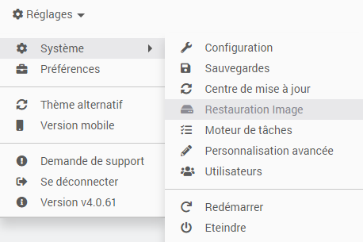
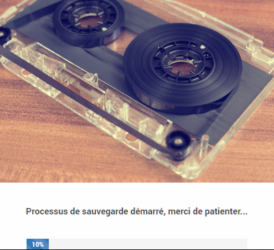
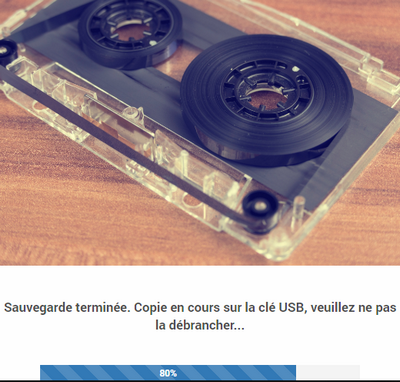
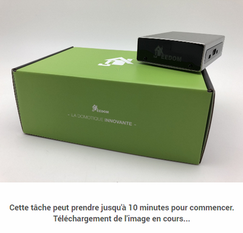
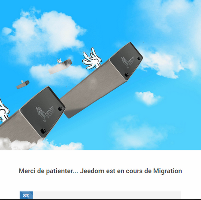
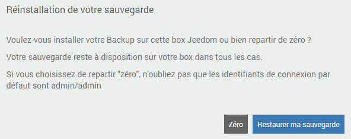

# 

 **** . .

## 

.

 :

-  ****  *()*,
-  [ ****](https://fr.wikihow.com/formater-en-FAT32){: ****,
-  ****  ****.

>****
>
> **** .

## Migration

### 

 :

-  **** :     

-  ****  :     

### 

.  *()* .

 :

 :

>****
>
>. .

### 

. .  ``Backup`` .

.

. .

### 

 :

 :

### 

.  !

.  :

### 

.  :

>****
>
>**.**

, **** !

## 

>** ?**    
>.  {: **** *()*.

>**.**    
> ******.

>**.**    
>.

>**.**    
> *()*.
