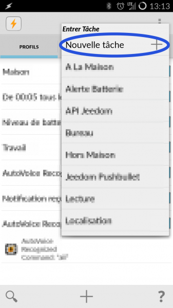
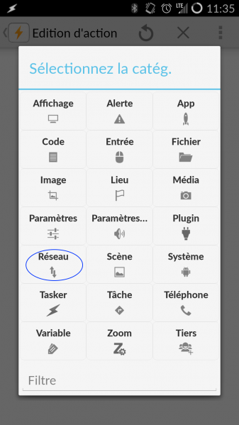
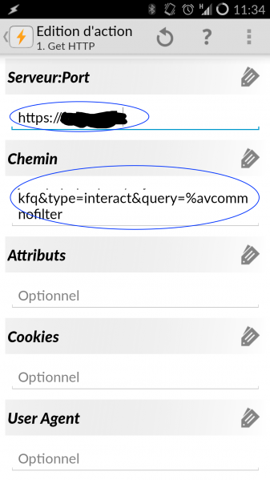

# Android autovoice

The purpose of this article is to guide you in using Android to speak to Jeedom. We will use the Jeedom interactions engine which makes it possible to formulate requests and that Jeedom responds to them (and also, if desired, activates different scenarios or elements).

# Installation

## Prerequisites

Naturally, you need an Android device (tablet, phone, PC with microphone and speakers) and install it [Tasker](https://play.google.com/store/apps/details?id=net.dinglisch.android.taskerm&hl=fr) and [AutoVoice](https://play.google.com/store/apps/details?id=com.joaomgcd.autovoice&hl=fr). The latter allows you to create your own voice commands for Google Now to automate your tasks using voice.

To note : AutoVoice is only the component for talking to Jeedom but does not allow Jeedom to respond. To do it, you don't need the Tasker plugin. We can also use this example by replacing AutoVoice's voice recognition with an NFC tag, geolocation, received SMS…

## The principle

We will use a Tasker profile on state. This will be a voice recognition from AutoVoice. Then in task, we will ask Tasker to execute 2 actions. The first will be to call Jeedom and transmit the text result of the voice recognition. The second will be to announce the return of Jeedom.

# Profile creation

We add a new profile with a **State** as a trigger.

We select **Plugin** on the first screen.

In plugin type, we select **AutoVoice**.

In the submenu **AutoVoice**, We select **Recognized**.

You can save the default configuration, unless you want to
specify keywords or other parameters.

We can give the profile a name like "Jeedom Interactions" and the backup will be made after the link with a task.

# Task

We add a **new task** to the newly created profile. For example, it could be called "Jeedom API".

The task will finally group 2 actions : **API call** and **say back**.

First we will add a type action **Network**.

Then we select **Get HTTP**.

Here we will fill in with Jeedom information. Here is the information to enter :

-   Serveur:Port : ``https://mondomain.tld``
-   Path : ``/jeedom/core/api/jeeApi.php?apikey=votreclef&type=interact&query=%avcommnofilter&utf8=1``

Do not forget to put your API key instead of the chain "your key" . We must leave ``%avcommonfilter`` at the end, it will be replaced by the return of Autovoice.

Add a type action **Say**. To do this, filter the actions by putting "say" at the magnifying glass.

And we go back ``%HTTPD`` in the text field.

It's finish. On text recognition by AutoVoice, Jeedom will be called and you will have the response configured in the interactions which will be spoken by your phone. Don't forget to configure Jeedom interactions and you can ask it whatever you want. From "what is the temperature in the living room" to "turn on the living room light".

> **Tip**
>
> If it doesn't work from the start, it's often because AutoVoice is not active. To do this, launch it, click on Google Now Integration and on the first choice at the top and authorize AutoVoice.

> **Tip**
>
> By default, AutoVoice disables Google Now search, it is possible to cancel this behavior, for that in Tasker click on your profile then "edition" (small pencil), then "advanced" (at the bottom), and uncheck "Do Google Now Search "(at the very bottom).
