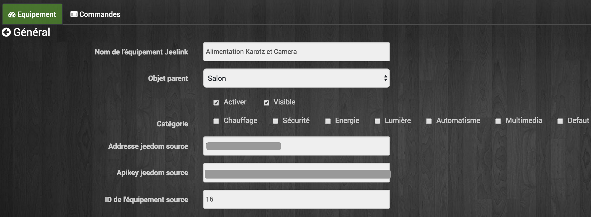

# Jeelink migration

We will see here how to migrate an installation with Jeedom in slave mode to a Jeedom with the plugin "Jeedom Link". Jeedom slave mode being abandoned at the transition from Jeedom to version 3.0, it is necessary to proceed before the migration to the new operating mode.

# Preparation before migration

> **Warning**
>
> It is important to read all of this documentation before embarking on the migration. Important information concerning the prerequisites for updating, saving and recovering information is essential for the proper understanding of the operation to be carried out. Failure to read this documentation can lead to destructive operations on your installation. If you do not understand a point, do not hesitate to ask questions on the forum before starting the procedure !

> **IMPORTANT**
>
> Be careful not to loop equipment by configuring the "Jeedom Link" plugin". For example, do not do an Equipment-X in a Jeedom1 which goes back up in a Jeedom2 and then goes up again in Jeedom1. It could drop your Jeedoms !

> **NOTE**
>
> For a better reading and understanding of this tutorial, here are the terms used :
>
> - **Jeedom Target** : Server (your old Jeedom Master) which centralizes the equipment of the **Jeedom (s) Source (s))**  The screenshots on a black background correspond to the **Jeedom Target**.
>
> - **Jeedom Source** : Server (your / your old Jeedom Slave (s)) which reassembles your equipment on the **Jeedom Target**.
>
> - The notions of **Jeedom Master** and **Jeedom Slave** no longer relevant. The new operating mode of equipment synchronization between several Jeedoms can be bidirectional. A Jeedom server can now be **Source** and **Target** whereas the old mode only allowed the ascent of the equipment of  **the Slave** to **the master**. With the new mode it is also possible to have several **Jeedom Targets** for the same **Jeedom Source**. Communication between Jeedoms can now also be done remotely via the internet (Jeedom DNS or other).

## Configuration Updates and Verification

-   Update the **Jeedom Master** to the latest version (even if no update is offered to you).
-   Update plugins of **Jeedom Master** the latest versions available.
-   Check in the Health page that the internal network configuration of the **Jeedom Master** is OK (And external if your **Jeedoms Sources** will be distant).

## Gathering useful information

Depending on the plugins installed on your **Jeedom Slave**, it is necessary to retrieve the following information :

### Zwave plugin

-   In the health page of the Zwave plugin on the **Jeedom Master**, choose your **Slave** in the drop-down menu and make a screenshot, in order to have a list of the equipment that comes from it.
-   Note for each piece of equipment coming from **the Slave** : parent object, name, ID (Node), model.
-   Recover Zwcfg file : *Plugins ⇒ Plugin management ⇒ Z-wave*. Click on the red button *Zwcfg* and copy the content to a text file on your computer.

### RFXcom plugin

-   Note for each piece of equipment coming from **the Slave** : parent object, name, ID (Logical), Type, Model.

> **NOTE**
>
> A non-exhaustive sheet of information to note for migration is available [here](images/MemoMigration.xls)

## Preventive backups

-   Do a [Jeedom backup](https://doc.jeedom.com/en_US/core/doc-core-backup.html) of your **Jeedom Master** and your (your) **Jeedom Slave (s)** and recover it (s) on your PC / NAS….
-   Do a [SD / Disk backup](https://doc.jeedom.com/en_US/howto/doc-howto-sauvegarde.comment_faire.html#_sauvegarde_restauration_de_la_carte_microsd) of your **Jeedom Master** and your (your) **Jeedom Slave (s)** and recover them on your PC / NAS….

# Migration

> **NOTE**
>
> Do not delete old equipment from  **the Slave** sure **the master**.

## Install and activate the "Jeedom Link" plugin on the **Jeedom Target** (former master).

On your **Jeedom Target**, *Plugins ⇒ Management of plugins* :

## Installation of **Jeedom Source**

> **NOTE**
>
> if you have an additional Raspberry Pi and another SD card, you can migrate one protocol after another by installing a new one **Jeedom Source** in parallel without having to touch your **Jeedom Slave** existing. Obviously by moving possible controllers from one to the other.

> **Warning**
>
> If you are using your existing RaspberryPi, please be sure to follow the backup chapter of this documentation.

> **NOTE**
>
> if you are using the existing Raspberry Pi which is currently a  **Jeedom Slave**, we advise you to use a new SD / microSD card. This will allow you to easily backtrack if necessary.

-   Install a new Jeedom on a new SD card (Whether to put in your **Jeedom Slave** existing or for a new Raspberry Pi) by following the [installation documentation](https://doc.jeedom.com/en_US/installation/doc-installation.html).
-   Update the **Jeedom Source** to the latest version (even if no update is offered to you).
-   Check in the Health page that the internal network configuration (and external if necessary) of the **Jeedom Source** is OK.

## Jeedom Source Configuration

-   Change the password of the admin user or / and configure a new user.
-   Configure your Jeedom Market account (*Configuration ⇒ Updates and files ⇒ "Market" tab"*). Click on test after saving, to confirm the entry of your Jeedom Market identifiers).
-   Installation and activation of the "Jeedom Link" plugin on the new **Jeedom Source**.

-   Installation and activation of plugins you want to use. (It is advisable to do them one by one, checking every time that the dependencies and any demons are OK).
-   Recreate the tree of objects (just the ones that will be useful to you) of the **Jeedom Target** (Old Master) on your new **Jeedom Source** (Former Slave).

## Configuration of equipment on the **Jeedom Source**

To send equipment present on the **Jeedom Source** to the **Jeedom Target** via the "Jeedom Link" plugin, it must be already operational on your new **Jeedom Source**.

> **NOTE**
>
> Remember to deactivate the logging of info commands for each piece of equipment on the **Jeedom Source** in order to save the SD card of it (Historization will be done on the  **Jeedom Target**).

> **NOTE**
>
> You can also gradually assign the equipment to the objects recreated on the **Jeedom Source** so that they are later automatically put in the correct object on the **Jeedom Target** when declaring in the Jeedom Link plugin". In case of duplicate name with equipment already present in the objects of the **Jeedom Target**,  the plugin will add "remote XXXX" to the name of the equipment.

### Zwave plugin

-   Click on the "Synchronize" button to retrieve the modules associated with your controller. (They are kept in the memory of it)
-   Replace file *Zwcfg* : *Plugins ⇒ Plugin management ⇒ Z-wave*. Click on the red button *Zwcfg* and paste the contents of the text file previously created on your computer. *Save changes*.
-   Rename your modules and place them in the desired objects, using your migration memo.

### RFXcom plugin :

#### Probes, sensors, detectors,…

-   Switch the plugin to inclusion mode.
-   Repeat inclusion until you have all your equipment of this type.
-   Rename your equipment and place it in the desired objects using your migration memo.

#### Actuators, sockets,…

-   Add new equipment.
-   Define the name, ID, parent object, equipment type and model using your migration memo.
-   Repeat for all your equipment of this type.

## Configuration of the "Jeedom Link plugin"

The "Jeedom Link" plugin installed on the **Jeedom Source** will allow equipment to be brought up to the **Jeedom Target** (Your old Master).

> **NOTE**
>
> Reminder, for a better reading and understanding of this tutorial :
>
> - The screenshots on a black background correspond to the **Jeedom Target**.
> - The screenshots on a white background correspond to **Jeedom Source**.

On the **Jeedom Source**,
[Configuring](https://doc.jeedom.com/en_US/plugins/jeelink/jeelink)
the "Jeedom Link" plugin by specifying :

-   The name of **Jeedom Target**.
-   The IP address or DNS name of the **Jeedom Target**.
-   The API key of **Jeedom Target**.

And save the configuration.

In the tab *Assignment*, add the equipment you want to go back to the **Jeedom Target**.

Click on *Add equipment* Select the object and equipment to add :

After refreshing the page *My jeelinks* from **Jeedom Target**, you should see the automatic creation of the equipment :

Like all Jeedom equipment, you can activate / deactivate and display or not the equipment, its controls,… or change the category :

In the tab *Commands*, you access all the parameters of the equipment controls :

## Historical recovery

> **NOTE**
>
> To do on **Jeedom Target** (Former Master) for each info command of the equipment of the former **Slave** whose history we want to recover.

-   Go to order configuration (*Toothed wheel on the right*).
-   Go to the tab *Advanced configuration*.
-   Click on the button *Copy the history of this command on another command*.
-   Find the corresponding order for the corresponding new JeeLink equipment and confirm.

## Replacement of old slave equipment in Scenarios / virtual /…

> **NOTE**
>
> To do on **Jeedom Target** (Former Master) for each info / action command of the equipment of the former **Slave** whose occurrences we want to replace in scenarios / virtual /…

-   Go to order configuration (*Toothed wheel on the right*).
-   Go to the tab *Information*.
-   Click on the button *Replace this command by the command*.
-   Find the corresponding order for the corresponding new JeeLink equipment and confirm.

## Retrieving advanced display configurations for commands

> **NOTE**
>
> To do on **Jeedom Target** (Former Master) for each info / action command of the equipment of the former **Slave** which we want to retrieve advanced display settings.

-   Go to order configuration (*Toothed wheel on the right*).
-   Click on the button *Apply to*.
-   Find and select the corresponding command for the corresponding new JeeLink equipment and confirm.

## Copy of advanced command configurations

> **NOTE**
>
> To do on **Jeedom Target** (Former Master) for each info / action command of the equipment of the former **Slave** which we want to recover the advanced configuration.

-   No easy solution at this level, you will need to have two tabs / windows open on your browser.
-   Open orders for old equipment **Slave** in a tab (Jeedom Target).
-   Open jeeLink equipment controls in the other tab (Jeedom Target).
-   And copy the desired parameters by hand.

> **NOTE**
>
> In order to avoid repeating the same command several times, operations 2.6 → 2.9 can be carried out in sequence on the same order before proceeding to the following.

> **Warning**
>
> Interactions on the **Jeedom Target** cannot be launched using equipment from a **Jeedom Source** transferred via the Jeedom Link plugin".

# Household on the **Jeedom Target**

> **NOTE**
>
> After validating with certainty that your equipment / scenarios / interactions / virtual /…. work well with the new jeelink system, you can do the cleaning.

-   Remove residual equipment from the old **Jeedom Slave**.
-   Disable and delete plugins that are no longer useful to you (Those for which you only had equipment on the Slave).
-   In the "Jeedom Link" plugin, rename the equipment that could have a name ending with "remote XXXX".
-   In the Jeedom Network page, delete the old one **Jeedom Slave**.
