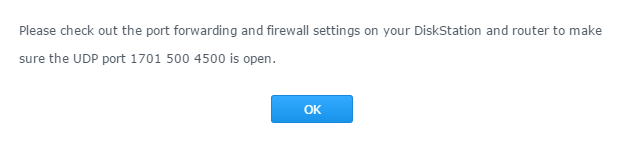

Install VPN Server 
====================

From a web browser on a computer connected to the same network as
Synology

Go to the DSM interface and log in with an admin account then
go to the main menu and select Package Center

Top left in the window do a search with the word VPN.
VPN Server should appear, then click install.

Go back to the main menu and select VPN Server

When the window opens, go to L2TP / IPSEC

Choose the option Enable L2TP / IPsec VPN server

In Dynamic IP Address, enter a number that will correspond to the sub
network for assigning the IPs of your devices in VPN on the internal network
from your place. NB : do not choose the same thing as the
default subnet of your box ex at free the subnet of
machines is 192.168.1.0 so in the example we put 2

Then enter the maximum number of connections you want to allow
on the VPN server, then the maximum number of simultaneous connections
for a user

Finally enter a sharing key NB : it is a password that he
will have to enter the VPN configuration on the mobile or tablet.

Then apply

A message then indicates the ports which must be redirected on your
Internet box to your NAS.

Allow users to use the VPN service on the NAS 
===============================================================

Go back to the main menu and select VPN Server

In the left part select Privilege

Uncheck all boxes under PPTP Open VPN and L2TP

 .

> **Tip**
>
> 
> .

X 
===============================

. 

.

> **Tip**
>
> ,
> 

 
==================================

VPN server :

 !
