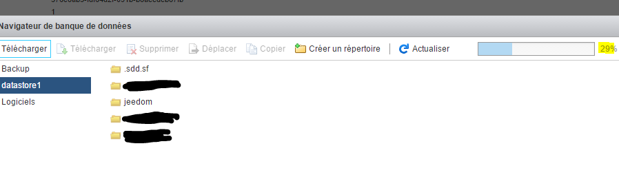
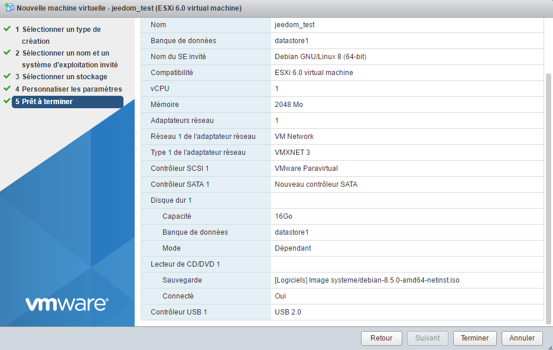

# Create a vm under vmware

We will see here how to create a VM under VMware.

There is a little important thing to know about VMware, there are 2 ways to manage it :

-   the web interface (present by default in 6.0 update 2, or through a vib for the other versions), it is accessed by IP\_ESXI / ui
-   the heavy and historical client of VMware (vSphere client)

Here I will mainly use the web interface because I think it is the future of VMware which is increasingly abandoning the heavy client (in fact all the new features since 5.1 cannot be used with the thick client).

Also note that the web interface is still being implemented at VMware, in fact you will surely encounter some bugs or slowdowns but a small refresh of the page and it will start again without problems.

# Connection to the web interface

Go to IP\_ESXI / ui with your internet browser, you must have :

> **NOTE**
>
> If you have nothing I advise you to install the web interface, all the information [here](https://doc.jeedom.com/en_US/howtoadvance/vmware.trucs_et_astuces)

Enter your login credentials to ESXI :

As you can see the interface is quite nice and allows you to do a lot of things, I will not go into details but you can already from this screen :

-   stop / restart the ESXi
-   view resource usage (CPU, memory and disk)
-   have information about your system (operating time, version of VMware, version of the bios, display of datastores)
-   button to create a VM (we will use it right after)
-   an action button which allows you to switch to maintenance mode (useful if you have an ESXi cluster otherwise you will never use it), activate / deactivate the SSH service (is used in the backup configuration tutorial)

# Sending installation ISO

After downloading your installation ISO ([here](https://cdimage.debian.org/cdimage/archive/11.8.0/amd64/iso-cd/debian-11.8.0-amd64-netinst.iso) for example for debian 11.8 in netinstall), you need to put it on your datastore.

For that click on datastore :

Select your datastore (usually it's called datastore1) :

Click on "Database browser" :

Click on "Download" (the first) :

Select the previously downloaded ISO and validate :

You can then follow the progress of the shipment :

Once finished you can see that your iso has arrived on the datastore :

# Creation of your first VM

Click on the "Create / Save VM" button" :

Click on next :

Then give a name to your machine and specify its operating system (here we will install a Debian) :

Indicate the target datastore :

Here you will be able to configure the parameters of your machine (hard disk, CPU, memory, etc.)) :

> **NOTE**
>
> All these parameters can be modified afterwards without any problems, note however that it is not really possible to reduce the size of a hard drive, you can increase it (but you have to know how to manage this at the level of the hard drive). 'OS next) but not reduce it.

In the CD / DVD drive, select "ISO file database" :

Then select the location where your ISO is stored (see previous chapter) and validate :

Then do next :

You then have a summary of your configuration, click on "Finish" :

A message at the top will tell you that it's good, then click on "Virtual machines" :

You should see your virtual machine (if it is not the case click on "Refresh") click on it :

You must have a page of this type, click on the play button :

Your machine will launch and you will be able to install your OS :

> **IMPORTANT**
>
> Once your machine is installed it is ABSOLUTELY necessary to install VMware tools (it allows VMware to have information on your VM and to shut down it properly). Under debian just do "sudo apt-get -y install open-vm-tools".

For the rest of the installation I invite you to read this [Tutorial](https://doc.jeedom.com/en_US/howtoadvance/debian.installation)

# Mount USB devices in the VM

> **NOTE**
>
> If you do not have the options below it is necessary to update the ESXi Embedded Host Client, all the information [here](https://doc.jeedom.com/en_US/howto/doc-howto-vmware.trucs_et_astuces.html)

It is a rather rare need, but I had to use it for Jeedom, indeed I have on my ESXi the keys Zwave, RFXcom, edisio, enOcean and GSM of connected and I had to connect them to my VM Jeedom to be able to use it.

> **NOTE**
>
> For Zwave, RFXcom, edisio and enOcean there is no problem, for GSM keys you must follow this [Tutorial](https://doc.jeedom.com/en_US/howtoadvance/gsm.huawei_mode_modem) before to force the key in modem mode only otherwise it is not seen correctly on the ESXi.

Go to your VM then do "Change settings" :

Click on "Add another device" then USB controller :

> **NOTE**
>
> The next step will need to be repeated for each USB device you want to connect

Save, redo "Change settings", then "Add another device" and "USB device" :

Choose your USB device from the drop-down list :

And now your device is plugged into your VM. At each restart it will be automatically reconnected to the VM and if you physically disconnect / connect it then it will be reconnected to your VM. In other words the use is now completely transparent.
