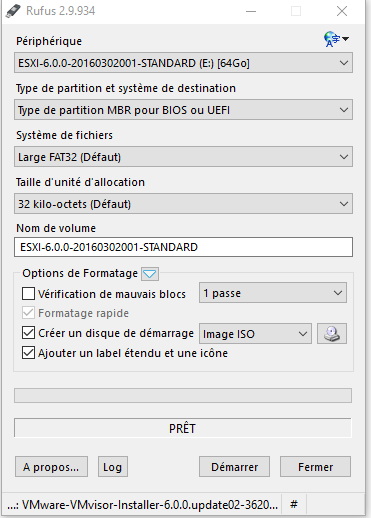

 
===========

 
---------

. 
.

:

-   . -
    

-   .. -
    

.

 :

-   

-   
    .

 :

-    : [
    :

-   . : [
    :

-    : [
    :

-   . : [
    :

 
---

. 

.
. 

.

> **IMPORTANT**
>
> 
> 

-   [LDLC  M.2 2280 F6 PLUS 120
    :

-   [Samsung  850 EVO 120 Go
    :

-   [LDLC  M.2 2280 F6 PLUS 240
    :

-   [Samsung  850 EVO 250 Go
    :

-   [LDLC  M.2 2280 F6 PLUS 480
    :

 
-------

,
. 

 :

-   [Crucial SO-DIMM DDR4 8 Go (2 x 4 Go) 2133 MHz CL15 SR
    X:

-   [Crucial SO-DIMM DDR4 16 Go (2 x 8 Go) 2133 MHz CL15 DR
    X:

-   [Crucial SO-DIMM DDR4 32 Go (2 x 16 Go) 2133 MHz CL15 DR
    X:

 
=============================

.

 
------------------------

> **IMPORTANT**
>
> .
> 
> [KB](https:?

:

-   
    [ici](https://my.vmware.com/en/web/vmware/evalcenter?p=free-esxi6)
    

-   

-   
    [ici](https://my.vmware.com/en/web/vmware/evalcenter?p=free-esxi6)
    
    

-   
    [là](https://my.vmware.com/fr/web/vmware/details?productId=491&downloadGroup=ESXI60U2)
    "

-   
    [ici](https://my.vmware.com/en/web/vmware/evalcenter?p=free-esxi6)
    
    

.

 
-----------------------

[la](http://rufus.akeo.ie/downloads/rufus-2.9.exe). Il vous faut ensuite

 
--------------------------------

 :

.

 
==============================

 :

-   

-   

-   

 :

 :

 :

:

 :

..

 
======================

 :

> **NOTE**
>
> 
> 

" :

 :

 :

 :

 ,
 !!!

[tutoriel](https://jeedom.github.io/documentation/howto/en_US/doc-howto-vmware.creer_une_vm.html)

[ici](https://jeedom.github.io/documentation/howto/en_US/doc-howto-vmware.trucs_et_astuces.html)

