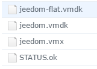

# Vmware backup implementation

It is important to have backups of your VMs and this is a point not to be overlooked, not to mention hardware failures you may one day need to return to a backup due to improper handling or a problem following an update. Please note here we are talking about the complete image of the VMs, it is not just an application backup, it will therefore have a fairly large size.

One of the constraints to make a backup under VMware is to have absolutely 2 datastores. For this you have several choices :

-   2 hard drives / SSD with a datastore on each
-   a NAS (Synology type) that shares an NFS mount. In this case you must add a network file system to VMware so that it sees it as a datastore

For this tutorial I will use the ESXi web interface which is available either by installing a vib or from version 6.0 update 2. As a reminder, to access this interface just go to IP\_ESXI / ui

> **NOTE**
>
> For this tutorial I will use the ESXi web interface which is available either by installing a vib or from version 6.0 update 2. For reminders to access this interface just go to ``IP_ESXI/ui``

# GhettoVCB installation

We must recover this [script](https://raw.githubusercontent.com/lamw/ghettoVCB/master/ghettoVCB.sh) and transfer it to the ESXi (on the same datastore as the one that will host the backups for example).

> **NOTE**
>
> In the rest of this tutorial I consider that you have put the ghettoVCB script.sh in /vmfs/volumes/Backup/ghettoVCB.sh. It's up to you to adapt the commands / scripts provided according to your configuration.

# Connection in ssh

You will have to connect in SSH on the ESXi, to do this you must from the interface


Then with putty or kitty connect to it by putting the IP of your ESXi and using your identifiers of it

# Configuration file creation

> **NOTE**
>
> For the rest of this tutorial I consider that your backup datastore has the path / vmfs / volumes / Backup, be careful to change if this is not the case for you

On the backup datastore you must create a file ``ghettoVCB.conf`` which contains :

````
VM_BACKUP_VOLUME=/vmfs/volumes/Backup/
DISK_BACKUP_FORMAT=thin
VM_BACKUP_ROTATION_COUNT=2
POWER_VM_DOWN_BEFORE_BACKUP=0
ENABLE_HARD_POWER_OFF=0
ITER_TO_WAIT_SHUTDOWN=3
POWER_DOWN_TIMEOUT=5
ENABLE_COMPRESSION=0
VM_SNAPSHOT_MEMORY=0
VM_SNAPSHOT_QUIESCE=0
ALLOW_VMS_WITH_SNAPSHOTS_TO_BE_BACKEDUP=0
ENABLE_NON_PERSISTENT_NFS=0
UNMOUNT_NFS=0
NFS_SERVER=172.30.0.195
NFS_MOUNT=/nfsshare
NFS_LOCAL_NAME=nfs_storage_backup
NFS_VM_BACKUP_DIR=mybackups
SNAPSHOT_TIMEOUT=15
EMAIL_LOG=0
EMAIL_SERVER=auroa.primp-industries.com
EMAIL_SERVER_PORT=25
EMAIL_DELAY_INTERVAL=1
EMAIL_TO=auroa@primp-industries.com
EMAIL_FROM=root@ghettoVCB
WORKDIR_DEBUG=0
VM_SHUTDOWN_ORDER=
VM_STARTUP_ORDER=
````

The parameters that you must adapt are :

-   ``VM_BACKUP_VOLUME`` ⇒ location of your backup datastore
-   ``VM_BACKUP_ROTATION_COUNT`` ⇒ number of backups per VM to keep

> **NOTE**
>
> You can consult [here](https://communities.vmware.com/docs/DOC-8760) the complete ghettoVCB documentation with a description of each parameter

> **IMPORTANT**
>
> Be careful to put the ``/`` final for the parameter ``VM_BACKUP_VOLUME`` otherwise the script will be in error

# Backup test

Here we will launch a first initial backup of all VMs to see if everything is ok. Thereafter we will schedule it automatically. Return to the ESXi in SSH (reconnect if necessary) and do :

``/vmfs/volumes/Backup/ghettoVCB.sh -a -g /vmfs/volumes/Backup/ghettoVCB.conf``

This will launch a backup of all your VMs (and can therefore take a long time). At the end you should have on your backup datastore a folder by VM and in each VMs folder a subfolder by date containing 4 files :



-   ``*-flat.vmdk`` ⇒ the virtual disk of your machine
-   ``*.vmdk`` ⇒ the descriptor of the disc
-   ``*.vmx`` ⇒ the file containing the configuration of your machine
-   ``STATUS.ok`` ⇒ indicates that the backup is ok

Here is another possibility for the command line :

-   Backup simulation : ``/vmfs/volumes/Backup/ghettoVCB.sh -d dryrun -a -g /vmfs/volumes/Backup/ghettoVCB.conf``
-   Launch in debug mode : ``/vmfs/volumes/Backup/ghettoVCB.sh -d debug -a -g /vmfs/volumes/Backup/ghettoVCB.conf``
-   Backup only the VM "toto" ``/vmfs/volumes/Backup/ghettoVCB.sh -m toto -a -g /vmfs/volumes/Backup/ghettoVCB.conf``

# Automatic backup launch

You must add the command line to the crontab but under VMware the crontab is a little special and above all overwritten at each start. To avoid this you must therefore add a small script which will update the crontab at boot (don't worry it's quite simple and fast), in SSH on the ESXi do :

``vi /etc/rc.local.d/local.sh``

And before ``exit 0`` add the following lines :

````
/bin/kill $(cat /var/run/crond.pid)
/bin/echo "0 0 1 * * /vmfs/volumes/Backup/ghettoVCB.sh -a -g /vmfs/volumes/Backup/ghettoVCB.conf >/dev/null 2>&1" >> /var/spool/cron/crontabs/root
/usr/lib/vmware/busybox/bin/busybox crond
````

> **NOTE**
>
> Here I request a backup every 1st of the month, you can change this by modifying : ``0 0 1 * *``

> **NOTE**
>
> Here I make a backup of all the VMs, you can adapt this by replacing the ``-a`` by ``-m ma_vm``, be careful if you want to put several VMs you have to duplicate the line ``/bin/echo "0 0 1 * *"``
````
/vmfs/volumes/Backup/ghettoVCB.sh -a -g
/vmfs/volumes/Backup/ghettoVCB.conf &gt;/dev/null 2>&1";
/var/spool/cron/crontabs/root" et en mettre une by VM à backuper
````

> **IMPORTANT**
>
> Do not forget to adapt the path to the ghettoVCB configuration file according to your configuration : ``/vmfs/volumes/Backup/ghettoVCB.conf``

Last step: you must restart your ESXi for cron to be taken into account, you can see the result by doing (always in SSH) :

``cat /var/spool/cron/crontabs/root``

Here you must have a line :

``0 0 1 * * /vmfs/volumes/Backup/ghettoVCB.sh -a -g /vmfs/volumes/Backup/ghettoVCB.conf >/dev/null 2>&1``
