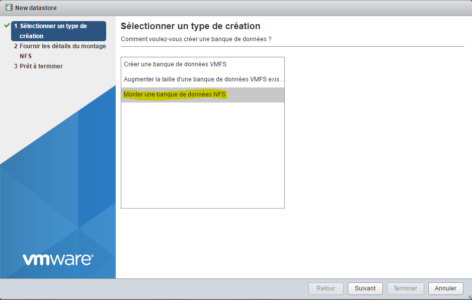

# Vmware tips and trick

Not really a howto here but more a collection of tips and tricks on VMware

# Add your license

Once connected on the web interface ``IP_ESXI/ui`` go to "Manage" :

Then on "Licensing" and click on "Assign a license"

And enter your license key

> **NOTE**
>
> As a reminder, if you do not do so your ESXi may no longer function after 60 days

# Mount an NFS datastore with Synology

We will see here how to mount an NFS share from a Synology on VMware. This allows for example to put the virtual machines on the Synology (which can have more space than the ESXi) or to send the backups of the machines on the Synology

## Synology configuration

You have to go to the control panel then "File services" and check the box "Activate NFS" :

Then you have to click on "Shared folder", then choose the folder to share (here Backup), click on modify then "NFS authorization" and finally on create (here I already have one, your list should be empty) :

Then you put the IP of your ESXi and in "Squash" you put "Mapping of all users on admin" then you validate :

We must then recover the sharing path (here ``/volume2/Backup``) :

Here it is finished on the Synology side, we will now switch to the ESXi side

## ESXi configuration

Go to "Storage" :

Then click on "New database" :

There you select "Mount an NFS database" then do the following :

Enter the name of the datastore to create (be careful to avoid spaces and special characters), put the IP of our Synology and put the sharing path (see above) and finally validate :

Click on finish :

And now your new datastore should appear (otherwise click on "Refresh").

# Added VAAI Synology plugin for NFS mounting

Adding this plugin enables hardware acceleration on NFS mounts (for an explanation, see [here](http://www.virtual-sddc.ovh/exploiter-les-vaai-nfs-avec-un-nas-synology/))

To see if you have it, you have to connect with the thick client (I didn't find the info on the web client) and go to configuration → storage :

The implementation is quite simple, first you have to activate the SSH service of the ESXi (on the web interface you have to go to action ⇒ services ⇒ Activate Secure Shell), then connect in SSH above (the identifiers are the same as to access the interface). Then you just have to do :

``esxcli software vib install -v https://global.download.synology.com/download/Tools/NFSVAAIPlugin/1.0-0001/VMware_ESXi/esx-nfsplugin.vib -f``

You must have :

You must then restart the ESXi, to verify that it is ok, you must then return with the thick client to configuration → storage :

# Install / Update ESXi Embedded Host Client

ESXi Embedded Host Client is a web interface (in HTML5) of ESXi which allows in 95% of cases to do without the heavy client. It is present by default in version 6.0 update 2, but in version 1.0, it is strongly advised to update it.

You will find all the information
[here](https://labs.vmware.com/flings/esxi-embedded-host-client)

To see if you have the web interface, just go to your browser with ``IP_ESXI/ui`` if you have nothing you must install it, you must first connect in SSH on the ESXI then do :

``esxcli software vib install -v http://download3.vmware.com/software/vmw-tools/esxui/esxui-signed-latest.vib``

If you already have it, to update it you have to do :

``esxcli software vib update -v http://download3.vmware.com/software/vmw-tools/esxui/esxui-signed-latest.vib``

# Installation of the thick client

This part is optional if you don't need to manage the USB.

You must go, with your internet browser, to the IP of the ESXi then click on the link ``Download vSphere Client for Windows`` :

Once downloaded, you just have to launch the installation (I voluntarily pass on this part because it is enough to validate everything).

Then launch VMware vSphere Client, you should have :

You just have to enter the IP of your ESXi, the user name and the password and you are connected to it :

# ESXi update

The procedure is quite easy, you must first recover the patch by going [here](https://my.vmware.com/group/vmware/patch#search) (you will probably have to log in with your VMware account). On the list ``Select a Product`` put ``ESXi (Embedded and Installable)``, opposite leave the latest version of VMware and do ``Search``. Then download the desired patch (usually the last one). The build number (the first number not the one starting with KB) gives you the version of the patch that you can compare with your build number.

Then transfer the zip to one of your datastores and make :

``esxcli software vib update -d /vmfs/volumes/576c8ab3-fdf64d2f-091b-b8aeedeb87fb/ESXi600-201605001.zip``

> **NOTE**
>
> Replace the path and the name of the zip according to your configuration

> **IMPORTANT**
>
> Be careful to put the full path to the zip otherwise it does not work

The command above only updates the vibes that need it but you can force the installation of all the vibes in the package (so beware this can be downgraded) by doing :

``esxcli software vib install -d /vmfs/volumes/576c8ab3-fdf64d2f-091b-b8aeedeb87fb/ESXi600-201605001.zip``

# NTP configuration

By default the ESXi does not use NTP which means that it is not on time and that VMs are not on time, to correct it is very simple. You have to go from the web version to Manage → System → Date and time, there you click on "Change settings" :

And in the "NTP server" box you have to put : ``0.debian.pool.n, 1.debian.pool.n, 2.debian.pool.n, 3.debian.pool.n, time.nist.gov``

Then in Actions → NTP Service → Strategy click on "Start and stop with the host" :

Still in Actions → NTP Service click on "Start"

This is your ESXi should take the time alone by now.

# External access to the ESXi

To access the ESXi from the outside you need :

-   open port 443 to ESXi 443
-   open port 902 to ESXi 902

And that is all. Little tip if you have a Synology NAS you can do (be careful to follow) :

-   open 443 to 5001 on Synology NAS
-   open the 80 towards the 80 of the NAS (useful just to generate the certificates let's encrypt)
-   open port 902 to ESXi 902

Then on the NAS in the control panel then application portal and reverse proxy (attention it is absolutely necessary DSM 6) :

Click on create and put :

In "Hostname" (at source level) you must put the desired DNS (for example monesxi.mondsn.synology.me) and in "Host name" (at the destination) you must put the IP of the ESXi

> **NOTE**
>
> You can also do the same thing to access jeedom but this time putting the jeedom IP (of the vm if you are virtualized) and port 80

> **NOTE**
>
> Once you have done this and if your DNS points correctly to the NAS you can generate a valid SSL certificate for free with Let's encrypt, by going to Secrity ⇒ certificate and having added. Then don't forget to click on configure to assign it to your reverse proxy

Then to access your ESXi you just have to go to your external DNS or IP with your browser by adding / ui at the end and it's good.

> **IMPORTANT**
>
> If you go through the NAS reverse proxy the console in VMs web mode does not work (because it goes through websocket), on the other hand if you go through VMware Remote Console everything should be ok (it goes through port 902)

> **NOTE**
>
> There is also a Vmware Watchlist application on Android to access the ESXi as well as the consoles of the VMs

# SSL certificate

It is possible to import the vmware certificates directly into your pc to no longer have the alert.

In order it is necessary :

-   have a url (dns) to access your esxi, here we will take ``esxi1.lan``
-   configure the name of your esxi, in ssh above do : ``esxcli system hostname set --host=esxi1``
-   configure the fqdn : ``esxcli system hostname set --fqdn=esxi1.lan``
-   Retrieve the root certificate of esxi, it is in ``/etc/vmware/ssl/castore.pem``

Right click on the computer then install the certificate, put it in "Trusted Root Certification Authority"
