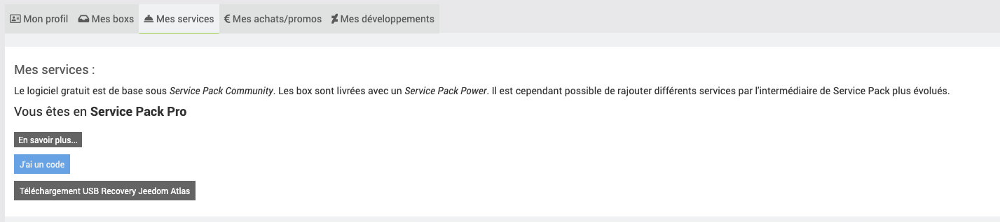
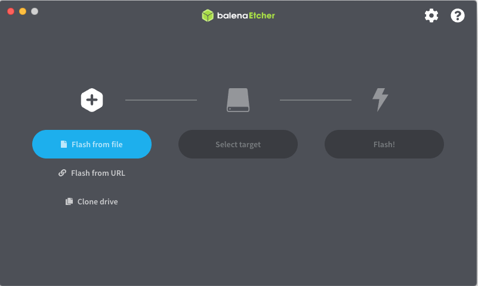

# Restoration in factory mode of a Jeedom Atlas

## Jeedom Backup

First of all, **It is essential to make a backup of Jeedom** which can be restored at the end of the procedure.

1. Go to the Jeedom interface then click on the menu **Settings > System > Backups**.

2. Click the button **Start a backup**.

3. When the backup is complete, click on **Download Backup**.

4. Once the Jeedom backup is downloaded, turn off the system via the menu **Settings > System > Power off**.

## Presentation

The Jeedom Atlas is equipped with an Emmc disk, guaranteeing better reliability than an SD card, but this disk is not directly accessible.

USB Recovery Mode includes both the system, the OS, and also the Jeedom application.

It allows :

- La réinitialisation  de la Jeedom Atlas en configuration « usine » OS+Jeedom.
- La réinitialisation  de la Jeedom Atlas en configuration « usine », en appliquant ensuite sa sauvegarde Jeedom.

Pour rappel la gestion des sauvegardes/restauration est disponible dans Jeedom dans le menu « Réglages » en haut à droite, puis « Sauvegardes ».

Jeedom offers a service with automatic backup subscription on Jeedom private cloud, so you don't have to worry about anything. (Sur le Market, dans votre compte, menu à gauche « Backup Cloud »).

## Operation of recovery mode

>**Note**
>
>Remember to set aside (locally) a Jeedom configuration backup

>**IMPORTANT**
>
>Applying a Recovery leads to a change in the MAC address of your Jeedom box. You will then need to change your IP reservation in the configuration of your DHCP server if you have one.

>**IMPORTANT**
>
>Depending on whether or not you still have access to your box, the procedure is not the same.

Necessary material : a USB key (minimum 16 GB).

CASE 1 : YOU HAVE ACCESS TO YOUR ATLAS BOX

Go to the Atlas plugin (Home Automation Gateway/Atlas Plugin), and click on Recovery, and follow the procedure.

***

CASE 2 : YOU DO NOT HAVE ACCESS TO YOUR ATLAS BOX

- Download the Recovery from your profile on the market : Profile / My Services and click on Download USB Recovery Atlas

- Download the software [Balena etcher](https://www.balena.io/etcher/)
- In the software, choose your downloaded image, then your usb key 

- Once the key is ready, put it in the lower USB 2 port (black USB port), then turn on your Atlas box
- Wait about 5 to 10 minutes
- Puis rendez-vous sur http://jeedomatlasrecovery.local/
- Put username and password :  admin/admin, then change the password, IMPORTANT : put a market account.
- Once done, Jeeasy launches and shows you the recovery procedure
- Follow the procedure

This Recovery Mode is only compatible with the Jeedom Atlas
