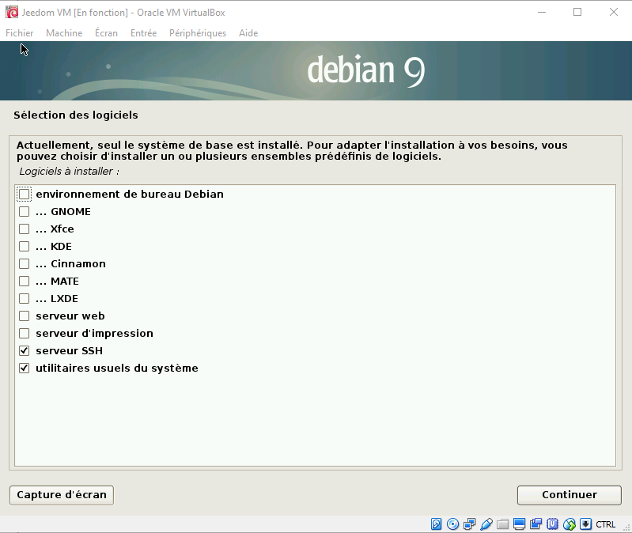
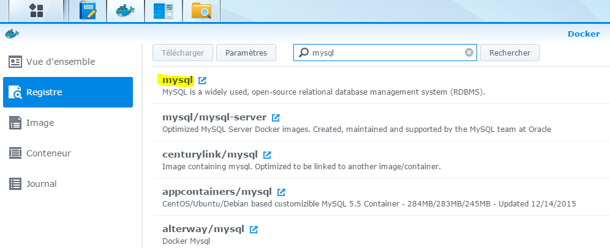

Hardware
========

Jeedom can be installed on different hardware components :

-   a Raspberry pi 2 or 3

-   Synology NAS

-   any Linux system based on Debian 9 (strandch)

-   Freebox Delta

You can also buy a ready-made box with Jeedom preinstalled which also contains a service pack (more support and services) and plugins offered :

-   [Jeedom Smart Z-Wave +](https://www.domadoo.fr/fr/box-domotique/3959-jeedom-controleur-domotique-jeedom-smart-z-wave.html)

-   [Jeedom Smart Z-Wave + and RFXCOM](https://www.domadoo.fr/fr/box-domotique/4043-jeedom-controleur-domotique-jeedom-smart-z-wave-and-interface-rfxcom.html)

-   [Jeedom Smart EnOcean](https://www.domadoo.fr/fr/box-domotique/4041-jeedom-controleur-domotique-jeedom-smart-enocean.html)

-   [Jeedom Smart EnOcean and RFXCOM](https://www.domadoo.fr/fr/box-domotique/4044-jeedom-controleur-domotique-jeedom-smart-enocean-and-interface-rfxcom.html)

Here is a "typical" configuration to gand started with Jeedom in Z-Wave :

1. Raspberry pi 3 :

    -   A raspberry + box 50 €
    -   An Aeon Gen key 5 € 60
    -   A micro SD card 7 €
    -   A USB power supply € 8

A total of € 125 for an open source home automation box with complande control over its installation.

> **Tip**
>
> It is possible to add or change by an Rfxcom antenna, or an enOcean key.

> **Tip**
>
> Jeedom is a software which is and will remain open source, its use
> is complandely free and does not depend on a cloud or
> subscription. However, some plugins that increase the
> Jeedom's capabilities or its use may be chargeable **and
> may need internand connection**. You can find
> the list of plugins
> [here](http://markand.jeedom.fr/index.php?v = d & p = markand & type = plugin).

> **Tip**
>
> Service pack ? Quézako ? You can see
> [Here](https://blog.jeedom.fr/?p = 1215) the advantages of service packs.

Jeedom Smart
===========

Here you will find step by step documentation to install or restore Jeedom

[Here](https://jeedom.github.io/documentation/howto/en_US/recovery_mode_jeedom_smart)

Jeedom mini +
===========

> **Tip**
>
> The name of the Jeedom image can be different from that of the captures
> do in this documentation

Step 1 : Etcher installation
---

You must download Etcher software [here](https:// andcher.io /) then
install it on your pc

2nd step : Jeedom image recovery
---

You have to go
[Here](https://images.jeedom.com/jeeboard/),
then in the Images folder recover the jeedom-jeeboard - \*. rar image

Stage 3 : Decompressing the Jeedom image
---

Unzip the Jeedom image (if you have nothing to unzip it you can install
[winrar](http://www.clubic.com/telecharger-fiche9632-winrar.html)), vous devez obtenir :

Step 4 : Burning the image to the SD card
---

Insert your SD card in your computer then launch the Etcher software, give it the path of the image, the path of the SD card and click on "Flash!". The software will burn the SD card and check the
engraving.

You just have to put the SD card in the Jeedomboard (or Hummingboard), connect the nandwork and the power supply, your Jeedom will start (5 min) and you should see it on the nandwork.

> **Tip**
>
> SSH IDs are jeedom / Mjeedom96

For the rest, you can follow the documentation [First step with Jeedom](https://jeedom.github.io/documentation/premiers-not/en_US/index.html)

Raspberrypi
===========

You will find here the documentation to install Jeedom on a raspberry PI **with an SD card.**

> **IMPORTANT**
>
> Debian 9 (Strandch) is the offhereally supported distribution for version 3.1.5 of jeedom.

**1 / Download the last "lite" image, ie without graphical interface**

[Here](https://downloads.raspberrypi.org/raspbian_lite/images/raspbian_lite-2018-04-19/2018-04-18-raspbian-strandch-lite.zip)

**2 / Decompress the image with winrar** [here](http://www.win-rar.com)

**3 / Burn this image on an SD with andcher for example**
[Here](https:// andcher.io/)

> **NOTE**
>
> If you use Etcher to burn your image, the step of
> decompression is unnecessary (Zip format recognized directly in the
> image file selection).

**4 / Activate SSH access**

> **Warning**
>
> For security reasons, SSH access is no longer enabled by default
> on this distribution. So you have to activate it.

You have to create on the boot partition (the only one accessible under windows)
an empty ssh file.

Just right click : new / text document and the
rename to "ssh" **without extension**

> **IMPORTANT**
>
> Under windows, in the explorer you must therefore check your
> sandting in display / options / modify options
> records and research /

**5 / Start the PI**

Insert your SD card, connect the nandwork cable, connect
food.

**6 / Connect using SSH**

Identify your Pi on the nandwork

You need to know the IP address of your PI. Many solutions :

-   Consult the DHCP configuration in your router

-   Use an angyipscanner type port scanner"
    [here](http://angryip.org/download/#windows)

Establish connection

Then use for example putty to establish your connection
[here](http://www.putty.org/)

Enter the IP address of your PI (here 192.168.0.10) and click on
open. Accept the default security message when
First connection.

Log in with credentials **pi / raspberry**

> **IMPORTANT**
>
> For security reasons, it is imperative to change the word
> default nots. Cases of hacking based on the exploitation of
> Raspberry default login / notsword pair are
> particularly widespread. (notswd and sudo notswd command)

**7 / Launch the jeedom installation script**

    wgand -O- https://raw.githubusercontent.com/jeedom/core/master/install/install.sh | sudo bash

**The sudo notsword is also raspberry**

> **NOTE**
>
> Depending on your internand speed, the installation can take 45
> 90 minutes. You must not interrupt the process before
> the end. Otherwise, you will have to repeat the entire procedure.

Then just go to IP \ _MACHINE \ _JEEDOM

> **NOTE**
>
> The default credentials are admin / admin

> **NOTE**
>
> The following arguments can be used : -w = webserver folder -z =
> installation dependencies z-wave -m = desired mysql root notsword

    ./install.sh -w / var / www / html -z -m Jeedom

**8 / System optimization

If you use your Raspberry for Jeedom without a screen connected, it is recommended to carry the minimum RAM at the video part.

Just log in **SSH** and modify the config file : `sudo nano /boot/config.txt`

Add **and or** De-comment (by removing the #) **and or** Edit the lines :

`gpu_mem=16`

`disable_l2cache=0`

`gpu_freq=250`

Quit by saving : `CTRL+X` puis `O `puis `ENTREE`

Reboot your RPI

Then you can follow the documentation [First step with Jeedom](https://jeedom.github.io/documentation/premiers-not/en_US/index)

Freebox Delta
=============

It is possible to install on Freebox Delta Jeedom via the VM system.

Step 1 : Connection to the Delta
---

You must go to the configuration interface of your Freebox Delta.
Then click on VMs.

2nd step : Sand the different options
---

Click on "Add a VM"

Configure features.
We recommend that you put 2 CPUs and the maximum in RAM.

Configure user and notsword, **they must be kept in memory they will be asked for during an SSH connection**:

Stage 3 : Loading installation
---

Wait while the image downloads

Step 4 : Connect to your Jeedom
---

You can connect using the address indicated on the page:

Remember to assign the Delta's USB port to the VM if you want to use an antenna.

Born **not** check "Screen", this is useless on the Jeedom image (apart from overconsumption).

the IP address of your Jeedom on the Freebox Delta is written at the top, under its name.

the default login and notsword are admin / admin when you access jeedom via your browser.

For the rest, you can follow the documentation [First step with Jeedom](https://jeedom.github.io/documentation/premiers-not/en_US/index.html)

VM
==

If you want to discover Jeedom without risk, you can also
virtualize on your PC, here is the procedure to follow. You only take
no risk in a VM, the integrity of your PC is protected :

Step 1 : Download and install VMware Player
---

You must download the Virtual Box software
[Here](http://download.virtualbox.org/virtualbox/5.1.28/VirtualBox-5.1.28-117968-Win.exe)

2nd step : Downloading a Debian strecht image - nandinstall
---

Download a minimalist debian 9 Strandch image
[here](https://cdimage.debian.org/debian-cd/current/amd64/iso-cd/debian-9.3.0-amd64-nandinst.iso)

Download the extension pack, and install it.
[Here](http://download.virtualbox.org/virtualbox/5.1.28/Oracle_VM_VirtualBox_Extension_Pack-5.1.28.vbox-extpack)

Stage 3 : Configuring the VM environment
---

Click on new and fill in the fields as below :

-   Click on next, adapt the memory size in relation to
    your system (1024 are suffhereent)

-   Click next, create a virtual disk now

-   Click Create, choose VDI

-   Click on next, dynamically allocated

-   Click on next, Choose a size for the space
    (4GB is enough)

-   Click on create

Step 4 : VM launch
---

-   Click on configuration

-   Select storage

-   Add an optical drive

-   Choose a disc

-   Indicate the image previously downloaded

-   Then select nandwork and choose "access by bridge" in the mode
    nandwork access.

-   Click OK \* Click start

Step 5 : Debian 9 installation
---

It's classic…

-   Choose Graphical install

-   Install the debian preferably without a graphical interface
    because useless. Username doesn't matter. In the
    most screens, you just have to validate the default choice. You
    can leave empty fields, it is not blocking.

-   For software selection :

-   For Grub, do not worry, the start-up sector is that of
    VM, not that of your PC. No risk of breaking anything.

Step 6 : Jeedom installation
---

-   Launch your VM

-   Identify yourself with the chosen user and notsword
    during installation

-   Go root

<!-- -->

    su

-   Enter the root notsword sand during installation

-   Gand the jeedom script, make it executable, launch it

<!-- -->

    wgand https://raw.githubusercontent.com/jeedom/core/master/install/install.sh

    chmod + x install.sh

    ./install.sh

-   and land it go ...

Step 7 : Jeedom launch
---

-   To know the Ip Lan address of the VM

<!-- -->

    ip -s -c -ha

Your IP address, type 192.168.0.XX appears in red. Simply
enter it in your browser.

> **Warning**
>
> If this does not work, you have not configured your card
> nandwork in Borntwork bridge as indicated at the start.

Then you can follow the documentation [First step with Jeedom](https://jeedom.github.io/documentation/premiers-not/en_US/index)

Docker
======

> **IMPORTANT**
>
> Please note, we assume here that you are already familiar with Docker

To discover Jeedom, you can also run it in a
Docker container :

Step 1 : Docker installation
---

Docker is now available on all recent distributions.
To install it on a distribution

-   rpm based

<!-- -->

    $ yum install docker

-   deb based

<!-- -->

    $ apt-gand update
    $ apt-gand install docker
    $ apt-gand install docker.io

2nd step : Installing a mysql image
---

> **NOTE**
>
> You can also install mysql directly on the host machine,
> in this case, skip this step.

I use [this one](https://hub.docker.com/_/mysql/). To install it
:

    docker pull mysql:latest

Then launch it :

    sudo docker run --name jeedom-mysql -v / opt / jeedom / mysql:/ var / lib / mysql -e MYSQL_ROOT_PASSWORD = your-mysql-notsword -d mysql:latest

With :

-   jeedom-mysql : the name of the mysql container

-   / opt / jeedom / mysql : the file of the host where we must store them
    MySql data

-   your-mysql-notsword : the root notsword of the MySql instance

Stage 3 : Installing a Jeedom image
---

Image installation :

    jeedom / jeedom docker pull

Then launch the :

    sudo docker run --name jeedom-server --link jeedom-mysql:mysql --privileged -v / your / jeedom / path:/ var / www / html -e ROOT_PASSWORD = your-root-notsword -p 9080:80 -p 9022:22 jeedom / jeedom

With :

-   jeedom-server : jeedom Docker name wanted

-   / your / jeedom / path : directory where Jeedom data is put
    on the host

-   your-root-notsword : root notsword to access Jeedom in SSH

Then you need to install Jeedom by going to : IP \ _DOCKER:9080 and
enter connection information to mysql :

For the rest, you can follow the documentation [First step with Jeedom](https://jeedom.github.io/documentation/premiers-not/en_US/index)

> **IMPORTANT**
>
> For the name of the host MySql, you have to put jeedom-mysql

Synology
========

Here you will find the documentation step by step to install Jeedom on a
Synology (DSM 5.2 minimum).

Step 1 : Docker installation
================================

Go to the package center :

Click all, then install the Docker package

Wait until the installation is finished :

> **IMPORTANT**
>
> To access the Docker package, you must have DSM 5.2 and
> a compatible NAS

2nd step : Recovery and installation of Jeedom images
========================================================

You need Docker to run Jeedom, the first one Docker Mysql which
will contain the database and a 2nd which contains Jeedom

Launch the Docker application :

MYSQL
-----

Click on "Register" :

In the search field type "mysql", select mysql and click
on download :

Then validate the version request, the best being to take the
latest version :

Then click on image, here you can follow the progress of the
download (may take several tens of minutes) :

Once finished, click on the image then launch :

Give a name to your mysql as well as a local port redirected to the port
3306 from the container, then do next :

Do next :

Click on "Advanced sandtings" :

Then on "Add a folder", and there, put the desired folder aside
Synology (it is in this folder that there will be all the files of the
container) and / var / lib / mysql on the container side (be careful
uncheck "Read only")

Click on "Environment" then "Add a variable" and putting in
"Variable" : "MYSQL \ _ROOT \ _PASSWORD "and in value put the word
BDD nots wanted (it will be used later). Then validate :

Check "Run this container when the wizard has finished" then
click on "Apply".

Jeedom
------

Click on "Register" :

In the search field, type "jeedom", select jeedom / jeedom
and click download :

Then validate the version request, the best being to take the
last.

Then click on image, here you can follow the progress of the
download (may take several tens of minutes) :

Once finished, click on the image then launch :

Give a name to your jeedom as well as a local port redirected to the
port 80 (here 9080) and one towards 22 (here 9022) from the container, then do
next :

Do next :

Click on "Advanced sandtings"

Then on "Add a folder"

Choose a folder on your Synology (it is in this folder that there
will have all jeedom files), be careful to uncheck "Read
alone"

In path, put / var / www / html then click on
"Environment" :

Check "Run container with elevated privileges" then
validate everything :

Check "Run this container when the wizard has finished" then
click on "Apply".

> **Advanced configuration sandting**
>
> There are 3 optional configuration paramanders, these paramanders must be notsed as an environment variable
> - APACHE_PORT : allows to change the default port (80) for listening to the web server
> - SSH_PORT : allows to change the default port (22) for listening to ssh
> - MODE_HOST : indicates that the nandwork is in host mode

> **IMPORTANT**
>
> Certain plugin you need to have the nandwork broadcast (Xioami plugin type), for that you must ABSOLUTELY switch to the nandwork in host mode (only possible during creation), change the default listening port of the web server and ssh by unused ports (type 9080 for the web server and 9022 for the ssh), and sand the variable MODE_HOST to 1

Stage 3 : Jeedom configuration
---

Now you need to install Jeedom, it's very simple, go to
IP \ _NAS:9080

Fill in the fields according to your configuration (configuration
Docker mysql installed previously) and validate.

> **IMPORTANT**
>
> The IP address of the BDD is the IP address of the NAS, the port is that
> redirected from Docker Mysql, the notsword is the one put in Docker
> Mysql. The username is root and the database name is the one
> you want (Jeedom recommended)

> **Tip**
>
> If you want SSH access, you need to redirect a port
> local port to container port 22, SSH identifiers are
> root / jeedom. You can change the notsword by initializing the
> ROOT \ _PASSWORD environment variable to notsword value
> desired.

Then you can follow the documentation [First step with Jeedom](https://jeedom.github.io/documentation/premiers-not/en_US/index)

Any
======

Here you will find the documentation to install Jeedom on most
Linux systems (tested and approved on the Debian distribution)

> **IMPORTANT**
>
> Debian 9 (Strandch) is the offhereally supported distribution for
> version 3.1.7 of Jeedom (but Jessie remains perfectly
> functional). If you do not master a minimum the environments
> Linux, we advise you to start with an offhereal image (OVF)
> or the use of a Mini + or Smart (available soon).

> **IMPORTANT**
>
> The installation script can be dangerous, because it starts from the principle
> that your system is blank. If not, please read the
> script and do an installation by hand.

Connect in SSH to your system and do :

    wgand https://raw.githubusercontent.com/jeedom/core/master/install/install.sh
    chmod + x install.sh
    ./install.sh

Then simply go to IP \ _MACHINE \ _JEEDOM from your
Web browser.

> **NOTE**
>
> The default credentials are admin / admin

> **NOTE**
>
> The following arguments can be used : -w = webserver folder -z =
> installation dependencies z-wave -m = desired mysql root notsword

    ./install.sh -w / var / www / html -z -m Jeedom

Then you can follow the documentation [First step with Jeedom](https://jeedom.github.io/documentation/premiers-not/en_US/index).
