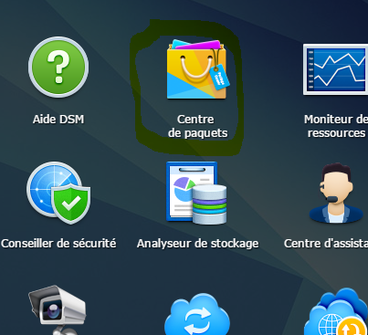

# Installation on Synology

Here you will find the documentation step by step to install Jeedom on a Synology (DSM 5.2 minimum).

## Docker installation

Go to the package center :



Click all, then install the Docker package


Wait until the installation is finished :


> **Important**
>
> To access the Docker package, you must have DSM 5.2 and a compatible NAS

## Jeedom image recovery

Launch the Docker application :


Click on "Register" :


In the search field, type "jeedom", select jeedom/jeedom, and click download :


Then validate the version request, the best is to take the latest (take the latest version).
 _But for some Sybology models it may be necessary to choose the *-buster_ version

Then click on image, here you can follow the progress of the download (can take several tens of minutes) :


## Container configuration

Once finished, click on the image then launch :


Give a name to your jeedom, check the box "Run the container using elevated privileges" then click on advanced parameters then in port parameters redirected port 80 (here around 9080) :


Then on "Volume" add the following 2 volumes :


Check "Run the container using elevated privileges" then validate everything.

> **Important**
>
> Certain plugin you need to have network broadcast (Xioami plugin type), for this you must ABSOLUTELY switch to network in host mode (only possible during creation), change the default listening port of the web server ( type 9080 for the web server)

> **Important**
>
> On error, if the Apache service does not start with this error in the logs: ```function not implemented: AH00141: Could not initialize random number generator``` in this case you must use the image `jeedom/jeedom4.3-buster`.

After a first or longer start-up phase you just have to go to IP_NAS:9080

Then you can follow the documentation [First step with Jeedom](https://doc.jeedom.com/en_US/premiers-pas/index)
