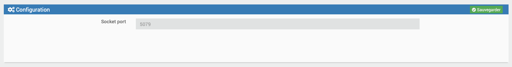
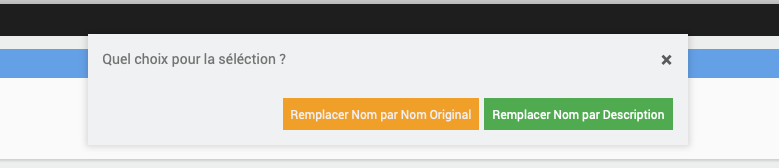

# Bacnet

#Description

The Bacnet plugin allows you to retrieve information from your Bacnet / Ip equipment and interact with it from your Jeedom.

# Plugin configuration

After downloading the plugin, you must first activate it, like any Jeedom plugin :

Then, you have to start the installation of dependencies (even if they appear OK) :

Finally, we must start the demon :

Rien n'est à modifier dans le champ « Port socket interne » de la section « Configuration ».

In this same tab, you must choose the Cron value for updating your equipment.

# How to declare a new Bacnet device in Jeedom

>**IMPORTANT**
>
>Your BACNET equipment must be on the same network as your Jeedom to be detected by it.

Rendez-vous dans le menu « Plugins → Energie → Bacnet » :

You arrive on the next page:

Vous devez donc cliquer sur l'option « Nouvel équipement / Création commandes » :

An automatic scan of your network will be launched to detect the Bacnet devices present on it.
It may take about twenty seconds.

Following the scan, a table with all the inputs / outputs of your equipment will be displayed.

The table menu where you can search by column :

An example of detection of Bacnet equipment :

Depending on the equipment manufacturer, some values are not available;

All you have to do is select the orders to be created by checking one of the options according to your choice (command type info or type action):

Validate, refresh the page, and the corresponding equipment will have been created in your Jeedom; by default, it will be named with the DeviceID of your Bacnet equipment provided by the manufacturer (you are free to rename it )

 Cliquez ensuite sur votre équipement créé, puis cocher « Activer » et « Visible » pour le voir apparaitre sur votre dashboard.

To add commands later to an existing equipment, you have to redo the previous operation : « Nouvel équipement / Création commandes » , et sélectionnez les commandes que vous désirez.

# The orders

Rendez-vous dans l'onglet « Commandes » de la page de configuration du nouvel équipement Bacnet.

Ici vous pouvez masquer et rendre visibles les différentes commandes de type « action » et « info » disponibles (les commandes de type « info » peuvent également être historisées) :

All the equipment created will have 2 commands by default : une commande info « Connexion Bacnet » et une commande action « Refresh » , qui serviront à voir l'état de la connexion Bacnet sur votre dashboard, et à rafraichir les valeurs de vos commandes.

>**IMPORTANT**
>
>Regarding writing: for security, the Bacnet protocol provides by default a writing system with priority levels on the inputs / outputs of its equipment.
There are 16 priority levels (the lowest level taking priority over all others)). Your equipment may be programmed in such a way that the write function developed in this plugin does not take priority over the logic programming of the equipment / system by default.
For Output type I / O, the plugin is configured with priority 8 writing (Manual Operator).
More info on the subject :

https://store.chipkin.com/articles/bacnet-why-doesnt-the-present-value-change

For a write on a Bacnet device, we extend on the PresentValue of the corresponding input / output.
You should know that the PresentValues of the inputs / outputs type: Analog Output, Binary Output and Multistate Output are always controllable.
Those of AnalogValue, BinaryValue or MultistateValue inputs / outputs can be ordered if the manufacturer has implemented this feature. It is at the sole discretion of the manufacturer. Please check with your equipment documentation to learn more about this.

When creating the chosen write-type orders, an associated action order will also be created, by default not visible on the dashboard.
By clicking on it, it resets the write priority table of an input / output to the default.
It will have a name with << resetPrioritesEcriture >>
To make this command visible on your dashboard, go to the commands of your equipment and check the "Show"

# List on Command Action (for MultiStateValue)

When you have created a Write command as usual from the scan results, it is basic in Slider or On Off, depending on the type of Bacnet point returned (analog, binary) : now, if you choose a multiState, the command will be of type Slider by default, but you can list it in the list of equipment commands; a new Value List field will appear;
You can put the values you want, separated by a -, without space : for example 1-4-5-8
When saving the equipment, this will put these values in the list of the order on the Dashboard
When changing this value, it will send the value write on the parameterized point.

# Write priority

    A Handle with care

    A Write Priority field is available on each order created

    As per the documentation :

    In BACnet, object to which we can write often provide what is called the priorityArray. This array contains 16 levels to which we can write (1 being the highest priority).

    Typical usage of priority is :

    1 Manual-Life Safety 2 Automatic-Life Safety 3 Available 4 Available 5 Critical Equipment Control 6 Minimum On/Off 7 Available 8 Manual Operator (Override) 9 Available 10 Available (Typical Control from a Supervisor) 11 Available 12 Available 13 Available 14 Available 15 Available (Schedule) 16 Available

    You can choose a write priority on the desired commands, by choosing a number between 1 and 16

    If no value entered on a write command, by default the value will be set to 8.

# Change Command Names by Description

Some Bacnet devices have error codes contained in the Point Description.
It may be useful in this case to want to rename the commands by their description for greater readability

To change the default name of the orders created, you can then go to the Points Management modal, to choose the orders to be renamed via their Description

We open the Bacnet Points Management mode :

We see the list of Eqlogics already created :

We click on Configure the desired equipment, and we see the list of orders already created
You can select the ones you want via the associated checkbox, and click on Validate Selection, to choose whether you want to rename by the Description, or return to the original name

