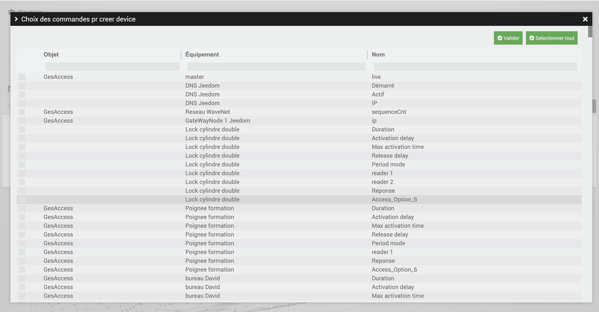

# BacnetManager

>**IMPORTANT**
>
>. 

# Description

.

# Plugin Setup

After downloading the plugin, you must first activate it, like any Jeedom plugin :

Then, you have to start the installation of the dependencies (even if they appear OK) :

Finally, start the daemon :

Rien n'est à modifier dans le champ « Port socket interne » de la section « Configuration ».

.

# How the plugin works ?

>**IMPORTANT**
>
>Your BACNET equipment must be on the same network as your Jeedom to be detected by it.

By default, a jeeBacnetManager device is created; it is this 'bacnet' equipment which will be seen by your Bacnet supervisor on the network

You can configure its deviceId in the plugin configuration

To add Jeedom commands to your jeeBacnetManager, click Add Commands to Server :

A modal will open, where all the Info type commands present in the different plugins of your jeedom will appear.

>**IMPORTANT**
>
>Your equipment must be Active for commands to be detected on this modal.

You must also name the order, by filling in the field provided for this purpose. 
Do not put spaces in the command name

All you have to do is search for the ones you want, and Validate.

>**IMPORTANT**
>
>

.

 :

 :

- ' : .
- ' :  : . ). 

#### Command Settings

1. **Action Command Selection** : Select an Action command depending on the chosen plugin.
2. **Initial Value** : Set an initial value to initialize the Bacnet point for the first time.
3. **Use Bacnet Value** : Check this option to use Bacnet value. If this option is not checked, you must fill in the "Value to send to action" field".

When the cron runs, the system will check if there has been a change of value on the Bacnet point (write). At that point it will send either that Bacnet value or the value entered in "Send to Action" to the configured Action command.

To update the values you need to configure the cron in the plugin configuration.

# Orders Setup :

To change the unit of bacnet points, and see them appear on the network, you must choose the unit in the Select menu provided for this purpose on the controls.
Jeedom commands of type 'string' do not have to select units.

On the bacnet network, the instances of the points will use the names of the commands specified in the field on the Additions of commands modal.

>**IMPORTANT**
>
>

# Import/Export the jeeBacnetManager (coming soon)):

To prevent needs, 2 options are provided : 

- Export device :

By clicking on this button, it will download a Json file containing the configuration of the device as well as its commands.

- Import device :

By clicking on this button, you can import the jeeBacnetManager configuration json file that you would have downloaded, to use the commands that were configured in this one

# ANNEXE:

# List of BACnet Engineering Units)

| Engineering units               |
|---------------------------------|
| ampereSeconds                   |
| ampereSquareHours               |
| ampereSquareMeters              |
| amperes                         |
| amperesPerMeter                 |
| amperesPerSquareMeter           |
| bars                            |
| becquerels                      |
| btus                            |
| btusPerHour                     |
| btusPerPound                    |
| tusPerPoundDryAir               |
| candles                        |
| candelasPerSquareMeter          |
| centimeters                     |
| centimetersOfMercury            |
| centimetersOfWater              |
| cubicFeet                       |
| cubicFeetPerDay                 |
| cubicFeetPerHour                |
| cubicFeetPerMinute              |
| cubicFeetPerSecond              |
| cubicMeters                     |
| cubicMetersPerDay               |
| cubicMetersPerHour              |
| cubicMetersPerMinute            |
| cubicMetersPerSecond            |
| currency1                       |
| currency10                      |
| currency2                       |
| currency3                       |
| currency4                       |
| currency5                       |
| currency6                       |
| currency7                       |
| currency8                       |
| currency9                       |
| cyclesPerHour                   |
| cyclesPerMinute                 |
| days                            |
| decibels                        |
| decibelsA                       |
| decibelsMillivolt               |
| decibelsVolt                    |
| degreeDaysCelsius               |
| degreeDaysFahrenheit            |
| degreesAngular                  |
| degrees Celsius                  |
| degrees CelsiusPerHour           |
| degrees CelsiusPerMinute         |
| degreesFahrenheit               |
| degreesFahrenheitPerHour        |
| degreesFahrenheitPerMinute      |
| degreesKelvin                   |
| degreesKelvinPerHour            |
| degreesKelvinPerMinute          |
| degreesPhase                    |
| deltaDegreesFahrenheit          |
| deltaDegreesKelvin              |
| farads                          |
| feet                            |
| feetPerMinute                   |
| feetPerSecond                   |
| footCandles                     |
| grams                           |
| gramsOfWaterPerKilogramDryAir   |
| gramsPerCubicCentimeter         |
| gramsPerCubicMeter              |
| gramsPerGram                    |
| gramsPerKilogram                |
| gramsPerLiter                   |
| gramsPerMilliliter              |
| gramsPerMinute                  |
| gramsPerSecond                  |
| gramsPerSquareMeter             |
| gray                            |
| hectopascals                    |
| henrys                          |
| hertz                           |
| horsepower                      |
| hours                           |
| hundredthsSeconds               |
| imperialGallons                 |
| imperialGallonsPerMinute        |
| inches                          |
| inchesOfMercury                 |
| inchesOfWater                   |
| jouleseconds                    |
| joules                          |
| joulesPerCubicMeter             |
| joulesPerDegreeKelvin           |
| joulesPerHours                  |
| joulesPerKilogramDegreeKelvin   |
| joulesPerKilogramDryAir         |
| kiloBtus                        |
| kiloBtusPerHour                 |
| kilobecquerels                  |
| kilograms                       |
| kilogramsPerCubicMeter          |
| kilogramsPerHour                |
| kilogramsPerKilogram            |
| kilogramsPerMinute              |
| kilogramsPerSecond              |
| kilohertz                       |
| kilohms                         |
| kilojoules                      |
| kilojoulesPerDegreeKelvin       |
| kilojoulesPerKilogram           |
| kilojoulesPerKilogramDryAir     |
| kilometers                      |
| kilometersPerHour               |
| kilopascals                     |
| kilovoltAmpereHours             |
| kilovoltAmpereHoursReactive     |
| kilovoltAmperes                 |
| kilovoltAmperesReactive         |
| kilovolts                       |
| kilowatt hours                   |
| kilowattHoursPerSquareFoot      |
| kilowattHoursPerSquareMeter     |
| kilowattHoursReactive           |
| kilowatts                       |
| liters                          |
| litersPerHour                   |
| litersPerMinute                 |
| litersPerSecond                 |
| lumens                          |
| luxuries                           |
| megaBtus                        |
| megabecquerels                  |
| megahertz                       |
| megajoules                      |
| megajoulesPerDegreeKelvin       |
| megajoulesPerKilogramDryAir     |
| megajoulesPerSquareFoot         |
| megajoulesPerSquareMeter        |
| megaAVoltAmpereHours             |
| megaVoltAmpereHoursReactive     |
| megaAVoltAmperes                 |
| megaAVoltAmperesReactive         |
| megaVolts                       |
| megawatt hours                   |
| megawattHoursReactive           |
| megawatts                       |
| megohms                         |
| meters                          |
| metersPerHour                   |
| metersPerMinute                 |
| metersPerSecond                 |
| metersPerSecondPerSecond        |
| microSiemens                    |
| microgramsPerCubicMeter         |
| microgramsPerLiter              |
| microgray                       |
| micrometers                     |
| microsieverts                   |
| microsievertsPerHour            |
| milesPerHour                    |
| milliamperes                    |
| millibars                       |
| milligrams                      |
| milligramsPerCubicMeter         |
| milligramsPerGram               |
| milligramsPerKilogram           |
| milligramsPerLiter              |
| milligray                       |
| milliliters                     |
| millilitersPerSecond            |
| millimeters                     |
| millimetersOfMercury            |
| millimetersOfWater              |
| millimetersPerMinute            |
| millimetersPerSecond            |
| milliohms                       |
| milliseconds                    |
| millisiemens                    |
| millisieverts                   |
| millivolts                      |
| milliwatts                      |
| minutes                         |
| minutesPerDegreeKelvin          |
| months                          |
| nanogramsPerCubicMeter          |
| nephelometricTurbidityUnit      |
| newton                          |
| newtonmeters                    |
| newtonSeconds                   |
| newtonsPerMeter                 |
| noUnitsohmMeterPerSquareMeter   |
| ohmMeters                       |
| ohms                            |
| pH                              |
| partsPerBillion                 |
| partsPerMillion                 |
| pascalSeconds                   |
| pascals                         |
| per hour                         |
| perMille                        |
| perMinute                       |
| perSecond                       |
| percent                         |
| percentObscurationPerFoot       |
| percentObscurationPerMeter      |
| percentPerSecond                |
| percentRelativeHumidity         |
| poundsForcePerSquareInch        |
| poundsMass                      |
| poundsMassPerHour               |
| poundsMassPerMinute             |
| poundsMassPerSecond             |
| powerFactor                     |
| psiPerDegreeFahrenheit          |
| radians                         |
| radiansPerSecond                |
| revolutionsPerMinute            |
| seconds                         |
| siemens                         |
| siemensPerMeter                 |
| sieverts                        |
| squareCentimeters               |
| squareFeet                      |
| squareInches                    |
| squareMeters                    |
| squareMetersPerNewton           |
| teslas                          |
| thermals                          |
| yourHours                        |
| tones                            |
| tonsPerHour                     |
| tonsRefrigeration               |
| usGallons                       |
| usGallonsPerHour                |
| usGallonsPerMinute              |
| voltAmpereHours                 |
| voltAmpereHoursReactive         |
| voltAmperes                     |
| voltAmperesReactive             |
| volts                           |
| voltsPerDegreeKelvin            |
| voltsPerMeter                   |
| voltsSquareHours                |
| wattHours                       |
| wattHoursPerCubicMeter          |
| wattHoursReactive               |
| watts                           |
| wattsPerMeterPerDegreeKelvin    |
| wattsPerSquareFoot              |
| wattsPerSquareMeter             |
| wattsPerSquareMeterDegreeKelvin |
| webers                          |
| weeks                           |
| years                           |

