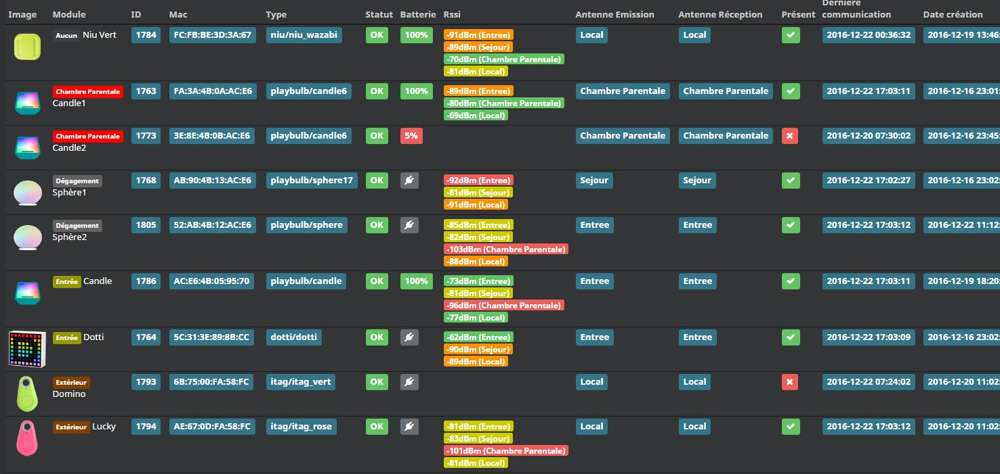

# BLEA plugin (Bluetooth advertisement)

This plugin is a plugin allowing you to receive events from certain bluetooth devices (such as NIU from Nodon and other)

# Plugin configuration

> **Tip**
>
> In order to use the plugin, you must download, install and activate it like any Jeedom plugin.

After that you will come to this page :

On this page you have little to do. It is highly recommended to start the installation of the dependencies (even if they appear OK). Then at the end of refreshing the page.

> **Important**
>
> The most important thing here is to select your Bluetooth Controller

The other option available on this page is : **Automatically delete excluded devices**. This removes the Jeedom equipment when it is excluded.

You can also check the status of dependencies and relaunch them. Incase of problems with the plugin, always relaunch the dependencies even if OK when in doubt.

# The plugin

Rendez vous dans le menu Plugins &gt; Protocole Domotique pour retrouver le plugin.

On this page you can see the modules already included.

On the upper part of this page, you have several buttons.

- Inclusion button : this button allows to put Jeedom in Inclusion.
- Exclusion button : this button allows to put Jeedom in Exclusion.
- Configuration button : this button opens the plugin configuration window.
- Health button : this button allows you to have a Health overview of all your modules.

# Equipement

When you click on one of your modules, you arrive on the configuration page of this module. Like everywhere in Jeedom you can here on the left side :

- Give a name to the module.
- Activate / make it visible or not.
- Choose your parent object.
- Assign a category.
- Define a communication monitoring delay for certain modules.
- Post a comment.

On the right side you will find :

- The profile of the equipment (generally auto detected if the module allows it).
- Choose a model if for this profile several models are available.
- See the visual.

# Which modules

For the moment, only certain specific modules are recognized.

## NIU case

NIU is very easy to include, put Jeedom in Inclusion then press the button (as simple as that).

Once the NIU is created, you will get this :

You will have 4 orders :

- ButtonId : gives a digital representation of the type of support (ideal for scenarios)
  - 01 : simple press
  - 02 : double support
  - 03 : long press
  - 04 : relachement
- Buttons : gives a textual representation of the type of support
- Rssi : gives the signal strength value
- Drums : gives the battery value

## Other modules

Other modules can be included such as beacon NUT, fitbit bracelet, etc.

They will allow presence detection with detection on a 1 minute slot.

Obviously many other modules will be added.

# Remote antenna configuration

Bluetooth has a relatively limited range, it is possible that part of your home is out of range of your antenna depending on the location of your Jeedom box.
But there is a solution: it is possible to extend the network by installing additional antennas.

The simplest is to use a raspBerry pi (existing or dedicated depending on the equipment you already have). We will assume here that the raspBerry is already installed with a raspbian and that ssh as well as bluetooth are activated.

## Created the antenna

You must go to the plugin page (Plugins> Home Automation Protocol) and click on "Antennas"

1) click on "Add"
2) choose a name
3) Enter the ip and port (22 by default)
4) Enter the user name ("pi" by default) and the password
5) Enter the bluetooth equipment on the pi ("hci0" on a default installation)
6) Save

## Installation of the daemon

If there was no error and your antenna is well created in the plugin, you must now install the necessary dependencies and launch the daemon on the antenna which will take care of making the link between the Bluetooth devices at range of the antenna and the plugin (and therefore Jeedom).

1) Click on the "Send files" button, it may take a little time, please wait. A green banner confirming success will appear, red if there has been a problem. In this case, check the "Blea" log, check the configuration (ip, user, password, ...)
2) Then click on the "Launch dependencies" button". Again, it may take time, please wait. A green banner will confirm the success or red if not (same, check the Blea log)
3) Optional, you can manually recover the dependencies installation log by clicking on "Dependencies log" and check the log, a specific log file will be available in the plugin config.
4) If all goes well, you can click on "Launch the daemon", after a maximum of one minute the date of the last communication should update, this means that the daemon is communicating correctly with the BLEA plugin.
5) Last optional but recommended step: activate the automatic management of the daemon by clicking on the corresponding button. This will cause the plugin to automatically try to restart the remote daemon in the event of a connection loss (useful if your remote pi has been temporarily disconnected from the mains or has been restarted following updates).

# List of compatible equipment

Some equipment like the lywsd03 needs to be added to mihome at least once before being active

You can find [here](https://compatibility.jeedom.com/index.php?v=d&p=home&search=&plugin=blea) the list of compatible equipment
