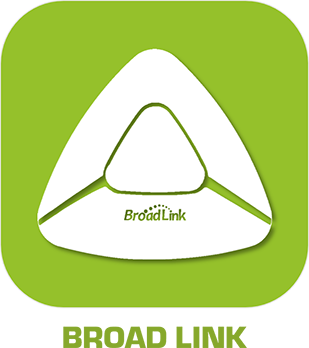
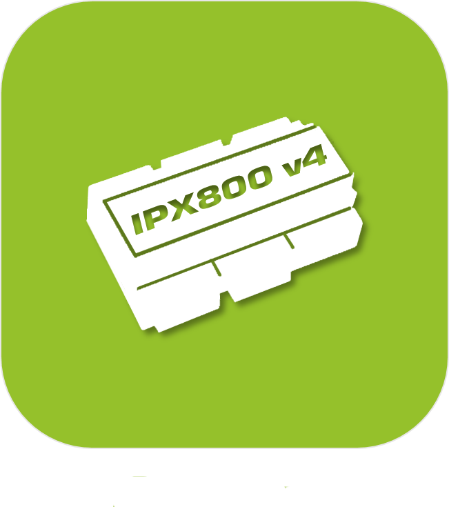

>**Important**
>Only official plugins have their documentation here. You can consult the documentation of the other plugins directly from the Jeedom Market. Once on the plugin in question, click on documentation.
>You can see [here](https://market.jeedom.com/index.php?v=d&p=market&type=plugin&categorie=automation+protocol) all official plugins in this category

| | | | |
|--- | --- | --- | ---|
||BACnet|Plugin for controlling Bacnet / IP equipment|[Documentation Stable](bacnet/index.md) - [Beta documentation](bacnet/beta/index.md) [Market](https://market.jeedom.com/index.php?v=d&p=market_display&id=4161) [Changelog Stable](bacnet/changelog.md) - [Changelog beta](bacnet/beta/changelog.md)|
||BacnetManager|Plugin to create a Bacnet device, add Jeedom info commands to it at a Bacnet point, and thus read or write to this Bacnet device from any other Bacnet client|[Documentation Stable](bacnetManager/index.md) - [Beta documentation](bacnetManager/beta/index.md) [Market](https://market.jeedom.com/index.php?v=d&p=market_display&id=4551) [Changelog Stable](bacnetManager/changelog.md) - [Changelog beta](bacnetManager/beta/changelog.md)|
||BACnetServer|ATTENTION plugin available only in beta Plugin allowing to create a Bacnet/Jeedom device|[Beta documentation](bacnetServer/beta/index.md) [Market](https://market.jeedom.com/index.php?v=d&p=market_display&id=4323) [Changelog beta](bacnetServer/beta/changelog.md)|
||Odace SFSP|Plugin adding support for the Odace SFSP range (wireless without battery) Schneider to Jeedom. It allows to obtain the information of the switches (shutters / scenes / single / double). It allows to control the actuators (shutter / dcl). It also allows you to use scenes and groups.|[Documentation Stable](beagle/index.md) - [Beta documentation](beagle/beta/index.md) [Market](https://market.jeedom.com/index.php?v=d&p=market_display&id=3917) [Changelog Stable](beagle/changelog.md) - [Changelog beta](beagle/beta/changelog.md)|
||Bluetooth Advertisement|Plugin for the management of certain devices which work in bluetooth advertisement like the NIUS of Nodon For the NIUS it allows to detect the different supports. For some other devices it allows to make presence. Also compatible with ticatag buttons (with management of multiple temperature and action presses to make it ring) Compatible Mi flora, Mi scale, awox smartplug, playbulb, miband1 and 1s|[Documentation Stable](blea/index.md) - [Beta documentation](blea/beta/index.md) [Market](https://market.jeedom.com/index.php?v=d&p=market_display&id=2554) [Changelog Stable](blea/changelog.md) - [Changelog beta](blea/beta/changelog.md)|
||Broadlink|Plugin adding support for certain Broadlink products such as (RM, A1 etccc)|[Documentation Stable](broadlink/index.md) - [Beta documentation](broadlink/beta/index.md) [Market](https://market.jeedom.com/index.php?v=d&p=market_display&id=2699) [Changelog Stable](broadlink/changelog.md) - [Changelog beta](broadlink/beta/changelog.md)|
||Dali|This plugin allows management of the Dali protocol, compatible only with the HASSEB DaliMaster v2 gateway|[Documentation Stable](dali/index.md) - [Beta documentation](dali/beta/index.md) [Market](https://market.jeedom.com/index.php?v=d&p=market_display&id=4223) [Changelog Stable](dali/changelog.md) - [Changelog beta](dali/beta/changelog.md)|
||Deconz|This plugin will allow you to integrate a multitude of ZigBee modules (Ikea, Philips Hue, Xiaomi etc ...) without having to go through their gateway with the Conbee / Conbee II key. IMPORTANT : you absolutely need a conbee key to use this plugin. Another point is to read the documentation and compatible modules.|[Documentation Stable](deconz/index.md) - [Beta documentation](deconz/beta/index.md) [Market](https://market.jeedom.com/index.php?v=d&p=market_display&id=3610) [Changelog Stable](deconz/changelog.md) - [Changelog beta](deconz/beta/changelog.md)|
||Eco-device||[Documentation Stable](ecodevice/index.md) - [Beta documentation](ecodevice/beta/index.md) [Market](https://market.jeedom.com/index.php?v=d&p=market_display&id=342) [Changelog Stable](ecodevice/changelog.md) - [Changelog beta](ecodevice/beta/changelog.md)|
||Edimax Plug||[Documentation Stable](edimaxplug/index.md) [Market](https://market.jeedom.com/index.php?v=d&p=market_display&id=2455) [Changelog Stable](edimaxplug/changelog.md)|
||Edisio|Edisio plugin to manage the Edisio protocol with Edisio USB key. So you can communicate with the products of the Edisio range.|[Documentation Stable](edisio/index.md) [Market](https://market.jeedom.com/index.php?v=d&p=market_display&id=1541) [Changelog Stable](edisio/changelog.md)|
||ipx800 V3||[Documentation Stable](ipx800/index.md) - [Beta documentation](ipx800/beta/index.md) [Market](https://market.jeedom.com/index.php?v=d&p=market_display&id=344) [Changelog Stable](ipx800/changelog.md) - [Changelog beta](ipx800/beta/changelog.md)|
||ipx800 V2|| [Market](https://market.jeedom.com/index.php?v=d&p=market_display&id=1194)|
||IPX 800 v4|Plugin to control the IPX 800|[Documentation Stable](ipx800v4/index.md) - [Beta documentation](ipx800v4/beta/index.md) [Market](https://market.jeedom.com/index.php?v=d&p=market_display&id=2046) [Changelog Stable](ipx800v4/changelog.md) - [Changelog beta](ipx800v4/beta/changelog.md)|
||IPX800 v5|ATTENTION plugin available only in beta Plugin for ipx800v5.Beware of the complexity of the API provided by the manufacturer, this plugin is not recommended for beginners. If you can go on a much simpler ipx800v4 instead. Please note that the plugin will pay when it goes to stable|[Beta documentation](ipx800v5/beta/index.md) [Market](https://market.jeedom.com/index.php?v=d&p=market_display&id=4218) [Changelog beta](ipx800v5/beta/changelog.md)|
||Lora Payload|Plugin allowing decoding of Lora Payloads.|[Documentation Stable](lorapayload/index.md) - [Beta documentation](lorapayload/beta/index.md) [Market](https://market.jeedom.com/index.php?v=d&p=market_display&id=4146) [Changelog Stable](lorapayload/changelog.md) - [Changelog beta](lorapayload/beta/changelog.md)|
||Modbus|Modbus plugin Not Wago compatible|[Documentation Stable](modbus/index.md) - [Beta documentation](modbus/beta/index.md) [Market](https://market.jeedom.com/index.php?v=d&p=market_display&id=4267) [Changelog Stable](modbus/changelog.md) - [Changelog beta](modbus/beta/changelog.md)|
||ModbusServer|ATTENTION plugin available only in beta Plugin allowing to create a Modbus/Jeedom device|[Beta documentation](modbusServer/beta/index.md) [Market](https://market.jeedom.com/index.php?v=d&p=market_display&id=4357) [Changelog beta](modbusServer/beta/changelog.md)|
||MyhomeSCS|Allows you to manage the MyHome Bus protocol.|[Documentation Stable](myhomescs/index.md) [Market](https://market.jeedom.com/index.php?v=d&p=market_display&id=3107) [Changelog Stable](myhomescs/changelog.md)|
||EnOcean|Plugin ajoutant le support du EnOcean à Jeedom https://compatibility.jeedom.com/index.php?v=d&p=home&search=&plugin=openenocean Many modules will be added quickly and continuously We advise you to migrate with caution|[Documentation Stable](openenocean/index.md) - [Beta documentation](openenocean/beta/index.md) [Market](https://market.jeedom.com/index.php?v=d&p=market_display&id=2622) [Changelog Stable](openenocean/changelog.md) - [Changelog beta](openenocean/beta/changelog.md)|
||Z-Wave|Plugin to control ZWave equipment via an openWave compatible ZWave key|[Documentation Stable](openzwave/index.md) - [Beta documentation](openzwave/beta/index.md) [Market](https://market.jeedom.com/index.php?v=d&p=market_display&id=185) [Changelog Stable](openzwave/changelog.md) - [Changelog beta](openzwave/beta/changelog.md)|
||RfPlayer2|Plugin adding support for the RfPlayer key from Ziblue to Jeedom. This plugin will eventually replace the first plugin. It will be made available to all owners of the first plugin. This will allow everyone to migrate quietly. Because the philosophy of the plugin having changed and the ids too, you will have to include your devices on this new plugin.|[Documentation Stable](rfplayer2/index.md) - [Beta documentation](rfplayer2/beta/index.md) [Market](https://market.jeedom.com/index.php?v=d&p=market_display&id=3349) [Changelog Stable](rfplayer2/changelog.md) - [Changelog beta](rfplayer2/beta/changelog.md)|
||RFXcom|Plugin to use the RFXcom USB. Allows you to control 433Mhz home automation equipment (Chacon, Oregon, La Crosse, X10, DI-O, Blyss...)|[Documentation Stable](rfxcom/index.md) - [Beta documentation](rfxcom/beta/index.md) [Market](https://market.jeedom.com/index.php?v=d&p=market_display&id=52) [Changelog Stable](rfxcom/changelog.md) - [Changelog beta](rfxcom/beta/changelog.md)|
||Velux MQTT|ATTENTION plugin available only in beta This plugin allows the control of skylights and "io-homecontrol" openings compatible with the VELUX KLF 200 interface (Somfy roller shutters for example). Official Docker Management and MQTT Manager plugins must be installed, configured and working.|[Beta documentation](vlx2mqtt/beta/index.md) [Market](https://market.jeedom.com/index.php?v=d&p=market_display&id=4275) [Changelog beta](vlx2mqtt/beta/changelog.md)|
||Wattlet|This plugin allows you to control Wattlet's Wattcubes modules via the Wattcube Web.|[Documentation Stable](wattlet/index.md) [Market](https://market.jeedom.com/index.php?v=d&p=market_display&id=2600) [Changelog Stable](wattlet/changelog.md)|
||Wes|This plugin will allow you to integrate a CartElectronics wes|[Documentation Stable](wes/index.md) [Market](https://market.jeedom.com/index.php?v=d&p=market_display&id=1336) [Changelog Stable](wes/changelog.md)|
||JeeZigbee|Plugin allowing to use zigbee, based on zigbee2mqtt.|[Documentation Stable](z2m/index.md) - [Beta documentation](z2m/beta/index.md) [Market](https://market.jeedom.com/index.php?v=d&p=market_display&id=4351) [Changelog Stable](z2m/changelog.md) - [Changelog beta](z2m/beta/changelog.md)|
||Zigbee|IMPORTANT This plugin is replaced by Jeezigbee (documentation in progress). Plugin offering general compatibility with different types of Zigbee controllers such as deCONZ and EZSP (Silicon labs), and in beta support : Zigate, XBee and Texas Instruments.    It is important to read the plugin documentation carefully before any purchase.|[Documentation Stable](zigbee/index.md) - [Beta documentation](zigbee/beta/index.md) [Market](https://market.jeedom.com/index.php?v=d&p=market_display&id=4050) [Changelog Stable](zigbee/changelog.md) - [Changelog beta](zigbee/beta/changelog.md)|
||Z-Wave JS|Plugin to control Z-Wave equipment|[Documentation Stable](zwavejs/index.md) - [Beta documentation](zwavejs/beta/index.md) [Market](https://market.jeedom.com/index.php?v=d&p=market_display&id=4306) [Changelog Stable](zwavejs/changelog.md) - [Changelog beta](zwavejs/beta/changelog.md)|
