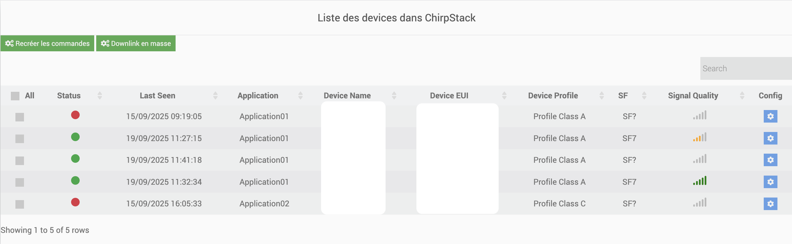

# LoraPayload plugin

The plugin ****  **)**.
.
 :

- ).

- .

- .

- .

# Fonctionnalité
 :

- **** : .).
- **** .
- **** :
  -  **** ().
  -  **** ().
- **** : .
- **** .
- **** .
- **** .
- **** .

# Configuration
---
## Plugin configuration

 :

- .  
- .).  

!alt text](../images/image_dependance.png)
---

## The plugin

 ****.  
.

 :

!alt text](../images/image.png)
- **** : .  
- **** : .  
- **** : . *(.)*

## Equipement

 :

!alt text](../images/accueil_config_equip.png)

- .  
- .  
- .  
- .  

 :

-  **** ().  
- .  

 :

-   )
!alt text](../images/equiplorawanconfig.png)
.  

### 

.  

 :  

1. ****  **.  
2. **** .  
3. **** .  

 **** :  :  
- ,  
- .  

**** :  **** .
   
-   An Orders tab (this is where you will find the controls corresponding to your equipment - this tab is standard at Jeedom)
!alt text](../images/equipcommconfig.png)

## Adding equipment
!alt text](../images/image-1.png)
.

.

It is important on the right side to choose the type of equipment. This is what will allow us to know how to parse the frame.

 :
!alt text](../images/equiplorawanconfig.png)
-    )
-   .
-   .

Once done you can save. Following this, the next time you receive a frame, the commands for your equipment will update

## Sending orders

Some Lorawan modules have Action commands which can be used to send instructions to the modules via the Jeedom interface.

In the LoraPayload plugin's Equipment tab :

- You must choose the  command (MQTT or other))
- You must choose whether you want confirmation (Ack). This information is entered into MQTT on a dedicated topic and has no influence on the data entered.
The send command, when used with MQTT, is an MQTT command of type Action and sub-type Message. The topic is the topic dedicated to downlinks and the value of the command is **.

---
## )

 **** .

---

### 1.  

1. **** :  
     
   Exemple:  
   -   
   - 

2. ****:  
   

3. ****.

---

### 2. 

Remplacer:
js
) {
    
}
 
) {
    
    
}

---

### 3. 

Remplacer:
js
) {

}
 
) {
    
}

### 4.  
:
js
 = {
    Decode,
    Encode
}

### 5. 

1. ****  ``/var/www/html/plugins/lorapayload/core/config/devices/ `` ``.js``).

:

- 

- : )

### 6.  
json
{
  "": {
    "name": " 
    "groupe": "
    "configuration": {
      "type": "",
      "language": ")
      "deviceProfile": ")
    },
    "commands": 
      {
        "name": " 
        "type": ")
        "subtype": "
        "isVisible": 
        "isHistorized": 
        "unite": "
        "logicalId": "parsed::)
      },
      {
        "name": "
        "type": "info",
        "subtype": "numeric",
        "isVisible": 0,
        "isHistorized": 0,
        "unite": "",
        "logicalId": "
      },
      {
        "name": "Reboot",
        "type": ")
        "subtype": "other",
        "isVisible": 1,
        "logicalId": "encoder::reboot::::<fonction>::<valeur>)
      },
      {
        "name": "",
        "type": ")
        "subtype": "other",
        "isVisible": 1,
        "logicalId": "action::::<valeur_en_hexadecimal>)
      },
      {
        "name": "",
        "type": "action",
        "subtype": "
        "isVisible": 1,
        "logicalId": "encoder::",
        "configuration": {
          "minValue": 1,
          "maxValue": 5000,
          "step": 1
        }
      },
      {
        "name": "",
        "type": "action",
        "subtype": "
        "isVisible": 1,
        "logicalId": "action::",
        "configuration": {
          "minValue": 1,
          "maxValue": 5000,
          "step": 1
        }
      },
      {
        "name": "",
        "type": "info",
        "subtype": "string",
        "isVisible": 0,
        "isHistorized": 0,
        "logicalId": "
      }
    ],
    "compatibility": 
      {
        "manufacturer": "Milesight",
        "name": "GS601",
        "doc": "",
        "type": "",
        "remark": "",
        "inclusion": "",
        "imglink": ""
      }
    ]
  }
}

### ?
.

#### 
- ****: .

- ****: : ).

- ****:

    - `type`: .

    - `language`: .

    - `deviceProfile`: ).

- ****: ).

    - ****:

        - `info`: ).

        - `action`: ).

- ****:

    - `numeric`: .

    - `string`: .

    - `binary`: .

    - : .

    - `other`: .

- ****: ).

- ****: ).
(")

- ****: ).

- ****:

    - : ``parsed::nom_de_la_variable`` (.)

    - : 
        json
        action::<valeur_en_hexadecimal>
        
        ou
        json
        encoder::<fonction>::<valeur>
        
        ou
         
        encoder::<fonction>
         
        (: slider)

    - : ``"logicalId": "payload"``

- ****: .

##### 
- : : ``decoded.temperature ⇒ "parsed::temperature"``).

- .

- .).

- .

### 

- : 

- : )
---
### ?
.

    - Regardez le tableau  la section “ downlink”  “ via payload”,

    - .

.

    - .

 | (.

4. (**): .

:

|                 |  |                     |
| -------------------- | ----------------- | ------------------------------ |
|                |               | 0: :       |
|  |            | 1: : ... |
|        |             |                           |
|        |             |                           |

json
{
  "": {
    "enable": 1,
    "": 2,
    "": 30,
    "": 40
  }
}

-  :
|2|30|

## Panel

###  ?

-  ****  ****.
-  :
  -  **** .

- .
!alt text](../images/image-3.png)

---
### 

-  :

  
  

---

#### 

 :

1. ****  
    :  
   - **** : .  
     -  **** : .  
     -  **** : .  
     -  **** : .  
   - **** : .  
   - **** : .  
   - **** :  ****,  ****  ****.  
     -  **** : ).  
     -  **** : ).  
     -  **** : ).  
   - **** : .
2. ****
  - .  
  -  ****.  
    **** .  
3. ****

    - ****
  .
    - ****
  .
    - ****
  .
  !alt text](../images/ongletintegrationmass.png)
  ** : ** :
  
  -  : **** ( **X)** .
  - .
  !alt text](../images/selectfortemplate.png)
  -  **""** .

  ** : ** :
   :
  - **** : ).
  - **** : , ****.
  - **** : , ****.
  - **** : :).
  - **** : :).
  - **** : ).
  - **** : ).

  ** : ** :
  - ).
  

    
  

  - .
  !alt text](../images/tableaupostanalyse.png)

  - ..">. .
  ** :** .
  - .">
  - .">. .

4. ****  
   .

---

#### 

 **** .  
 :  

.  
 ****.  
 **)**.  

 :  
- .  
- .  
- .  

.

---
### 

.  :
- ..

- ,

- ).

- ).

- .

- .

### 

1. ****
..  :
- 
- .

2. ****

!alt text](../images/image-11.png)

 :
- ),
-  : ),
- .

3. ****
- ****
.

- ****
).
: .

- **)**
: 0s).
.

- ****
 : ).
.

- ****
.

- ****
. .

4. ****

!alt text](../images/image-13.png)
.
.
!alt text](../images/image-12.png)
.
.

# )

## 
-  ****  ****, .  
- .  
!alt text](../images/rak1.png)
---

## 
- .  
-  ****  ****.  
-  **“Failed”**, .  

---

## 
-  ****.  
-  ****  (**.**).  
 !alt text](../images/rak2.png)
 **** : .  

---

## 
- .  
-  **** .  
-  **** .  

---

## 
-  :  
  -  **** for exploitation on ****,  
  -  **** for automated use or scripts.  

 **Access path** :  

→ rak10701 files.csv and rak10701_history.json.
!alt text](../images/rak3.png)

If write permission is not granted, restore the folder and file permissions in the OS/DB field in configuration.

## 6. Download the file and process the data
!alt text](../images/rak4.png)

# FAQ

-   Some commands do not update at the same time as others : yes indeed some Lorawan modules do not necessarily send all the information at the same time and with the same frequency
