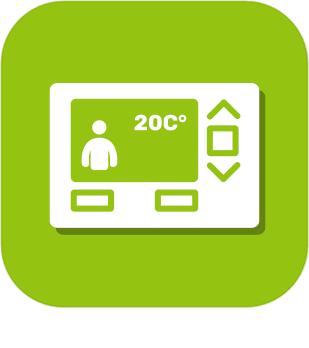

>**Important**
>Only official plugins have their documentation here. You can consult the documentation of the other plugins directly from the Jeedom Market. Once on the plugin in question, click on documentation.
>You can see [here](https://market.jeedom.com/index.php?v=d&p=market&type=plugin&categorie=automatisation) all official plugins in this category

| | | | |
|--- | --- | --- | ---|
||Light management|Plugin for managing lights|[Documentation Stable](lightmanager/index.md) - [Beta documentation](lightmanager/beta/index.md) [Market](https://market.jeedom.com/index.php?v=d&p=market_display&id=4199) [Changelog Stable](lightmanager/changelog.md) - [Changelog beta](lightmanager/beta/changelog.md)|
||Shutter management|This plugin will allow you to easily manage the automatic positioning of your shutters according to the sun and/or other conditions. Important : this plugin only works with equipment that has an action/cursor command allowing the shutter to be positioned at a certain opening/closing percentage.|[Documentation Stable](sunshutter/index.md) - [Beta documentation](sunshutter/beta/index.md) [Market](https://market.jeedom.com/index.php?v=d&p=market_display&id=3793) [Changelog Stable](sunshutter/changelog.md) - [Changelog beta](sunshutter/beta/changelog.md)|
||Thermostat management|ATTENTION plugin only available in beta Allows you to manage changes in thermostats|[Beta documentation](thermostatmanager/beta/index.md) [Market](https://market.jeedom.com/index.php?v=d&p=market_display&id=4200) [Changelog beta](thermostatmanager/beta/changelog.md)|
||Arrosage|ATTENTION plugin only available in beta Watering plugin|[Beta documentation](watering/beta/index.md) [Market](https://market.jeedom.com/index.php?v=d&p=market_display&id=4198) [Changelog beta](watering/beta/changelog.md)|
