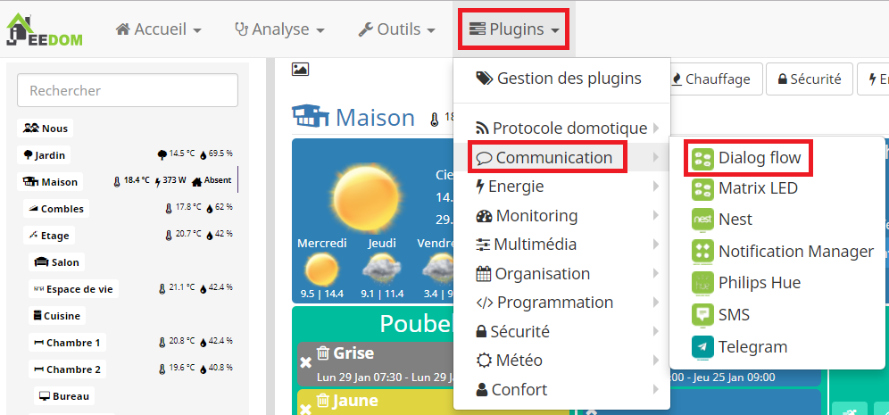
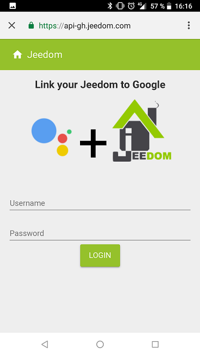

# Dialogflow

The dialogflow plugin makes it possible to connect Jeedom to Google Home / Assistant by a native application and interactions

> **NOTE**
>
> There is also the Google Smarthome plugin which allows you to connect Jeedom to Google Home / Assistant but this time for the sake of Google’s Smarthome integration, it therefore does not use interactions.

> **Important**
>
> The plugin requires a subscription to voice services. You can manage your subscription [here](https://market.jeedom.com/index.php?v=d&p=profils#services)

# Configuration

Install the plugin and activate it. Then always on the plugin configuration page click on "Send" to send your configuration to the market.

> **IMPORTANT**
>
> You don't have to create any equipment for this plugin. Just follow the instructions below.

On the market you must activate "Google Smarthome" in the "My Services" tab".

> **IMPORTANT**
>
> The access url of your jeedom must absolutely be in https

> **NOTE**
>
> You can only connect one Jeedom to Google per market account

On a phone with Google Assistant, say "Speak with Jeedom", Google will tell you to link your Jeedom account and Google click on yes :

Indicate your market identifiers :

Google will tell you that the configuration is successfully created / updated :

Here, the link between your Jeedom and Google Home / Assistant is made.

You can now talk to your Jeedom and use all the interactions of your Jeedom directly from your Google Home / Assistant.
From your Google Home / Assistant, just say "Talk to Jeedom", "Ask Jeedom" or even "Say to Jeedom" to start interaction with Jeedom and "Thank you" when you're done to end the conversation.

# FAQ

>**I have the error ESOCKETTIMEDOUT**
>
>Is that your URL or API key configured on the market is not good. Also pay attention to the response time defined in the interactions, Google imposes a response time before timeout of 4 seconds.

>**Error your Jeedom did not answer correctly ETIMEDOUT code. Something else**
>
>This comes from your Jeedom which did not respond within the time limit (imposed by Google). It can come from 2 things, a slow internet connection, or actions that take too long..
