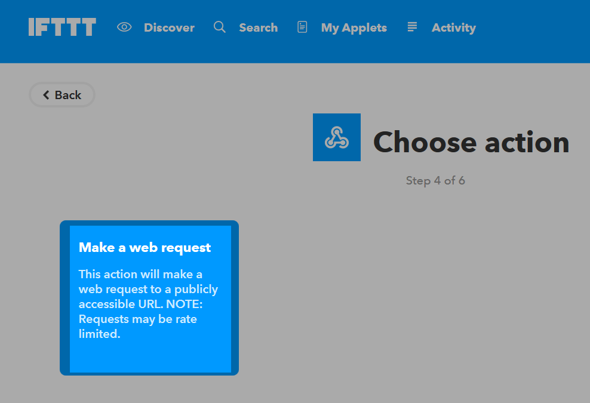

# IFTTT plugin

This plugin allows to send an event to IFTTT.

# Plugin configuration

After downloading the plugin you just need to activate it, it does not require any other configuration.

# Equipment configuration

The configuration of IFTTT equipment is accessible from the plugins menu :

This is what the IFTTT plugin page looks like (*already with 1 equipment*) :

Once you click on one of them, you get :

Here you find all the configuration of your equipment :

-   **Name of equipment** : name of your IFTTT equipment.
-   **Activate** : makes your equipment active.
-   **Visible** : makes it visible on the dashboard.
-   **Key** : IFTTT key that you will find in the configuration of the Webhooks service (which replaces channel maker).

Below you will find the configuration of the commands :

-   **Name** : Name of the order.
-   **Type** : Type of order.
-   **Event** : event name configured in IFTTT.
-   **Value** : value to send to IFTTT. 3 possible distinctions according to the subtype, you can use the tags : ``#color#, #slider#, #message#, #title#``.
-   **Advanced configuration** *(small notched wheels)* : used to display the advanced configuration of the command (logging method, widget, etc).
-   **Test** : Used to test the command.
-   **Delete** *(sign -)* : allows to delete the command.

# Creation of an IFTTT account

Create an IFTTT account if you have not already done so, by going to [IFTTT](https://ifttt.com) :

Enter your email address then your username and have it created :

A short guide will explain the possibilities, once it is finished, click at the top right on **Search** :

Then in the search box type webhooks and click on webhooks :

Then on **Connect** :

On this poop you have to get your key :

This key is to be copied into the field **Key** of your equipment under Jeedom :

# Creation of your first "Applet"

Nothing could be simpler, in IFTTT click on **My applets** Then on **New applet** :

Then click on **Create a Recipe** :

Click on **+ this**  :

Then search for "Webhooks" and click on it :

Click on **Make a web request** :

Give a name to your "Event". Please note that this must correspond to the name of the event in the Jeedom command, so it must be memorized.    
Confirm by clicking on **Create trigger** :

Then click on **+ that** :

Then it's up to you to see, for the example I'll send a notification to my phone (you must first have installed the IFTTT application on it), so I click on **Notifications** :

Confirm by clicking on **Send a notification** (may be different depending on the channels) :

Then you have to write the message of the notification, there are possible tags (ingredients) :

-   **EventName** : name of the event, here weather.
-   **Value1** : value 1 sent in the channel, this is configured on the command in Jeedom.
-   **Value2** : value 2 sent in the channel, this is configured on the command in Jeedom.
-   **Value3** : value 3 sent in the channel, this is configured on the command in Jeedom.
-   **OccurredAt** : date of occurrence.

Here is what it gives here (I want to receive the notification of the current weather at home), validate by clicking on **Create Action** :

Give a name to your applet (recipe) and validate by clicking on **Create Recipe** :

Here you have created your "applet" on the IFTTT side :

It remains more than to create the order on the Jeedom side, it's quite simple :

Nothing special, you have to put the name of the IFTTT event back in Jeedom and then put the values to pass to IFTTT. In our example the weather conditions in the ingredient ``value1``.

> **TRICK**
>
> On the Jeedom side you can, if you place a message subtype command for example, put the tag ``#message#`` in one or more "Value" fields". So, in your scenario the value of the message will be passed to IFTTT. The same is possible with ``#title#``, ``#color#`` or ``#slider#``.

# Sending information from IFTTT to Jeedom

It is also possible to do it in the other direction, i.e. sending information from IFTTT to Jeedom.      
Here's how to, for example, send information when the phone enters a given area. First thing to do, create a new applet :

Then click on the **+ this** :

Select **Rental** :

Choose your trigger (here I will take when entering a zone) :

Mark your zone then do **Create trigger** :

Click on **+ that** :

Look for "Webhooks" and click on it :

Click on **Make a web request** :

Jeedom side, on your IFTTT equipment, create an info / other type command (or binary if you just want to know if you are in the area), like this :

Very important : retrieve the order id (here ``5369``).

We then return to IFTTT and in our webhooks we will give it the url to call. This is the most complicated step, finding your external access url :

-   You are using jeedom DNS so this is : ``https://XXXXX.dns.jeedom.com/core/api/jeeApi.php?apikey=\#APIKEY\#&type=ifttt&id=\#IDCMD\#&value=\#VALEUR\#``.   
Attention if you have an address in / jeedom you must remember to add it before the / core.
-   You have your own DNS then the url is of the form ``http://\#VOTRE\_DNS\#/core/api/jeeApi.php?apikey=\#APIKEY\#&type=ifttt&id=\#IDCMD\#&value=\#VALEUR\#``.   
Attention if you have an address in / jeedom you must remember to add it before the / core

Remember to replace :

-   ``#APIKEY#`` : by your JEEDOM API key (it can be found in Settings → System → Configuration → API).
-   ``#IDCMD#`` : by the id of your previously created order.
-   ``#VALEUR#`` : by the value you want to give to your order. Be careful here, spaces must be replaced by% 20 (and it is better to avoid special characters - example : ``Hors%20zone``).

This is what it gives :

Remember to put method on Get, then click on **Create Action**.

Give your applet a title then click on **Create Action**. And there you go, as soon as you enter the area, Jeedom will be warned.

> **Important**
>
> You also need to make a recipe for leaving the area, otherwise Jeedom does not
> will not be warned when leaving the area.

> **NOTE**
>
> To retrieve the webhook url on ifttt you have to go [here](https://ifttt.com/maker_webhooks) then click on documentation
