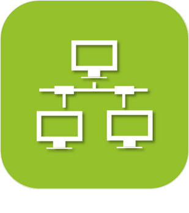
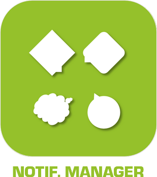
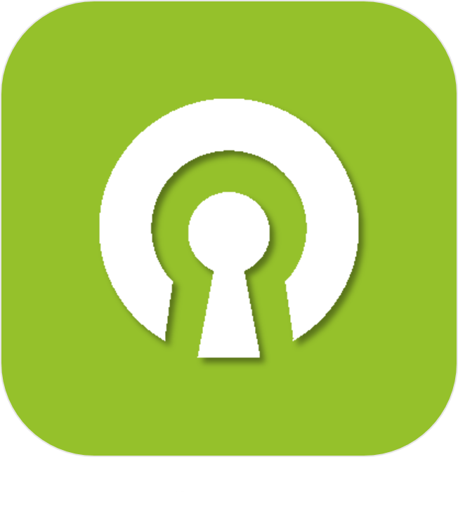

# Communication

>**IMPORTANT**
>Only official plugins have their documentation here. You can consult the documentation of the other plugins directly from the Jeedom Market. Once on the plugin in question, click on documentation.
>You can see [here](https://market.jeedom.com/index.php?v=d&p=market&type=plugin&categorie=communication) all official plugins in this category

| | | | |
|--- | --- | --- | ---|
||Alexa|Alexa|[Documentation](ash/index.md) - [Market](https://market.jeedom.com/index.php?v=d&p=market_display&id=3409)|
||Tenda W301A bollard|Plugin author : Thomas Guenneguez PLEASE NOTE, this is not an official Jeedom plugin but a plugin developed by a third person and whose development has been abandoned. The Jeedom technical team will provide assistance with this plugin without obligation of result. Plugin to manage Tenda W301A Kiosks.|[Documentation](bornetenda/index.md) - [Market](https://market.jeedom.com/index.php?v=d&p=market_display&id=1299)|
||Dialog flow|Plugin allows talking to Google Home / Assistant through Jeedom interactions|[Documentation](dialogflow/index.md) - [Market](https://market.jeedom.com/index.php?v=d&p=market_display&id=3215)|
||Gcast|Simple cast management plugin, and allows voice notification|[Documentation](gcast/index.md) - [Market](https://market.jeedom.com/index.php?v=d&p=market_display&id=3057)|
||Google Smarthome|Plugin to drive Jeedom with a Google Home. IMPORTANT : the configuration of this plugin is not click and play it is absolutely necessary to read the documentation before buying it !!!!!|[Documentation](gsh/index.md) - [Market](https://market.jeedom.com/index.php?v=d&p=market_display&id=3412)|
||IFTTT|Thanks to this plugin, you can benefit from the countless recipes available on IFTT. So a Jeedom event can become an entry point for an IFTT recipe and trigger an event of all kinds|[Documentation](ifttt/index.md) - [Market](https://market.jeedom.com/index.php?v=d&p=market_display&id=1705)|
||Jarvis|Plugin to manage one or more Jarvis|[Documentation](jarvis/index.md) - [Market](https://market.jeedom.com/index.php?v=d&p=market_display&id=2577)|
||Jeedom Link|Plugin allowing to link several Jeedom|[Documentation](jeelink/index.md) - [Market](https://market.jeedom.com/index.php?v=d&p=market_display&id=2530)|
||LaMetric|Plugin to display notifications on LaMetric Time|[Documentation](lametric/index.md) - [Market](https://market.jeedom.com/index.php?v=d&p=market_display&id=2818)|
||Mail|Plugin to send emails|[Documentation](mail/index.md) - [Market](https://market.jeedom.com/index.php?v=d&p=market_display&id=22)|
||Mobile App|The official Jeedom application allows the control of your Jeedom home automation system, whether by local Wifi, or on your operator's 3G / 4G network.  The app automatically connects to your Jeedom with automatic initialization by QRcode, no configuration is necessary. (possibility to do it manually) You will find on your mobile all the features of your Jeedom. You can customize your application with shortcuts and more...  Current functionalities: - Managing your scenarios. - Management of your home automation according to your parts and equipment. - Automatic shift and status feedback - Compatibility with plugins, such as thermostat, alarm, camera, etc.... - Customizable interface with shortcuts. - General home automation and by room - Notifications (with ASK support) - Display of Designs   Other features and compatibilities are coming in the next updates !  Respect for privacy. No data (home automation or personal) is stored or kept on our servers.|[Documentation](mobile/index.md) - [Market](https://market.jeedom.com/index.php?v=d&p=market_display&id=2030)|
||Nest|This plugin will allow you to find your Nest Thermostat or Nest Protect (be careful not to report alerts in real time) in your Jeedom. IMPORTANT : There is no API for Nest E in Europe. This plugin therefore does not allow you to control a Nest E thermostat in Europe.|[Documentation](nest/index.md) - [Market](https://market.jeedom.com/index.php?v=d&p=market_display&id=407)|
||Network|Plugin for network management of equipment : ping (ip, arp and port) and wake on lan|[Documentation](networks/index.md) - [Market](https://market.jeedom.com/index.php?v=d&p=market_display&id=1950)|
||Nimbus|Plugin to control your Nimbus.  You can control the displayed text, the position of the hands. All via scenario or via the dashboard.  A customizable representation of the nimbus on your dash will enhance the whole  The dashboard is completely customizable  You can change the position of each needle and change the text of each screen independently (either via the dashboard or via scenario)  There is also a demo command and an all command (to act on all screens at the same time), as well as a phrase command to split a phrase on the 4 screens.   Read the documentation|[Documentation](nimbus/index.md) - [Market](https://market.jeedom.com/index.php?v=d&p=market_display&id=1506)|
||Notification Manager|This plugin allows you to manage notifications (recovery in case of error, generation of text ...)|[Documentation](notificationmanager/index.md) - [Market](https://market.jeedom.com/index.php?v=d&p=market_display&id=3315)|
||Openvpn|Plugin to manage the connection to an openvpn server|[Documentation](openvpn/index.md) - [Market](https://market.jeedom.com/index.php?v=d&p=market_display&id=1965)|
||Philips Hue|Plugin to control Philips Hue lamps. Available functions: - On / off - Luminosité - Transition - Groupe - Couleur - Alert Mode - Rainbow mode  WARNING : there is a slight known color difference between the selector and the color of the bulb. It seems that the color grid of the bulbs has an offset|[Documentation](philipsHue/index.md) - [Market](https://market.jeedom.com/index.php?v=d&p=market_display&id=190)|
||Phone market|Plugin to use the market as an SMS gateway and to make calls|[Documentation](phonemarket/index.md) - [Market](https://market.jeedom.com/index.php?v=d&p=market_display&id=1694)|
||Sarah|Plugin pour utiliser Sarah (http://encausse.wordpress.com/s-a-r-a-h/)|[Documentation](sarah/index.md) - [Market](https://market.jeedom.com/index.php?v=d&p=market_display&id=17)|
||Slack|Plugin to link Jeedom to Slack|[Documentation](slack/index.md) - [Market](https://market.jeedom.com/index.php?v=d&p=market_display&id=1689)|
||SMS|Plugin adding management (sending / receiving) of SMS to Jeedom.With this plugin you can be notified by SMS, see through the interaction engine ask a question or trigger an action via SMS.(Requires a 3G key and a SIM card).|[Documentation](sms/index.md) - [Market](https://market.jeedom.com/index.php?v=d&p=market_display&id=16)|
||Wifip|Plugin to manage the wifi of your box as well as fix the ip|[Documentation](wifip/index.md) - [Market](https://market.jeedom.com/index.php?v=d&p=market_display&id=2286)|
||Wifipower|Wifipower equipment management plugin|[Documentation](wifipower/index.md) - [Market](https://market.jeedom.com/index.php?v=d&p=market_display&id=1046)|
