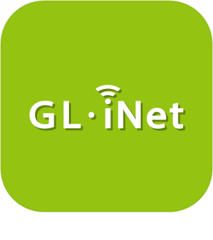

# Communication

>**IMPORTANT**
>Only official plugins have their documentation here. You can consult the documentation of other plugins directly from the Jeedom Market. Once on the plugin in question, click on documentation.
>You can see [here](https://market.jeedom.com/index.php?v=d&p=market&type=plugin&categorie=communication) all official plugins in this category

| | | | |
|--- | --- | --- | ---|
||Aruba|ATTENTION plugin available only in beta | [Market](https://market.jeedom.com/index.php?v=d&p=market_display&id=4108)|
||Alexa|Plugin allowing you to use Amazon Alexa (echo, dot...) to control your Jeedom. Important : the plugin requires a subscription to voice services . Pour gérer cet abonnement : https://www.jeedom.com/market/index.php?v=d&p=profils#services|[Documentation](ash/index.md)[Beta](ash/beta/index.md) [Market](https://market.jeedom.com/index.php?v=d&p=market_display&id=3409) [Changelog](ash/changelog.md)[Beta](ash/beta/changelog.md)|
||Bestway|Plugin to control Bestway connected equipment. For the moment only the SPA Milan has been tested (the only connected spa in the range).|[Documentation](bestway/index.md)[Beta](bestway/beta/index.md) [Market](https://market.jeedom.com/index.php?v=d&p=market_display&id=4014) [Changelog](bestway/changelog.md)[Beta](bestway/beta/changelog.md)|
||Tenda W301A bollard|Plugin Author : Thomas Guenneguez ATTENTION, this is not an Official Jeedom plugin but a plugin developed by a third party and whose evolution has been abandoned. The Jeedom technical team will provide assistance on this plugin without obligation of result. Plugin to manage Tenda W301A Terminals.|[Documentation](bornetenda/index.md) [Market](https://market.jeedom.com/index.php?v=d&p=market_display&id=1299) [Changelog](bornetenda/changelog.md)|
||Dialog flow|Plugin allows talking to Google Home/Assistant through Jeedom interactions|[Documentation](dialogflow/index.md) [Market](https://market.jeedom.com/index.php?v=d&p=market_display&id=3215) [Changelog](dialogflow/changelog.md)|
||Dyson|Plugin to control Dyson Link equipment (pure link, hot+cool, humidify+cool...). At the moment the vacuum cleaner is not supported.|[Documentation](dyson/index.md) [Market](https://market.jeedom.com/index.php?v=d&p=market_display&id=4002) [Changelog](dyson/changelog.md)|
||Gcast|Plugin to make a CAST device speak. It also allows you to adjust the volume. In use combined with a Google home it allows to bridge the interactions and to have a voice feedback, it also allows to use the ask function.|[Documentation](gcast/index.md)[Beta](gcast/beta/index.md) [Market](https://market.jeedom.com/index.php?v=d&p=market_display&id=3057) [Changelog](gcast/changelog.md)[Beta](gcast/beta/changelog.md)|
||GL-iNet|GliNet management plugin (sms, connection)|[Documentation](glinet/index.md)[Beta](glinet/beta/index.md) [Market](https://market.jeedom.com/index.php?v=d&p=market_display&id=4181) [Changelog](glinet/changelog.md)[Beta](glinet/beta/changelog.md)|
||Google Smart Home|Plugin to drive Jeedom with a Google Home. Important : the plugin requires a subscription to voice services (3 months offered when purchasing the plugin) for easy configuration. Pour gérer cet abonnement : https://www.jeedom.com/market/index.php?v=d&p=profils#services Vous pouvez utiliser aussi le mode standalone mais sa configuration est plus complexe, nous vous conseillons vivement de lire la documentation avant tout achat si vous souhaitez utiliser ce mode.|[Documentation](gsh/index.md)[Beta](gsh/beta/index.md) [Market](https://market.jeedom.com/index.php?v=d&p=market_display&id=3412) [Changelog](gsh/changelog.md)[Beta](gsh/beta/changelog.md)|
||Helium Hotspot|Plugin to retrieve information from Helium hotspots|[Documentation](heliumhotspot/index.md)[Beta](heliumhotspot/beta/index.md) [Market](https://market.jeedom.com/index.php?v=d&p=market_display&id=4315) [Changelog](heliumhotspot/changelog.md)[Beta](heliumhotspot/beta/changelog.md)|
||IFTTT|Thanks to this plugin, you can benefit from the countless recipes available on IFTT. Thus a Jeedom event can become an entry point for an IFTT recipe and trigger events of all kinds.|[Documentation](ifttt/index.md)[Beta](ifttt/beta/index.md) [Market](https://market.jeedom.com/index.php?v=d&p=market_display&id=1705) [Changelog](ifttt/changelog.md)[Beta](ifttt/beta/changelog.md)|
||inter2N|ATTENTION plugin available only in beta Plugin to manage inter2N intercoms|[Beta Documentation](inter2N/beta/index.md) [Market](https://market.jeedom.com/index.php?v=d&p=market_display&id=4166) [Changelog beta](inter2N/beta/changelog.md)|
||Jarvis|Plugin to manage one or more Jarvis|[Documentation](jarvis/index.md) [Market](https://market.jeedom.com/index.php?v=d&p=market_display&id=2577) [Changelog](jarvis/changelog.md)|
||Jeedom Link|This plugin will allow you to link several Jeedom installations in order to transfer the equipment from one or more "source Jeedoms" to one or more "target Jeedoms".|[Documentation](jeelink/index.md)[Beta](jeelink/beta/index.md) [Market](https://market.jeedom.com/index.php?v=d&p=market_display&id=2530) [Changelog](jeelink/changelog.md)[Beta](jeelink/beta/changelog.md)|
||LaMetric|Plugin to display notifications on LaMetric Time.|[Documentation](lametric/index.md) [Market](https://market.jeedom.com/index.php?v=d&p=market_display&id=2818) [Changelog](lametric/changelog.md)|
||Mail|This plugin allows you to send emails from Jeedom. This allows you to be notified directly by email during an alert or simply for a daily report. You can define as many recipients as you want, this is useful for sending personalized reports or targeting alerts for this or that recipient.|[Documentation](mail/index.md)[Beta](mail/beta/index.md) [Market](https://market.jeedom.com/index.php?v=d&p=market_display&id=22) [Changelog](mail/changelog.md)[Beta](mail/beta/changelog.md)|
||Mobile App|The official Jeedom application allows you to control your Jeedom home automation system, whether in local Wifi, or on your operator's 3G/4G network.  The app automatically connects to your Jeedom with automatic initialization by QRcode, no configuration is necessary. (possibility to do it manually) You will find on your mobile all the features of your Jeedom. You will be able to customize your app with shortcuts and more...  Current Features: - Managing your scenarios. - Management of your home automation according to your rooms and equipment. - Shift and automatic status return - Compatibility with plugins, such as thermostat, alarm, camera etc... - Customizable interface with shortcuts. - General home automation summary and by room - Notifications (with support for ASK) - Viewing Designs   More features and compatibilities are coming in future updates !  Respect for privacy. No data (home automation or personal) is stored or kept on our servers.|[Documentation](mobile/index.md)[Beta](mobile/beta/index.md) [Market](https://market.jeedom.com/index.php?v=d&p=market_display&id=2030) [Changelog](mobile/changelog.md)[Beta](mobile/beta/changelog.md)|
||Netatmo|ATTENTION plugin available only in beta Plugin to retrieve Netatmo equipment (Weather, Energy, Security). In standalone mode (more complex configuration) or through the Jeedom cloud (service which may in the future become chargeable) .Attention for the moment it is not possible to have the flow of the cameras in Jeedom cloud mode.|[Beta Documentation](netatmo/beta/index.md) [Market](https://market.jeedom.com/index.php?v=d&p=market_display&id=4062) [Changelog beta](netatmo/beta/changelog.md)|
||Network|Plugin allowing network management of equipment : ping (ip, arp, port) and wake on lan|[Documentation](networks/index.md) [Market](https://market.jeedom.com/index.php?v=d&p=market_display&id=1950) [Changelog](networks/changelog.md)|
||Nimbus|Plugin to control your Nimbus.  You can control the text displayed, the position of the hands. All via scenario or via the dashboard.  A customizable representation of the nimbus on your dash will add to the whole thing  The dashboard is completely customizable  You can change the position of each hand and change the text of each screen independently (either via the dashboard or via scenario)  There is also a demo command as well as an all command (to act on all the screens at the same time), as well as a sentence command to split a sentence on the 4 screens.   Read the documentation carefully|[Documentation](nimbus/index.md) [Market](https://market.jeedom.com/index.php?v=d&p=market_display&id=1506) [Changelog](nimbus/changelog.md)|
||Notification Manager|This plugin allows you to manage notifications (resume in case of error, text generation, etc...).|[Documentation](notificationmanager/index.md)[Beta](notificationmanager/beta/index.md) [Market](https://market.jeedom.com/index.php?v=d&p=market_display&id=3315) [Changelog](notificationmanager/changelog.md)[Beta](notificationmanager/beta/changelog.md)|
||Openvpn|Plugin to manage the connection to an openvpn server.|[Documentation](openvpn/index.md)[Beta](openvpn/beta/index.md) [Market](https://market.jeedom.com/index.php?v=d&p=market_display&id=1965) [Changelog](openvpn/changelog.md)[Beta](openvpn/beta/changelog.md)|
||Philips Hue|Plugin allowing to integrate a Philips Hue ecosystem in Jeedom. The plugin is able to manage up to 2 bridges simultaneously.|[Documentation](philipsHue/index.md)[Beta](philipsHue/beta/index.md) [Market](https://market.jeedom.com/index.php?v=d&p=market_display&id=190) [Changelog](philipsHue/changelog.md)[Beta](philipsHue/beta/changelog.md)|
||Phone market|Plugin to use the market as an SMS gateway and to make calls|[Documentation](phonemarket/index.md) [Market](https://market.jeedom.com/index.php?v=d&p=market_display&id=1694) [Changelog](phonemarket/changelog.md)|
||Sarah|Plugin pour utiliser Sarah (http://encausse.wordpress.com/s-a-r-a-h/)|[Documentation](sarah/index.md) [Market](https://market.jeedom.com/index.php?v=d&p=market_display&id=17) [Changelog](sarah/changelog.md)|
||Slack|Plugin to link Jeedom to Slack|[Documentation](slack/index.md) [Market](https://market.jeedom.com/index.php?v=d&p=market_display&id=1689) [Changelog](slack/changelog.md)|
||SMS|Plugin adding SMS management (sending/receiving) to Jeedom. With this plugin you can be notified by SMS, even ask a question or trigger an action via SMS thanks to the interaction engine. (Requires a 3G dongle and a SIM card ).|[Documentation](sms/index.md)[Beta](sms/beta/index.md) [Market](https://market.jeedom.com/index.php?v=d&p=market_display&id=16) [Changelog](sms/changelog.md)[Beta](sms/beta/changelog.md)|
||Wifip|Plugin to manage the wifi of your box as well as set the ip.|[Documentation](wifip/index.md) [Market](https://market.jeedom.com/index.php?v=d&p=market_display&id=2286) [Changelog](wifip/changelog.md)|
||Wifipower|Plugin for wifipower equipment management|[Documentation](wifipower/index.md) [Market](https://market.jeedom.com/index.php?v=d&p=market_display&id=1046) [Changelog](wifipower/changelog.md)|
||Wireguard|ATTENTION plugin available only in beta Plugin to manage the connection to a Wireguard server.|[Beta Documentation](wireguard/beta/index.md) [Market](https://market.jeedom.com/index.php?v=d&p=market_display&id=4222) [Changelog beta](wireguard/beta/changelog.md)|
