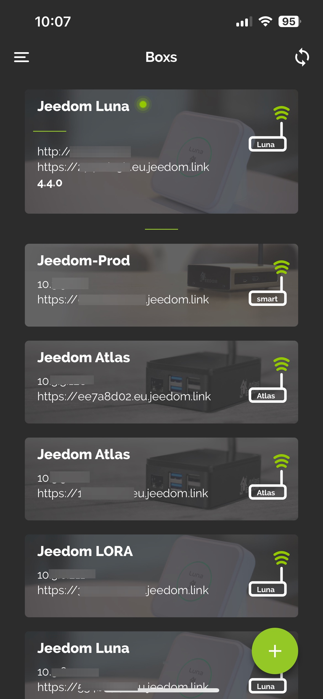
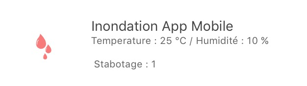
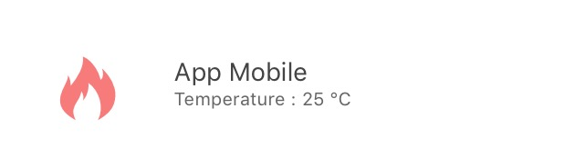

# Mobile Plugin

Plugin for using the Jeedom Mobile application.

The Jeedom mobile application requires the installation of this plugin so that the box can communicate with the Mobile application.

# Configuration of the Mobile plugin for Application V2

After installing the plugin, you just need to activate it :

# First connection to the V2 application

To connect your phone : there are 2 possible methods;
on the first screen of the application, you are offered to connect your market account, and thus find all the boxes associated with this account, or simply add a box.

>**IMPORTANT**
>
> To benefit from the application's functionalities, the core of your Jeedom must be in 4.4.0 minimum

#### __LOGIN VIA THE MARKET ACCOUNT__ :

All you have to do is enter your Market ID and password.

#### __LOGIN VIA BOX ID__ :

Several choices on this screen :

  - You enter the url of your Jeedom (internal or external), as well as the access identifiers to it and you confirm with the LOGIN button

  - You click on QR Code : a new screen appears; you can scan a QRCode from the Mobile plugin of the box you want to add, via the QRCODE tab of the plugin.

> Qr Code tab of the Mobile plugin

>> 

Once this first step has been completed, you are registered in the application: if you have the Mobile plugin, you will have access via the menu to Notifications, QrCodes, Menu customization ....

In the menu, you will have a Boxs tab, which groups together all the boxes present on this market account

Simply click on the box where the Mobile plugin is installed, then identify yourself to access the box.

The box will go to the top of the list, having validated its authentication.
You can do this for several boxes.

You can also click on the + button at the bottom right to access different options;
  - QrCode to add a box to the list via the Mobile plugin,
  - Manual to manually add a box
  - Detection Atlas and Luna (if you are on Wifi, will detect the boxes on the network)
  - Market sync to update configured Market account information

To access features such as Notifications, Menu Personalization or Geolocation, you must first have selected at least one current box'

# How Geolocation works

We add a Geolocation zone by clicking on the + icon

We type the address we are looking for, we validate with Enter on his phone; the cursor will then position itself on the desired address.
We can then add a name and save the zone. 

This will create a new command on your mobile equipment, of binary type, which will correspond to the entries and exits of the zone if geolocation is activated on your mobile phone.

We can also change the radius of the zone, to extend the detection of the zone. 

# FAQ

>**I have problems with notifications**
>
>This part is currently being improved and optimized on the beta application.

>**I have problems displaying my webview**
>
>On your Jeedom, in the Preferences, check that the mobile home page is HOME.

# Setting up the Mobile V1 plugin

After installing the plugin, you just need to activate it :

**Setup**

To configure the plugin, you must add the phones that will be able to access Jeedom.

To Add a phone : **Plugins** → **Communication** → **App
Mobile** → **Add**

Here are the parameters to enter :

-   **Name of mobile equipment** : Phone name
-   **Activate** : Enabling access for this mobile
-   **Mobile Type** : Phone OS selection (iOS, Android)
-   **User** : User associated with this access

> **Tip**
>
> The choice of the user is important because it determines the equipment to which he will have access according to his rights.

After saving, you will get a QRCode allowing the application to configure itself.

# Configuration of plugins and commands received by the app

After the initialization of the Mobile Plugin you have the possibility to modify the generic types of orders, plugins and parts.

By clicking on a plugin, you can authorize it or not to chat with the mobile application, and configure each of the generic types associated with its commands.

By clicking on a part, you can authorize it or not to be present in the mobile application, and configure each of the generic types associated with its orders.

# Mobile app configuration

You will find the applications on the mobile blinds :

**Android Google Play**

**Apple App Store**

## First launch of the app

When you launch the Mobile application for the first time, you will be offered a tutorial to help you configure it.

After downloading and installing your Jeedom mobile application, launch the application on your smartphone.

You then arrive in a configuration tutorial which we advise you to follow. Some steps have been done previously.

You will then have the choice between a manual or automatic configuration by QRcode. If you choose to configure by QRcode, just flash the QRcode present on the Mobile App plugin in the smartphone equipment created previously. In this case, the application will automatically recover all the configuration of your Jeedom and connect automatically. When it is connected to your home via Wifi, the application will automatically use the Jeedom ethernet address internal to your network. When you are connected in 4G or 3G, it will use your external address to connect to your Jeedom (for example via the Jeedom DNS service if you use it). If you choose manual configuration, in this case you will need to manually enter the internal and external IP addresses of your Jeedom. This option is reserved for an informed public.

The application will synchronize and you will arrive on its home page (preceded by a mini presentation guide).

Jeedom mobile app is now ready to work.

## Favorites

On the application you can have Favorites (shortcuts of commands, plugins, scenarios).

Here is the procedure for creating them :

Click on one of the + on the home screen of the application :

You will arrive on the shortcut type selection page :

For example, we are going to take Action, so it offers us Coins / Objects :

Then simply select the action you want as a shortcut :

It is then possible to personalize the color of this one (for the moment three colors are proposed) :

As well as the two associated texts :

Here, you have now a shortcut of your order (in version 1.1 On / Off commands are expected to appear on the same key).

# How to properly configure generic types

## Generic Types in the Mobile plugin

Better than words, here is an example of the generic credits for a light with all its controls (see also the Light table below) :

## Application template tables

### The lights

Picture                           | Type generic               | Dev plugin part            | Description          |
:-----------------------------: | :--------------------------- | :--------------------------- | :------------------: |
 | `Lumière Bouton On` `Button Off Light` | `LIGHT_ON` `LIGHT_OFF`| presence of two buttons "ON" and "Off" no status feedback. |
 | `Lumière Bouton On` `Button Off Light` `State Light` | `LIGHT_ON` `LIGHT_OFF` `LIGHT_STATE` | Status feedback present, the left button toggles between on and off |
 | `Lumière Bouton Toggle` `State Light` | `LIGHT_TOGGLE` `LIGHT_STATE` | Status feedback present, the left button toggles between on and off |
 | `Lumière Bouton On` `Button Off Light` `State Light` `Light Slider` | `LIGHT_ON` `LIGHT_OFF` `LIGHT_STATE` `LIGHT_SLIDER` | Status feedback present, the left button allows to switch between On and Off and the slider allows to control the intensity |
 | `Lumière Bouton On` `Button Off Light` `State Light` `Light Slider` `Light Color (info)` `Light Color (action)` `Light Mode` (optional, it is used to have light modes, for example rainbow on Hue philips) | `LIGHT_ON` `LIGHT_OFF` `LIGHT_STATE` `LIGHT_SLIDER` `LIGHT_COLOR` `LIGHT_SET_COLOR` `LIGHT_MODE` | Status feedback present, the left button allows to switch between On and Off and the slider allows to control the intensity. In the circle the color of the lamp is present and when you click it you can change the color and activate a mode |

### The plugs

Picture                           | Type generic               | Dev plugin part            | Description          |
:-----------------------------: | :--------------------------- | :--------------------------- | :------------------: |
 | `Prise Bouton On` `Button Off socket`| `ENERGY_ON` `ENERGY_OFF`| presence of two buttons "ON" and "Off" no status feedback. |
 | `Prise Bouton On` `Button Off socket` `State Taking` | `ENERGY_ON` `ENERGY_OFF` `ENERGY_STATE` | Status feedback present, the left button toggles between on and off |
 | `Prise Bouton On` `Button Off socket` `State Taking` `Slider socket` | `ENERGY_ON` `ENERGY_OFF` `ENERGY_STATE` `ENERGY_SLIDER` | Status feedback present, the left button allows to switch between On and Off and the slider allows to control the intensity |

### Shutters

Picture                           | Type generic               | Dev plugin part            | Description          |
:-----------------------------: | :--------------------------- | :--------------------------- | :------------------: |
   | `Volet Bouton Monter` `Down button pane` `Stop Button Pane` `State pane` (optional) | `FLAP_UP` `FLAP_DOWN` `FLAP_STOP` `FLAP_STATE` (optional) | Presence of three buttons "Up", "Down", "Stop", optional status feedback. |
   | `Volet Bouton Monter` `Down button pane` `Stop Button Pane` `State pane` `Slider Button Pane` | `FLAP_UP` `FLAP_DOWN` `FLAP_STOP` `FLAP_STATE` `FLAP_SLIDER` | Presence of a slider, with an Up / Down button in Toggle (with status icon) |

### Inondation

Picture                           | Type generic               | Dev plugin part            | Description          |
:-----------------------------: | :--------------------------- | :--------------------------- | :------------------: |
   | `Innondation` `TEMPERATURE` (optional) `Humidity` (optional) `SABOTAGE` (optional)|`FLOOD` `TEMPERATURE` (optional) `HUMIDITY` (optional) `HUMIDITY` (optional) | Allows you to have your complete flood sensor on a single line.

### Serrure

Picture                         | Type generic               | Dev plugin part            | Description          |
:---------------------------: | :--------------------------- | :--------------------------- | :------------------: |
   | `Lock Etat` `Open Button Lock` `Lock Button Close` | `LOCK_STATE` `LOCK_OPEN` `LOCK_CLOSE` | Status feedback present, the left button toggles between on and off |

### Mermaid

Picture                         | Type generic               | Dev plugin part            | Description          |
:---------------------------: | :--------------------------- | :--------------------------- | :------------------: |
   | `Mermaid Etat` `Siren Button On` `Siren Button Off` | `SIREN_STATE` `SIREN_ON` `SIREN_OFF` | Status feedback present, the left button toggles between on and off |

### Smoke

Picture                           | Type generic               | Dev plugin part            | Description          |
:-----------------------------: | :--------------------------- | :--------------------------- | :------------------: |
   | `Smoke` `TEMPERATURE` (optional)|`SMOKE` `TEMPERATURE` (optional) | Allows you to have your complete smoke sensor on a single line.

### Temperature

Picture                                       | Type generic               | Dev plugin part            | Description          |
:-----------------------------------------: | :--------------------------- | :--------------------------- | :------------------: |
   | `Temperature` `Humidity` (optional)|`TEMPERATURE` `HUMIDITY` (optional) | See picture.

### Presence

Picture                                 | Type generic               | Dev plugin part            | Description          |
:-----------------------------------: | :--------------------------- | :--------------------------- | :------------------: |
   | `Presence` `TEMPERATURE` (optional) `Brightness` (optional) `Humidity` (optional) `UV` (optional) `SABOTAGE` (optional)|`PRESENCE` `TEMPERATURE` (optional) `BRIGHTNESS` (optional) `HUMIDITY` (optional) `UV` (optional) `SABOTAGE` (optional) | See picture.

### Ouvrant

Picture                                       | Type generic               | Dev plugin part            | Description          |
:-----------------------------------------: | :--------------------------- | :--------------------------- | :------------------: |
   | `Porte / Fenêtre` `TEMPERATURE` (optional)|`OPENING / OPENING_WINDOW` `TEMPERATURE` (optional) | See Image (i.e. you can choose between window and door).

### Pilot wire

Picture                               | Type generic               | Dev plugin part            | Description          |
:---------------------------------: | :--------------------------- | :--------------------------- | :------------------: |
   | `Chauffage fil pilote Bouton ON` `Heating pilot wire OFF button` `Heating pilot wire State` `Button pilot wire heating` (optional) | `HEATING_ON` `HEATING_OFF` `HEATING_STATE` `HEATING_OTHER`|The ON / OFF and Status buttons allow you to create the button on the far left of the template and the `button pilot wire heating` are there to add buttons (5 max)

## THE JOKERS

### Generic Action

Picture                             | Type generic               | Dev plugin part            | Description          |
:-------------------------------: | :--------------------------- | :--------------------------- | :------------------: |
   | `Action Générique`           | `GENERIC_ACTION`             | Le bouton prend la forme du type de l'action. Par défaut c'est un toggle, si c'est un message alors vous avez une enveloppe, si slider vous avez un slider etc...

### Generic Info

Picture                         | Type generic               | Dev plugin part            | Description          |
:---------------------------: | :--------------------------- | :--------------------------- | :------------------: |
   | `Information Générique`           | `GENERIC_INFO`             | Le bouton prend la forme du type de l'info.

# Troubleshooting

**I am on Android version of the app (1.0.1 or 1.0.0) I cannot access my parts or even the configuration of the app.**

You had a popup warning you of a concern about the accessibility settings, so you just have to go to the accessibility settings of your mobile and uncheck the applications using this option. (A fix will be brought soon on the app)

**I have a message in one of the lines of my modules telling me that it
missing a Generic Type !**

By reading this message, it tells you what generic type is missing to create a compatible template. Just apply it.Refer to the [doc chapter Generic Type](https://www.jeedom.com/doc/documentation/plugins/mobile/en_US/mobile#_configuration_des_plugins_et_commandes_que_reçoit_l_app).

**I have a problem with one of the plugins called fully integrated (weather,
thermostat, alarm, camera) !**

Do not hesitate to access your module and click on save again, this will re-include the generic types associated with the module.

**Unable to put an info on the welcome of the app !**

This is normal, it will be available on version 1.1.

**I have the application which takes up a lot of memory in my
Phone !**

There was a bug on versions 1.0.0 and 1.0.1 on the Camera part. The problem will not happen again with 1.0.2, to delete the cache without overpricing the app, simply go to the configuration of your Mobile App and click on "delete the cache".

**I have a concern of first synchronization on the app or of sql on the mobile plugin !**

You have to put generic types and authorize the plugin to send generics see the doc a little higher.
