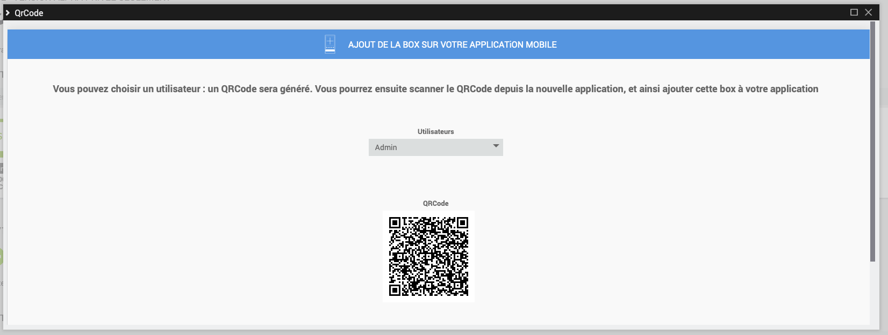

    # Mobile Plugin

    Plugin for using the Jeedom Mobile application.

    The Jeedom mobile application requires the installation of this plugin so that the box can communicate with the Mobile application.

    # Configuration of the Mobile plugin for Application V2

    After installing the plugin, you just need to activate it :

    

    # First connection to the V2 application

    To connect your phone : there are 2 possible methods;
    On the first screen of the application, you are offered to connect your market account, and thus find all the boxes associated with this account, or simply add a box.

    

    > **IMPORTANT**
    >
    > To benefit from the application's functionalities, the core of your Jeedom must be in 4.4.0 minimum

    #### **LOGIN VIA MARKET ACCOUNT** :

    

    All you have to do is enter your Market ID and password.

    #### **CONNECTION VIA BOX ID** :

    

    Several choices on this screen :

    - You enter the url of your Jeedom (internal or external), as well as the access identifiers to it and you confirm with the LOGIN button

    - You click on QR Code : a new screen appears; you can scan a QR Code from the Mobile plugin of the Box you wish to add, via the QR Code tab of the plugin.

    

    > Qr Code tab of the Mobile plugin

    > > 

    Once this first step has been completed, you are registered in the application: if you have the Mobile plugin, you will have access via the menu to Notifications, QR Codes, Menu customization ....

    In the menu, you will have a Boxs tab, which groups together all the boxes present on this market account

    

    

    Simply click on the Box where the Mobile plugin is installed, then identify yourself to access the Box.

    The box will go to the top of the list, having validated its authentication.
    You can do this for several boxes.

    You can also click on the + button at the bottom right to access different options;

    - QR Code to add a Box to the list via the Mobile plugin,
    - Manual to manually add a box
    - Detection Atlas and Luna (if you are on Wifi, will detect the boxes on the network)
    - Market sync to update configured Market account information

    

    To access features such as Notifications, Menu Personalization or Geolocation, you must first have selected at least one current box'

    

    # How Geolocation works

    We add a Geolocation zone by clicking on the + icon

    

    We type the address we are looking for, we validate with Enter on his phone; the cursor will then position itself on the desired address.
    We can then add a name and save the zone.

    This will create a new command on your mobile equipment, of binary type, which will correspond to the entries and exits of the zone if geolocation is activated on your mobile phone.

    We can also change the radius of the zone, to extend the detection of the zone.

    

    . .

    # :

     : :  :

    

    # FAQ

    > **)**
    >
    > . 

    > **I have problems with notifications**
    >
    > This part is currently being improved and optimized on the beta application.

    > **I have problems displaying my webview**
    >
    > On your Jeedom, in the Preferences, check that the mobile home page is HOME.

