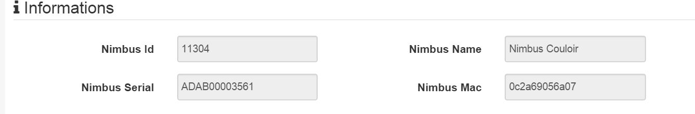
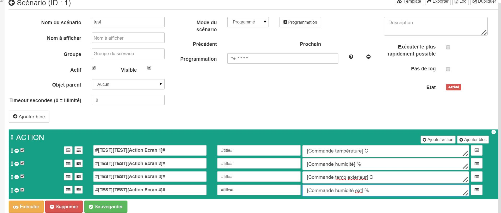

# Nimbus plugin 

This plugin allows you to control and have all the info for your Nimbus.

 
 

# Setup 

## Jeedom plugin configuration : 

In order to use the plugin, you must download, install and activate it like any Jeedom plugin.

Following this you will need to enter your credentials (wink account + API):

Go to the plugins / Communication menu, **there you will find the nimbus plugin :**

You will arrive on the page which will list your equipment (you can have several nimbus) and which will allow you to create some

**Click on the Add button :**

You will then arrive on the configuration page of your nimbus :

On this page you will find several sections :

**Main**

In this section you will find all jeedom configurations. Namely the name of your equipment, the object to which you want to associate it, the category (preferably multimedia), if you want the equipment to be active or not, and finally if you want it to be visible on the dashboard.

-   **Setup**

This section is useful if and only if you have several nimbus. You will need to enter the equipment number (1, 2 or 3 for example). You can leave this field empty if you have only one nimbus which will surely be your case.

-   **Design**

This section will allow you to customize the display of your nimbus on the dashboard. You can choose among several funds. You can also choose the needle color and the text color.

-   **Information**

This section will fill in by itself when saving your equipment. There you will find realtive information to your nimbus (serial number, mac address, name, id)

-   **Commands**

You have nothing to do in this section. Orders will be created automatically.

-   Rafraichir: button to refresh the widget if necessary
-   Screen 1 : Information displayed on screen 1
-   Screen 2 : Information displayed on screen 2
-   Screen 3 : Information displayed on screen 3
-   Screen 4 : Information displayed on the screen 4
-   Position 1 : Information about the position of the needle of screen 1
-   Position 2 : Information about the needle position of screen 2
-   Position 3 : Information regarding the position of the needle on screen 3
-   Position 4 : Information regarding the position of the screen needle 4
-   Screen Action 1 : Action command allowing in a scenario to choose the position and / or the text of the screen 1
-   Screen Action 2 : Command action allowing in a scenario to choose the position and / or the text of the screen 2
-   Screen Action 3 : Action command allowing in a scenario to choose the position and / or the text of the screen 3
-   Screen Action 4 : Action command allowing in a scenario to choose the position and / or the text of the screen 1
-   Screen Action All : Action command allowing in a scenario to choose the position and / or the text of all the screens
-   Phrase Screen Action : Command action allowing in a scenario to choose the position and / or the text of all the screens (a sentence of 4 words maximum split on the 4 screens)
-   Demo : Action to launch a technical demo on your nimbus

# Information 

## Information on the dashboard : 

The widget is divided into 4 dials representing the 4 dials of your nimbus.

-   The needle indicates the position of the needle on the corresponding screen of your nimbus
-   The text is the text displayed on your nimbus. This text can be clicked to reach this screen :

This screen allows you to manually change the text, the needle position or both. It allows you to see when you change the value already displayed.

# The actions 

## Actions accessible via scenario : 

Several actions are accessible via scenario :

The Demo action is independent and launches the technical demo.

All the other actions work in the same way on the principle.

**This is a message command which allows you to pass two parameters:**

-   Title : a number between 0 and 360 corresponding to the position of the needle
-   Message : the message to display

**The two are separable that means you can :**

-   Send a position by leaving the message field empty or by leaving *Message*
-   Send a message leaving the title field blank or leaving *title*
-   Send a position and a message by filling in both

**There is one order per screen, one order all, one order
Phrasing :**

-   Screen : allows to act on the corresponding screen
-   All : lets do the same on all screens
-   Phrasing : special command which will cut the message into 4 words which will be displayed on each screen (if a word exceeds 8 characters it will be cut if the sentence is more than 4 words it will be cut)

**HOW CAN I PERMANENTLY SHOW INFORMATION ABOUT MY HOME AUTOMATION**

If you want to continuously display information from your home automation.
Create a scheduled scenario every 5 minutes (for example).

In this example, you just need to replace what is in the hook with your commands. And every 5 minutes your screens will be updated with the correct values

# Faq 

The system retrieves information every hour. You can click the Refresh command to refresh manually.

Make sure you have created the config file by saving your info in the general config of the plugin.
