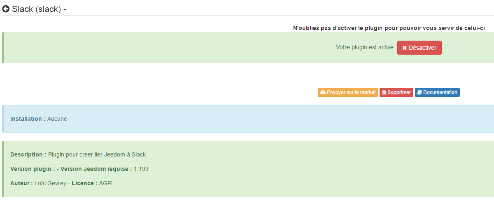
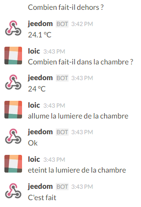

# Slack plugin

This plugin allows you to establish a connection between Slack and Jeedom to send alerts from Jeedom or chat with Jeedom (using interactions).

# Plugin configuration 

After downloading the plugin, you must activate it, it does not require any other configuration.

# Equipment configuration 

The configuration of Slack equipment is accessible from the Plugins menu :

This is what the Slack plugin page looks like (here with already 1 device) :

Once you click on one of them, you get :

Here you find all the configuration of your equipment :

-   **Name of equipment** : name of your Slack equipment
-   **Activate** : makes your equipment active
-   **Visible** : makes it visible on the dashboard
-   **Domain** : domain name of your Slack (especially if you have several Slacks to differentiate them)
-   **Token authentication** : Slack API token, useful only for sending files (capturing a camera for example), see below the method to retrieve it
-   **Return url** : this is the URL that must be given in the Slack webhook (be careful, your Jeedom must be accessible from the outside)

Below you will find the configuration of the commands :

-   **Name** : Name of the order
-   **Webhook** : URL to call to send a message on Slack
-   **Destination** : not mandatory, allows to force the sending of a message to a channel or a user
-   Advanced configuration (small notched wheels) : used to display the advanced configuration of the command (logging method, widget, etc)
-   Test : Used to test the command
-   Delete (sign -) : allows to delete the command

> **Tip**
>
> By default there are 2 commands : Sender that gives you the name of the last sender of the message and Message that gives you the message, this can be used, if you want to do something that is not possible with the interactions to trigger a scenario on the arrival of a new one message for example and retrieve the value of it (we can for example imagine having the message read on Sonos or Karotz)

Slack account creation 

Nothing more just go [here](:https://slack.com/), and enter an email address and a domain name / company, for example :

You just have to validate, you will receive an email, you must click on the link to activate your account and it's good

Then you will arrive on your Slack :

From there you find on the left the channels and the users, in the center you can download the Slack app for iOS, Android, Mac or Windows

# Adding outgoing webhook 

The wekhooks allow Slack to inform Jeedom of the arrival of a message and to wait for the response from Jeedom to retransmit it, to do this you must go to the settings :

Then click on integration :

At the bottom you will find "Outgoing WebHooks" :

Click on "Add" :

Then "Add Outgoing WebHooks Integration" :

You will find the different parameters towards the bottom of the page :

-   **Channel** : not required, lets tell Slack to send everything in this Channel to Jeedom. For example, we can create a channel just for Jeedom (more practical than putting a trigger word)
-   **Trigger Word (s)** : not mandatory if you have put a channel otherwise it is absolutely necessary. This field allows you to define a trigger word for sending to Jeedom, for example if you put Jeedom all your requests must start with Jeedom (ex : Jeedom how much is it in the bedroom)
-   **URL (s)** : URL to call, you find it on your equipment page under Jeedom under the name of "Return URL"

The other fields are not useful, except maybe the "Customize Name" which allows you to define the name of the Jeedom bot (name with which Jeedom responds), you can also with "Customize Icon" change the icon of Jeedom.

Then click on "Save Settings" and it's good

There, you can talk to Jeedom through Slack

> **Important**
>
> Do not forget in Jeedom to enter your domain name (company name), otherwise Jeedom will refuse to answer you (note that this field is sensitive to the box).

> **Tip**
>
> Since Jeedom separates the equipments by domain, it is possible if you have several domains to separate the equipments and therefore the scenarios behind.

# Addition of incoming webhook 

Incoming webhooks allow Jeedom to communicate a message on a channel or directly to a person. Without these webhooks Jeedom will not be able to take the initiative to send you a message.

To do this you have to go to the settings :

Then click on integration :

At the very bottom you will find "Incoming WebHooks" :

Then, you must choose a channel or a default destination user (you can then specify one by command in Jeedom) :

Then click on "Add Incoming WebHooks Integration".

At the bottom of the page you will find the information of the webhook, you just need to retrieve the value of the "Webhook URL" field and copy it into the Webhook field of your order.

> **Tip**
>
> In the destination field of the command in Jeedom you can specify a channel (ex \#monchannel) or a user (ex @toto).

Here, under Jeedom you just have to save and there you can from Jeedom send messages on Slack

# Token recovery 

Here is how to recover your token so that Jeedom can send files to Slack, and in particular captures from cameras for example. First you have to go [here](https://api.slack.com/custom-integrations/legacy-tokens), then at the very bottom go on :

Here in front of your team, ask Slack to generate the token, it will ask you for your password then send you back to the same page, at the bottom ask for the token again. After a few seconds it will appear, just copy it into the token field on Jeedom

> **Tip**
>
> This step is optional, it is just useful to send captures of your camera by Slack for example.

# What is the result ? 

Here is an example of what it is possible to do once the plugin is correctly configured and the interactions created :

> **Important**
>
> If you use the "ask" function of the scenarios, you must send the request on a channel on which Jeedom listens to the answers otherwise your "ask" request will fall into "timeout""
