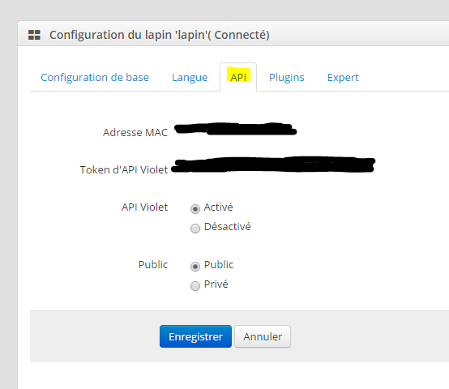

# Nabaztag plugin

Plugin to order the Nabaztag.

# Equipment configuration 

Once the plugin is installed and activated from the Market, you access the Nabaztag plugin page by :

Here you find all your Nabaztag equipment :

Once an equipment is selected you get :

Here you find all the configuration of your equipment :

-   **Name of the Nabaztag equipment** : name of your Nabaztag equipment
-   **Parent object** : indicates the parent object to which the equipment belongs
-   **Category** : equipment categories (it can belong to several categories)
-   **Activate** : makes your equipment active
-   **Visible** : makes it visible on the dashboard
-   **Address (openjabnab.fr or @IP)** : openjabnab or IP (DNS) address of your openjabnab if you self-host it
-   **MAC address** : your rabbit's mac address (see below)
-   **API Token Purple** : API token (see below)

Below you find the list of orders :

-   the name displayed on the dashboard
-   Pin up : allows to display the data on the dashboard
-   advanced configuration (small notched wheels) : displays the advanced configuration of the command (logging method, widget, etc.)
-   Test : Used to test the command

The list of commands is as follows :

-   **Standing** : Wakes up the rabbit
-   **Restart** : Restart the rabbit
-   **Sleep** : Lets tell the rabbit to go to bed
-   **Air quality** : Gives air quality (requires activation of the corresponding plugin in openjabnab)
-   **Ephemeris** : Give ephemeris (requires activation of the corresponding plugin in openjabnab)
-   **Talking clock** : Give the time (requires activation of the corresponding plugin in openjabnab)
-   **Weather** : Gives the weather (requires activation of the corresponding plugin in openjabnab)
-   **Saying** : Give a saying (requires activation of the corresponding plugin in openjabnab)
-   **Left ear** : Allows you to choose the position of the left ear (16 positions possible)
-   **Right ear** : Allows you to choose the position of the right ear (16 possible positions)
-   **Speak** : Lets say a sentence to the rabbit

# Retrieve max address and token 

Go to the site [openjabnab](http://openjabnab.fr/ojn_admin/index.php) then log into your account :

Click on rabbit :

Then click on API :

Here activate the purple and public API and get the mac address as well as the purple API key to put it in the configuration of your rabbit on Jeedom
