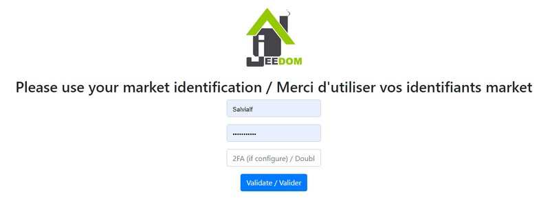

# Enedis plugin

Plugin allowing the recovery of electricity consumption data from smart meters *(linky for example)* by questioning the [customer account **Enedis**](https://mon-compte.enedis.fr/auth/XUI/#login/&realm=/enedis&forward=true){:target = "\_ blank"}.

>**Important**
>
>The plugin was completely rewritten in February 2021 to use **the official Enedis Data-Connect API**. If you used the plugin before, we invite you to create a new equipment or to delete all the controls of a previous equipment.

It is possible to access data from **consumption**, of **production** or to the 2 types of measurement directly in a device.

5 data are reported for each type of measurement :
- the **hourly consumption** per half hour *(in kW)*.
- the **daily consumption** *(in kWh)*.
- the **monthly consumption** *(in kWh)*.
- the **annual consumption** *(in kWh)*.
- the **max power** *(in kVA)*.

>**INFORMATION**
>
>As the data is not made available in real time, the plugin retrieves the electricity consumption data from the day before each day.

As long as the plugin has not retrieved all the data from the previous day, it continues to query the Enedis servers every 30 minutes, otherwise the calls are suspended until the next day.

# Configuration

Like any Jeedom plugin, the plugin **Enedis** must be activated after installation.

## Plugin configuration

If you haven't already done so, start by authorizing the sharing of Enedis data with Jeedom by clicking on the button **Authorize access to Enedis servers : I access my Enedis customer area** from the plugin configuration page :

You are then redirected to this page on which you must inform **your login details for the Jeedom market** then click on the button **Validate** :

Redirection to the Enedis consent page on which it is necessary **check the box** and click on **Validate** :

Once the data sharing is validated, this page is displayed :

>**Important**
>
>If you are unable to access any of these pages, disable the browser ad blocker.

## Equipment configuration

To access the different equipment **Enedis**, go to the menu **Plugins → Energy → Enedis**.

>**INFORMATION**
>
>The button **+ Add** allows you to add a new meter / PDL.

Once data sharing has been authorized from the plugin configuration page, all you have to do is enter **the identification number of the Delivery Point** concerned *(PDL)* and the **type of measurement** to get back.

During the 1st backup of an active and configured device, the plugin will automatically create the necessary commands and integrate the histories available on the Enedis site since January 1st of the current year. This process is likely to take several minutes, you can follow the progress from the menu **Analysis → Logs** *(logs in ``debug``)*.

>**INFORMATION**
>
>Hourly consumption data is retrieved over the last 7 days at most.

If you have not activated **recording and collecting hourly consumption** on your Enedis account, you must tick the box **Hourly data : Disable** so that the corresponding orders are not created.

# Adding data

It is possible to integrate histories on demand, up to 3 years back, directly from the Enedis site. To do so, just click on the blue button **Historical additions** from the tab **Orders** of an item of equipment, in the column **Action** of the order concerned :

Then choose the start date and click on **Okay** to initiate the process.

The day, month, year and maximum power data will be integrated from the date chosen until January 1 of the current year. The hourly data, when they are, will be integrated up to 7 days after the chosen date.

>**INFORMATION**
>
>These time constraints are set by Enedis.

# Widget template

>**INFORMATION**
>
>The widget template will be displayed on both desktop and mobile versions.

The plugin offers the possibility of displaying consumption and / or production data in a widget template imitating the appearance of a meter *Linky*. The click on the button "**- \| +**" allows to switch from consumption to production for those who have access to 2 types of measures. An indicator also lets you know if the data is up to date or not *(green = all data is up to date, orange = some data is not up to date, red = no data is up to date)*.

To activate this option, just check the box **Enable** section **Widget template** on the general page of the equipment concerned. Once the widget template is activated, go to the tab **Display** of the equipment configuration to choose the background color of the widget (`Template : background-color`) and/or title color (`Template : titlebar-color`) depending on the Jeedom access version *(desktop or mobile)*.

>**TRICK**
>
>In desktop version, the information displayed on the widget adapts in size when resizing the tile.

# FAQ

>**I have `Error on enedis json return` errors in the logs yet the data is visible on the Enedis site**
>
>It sometimes happens that you have to go directly to the Enedis site in order to validate the latest T & Cs to access the data again. It is also sometimes necessary to replace the Jeedom / Enedis link from the plugin configuration page.

>**I don't have Day / Month / Year data for December 31, 2021**
>
>To recover this data just click on the button **Historical additions** of the order **Consumption Day** and select the date of January 1, 2021 as the departure date.
