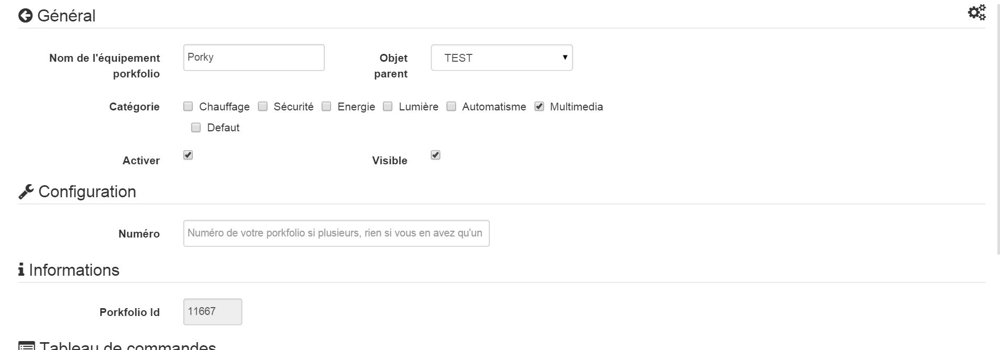
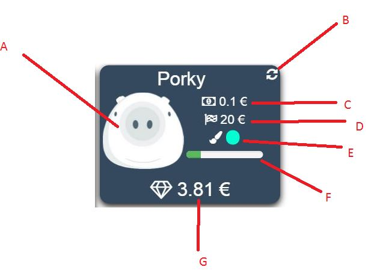
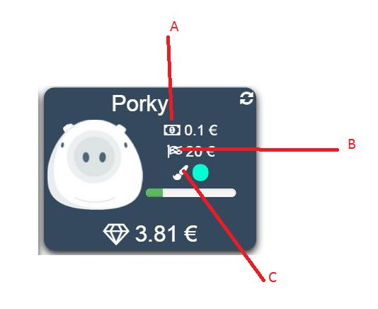

# Porkfolio plugin 

This plugin allows you to control and have all the info from your Porkfolio piggy bank.

# Setup 

## Jeedom plugin configuration : 

**Installation / Creation**

In order to use the plugin, you must download, install and activate it like any Jeedom plugin.

Following this you will need to enter your credentials (wink account + API):

Go to the Plugins / Finances menu, you will find the porkfolio plugin :

You will arrive on the page which will list your equipment (you can have several Porkfolio) and which will allow you to create some

Click on the Add button :

You will then arrive on the configuration page of your porkfolio:

On this page you will find several sections :

**Général**

In this section you will find all jeedom configurations. Namely the name of your equipment, the object with which you want to associate it, the category (preferably multimedia), if you want the equipment to be active or not, and finally if you want it to be visible on the dashboard.

**Setup**

This section is useful if and only if you have several porkfolio. You will need to enter the equipment number (1, 2 or 3 for example). You can leave this field empty if you have only one porkfolio which will surely be your case.

**Commands**

You have nothing to do in this section. Orders will be created automatically.

-   Refresh: button to refresh the widget if necessary
-   Deposit date : Date of last operation
-   Movement date : Date of the last time a movement was detected
-   Flip date : Date of the last time the porkfolio was returned
-   Last Operation : Amount of the last transaction
-   Nose : Nose color
-   Goal : Amount of your goal
-   Sum : Sum currently in the porkfolio

# Information 

## Information on the dashboard : 

-   At : Pig's head which can change mood. By leaving the mouse on his head he will tell you when he last moved as well as when he was last turned over
-   B : Refresh button to request values from the server
-   VS : Amount of the last transaction. By leaving the mouse on it you will have the date of the last operation
-   D : Amount of your goal
-   E : Nose color of your porkfolio
-   F : Progress bar in achieving your goal
-   G : Sum currently in your porkfolio

# The actions 

## Actions accessible on the dashboard : 

Several actions are available on the dashboard :

-   At : By clicking on the ticket you can deposit or withdraw a sum of money

-   B : By clicking on the flag you can change your goal

-   VS : By clicking on the brush you can change the color of the nose of your porkfolio

# FAQ 

The system retrieves information every hour. You can click the Refresh command to refresh manually.

Make sure you have created the config file by saving your info in the general config of the plugin.
