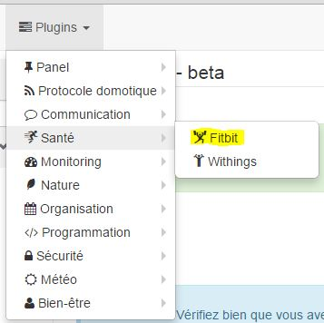
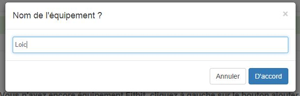

# Fitbit plugin

Plugin to access information on Fitbit devices (number of steps, calories, distance, etc.)

# Setup 

Once the Fitbit plugin is installed, go to :

## Equipment creation and association with Fitbit account 

Click on add a person to add someone :

Give a name to this person (this equipment) and validate :

You should then have this page :

> **Important**
>
> The first thing to check is "Return URL". This must be validated and accessible from outside, otherwise you will not be able to associate Jeedom with your Fitbit account. If this is not the case, update your network configuration parameters in General → Administration → Configuration then "networks" section, see [here](https://www.jeedom.fr/doc/documentation/core/en_US/doc-core-administration.html.html#administration)

> **NOTE**
>
> It is recommended when connecting between Jeedom and Fitbit to be connected to Jeedom by the external ip

To link your Fitbit account to Jeedom you first create a developer account with Fitbit by going [here](https://dev.fitbit.com/fr), then you need to log in and then do : "Register an app". Then fill in the information :

-   Application Name : Jeedom
-   Description : Jeedom
-   Application Website : <https://jeedom.com>
-   Organization : jeedom
-   Organization Website : <https://jeedom.com>
-   OAuth 2.0 Application Type : Server
-   Callback URL : You have to put the one that Jeedom gives you when creating a Fitbit equipment, be careful if you do not put the correct one the connection will not be able to be made
-   Default Access Type : Read & Write

You can also add a subscription, this allows Fitbit to push an update directly in Jeedom (instead of waiting for Jeedom to update the information) :

-   Default : oui
-   Endpoint URL : the one given by jeedom
-   Type : JSON body
-   Subscriber ID : Put nothing

If you have a subscription you must (be careful to do all these steps in order) :

-   Put the subscription number in the Fitbit equipment on Jeedom
-   Put the subscription code in the Fitbit equipment on Jeedom
-   Back up equipment
-   On the Fitbit site launch the verification of the subscription
-   Then "Link to a user" the jeedom equipment, as below

> **Important**
>
> Currently Fitbit does not support https well, so if you are in https there is little chance that it will work

Click "Link to User" to link this device to your Fitbit account :

Enter your Fitbit account credentials, then validate the authorization request :

If you get a blank page or an error, it means that your network configuration is not good, otherwise you must come back to this page :

## Setup 

Here are the details of the plugin configuration :

-   Name of the person : name of the Fitbit equipment
-   Parent object : name of the object to attach the equipment to
-   Activate / Visible : allows to activate the equipment (do not forget to do it otherwise you will have no data) and make it visible on the dashboard
-   For each order :
    -   Historize : allows to log the command
    -   Show : allows to make it visible or not on the dashboard
    -   Advanced (small notched wheels) : displays the advanced configuration of the command
    -   Test : allows to test the command to see its value
    -   Delete ("-" button) : to delete the order

## Widget 

Here is the fitbit widget :

