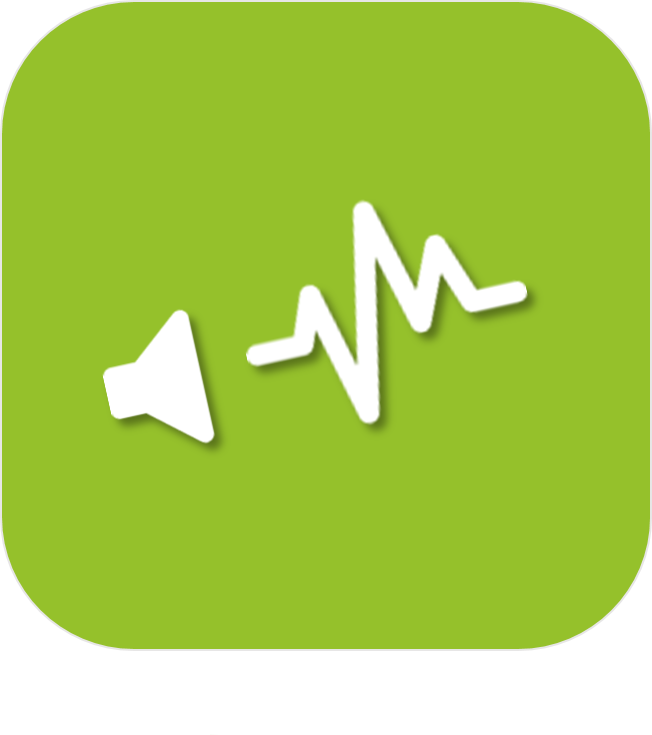

>**Important**
>Only official plugins have their documentation here. You can consult the documentation of the other plugins directly from the Jeedom Market. Once on the plugin in question, click on documentation.
>You can see [here](https://market.jeedom.com/index.php?v=d&p=market&type=plugin&categorie=multimedia) all official plugins in this category

| | | | |
|--- | --- | --- | ---|
||Denon|Plugin to control Denon amplifiers|[Documentation Stable](denonavr/index.md) - [Beta Documentation](denonavr/beta/index.md) [Market](https://market.jeedom.com/index.php?v=d&p=market_display&id=2077) [Changelog Stable](denonavr/changelog.md) - [Changelog Beta](denonavr/beta/changelog.md)|
||Harmony Hub|Plugin for controlling one or more Harmony Hubs.|[Documentation Stable](harmonyhub/index.md) - [Beta Documentation](harmonyhub/beta/index.md) [Market](https://market.jeedom.com/index.php?v=d&p=market_display&id=1599) [Changelog Stable](harmonyhub/changelog.md) - [Changelog Beta](harmonyhub/beta/changelog.md)|
||Ambilight|Hyperion plugin for controlling it|[Documentation Stable](hyperion2/index.md) - [Beta Documentation](hyperion2/beta/index.md) [Market](https://market.jeedom.com/index.php?v=d&p=market_display&id=1909) [Changelog Stable](hyperion2/changelog.md) - [Changelog Beta](hyperion2/beta/changelog.md)|
||Kodi|Plugin to send and receive orders to / from Kodi|[Documentation Stable](kodi/index.md) - [Beta Documentation](kodi/beta/index.md) [Market](https://market.jeedom.com/index.php?v=d&p=market_display&id=1398) [Changelog Stable](kodi/changelog.md) - [Changelog Beta](kodi/beta/changelog.md)|
||PJLink|The PJLink plugin allows the control of projectors compatible with the PJLink protocol to communicate on the local network.  The non-exhaustive list of brands compatible with the PJLink protocol is : BenQ, Canon, Casio, Epson, Fujifilm, Hitachi, InFocus, Maxell, Mitsubishi, Nec, Panasconic, Ricoh, Sharp, Sky, Sony...  Consult your hardware documentation to confirm compatibility with the PJLink protocol.|[Documentation Stable](pjlink/index.md) - [Beta Documentation](pjlink/beta/index.md) [Market](https://market.jeedom.com/index.php?v=d&p=market_display&id=4034) [Changelog Stable](pjlink/changelog.md) - [Changelog Beta](pjlink/beta/changelog.md)|
||Pulseaudio|Plugin author : Slobberbone. PLEASE NOTE, this is not an official Jeedom plugin but a plugin developed by a third person and whose development has been abandoned. The Jeedom technical team will provide assistance with this plugin without obligation of result. This plugin allows the management of the PulseAudio service. This service manages everything relating to sound and microphone inputs, outputs, whether the outputs are wired, via bluetooth or even on the network. This plugin makes the PulseAudio service visible on your internal network, you can then control it from a PC running GNU / Linux and ensure that the music played on your PC is sent to the sound output of Jeedom. This plugin also allows the addition of Bluetooth speakers to the Jeedom PulseAudio service and offers it as a standard output. Thus, via Jeedom and this PulseAudio plugin you can run Deezer on your PC under GNU / Linux (or Windows with the compatible PulseAudio client) and ensure that the sound is sent to the bluetooth speakers connected to Jeedom as well as to the sound output ( HDMI / Jack) from Jeedom to complete with an amplifier. This simultaneous mode will arrive soon with the possibility of putting a latency, avoiding the delay between the HDMI / Jack / Bluetooth sound outputs, perfect for the evening mode both on the terrace with the Bluetooth speakers and in the room with the amplifier !|[Documentation Stable](pulseaudio/index.md) [Market](https://market.jeedom.com/index.php?v=d&p=market_display&id=2704) [Changelog Stable](pulseaudio/changelog.md)|
||Roku|Plugin to manage your rokus|[Documentation Stable](roku/index.md) [Market](https://market.jeedom.com/index.php?v=d&p=market_display&id=2301) [Changelog Stable](roku/changelog.md)|
||Sounds and TTS|Plugin allowing you to add MP3s and have Google voice for texts to be played by TTS plugins (using TTS Jeedom)|[Documentation Stable](songs/index.md) - [Beta Documentation](songs/beta/index.md) [Market](https://market.jeedom.com/index.php?v=d&p=market_display&id=3794) [Changelog Stable](songs/changelog.md) - [Changelog Beta](songs/beta/changelog.md)|
||Sonos controller|Sonos / Ikea Symfonisk control plugin. Be careful : you need at least PHP 7.0.|[Documentation Stable](sonos3/index.md) - [Beta Documentation](sonos3/beta/index.md) [Market](https://market.jeedom.com/index.php?v=d&p=market_display&id=1502) [Changelog Stable](sonos3/changelog.md) - [Changelog Beta](sonos3/beta/changelog.md)|
||Spotify|Plugin for connecting Jeedom to one or more Spotify Connect accounts.|[Documentation Stable](spotifyconnect/index.md) - [Beta Documentation](spotifyconnect/beta/index.md) [Market](https://market.jeedom.com/index.php?v=d&p=market_display&id=4152) [Changelog Stable](spotifyconnect/changelog.md) - [Changelog Beta](spotifyconnect/beta/changelog.md)|
||SqueezeBox Control|This plugin allows you to control your Squeezebox.It makes self-discovery, it assigns your squeezebox to the right objects if they contain the name of the object.It also allows complete multidirectional synchro management. The possibility of synchronizing all squeezeboxes in one click, turning them all on, turning them off, etc. A TTS function is also available A simple dedicated panel (but which will want to become very complete) is also available.Many other functions are also present|[Documentation Stable](squeezeboxcontrol/index.md) - [Beta Documentation](squeezeboxcontrol/beta/index.md) [Market](https://market.jeedom.com/index.php?v=d&p=market_display&id=1710) [Changelog Stable](squeezeboxcontrol/changelog.md) - [Changelog Beta](squeezeboxcontrol/beta/changelog.md)|
