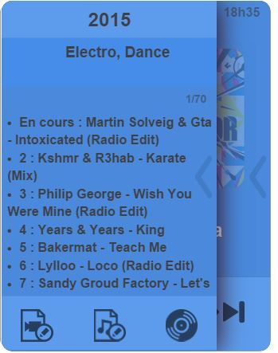

# Kodi plugin

This plugin allows you to order and receive information from Kodi.

# Setup 

## Jeedom plugin configuration

In order to use the plugin, you must download, install and activate it like any Jeedom plugin.

After that you will have to create your Kodi equipment :

Go to the plugins / multimedia menu, you will find the Kodi plugin :

Then you will arrive on the page which will list your equipment (you can have several Kodi) and which will also allow you to create some

Click on the Add Kodi button or on the + button :

You will then come to the configuration page of your Kodi:

On this page you will find several sections :

### Main

In this section you will find all jeedom configurations. Namely the name of your equipment, the object to which you want to associate it, the category (preferably multimedia), if you want the equipment to be active or not and finally if you want it to be visible on the dashboard.

### Configuration

This section is one of the most important it contains

-   IP : ip address of your kodi (it is important to enter the ip and not a hostname). If Kodi is on the same machine as jeedom put 127.0.0.1. This field is required
-   Port : the communication port of the web server in kodi (you must activate the web server in kodi). This field is required
-   Username : the username to log in to Kodi if you have one
-   Password : the password to connect to Kodi if you have one. (this goes with the username)
-   MAC Address : the MAC address of the machine to wake on lan
-   Volume + /- : the step of incrementation or decrementation of the volume (1 to 100)

### Commandes

This part lists all the commands available :

-   Accueil
-   Year
-   Fast forward
-   Bas
-   Next Songs
-   Droite
-   Eteindre
-   Gauche
-   Genre
-   Haut
-   End time
-   Lecture
-   Movies List
-   Music List
-   Series List
-   Playlist length
-   Evening mix
-   Muet
-   Notifications
-   OK
-   OSD
-   Pause
-   Full screen
-   Playlist position
-   Previous
-   Restart
-   Summary
-   Retour
-   Quick return
-   Audio Scan
-   Video scan
-   Status
-   Media Status
-   Status nb
-   Stop
-   Suivant
-   Thumbnail
-   Titre
-   Media Type
-   Volume
-   Volume status
-   Volume -
-   Volume \ +

## Configuration of the Kodi plugin

To be able to benefit from the feedback of the different statuses, it is necessary to install an addon on Kodi. You can download this addon in the general page of the plugin in Jeedom

Once the zip is recovered, you just need to install it in Kodi. To do this, go to Kodi, parameters / addons / install from a zip.

After installation you should find the addon in the addons activated in the service part.

To configure the addon click on configure, you will arrive on this page :

Here you will find 3 important parameters to configure :

-   IP adress : the ip address of your jeedom
-   Box type : mini / mini +, or specify if you have a / jeedom or not in your Jeedom address
-   API key : your Jeedom API key which you will find in the Jeedom configuration parameters

# Status information 

Kodi goes up many statutes :

-   Kind : goes up the complete list of genres (only usable via script or virtual)
-   End time : scheduled end time, updated when media is started and when pause is resumed
-   Status and statusnb : Go up the status (one in text the other in number) These are the different values :
    - Started 0
    - Video in progress 1
    - Audio in progress 2
    - Video finished 3
    - Audio complete 4
    - Video stopped 5
    - Audio stopped 6
    - Video paused 7
    - Audio paused 8
    - Video recovery 9
    - Audio resume 10
    - Stop 18
-   Media Status : will go back to a more general status (Play, Pause, Stop, Stop) regardless of the type of media
-   Thumbnail : will reassemble the cover (more particularly the link allowing to have it)
-   Title : will go up the title of the current media and details on the episode and the season in the case of a series
-   Media type : will go back the type of media (Series, Audio, Films)

# Widget Details 

Here are some details about the widget :

-   At : indicates an icon of the current media type
-   B : indicates the end time
-   VS : unfolds the remote control part

-   D : Part 1 of the current title
-   E : Part 2 of the current title
-   F : Playback commands (playback following stop, etc.)
-   G : Activate volume control mode or return to playback mode

-   H : lets you expand the info section

In series / film mode, you will find year, summary, genre

In audio mode you will find playlist, year, genre and playlist info

In both cases you will find at the bottom the buttons allowing to launch an audio / video scan or to launch an audio evening mix

